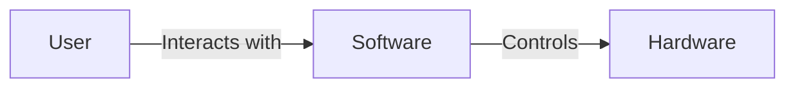

## 1.1.1 What Is Software?

In the vast and ever-evolving world of technology, understanding what software is forms the cornerstone of grasping how modern digital systems operate. Whether you're a novice just stepping into the realm of software development or a curious individual eager to comprehend the digital landscape, this section will provide you with a detailed exploration of software, its types, characteristics, and its integral role in our daily lives.

### What Is Software?

At its core, **software** is a collection of instructions, data, or programs that tell a computer how to work. It is the invisible force that drives the visible actions of computers and digital devices. Unlike hardware, which comprises the tangible components of a computer (such as the processor, memory, and storage), software is intangible. It exists in the form of code written by developers and is executed by the hardware to perform specific tasks.

Software can be as simple as a "Hello, World!" program or as complex as an operating system that manages the resources of a supercomputer. Its primary function is to enable users to perform tasks that would otherwise be impossible or extremely difficult with hardware alone.

### Types of Software

Software is broadly categorized into three main types: **System Software**, **Application Software**, and **Middleware**. Each category serves distinct purposes and plays a unique role in the computing ecosystem.

#### System Software

**System Software** acts as a bridge between the hardware and the user applications. It includes:

- **Operating Systems (OS):** These are the most critical system software that manage computer hardware and software resources and provide common services for application software. Examples include Windows, macOS, Linux, and Android.
- **Device Drivers:** These are specialized programs that allow higher-level computer programs to interact with a hardware device. For example, a printer driver translates the general commands from the operating system into instructions specific to the printer's hardware.

#### Application Software

**Application Software** is designed to help users perform specific tasks. This category includes:

- **Word Processors:** Such as Microsoft Word or Google Docs, which allow users to create and edit text documents.
- **Web Browsers:** Like Google Chrome, Mozilla Firefox, and Safari, which enable users to access and navigate the internet.
- **Games:** Software designed for entertainment, ranging from simple mobile games to complex video games on consoles and PCs.

#### Middleware

**Middleware** serves as a mediator between different software applications, enabling them to communicate and interact with each other. It is essential in distributed systems and cloud computing environments. Examples include:

- **Database Middleware:** Facilitates communication between databases and applications.
- **Message-Oriented Middleware (MOM):** Supports sending and receiving messages between distributed systems.

### Characteristics of Software

Understanding the characteristics of software is crucial for appreciating its role in technology:

- **Intangibility:** Unlike hardware, software cannot be touched or physically measured. It is composed of code, which is executed to perform tasks.
- **Interactivity:** Software acts as an interface between the user and the hardware, translating user commands into machine-readable instructions.
- **Scalability:** Software can be easily scaled to accommodate more users or increased workloads, often without the need for additional physical resources.
- **Versatility:** Software can be programmed to perform a wide variety of tasks, from simple calculations to complex simulations.

### Everyday Examples of Software

Software is ubiquitous in our daily lives, often operating behind the scenes to enhance our experiences:

- **Smartphone Apps:** From social media platforms to fitness trackers, apps are a type of application software that provides specific functionalities on mobile devices.
- **Computer Operating Systems:** When you boot up your computer, the operating system is the first software that runs, managing all other applications and hardware components.
- **Web Applications:** Services like email, online banking, and streaming platforms are powered by application software running on web servers.

### Software in Action: "Hello, World!" Programs

To illustrate software in action, let's look at a simple "Hello, World!" program in two popular programming languages: Python and JavaScript. This classic example demonstrates how software executes a task—displaying a message to the user.

#### Python Example

```python
print("Hello, World!")
```

#### JavaScript Example

```javascript
// This is a simple JavaScript program that prints "Hello, World!" to the console.
console.log("Hello, World!");
```

These programs, though minimal, encapsulate the essence of software: a set of instructions that produce a desired output when executed by the computer.

### Visualizing Software Interaction

To better understand the relationship between users, software, and hardware, consider the following diagram:



In this flowchart, the user interacts with the software, which in turn controls the hardware to perform tasks. This interaction is fundamental to all computing activities.

### Key Points to Emphasize

1. **Essential Component:** Software is an indispensable part of modern technology, enabling hardware to perform a wide range of functions.
2. **Ubiquity:** From personal devices to large-scale industrial systems, software is present in nearly every aspect of our lives.
3. **Enabler of Innovation:** Software drives innovation, allowing for the development of new applications and technologies that transform industries and societies.

### Conclusion

Understanding what software is and its role in the digital world is crucial for anyone interested in technology. As we continue to integrate more software into our daily lives, recognizing its types, characteristics, and applications will help us better navigate and leverage the digital landscape.

## Quiz Time!



### What is software?

- [x] A set of instructions, data, or programs used to operate computers and execute specific tasks.
- [ ] The physical components of a computer system.
- [ ] A type of hardware device.
- [ ] A network protocol for communication.

> **Explanation:** Software is defined as a set of instructions, data, or programs used to operate computers and execute specific tasks. It is distinct from hardware, which is the physical component of a computer.

### Which of the following is NOT a type of system software?

- [ ] Operating System
- [ ] Device Driver
- [x] Web Browser
- [ ] BIOS

> **Explanation:** A web browser is a type of application software, not system software. System software includes operating systems and device drivers.

### What role does middleware play in software architecture?

- [x] It connects different applications or services.
- [ ] It serves as the main user interface for applications.
- [ ] It is used to create graphical elements for applications.
- [ ] It is responsible for hardware management.

> **Explanation:** Middleware acts as a bridge that connects different applications or services, facilitating communication and data management.

### Which characteristic of software allows it to be easily scaled to accommodate more users?

- [x] Scalability
- [ ] Intangibility
- [ ] Versatility
- [ ] Interactivity

> **Explanation:** Scalability is the characteristic of software that allows it to be easily expanded or scaled to accommodate more users or increased workloads.

### What is an example of application software?

- [ ] Linux
- [ ] Printer Driver
- [x] Microsoft Word
- [ ] BIOS

> **Explanation:** Microsoft Word is an example of application software, which is designed to help users perform specific tasks such as word processing.

### What is the primary function of system software?

- [x] To manage computer hardware and software resources.
- [ ] To provide entertainment to users.
- [ ] To develop new software applications.
- [ ] To connect different networks.

> **Explanation:** System software, such as operating systems, is responsible for managing computer hardware and software resources and providing common services for application software.

### Which of the following is an example of middleware?

- [x] Database Middleware
- [ ] Microsoft Excel
- [ ] Android
- [ ] USB Driver

> **Explanation:** Database middleware is a type of middleware that facilitates communication between databases and applications.

### What does the "Hello, World!" program demonstrate?

- [x] The execution of a simple software task.
- [ ] The complexity of software development.
- [ ] The hardware capabilities of a computer.
- [ ] The user interface design.

> **Explanation:** The "Hello, World!" program demonstrates the execution of a simple software task, illustrating how software instructions produce a desired output.

### How does software interact with hardware?

- [x] Software controls hardware by executing instructions.
- [ ] Software is independent of hardware functions.
- [ ] Software is part of the hardware.
- [ ] Software physically alters hardware components.

> **Explanation:** Software interacts with hardware by executing instructions that control the hardware's functions, enabling it to perform tasks.

### True or False: Software is tangible and can be physically touched.

- [ ] True
- [x] False

> **Explanation:** Software is intangible and cannot be physically touched. It exists as code that is executed by hardware to perform tasks.



By understanding the foundational concepts of software, you are now better equipped to explore more advanced topics in software development and design patterns. Continue to engage with the material and apply your knowledge to real-world scenarios to deepen your understanding.
