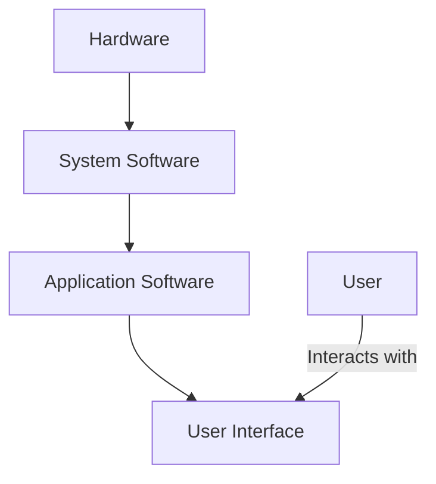

## 1.1.2 The Role of Software in Technology

In today's rapidly evolving world, software is the invisible force driving technological innovation and transforming every facet of our lives. From revolutionizing industries to reshaping our daily routines, the role of software in technology is both profound and pervasive. This section delves into how software acts as a catalyst for technological advancements, its impact on society, and its indispensable role in the global economy.

### Technological Advancements Driven by Software

Software is at the heart of many technological breakthroughs, enabling capabilities that were once the realm of science fiction. Let's explore some of the key areas where software is pushing the boundaries of what's possible.

#### Artificial Intelligence and Machine Learning

Artificial Intelligence (AI) and Machine Learning (ML) are among the most transformative technologies of our time, and software is their backbone. AI software can analyze vast amounts of data, recognize patterns, and make decisions with minimal human intervention. This capability is revolutionizing sectors such as healthcare, where AI algorithms assist in diagnosing diseases, and finance, where they predict market trends.

**Example in Python: A Simple Machine Learning Model**

Here's a basic example of a machine learning model using Python's popular library, scikit-learn. This script trains a model to predict whether a person has diabetes based on specific health metrics.

```python
from sklearn.datasets import load_diabetes
from sklearn.model_selection import train_test_split
from sklearn.linear_model import LinearRegression
from sklearn.metrics import mean_squared_error

diabetes = load_diabetes()
X = diabetes.data
y = diabetes.target

X_train, X_test, y_train, y_test = train_test_split(X, y, test_size=0.2, random_state=42)

model = LinearRegression()

model.fit(X_train, y_train)

predictions = model.predict(X_test)

mse = mean_squared_error(y_test, predictions)
print(f"Mean Squared Error: {mse:.2f}")
```

This script demonstrates how software can automate complex tasks, such as predicting health outcomes, which traditionally required manual analysis.

#### Internet of Things (IoT)

The Internet of Things (IoT) connects everyday devices to the internet, allowing them to send and receive data. Software plays a crucial role in IoT by enabling devices to communicate and perform tasks autonomously. Smart homes, for example, use IoT software to control lighting, heating, and security systems, enhancing convenience and efficiency.

#### Blockchain Technology

Blockchain technology, known for its role in cryptocurrencies, is another area where software is pivotal. Blockchain software ensures secure, transparent transactions across decentralized networks. Beyond finance, it's being used in supply chain management, healthcare, and even voting systems to enhance transparency and security.

### Software Transforming Industries

Software is not just advancing technology; it's transforming entire industries by streamlining processes, improving efficiency, and enabling new business models.

#### Healthcare Industry

In healthcare, software applications are revolutionizing patient care and hospital management. Electronic Health Records (EHR) systems, telemedicine platforms, and medical imaging software are improving diagnosis accuracy and patient outcomes. For instance, AI-powered diagnostic tools can analyze medical images faster and more accurately than human radiologists.

#### Finance Industry

The finance industry has undergone a digital transformation driven by software. Online banking, mobile payment apps, and automated trading platforms have made financial services more accessible and efficient. Fintech companies leverage software to offer innovative services like peer-to-peer lending and robo-advisors, disrupting traditional banking models.

#### Transportation Industry

Software has also revolutionized transportation. Navigation systems powered by software provide real-time traffic updates and route optimization, enhancing travel efficiency. Moreover, autonomous vehicles rely on complex software algorithms to navigate and make decisions, promising to redefine mobility in the future.

### Impact of Software on Daily Life

Software's influence extends beyond industries; it permeates our daily lives, affecting how we communicate, work, and travel.

#### Communication

Software has transformed communication, making it instantaneous and global. Social media platforms, messaging apps, and video conferencing tools allow us to connect with anyone, anywhere, at any time. These tools have become essential for personal and professional communication, especially in a world where remote work is increasingly common.

#### Transportation

In transportation, software applications like ride-sharing apps have changed how we commute. Navigation apps provide real-time traffic information, helping us avoid congestion and save time. Additionally, software in autonomous vehicles is set to revolutionize how we travel, promising safer and more efficient transportation.

### Economic and Social Influence of Software

The software industry is a major economic force, driving innovation and creating jobs worldwide. Let's explore its economic and social impact.

#### Globalization and Remote Work

Software has been instrumental in globalization, breaking down geographical barriers and enabling businesses to operate globally. Remote work, facilitated by collaboration tools and cloud-based software, has become a norm, offering flexibility and expanding the talent pool for companies.

#### Economic Impact

The software industry contributes significantly to the global economy. It drives innovation, increases productivity, and creates high-paying jobs. The demand for software developers continues to grow, reflecting the industry's importance in the digital age.

#### Social Influence

Software also has a profound social impact. It empowers individuals by providing access to information and services, enhancing education, and promoting social inclusion. However, it also raises ethical and privacy concerns, highlighting the need for responsible software development.

### Visual Representation of Software's Role

To better understand software's integral role in technology, let's visualize its position within the technology stack using a Mermaid.js diagram.



This diagram illustrates how software acts as a bridge between hardware and users, enabling interaction and functionality.

### Conclusion

Software is the driving force behind technological advancements, transforming industries, and reshaping our daily lives. Its role in enabling innovation, enhancing efficiency, and fostering global connectivity is indispensable. As we continue to navigate the digital age, understanding the role of software in technology is crucial for leveraging its potential to solve complex global challenges and create a better future.

## Quiz Time!



### Which of the following technologies is NOT primarily driven by software?

- [ ] Artificial Intelligence
- [ ] Internet of Things
- [ ] Blockchain
- [x] Traditional Manufacturing

> **Explanation:** Traditional manufacturing relies more on physical processes and machinery, whereas AI, IoT, and blockchain are heavily software-driven.

### How does software impact the healthcare industry?

- [x] By improving diagnosis accuracy with AI-powered tools
- [ ] By increasing the cost of medical care
- [ ] By eliminating the need for doctors
- [ ] By reducing the availability of patient data

> **Explanation:** Software, particularly AI-powered tools, enhances diagnosis accuracy and patient outcomes, improving healthcare delivery.

### What role does software play in the finance industry?

- [x] It enables online banking and mobile payments
- [ ] It increases transaction times
- [ ] It makes financial services less accessible
- [ ] It reduces the need for financial regulations

> **Explanation:** Software facilitates online banking and mobile payments, making financial services more accessible and efficient.

### Which of the following is a benefit of software in transportation?

- [x] Real-time traffic updates and route optimization
- [ ] Increased traffic congestion
- [ ] Higher transportation costs
- [ ] Reduced vehicle safety

> **Explanation:** Software provides real-time traffic updates and route optimization, enhancing travel efficiency and reducing congestion.

### How does software contribute to globalization?

- [x] By enabling remote work and breaking geographical barriers
- [ ] By increasing cultural isolation
- [ ] By limiting international trade
- [ ] By reducing communication efficiency

> **Explanation:** Software enables remote work and global communication, breaking geographical barriers and facilitating globalization.

### What is a major concern related to the social impact of software?

- [x] Privacy and ethical issues
- [ ] Lack of innovation
- [ ] Decreased access to information
- [ ] Reduced social inclusion

> **Explanation:** Privacy and ethical issues are major concerns, as software can collect and misuse personal data.

### Which industry has been transformed by software through the use of EHR systems?

- [x] Healthcare
- [ ] Agriculture
- [ ] Construction
- [ ] Retail

> **Explanation:** EHR systems have transformed the healthcare industry by improving patient data management and care delivery.

### What is a key characteristic of IoT devices?

- [x] Ability to communicate and perform tasks autonomously
- [ ] Dependence on human intervention for operation
- [ ] Lack of connectivity to the internet
- [ ] Inability to send or receive data

> **Explanation:** IoT devices are characterized by their ability to communicate and perform tasks autonomously, enhancing efficiency.

### What is the primary role of application software?

- [x] To provide functionality to users
- [ ] To manage hardware resources
- [ ] To operate without user interaction
- [ ] To replace system software

> **Explanation:** Application software provides functionality to users, enabling them to perform specific tasks.

### Software has a significant impact on which aspect of daily life?

- [x] Communication
- [ ] Physical exercise
- [ ] Traditional farming
- [ ] Manual labor

> **Explanation:** Software significantly impacts communication, enabling instantaneous and global interactions.


