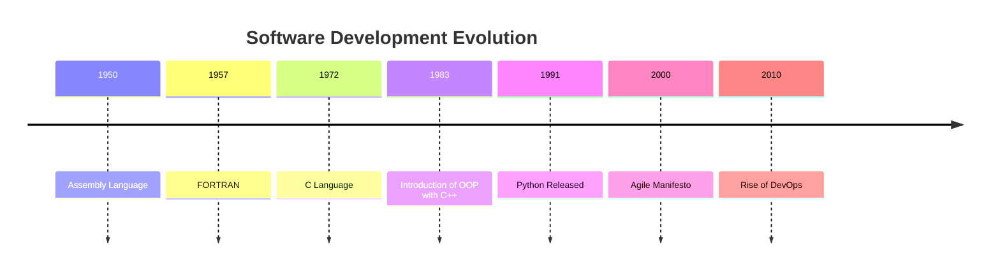

## 1.1.4 The Evolution of Software Development

The journey of software development is a fascinating tale of innovation and transformation, marked by significant milestones that have shaped the way we create and interact with technology today. Understanding this evolution not only provides context for current practices but also helps us anticipate future trends. This section delves into the historical perspective of software development, tracing its roots from early computing to the sophisticated methodologies and languages we use today.

### Early Computing: The Dawn of Programming

#### The Pioneers: Ada Lovelace and Alan Turing

The story of software development begins with visionaries like Ada Lovelace and Alan Turing, whose pioneering work laid the groundwork for modern computing. Ada Lovelace, often regarded as the first computer programmer, worked on Charles Babbage's Analytical Engine in the mid-1800s. Her notes on the engine include what is considered the first algorithm intended to be processed by a machine.

Alan Turing, a mathematician and logician, further advanced the field with his concept of the Turing Machine in the 1930s. His work provided a formal foundation for the theory of computation and introduced the idea of a machine that could simulate any algorithmic process, a principle that underpins modern computers.

#### Machine Language and Assembly Language

In the early days of computing, programming was done directly in machine language, which consists of binary code that the computer's hardware can execute. This approach was not only tedious but also prone to errors, as programmers had to manage every detail of the hardware's operation.

Assembly language emerged as a more human-readable form of machine language, using mnemonic codes and labels instead of binary. While still low-level, assembly language significantly improved programming efficiency and paved the way for more complex software systems.

```assembly
; Hello, World! in Assembly Language
section .data
    hello db 'Hello, World!',0

section .text
    global _start

_start:
    ; write(1, hello, 13)
    mov eax, 4
    mov ebx, 1
    mov ecx, hello
    mov edx, 13
    int 0x80

    ; exit(0)
    mov eax, 1
    xor ebx, ebx
    int 0x80
```

### The Rise of High-Level Languages

#### FORTRAN and COBOL: The First High-Level Languages

The introduction of high-level programming languages marked a significant leap forward in software development. FORTRAN (Formula Translation), developed in the 1950s, was one of the first high-level languages and was designed for scientific and engineering calculations. It allowed programmers to write code that was closer to human language, significantly reducing complexity and increasing productivity.

COBOL (Common Business-Oriented Language), developed around the same time, was designed for business applications. Its syntax was designed to be readable by non-programmers, making it accessible to a broader audience and cementing its place in the business world.

```fortran
! Hello, World! in FORTRAN
PROGRAM HelloWorld
  PRINT *, 'Hello, World!'
END PROGRAM HelloWorld
```

#### The Evolution to Modern Languages: C, Java, Python

As computing needs grew, so did the complexity of programming languages. The C language, developed in the early 1970s, introduced structured programming concepts and was instrumental in developing operating systems like UNIX. C's influence is profound, serving as a foundation for many modern languages.

Java, introduced in the mid-1990s, brought the concept of "write once, run anywhere," thanks to its platform-independent bytecode. Java's object-oriented approach and robust libraries made it a popular choice for enterprise applications.

Python, released in 1991, emphasized readability and simplicity, making it a favorite for beginners and professionals alike. Its versatility and extensive libraries have made it a staple in web development, data science, and automation.

```python
print("Hello, World!")
```

### Programming Paradigms: Shaping How We Code

#### Procedural Programming

Procedural programming, exemplified by languages like C, focuses on a sequence of instructions to perform tasks. This paradigm is characterized by the use of procedures or routines, which encapsulate code blocks that can be reused throughout a program. Procedural programming emphasizes a linear top-down approach, making it intuitive for tasks that follow a clear sequence.

```c
#include <stdio.h>

// Hello, World! in C
int main() {
    printf("Hello, World!\n");
    return 0;
}
```

#### Object-Oriented Programming (OOP)

Object-oriented programming (OOP) revolutionized software development by introducing the concept of objects—self-contained units that combine data and behavior. Languages like C++ and Java popularized OOP, promoting principles such as encapsulation, inheritance, and polymorphism. This paradigm allows for more modular, reusable, and maintainable code, which is essential for complex software systems.

```java
// Hello, World! in Java
public class HelloWorld {
    public static void main(String[] args) {
        System.out.println("Hello, World!");
    }
}
```

#### Functional Programming

Functional programming, with languages like Haskell and Scala, emphasizes immutability and first-class functions. This paradigm treats computation as the evaluation of mathematical functions, avoiding changing-state and mutable data. Functional programming is gaining popularity for its ability to handle concurrency and parallelism effectively, making it well-suited for modern multi-core processors.

```haskell
-- Hello, World! in Haskell
main = putStrLn "Hello, World!"
```

### Development Methodologies: From Waterfall to DevOps

#### The Waterfall Model

The Waterfall model, one of the earliest software development methodologies, follows a linear and sequential approach. Each phase—requirements, design, implementation, testing, deployment, and maintenance—must be completed before the next begins. While straightforward, the Waterfall model is inflexible and often criticized for its inability to accommodate changes during development.

#### Agile and Scrum: Embracing Flexibility

In response to the limitations of the Waterfall model, Agile methodologies emerged, emphasizing flexibility, collaboration, and customer feedback. The Agile Manifesto, published in 2001, highlighted values such as individuals and interactions over processes and tools, and working software over comprehensive documentation.

Scrum, a popular Agile framework, organizes work into iterative cycles called sprints, allowing teams to adapt to changes quickly and deliver incremental improvements. Agile methodologies have become the standard in many industries, promoting a culture of continuous improvement and responsiveness.

#### DevOps: Bridging Development and Operations

DevOps extends Agile principles by fostering collaboration between development and operations teams. This approach emphasizes automation, continuous integration, and continuous deployment (CI/CD), enabling faster and more reliable software delivery. DevOps practices have transformed how software is developed, tested, and deployed, reducing time-to-market and improving quality.

### Visualizing the Evolution: A Timeline

To better understand the progression of software development, let's visualize key milestones in a timeline:



### Key Points to Emphasize

1. **Dynamic Evolution:** Software development is a dynamic field, continuously evolving to meet new challenges and leverage emerging technologies.
   
2. **Historical Context:** Understanding the history of software development helps appreciate current practices and anticipate future trends.

3. **Impact of High-Level Languages:** The transition from low-level to high-level languages marked a significant leap in productivity and accessibility.

4. **Diverse Paradigms:** The diversity of programming paradigms—procedural, object-oriented, and functional—offers developers various tools to tackle different problems effectively.

5. **Modern Methodologies:** Agile and DevOps methodologies have reshaped software development, promoting flexibility, collaboration, and efficiency.

### Conclusion

The evolution of software development is a testament to human ingenuity and adaptability. From the early days of machine language to the sophisticated methodologies and languages of today, each step in this journey has contributed to the powerful and versatile software systems we rely on. As we continue to innovate, understanding this history not only enriches our knowledge but also equips us to shape the future of software development.

## Quiz Time!



### Who is considered the first computer programmer?

- [x] Ada Lovelace
- [ ] Alan Turing
- [ ] Charles Babbage
- [ ] John von Neumann

> **Explanation:** Ada Lovelace is often regarded as the first computer programmer due to her work on Charles Babbage's Analytical Engine.

### Which language is known for introducing structured programming?

- [ ] FORTRAN
- [x] C
- [ ] COBOL
- [ ] Assembly

> **Explanation:** The C language introduced structured programming concepts, which became a foundation for many modern languages.

### What is the main characteristic of procedural programming?

- [x] Sequence of instructions
- [ ] Object encapsulation
- [ ] Immutable data
- [ ] Event-driven

> **Explanation:** Procedural programming focuses on a sequence of instructions to perform tasks, emphasizing a linear top-down approach.

### Which programming paradigm emphasizes immutability and first-class functions?

- [ ] Object-Oriented Programming
- [ ] Procedural Programming
- [x] Functional Programming
- [ ] Event-Driven Programming

> **Explanation:** Functional programming emphasizes immutability and treats computation as the evaluation of mathematical functions.

### What is a key principle of Agile methodologies?

- [x] Flexibility and customer feedback
- [ ] Strict sequential phases
- [ ] Long-term planning
- [ ] Rigorous documentation

> **Explanation:** Agile methodologies emphasize flexibility, collaboration, and incorporating customer feedback into the development process.

### What does DevOps primarily focus on?

- [x] Collaboration between development and operations
- [ ] Sequential development phases
- [ ] Extensive documentation
- [ ] Long-term planning

> **Explanation:** DevOps fosters collaboration between development and operations teams, emphasizing automation and continuous integration.

### Which language was designed for business applications?

- [ ] FORTRAN
- [x] COBOL
- [ ] Python
- [ ] C

> **Explanation:** COBOL (Common Business-Oriented Language) was designed for business applications, with syntax accessible to non-programmers.

### What year was the Agile Manifesto published?

- [ ] 1995
- [ ] 2005
- [x] 2001
- [ ] 2010

> **Explanation:** The Agile Manifesto was published in 2001, outlining key values and principles for Agile software development.

### Which language introduced the concept of "write once, run anywhere"?

- [x] Java
- [ ] Python
- [ ] C++
- [ ] Haskell

> **Explanation:** Java introduced the concept of "write once, run anywhere" with its platform-independent bytecode.

### True or False: Assembly language is a high-level programming language.

- [ ] True
- [x] False

> **Explanation:** Assembly language is a low-level programming language, closer to machine language than high-level languages.


