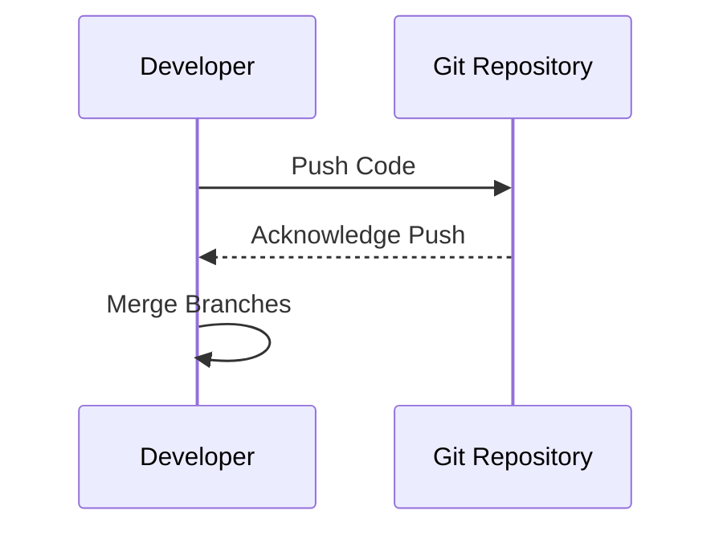

## 1.2.3 Implementation and Coding

The implementation and coding phase is where the theoretical designs and plans of software development are transformed into a functional product. This section delves into the intricacies of translating design into code, emphasizing best practices, tools, and collaborative methods that ensure the success and maintainability of software projects.

### Coding Standards and Best Practices

#### Importance of Coding Standards

Coding standards are a set of guidelines that help developers write code in a consistent manner. These standards play a crucial role in ensuring code readability, maintainability, and quality. By adhering to coding standards, developers can produce code that is easier to understand and modify, reducing the likelihood of errors and facilitating teamwork.

- **Consistency:** Coding standards ensure that code looks the same across the entire codebase, making it easier for developers to read and understand each other's code.
- **Readability:** Well-structured code is easier to read and understand, which is vital for debugging and future development.
- **Maintainability:** Consistent code is easier to maintain, as developers can quickly comprehend and modify it as needed.

#### Key Aspects of Coding Standards

1. **Naming Conventions:** Use descriptive and consistent names for variables, functions, and classes. For example, use camelCase for variables in JavaScript (`let userName`) and snake_case in Python (`user_name`).

2. **Commenting and Documentation:** Include comments to explain complex logic and document the purpose of functions and modules. This helps new team members understand the codebase quickly.

3. **Code Structure and Formatting:** Follow indentation rules and use whitespace effectively to enhance readability. Tools like Prettier for JavaScript and Black for Python can automate code formatting.

4. **Error Handling:** Implement robust error handling to manage exceptions and edge cases gracefully. This ensures that the application can handle unexpected situations without crashing.

#### Example of Coding Standards

Here is a simple example in Python demonstrating coding standards:

```python
def calculate_area(radius):
    """Calculate the area of a circle given its radius."""
    import math
    if radius < 0:
        raise ValueError("Radius cannot be negative")
    return math.pi * radius ** 2

try:
    area = calculate_area(5)
    print(f"The area is {area}")
except ValueError as e:
    print(e)
```

### Development Environments

A development environment is a critical component of the software development process. It consists of the tools and software that developers use to write, test, and debug their code.

#### Integrated Development Environments (IDEs)

IDEs are software applications that provide comprehensive facilities to programmers for software development. They typically include a source code editor, build automation tools, and a debugger.

- **Visual Studio Code:** A popular, lightweight IDE that supports multiple programming languages. It offers extensions for added functionality, such as syntax highlighting and code linting.

- **PyCharm:** An IDE specifically designed for Python development. It provides powerful features like code analysis, a graphical debugger, and integration with version control systems.

- **WebStorm:** An IDE for JavaScript development, offering advanced support for frameworks like React, Angular, and Vue.js.

#### Benefits of Using IDEs

- **Efficiency:** IDEs provide tools that automate repetitive tasks, such as code compilation and debugging, which increases productivity.
- **Code Quality:** Features like code completion and syntax highlighting help developers write error-free code.
- **Debugging:** Built-in debuggers allow developers to step through their code, inspect variables, and identify issues quickly.

### Version Control Systems

Version control systems (VCS) are essential for managing changes to source code over time. They enable multiple developers to work on a project simultaneously without overwriting each other's work.

#### Git and Repositories

Git is a distributed version control system that tracks changes in source code during software development. It allows developers to collaborate on projects effectively by managing changes and maintaining a history of modifications.

- **GitHub and GitLab:** Platforms that host Git repositories, providing a web-based interface for managing projects. They offer features like pull requests, code reviews, and issue tracking.

#### Key Git Concepts

- **Commits:** A commit is a snapshot of the project's current state. It records changes made to the codebase and includes a message describing the changes.

- **Branches:** Branches allow developers to work on different features or fixes independently. Once the work is complete, branches can be merged back into the main branch.

- **Merges:** Merging combines changes from different branches into a single branch. It is crucial for integrating new features and resolving conflicts.

#### Sample Git Commands

Here are some basic Git commands that are commonly used in software development:

```bash
git clone https://github.com/username/repository.git

git checkout -b feature-branch

git add .

git commit -m "Add new feature"

git push origin feature-branch

git checkout main
git merge feature-branch
```

### Collaborative Development

Collaboration is a key aspect of modern software development. It involves multiple developers working together to build, test, and maintain software.

#### Team Coding Practices

- **Code Reviews:** A process where developers review each other's code to ensure quality and adherence to coding standards. It helps identify bugs early and fosters knowledge sharing.

- **Pair Programming:** A technique where two developers work together at a single workstation. One writes the code (the driver), while the other reviews each line of code as it is typed (the observer).

#### Benefits of Collaborative Development

- **Improved Code Quality:** Regular code reviews and pair programming lead to higher quality code and fewer bugs.
- **Knowledge Sharing:** Collaboration allows team members to learn from each other, spreading knowledge and expertise across the team.
- **Faster Problem Solving:** Working together often leads to quicker solutions to complex problems, as multiple perspectives are considered.

### Visualizing the Code Workflow

To better understand how code moves from local development to shared repositories, consider the following sequence diagram:



This diagram illustrates a typical workflow where a developer pushes code to a Git repository and merges branches to integrate changes.

### Key Points to Emphasize

- **Implementation is where the design comes to life:** This phase is crucial for transforming design documents and specifications into a working software product.
- **Good coding practices and collaboration are vital for project success:** Adhering to coding standards and fostering a collaborative environment are essential for building high-quality software.

### Conclusion

The implementation and coding phase of the software development lifecycle is pivotal in bringing designs to fruition. By following coding standards, utilizing effective development environments, leveraging version control systems, and embracing collaborative practices, developers can ensure that their projects are successful, maintainable, and scalable. As you continue to explore the world of software development, remember that these practices are not just recommendations but essential components of a robust development process.

## Quiz Time!



### What is the primary benefit of adhering to coding standards?

- [x] Consistency and readability across the codebase
- [ ] Faster execution of code
- [ ] Reduced memory usage
- [ ] Increased complexity

> **Explanation:** Coding standards ensure that code is consistent and readable, making it easier to maintain and understand.

### Which of the following is a popular IDE for Python development?

- [ ] Visual Studio Code
- [x] PyCharm
- [ ] WebStorm
- [ ] Eclipse

> **Explanation:** PyCharm is specifically designed for Python development, offering features like code analysis and debugging.

### What is the purpose of a Git commit?

- [x] To record changes to the codebase
- [ ] To delete a branch
- [ ] To merge branches
- [ ] To clone a repository

> **Explanation:** A commit records changes made to the codebase, allowing developers to track modifications over time.

### How does pair programming benefit software development?

- [x] It improves code quality and facilitates knowledge sharing
- [ ] It reduces the number of developers needed
- [ ] It increases the complexity of code
- [ ] It slows down the development process

> **Explanation:** Pair programming involves two developers working together, which improves code quality and facilitates knowledge sharing.

### Which command is used to create a new branch in Git?

- [x] `git checkout -b branch-name`
- [ ] `git merge branch-name`
- [ ] `git commit -m "message"`
- [ ] `git push origin branch-name`

> **Explanation:** The `git checkout -b branch-name` command creates a new branch and switches to it.

### What is the role of a code review in collaborative development?

- [x] To ensure code quality and adherence to standards
- [ ] To increase the number of lines of code
- [ ] To reduce the number of developers
- [ ] To delete unnecessary code

> **Explanation:** Code reviews ensure that code meets quality standards and adheres to coding guidelines.

### What is the benefit of using an IDE?

- [x] It provides tools that automate repetitive tasks and increase productivity
- [ ] It makes the code run faster
- [ ] It increases the complexity of the code
- [ ] It reduces the need for documentation

> **Explanation:** IDEs provide tools that automate tasks like code compilation and debugging, increasing productivity.

### Which platform is used for hosting Git repositories?

- [x] GitHub
- [ ] Docker
- [ ] Jenkins
- [ ] Ansible

> **Explanation:** GitHub is a platform for hosting Git repositories, providing a web-based interface for managing projects.

### What is the purpose of merging branches in Git?

- [x] To combine changes from different branches
- [ ] To delete a branch
- [ ] To create a new branch
- [ ] To revert changes

> **Explanation:** Merging combines changes from different branches into a single branch, integrating new features or fixes.

### True or False: Version control systems are only useful for large teams.

- [ ] True
- [x] False

> **Explanation:** Version control systems are useful for both small and large teams, as they help manage changes and maintain a history of modifications.


