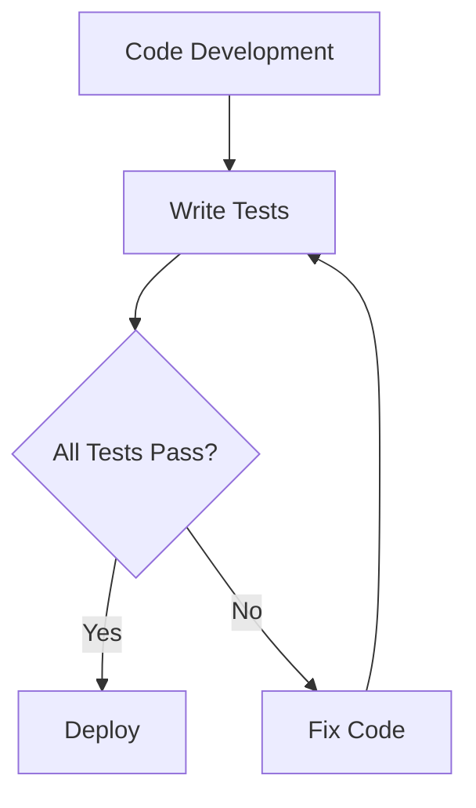

---

linkTitle: "1.2.4 Testing, Deployment, and Maintenance"
title: "Testing, Deployment, and Maintenance in Software Development Lifecycle"
description: "Explore the critical phases of testing, deployment, and maintenance in the software development lifecycle, ensuring quality and longevity of software applications."
categories:
- Software Development
- Software Engineering
- Software Lifecycle
tags:
- Testing
- Deployment
- Maintenance
- SDLC
- Software Quality
date: 2024-10-25
type: docs
nav_weight: 1240

---

## 1.2.4 Testing, Deployment, and Maintenance

The journey of software development doesn't conclude with the completion of coding. Ensuring the software performs as expected, deploying it to users, and maintaining its functionality over time are equally critical phases. This section delves into the final stages of the Software Development Lifecycle (SDLC) — Testing, Deployment, and Maintenance — which are paramount for ensuring software quality and longevity.

### Testing: Ensuring Software Reliability

Testing is an integral part of the SDLC that aims to identify and rectify defects before the software reaches the end-users. It is a systematic process that evaluates the functionality, performance, and security of the software. Let's explore the various types of testing, their importance, and the tools that facilitate these processes.

#### Types of Testing

1. **Unit Testing**
   - **Definition:** Unit testing focuses on testing individual components or functions of the software in isolation. It ensures that each part of the software performs as expected.
   - **Example in Python:**

     ```python
     import unittest

     def add(a, b):
         return a + b

     class TestMathOperations(unittest.TestCase):
         def test_add(self):
             self.assertEqual(add(2, 3), 5)
             self.assertEqual(add(-1, 1), 0)

     if __name__ == '__main__':
         unittest.main()
     ```

   - **Example in JavaScript:**

     ```javascript
     const add = (a, b) => a + b;

     test('adds 2 + 3 to equal 5', () => {
       expect(add(2, 3)).toBe(5);
     });

     test('adds -1 + 1 to equal 0', () => {
       expect(add(-1, 1)).toBe(0);
     });
     ```

2. **Integration Testing**
   - **Definition:** Integration testing examines the combination of individual software modules and their interactions. It identifies interface defects between modules.
   - **Importance:** Ensures that integrated components work together as intended.

3. **System Testing**
   - **Definition:** System testing evaluates the complete and integrated software system. It verifies that the system meets the specified requirements.
   - **Scope:** Includes functional and non-functional testing aspects.

4. **Acceptance Testing**
   - **Definition:** Acceptance testing is the final phase of testing before the software is delivered to the customer. It ensures the software meets business requirements and is ready for deployment.
   - **Types:** User Acceptance Testing (UAT) and Business Acceptance Testing (BAT).

#### Importance of Early Bug Detection

Detecting and fixing bugs early in the development process can significantly reduce the cost and time associated with software defects. Early testing helps in:

- **Reducing Cost:** Fixing defects early is less costly than addressing them after deployment.
- **Improving Quality:** Continuous testing improves the overall quality and reliability of the software.
- **Increasing Customer Satisfaction:** Delivering a defect-free product enhances user satisfaction and trust.

#### Automated Testing Tools and Frameworks

Automated testing tools and frameworks streamline the testing process, making it more efficient and reliable. Some popular tools include:

- **Python:** `unittest`, `pytest`
- **JavaScript:** `Jest`, `Mocha`, `Chai`

These tools help in automating repetitive tasks, executing tests quickly, and providing comprehensive reports on test outcomes.

### Deployment: Bringing Software to Users

Deployment is the process of moving software from development to a live environment where end-users can access it. This phase involves several steps and strategies to ensure a smooth transition.

#### Steps to Move Software from Development to Production

1. **Build and Package:** Compile the code and package it into deployable artifacts.
2. **Testing in Staging Environment:** Deploy the software to a staging environment that mimics the production setup to conduct final tests.
3. **Release Planning:** Plan the release schedule, considering factors like user impact and downtime.
4. **Deployment Execution:** Deploy the software to the production environment.
5. **Post-Deployment Monitoring:** Monitor the software for any issues post-deployment and ensure stability.

#### Deployment Strategies

1. **Continuous Deployment**
   - **Definition:** Continuous deployment involves automatically deploying every change that passes the automated tests to production.
   - **Benefits:** Reduces the time between development and deployment, enabling faster feedback and iteration.

2. **Staging Environments**
   - **Purpose:** A staging environment is a replica of the production environment used for final testing before deployment.
   - **Benefits:** Helps in identifying potential issues that might occur in the production environment.

### Maintenance: Sustaining Software Quality

Once the software is deployed, the maintenance phase begins. This phase is crucial for ensuring the software remains functional, secure, and relevant over time.

#### Ongoing Support and Updates

- **Bug Fixes:** Addressing defects reported by users or identified through monitoring.
- **Feature Enhancements:** Adding new features or improving existing ones based on user feedback.
- **Security Updates:** Regularly updating the software to patch security vulnerabilities.

#### Handling User Feedback and Bug Reports

User feedback is invaluable for improving software quality. Effective handling of feedback involves:

- **Prioritizing Issues:** Assessing the impact and urgency of reported issues.
- **Communicating with Users:** Keeping users informed about the status of their feedback or reported bugs.
- **Iterative Improvements:** Continuously improving the software based on user input.

#### Importance of Software Scalability and Adaptability

As user needs evolve, software must scale and adapt to meet new demands. Key considerations include:

- **Scalability:** Designing software to handle increased load without performance degradation.
- **Adaptability:** Ensuring the software can be easily modified to incorporate new features or technologies.

### Visualizing the Testing Process

Understanding the testing process can be enhanced through visual aids. Below is a flowchart illustrating the testing workflow:



### Key Points to Emphasize

- **Testing** ensures software reliability and user satisfaction by identifying defects early.
- **Deployment** is a critical transition phase that must be carefully planned and executed.
- **Maintenance** is an ongoing process essential for keeping software relevant and functional.

By understanding and implementing these phases effectively, software developers can ensure the delivery of high-quality, reliable, and user-friendly applications.

## Quiz Time!



### What is the primary goal of unit testing?

- [x] To test individual components or functions in isolation
- [ ] To test the entire software system
- [ ] To test the integration of multiple components
- [ ] To test the software from the user's perspective

> **Explanation:** Unit testing focuses on testing individual components or functions in isolation to ensure they perform as expected.

### Which testing phase is typically the last before software delivery to the customer?

- [ ] Unit Testing
- [ ] Integration Testing
- [ ] System Testing
- [x] Acceptance Testing

> **Explanation:** Acceptance testing is the final phase of testing before the software is delivered to the customer, ensuring it meets business requirements.

### What is the benefit of detecting and fixing bugs early in the development process?

- [x] It reduces cost and time associated with fixing defects later
- [ ] It increases the complexity of the software
- [ ] It delays the deployment process
- [ ] It decreases customer satisfaction

> **Explanation:** Detecting and fixing bugs early reduces the cost and time associated with addressing defects after deployment, improving overall software quality.

### Which of the following is a popular testing framework for JavaScript?

- [ ] unittest
- [ ] pytest
- [x] Jest
- [ ] Mocha

> **Explanation:** Jest is a popular testing framework for JavaScript, known for its simplicity and extensive features.

### What is the purpose of a staging environment?

- [x] To test software in an environment similar to production before deployment
- [ ] To develop new features
- [ ] To store backup data
- [ ] To monitor user activity

> **Explanation:** A staging environment is used to test software in an environment that mimics production, helping to identify potential issues before deployment.

### What is continuous deployment?

- [x] Automatically deploying every change that passes automated tests to production
- [ ] Deploying software manually after each change
- [ ] Deploying software once a month
- [ ] Deploying software without any testing

> **Explanation:** Continuous deployment involves automatically deploying every change that passes automated tests to production, enabling faster feedback and iteration.

### What is the primary focus of software maintenance?

- [x] Ensuring the software remains functional, secure, and relevant over time
- [ ] Developing new software from scratch
- [ ] Testing individual components
- [ ] Integrating third-party libraries

> **Explanation:** The primary focus of software maintenance is to ensure the software remains functional, secure, and relevant over time through updates and bug fixes.

### Why is user feedback important in the maintenance phase?

- [x] It helps in improving software quality by addressing user-reported issues
- [ ] It is not relevant to software maintenance
- [ ] It only increases the workload
- [ ] It is used for marketing purposes

> **Explanation:** User feedback is important in the maintenance phase as it helps in improving software quality by addressing issues and enhancing features based on user input.

### What does software scalability ensure?

- [x] The software can handle increased load without performance degradation
- [ ] The software can only run on specific hardware
- [ ] The software cannot be modified
- [ ] The software is always free

> **Explanation:** Software scalability ensures that the software can handle increased load without performance degradation, making it suitable for growing user bases.

### True or False: Maintenance is a one-time process after deployment.

- [ ] True
- [x] False

> **Explanation:** Maintenance is an ongoing process that continues after deployment to ensure the software remains functional, secure, and relevant over time.



By mastering these concepts, you will be well-prepared to ensure the quality and longevity of your software projects. Remember, the final phases of the SDLC are not just about finishing the project but about setting it up for success in the long run.
