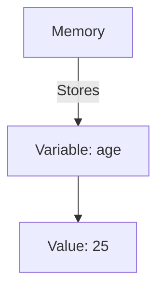

---

linkTitle: "1.3.2 Variables, Data Types, and Operators"
title: "Variables, Data Types, and Operators: Essential Programming Basics"
description: "Explore the foundational concepts of variables, data types, and operators in programming with practical examples in Python and JavaScript."
categories:
- Software Development
- Programming Basics
- Design Patterns
tags:
- Variables
- Data Types
- Operators
- Python
- JavaScript
date: 2024-10-25
type: docs
nav_weight: 132000
---

## 1.3.2 Variables, Data Types, and Operators

In the journey of learning programming, understanding variables, data types, and operators is crucial. These elements form the backbone of coding, enabling developers to manipulate data and create dynamic applications. In this section, we will delve into these fundamental concepts, using Python and JavaScript as our primary languages for examples.

### Understanding Variables

#### What are Variables?

Variables are essentially storage containers for data. They allow programmers to store, retrieve, and manipulate data within a program. Think of variables as labeled boxes where you can store different items (data), which can be accessed and modified as needed.

#### Declaring and Initializing Variables

In programming, declaring a variable means creating it, while initializing a variable means assigning it an initial value. Let’s explore how this is done in Python and JavaScript.

##### Python

In Python, variables are declared by simply assigning a value to a variable name. Python is dynamically typed, meaning you don’t need to specify the data type explicitly.

```python
age = 25
is_student = True
name = "Alice"
```

##### JavaScript

In JavaScript, variables can be declared using `var`, `let`, or `const`. The `let` and `const` keywords were introduced in ECMAScript 6 (ES6) and are preferred over `var` due to their block scope.

```javascript
// JavaScript example
let age = 25;
let isStudent = true;
let name = "Alice";
```

#### Visualizing Variables

To better understand how variables store data, consider the following diagram illustrating how a variable might be stored in memory:



### Exploring Data Types

Data types define the kind of data a variable can hold. Understanding data types is crucial because it influences what operations can be performed on the data. We categorize data types into primitive and complex types.

#### Primitive Data Types

Primitive data types are the most basic data types available in a programming language. They include:

- **Integers**: Whole numbers without a fractional component.
- **Floats**: Numbers with a decimal point.
- **Strings**: Sequences of characters.
- **Booleans**: True or false values.

##### Python Examples

```python
age = 25

height = 5.9

name = "Alice"

is_student = True
```

##### JavaScript Examples

```javascript
// Integer
let age = 25;

// Float
let height = 5.9;

// String
let name = "Alice";

// Boolean
let isStudent = true;
```

#### Complex Data Types

Complex data types can store multiple values and more complex structures. They include:

- **Lists/Arrays**: Ordered collections of items.
- **Dictionaries/Objects**: Collections of key-value pairs.

##### Python Examples

```python
fruits = ["apple", "banana", "cherry"]

student = {"name": "Alice", "age": 25, "is_student": True}
```

##### JavaScript Examples

```javascript
// Array
let fruits = ["apple", "banana", "cherry"];

// Object
let student = {
    name: "Alice",
    age: 25,
    isStudent: true
};
```

### Operators: Manipulating Data

Operators are symbols that perform operations on variables and values. They are essential for performing computations and making decisions in a program.

#### Arithmetic Operators

Arithmetic operators are used to perform mathematical operations.

- **Addition (+)**: Adds two operands.
- **Subtraction (-)**: Subtracts the second operand from the first.
- **Multiplication (*)**: Multiplies two operands.
- **Division (/)**: Divides the numerator by the denominator.
- **Modulus (%)**: Returns the remainder of a division operation.

##### Python Examples

```python
sum = 10 + 5      # 15
difference = 10 - 5  # 5
product = 10 * 5   # 50
quotient = 10 / 5  # 2.0
remainder = 10 % 3 # 1
```

##### JavaScript Examples

```javascript
// Arithmetic operations
let sum = 10 + 5;      // 15
let difference = 10 - 5;  // 5
let product = 10 * 5;   // 50
let quotient = 10 / 5;  // 2
let remainder = 10 % 3; // 1
```

#### Comparison Operators

Comparison operators compare two values and return a boolean result.

- **Equal to (==)**: Checks if two values are equal.
- **Not equal to (!=)**: Checks if two values are not equal.
- **Greater than (>)**: Checks if the left operand is greater than the right.
- **Less than (<)**: Checks if the left operand is less than the right.

##### Python Examples

```python
is_equal = (10 == 5)     # False
is_not_equal = (10 != 5) # True
is_greater = (10 > 5)    # True
is_less = (10 < 5)       # False
```

##### JavaScript Examples

```javascript
// Comparison operations
let isEqual = (10 == 5);     // false
let isNotEqual = (10 != 5);  // true
let isGreater = (10 > 5);    // true
let isLess = (10 < 5);       // false
```

#### Logical Operators

Logical operators are used to combine multiple boolean expressions.

- **And (and/&&)**: Returns true if both operands are true.
- **Or (or/||)**: Returns true if at least one operand is true.
- **Not (not/!)**: Inverts the boolean value of the operand.

##### Python Examples

```python
is_student_and_adult = is_student and (age >= 18)  # True
is_student_or_adult = is_student or (age >= 18)   # True
is_not_student = not is_student                   # False
```

##### JavaScript Examples

```javascript
// Logical operations
let isStudentAndAdult = isStudent && (age >= 18);  // true
let isStudentOrAdult = isStudent || (age >= 18);   // true
let isNotStudent = !isStudent;                     // false
```

### Practical Applications and Best Practices

Understanding variables, data types, and operators is essential for developing efficient and effective software. These elements are foundational to writing clean, maintainable code. Here are some best practices to keep in mind:

- **Use Descriptive Variable Names**: Choose names that clearly describe the data they hold, enhancing code readability.
- **Consistent Data Types**: Ensure variables hold consistent data types to avoid unexpected errors.
- **Optimize Operator Use**: Use operators efficiently to perform necessary computations and logic checks.

### Common Pitfalls

While working with variables, data types, and operators, beginners often encounter certain pitfalls:

- **Type Errors**: Mixing incompatible data types can lead to errors. For example, adding a string to an integer without conversion.
- **Scope Issues**: In JavaScript, using `var` can lead to unexpected behavior due to its function scope. Prefer `let` or `const` for block scope.
- **Operator Precedence**: Misunderstanding the order of operations can lead to incorrect computations. Use parentheses to clarify precedence.

### Conclusion

Variables, data types, and operators are the building blocks of programming. Mastering these concepts empowers developers to write robust and flexible code. As you continue your journey in software development, these fundamentals will serve as the foundation upon which more complex concepts are built.

---

## Quiz Time!



### What is the primary purpose of a variable in programming?

- [x] To store data that can be used and manipulated
- [ ] To execute a block of code repeatedly
- [ ] To define a new data type
- [ ] To create a user interface

> **Explanation:** Variables are used to store data that can be accessed and manipulated throughout a program.

### Which of the following is a primitive data type?

- [x] Integer
- [ ] Array
- [ ] Object
- [ ] Dictionary

> **Explanation:** Integer is a primitive data type, while arrays and objects are complex data types.

### How do you declare a variable in Python?

- [x] By assigning a value to a variable name
- [ ] Using the `var` keyword
- [ ] Using the `let` keyword
- [ ] Using the `const` keyword

> **Explanation:** In Python, you declare a variable by simply assigning a value to it without using any keyword.

### What does the modulus operator (%) do?

- [x] Returns the remainder of a division operation
- [ ] Divides two numbers
- [ ] Multiplies two numbers
- [ ] Adds two numbers

> **Explanation:** The modulus operator returns the remainder of a division operation.

### Which logical operator is used to invert a boolean value?

- [x] not/!
- [ ] and/&&
- [ ] or/||
- [ ] xor

> **Explanation:** The `not` operator in Python and `!` in JavaScript are used to invert a boolean value.

### What will the following Python code output: `print(10 > 5 and 5 < 3)`?

- [x] False
- [ ] True
- [ ] 10
- [ ] 5

> **Explanation:** The expression evaluates to `False` because `5 < 3` is `False`, making the entire `and` expression `False`.

### In JavaScript, which keyword should you use to declare a constant variable?

- [x] const
- [ ] var
- [ ] let
- [ ] static

> **Explanation:** The `const` keyword is used to declare a constant variable in JavaScript.

### What is the result of `5 + "5"` in JavaScript?

- [x] "55"
- [ ] 10
- [ ] 55
- [ ] "10"

> **Explanation:** In JavaScript, adding a number to a string results in string concatenation, producing "55".

### Which of the following is a comparison operator?

- [x] ==
- [ ] +
- [ ] &&
- [ ] not

> **Explanation:** The `==` operator is used to compare two values for equality.

### True or False: In Python, you must declare the data type of a variable when you create it.

- [x] False
- [ ] True

> **Explanation:** Python is dynamically typed, so you do not need to declare the data type of a variable when you create it.



By mastering variables, data types, and operators, you lay the groundwork for more advanced programming concepts. These basics will be invaluable as you progress through your software development journey.
