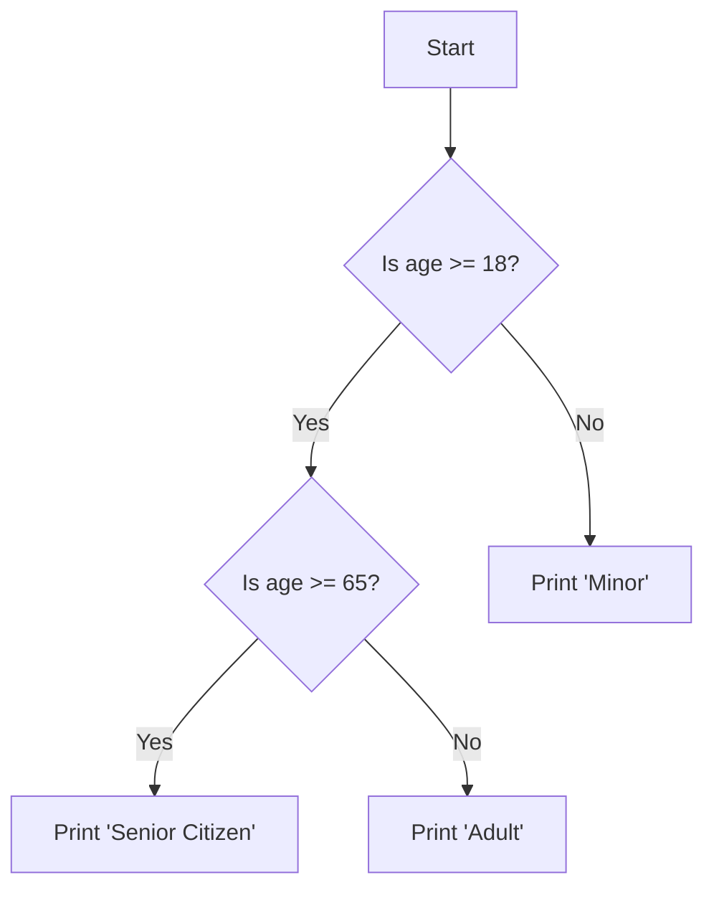

## 1.3.3 Control Structures and Loops

In the realm of software development, control structures and loops form the backbone of logical decision-making and repetitive task execution. These constructs allow developers to dictate the flow of a program, enabling it to respond dynamically to different inputs and conditions. In this section, we will delve into the intricacies of control structures and loops, focusing on their implementation in Python and JavaScript, two of the most widely used programming languages today.

### Understanding Control Structures

Control structures are fundamental components of programming that allow you to alter the execution flow of a program based on certain conditions. The primary types of control structures include conditional statements (`if`, `else if`, `else`) and loops (`for`, `while`, `do-while`). Let's explore each in detail.

#### Conditional Statements

Conditional statements enable a program to make decisions based on specific conditions. They are the building blocks for creating logic in your code.

##### The `if` Statement

The `if` statement evaluates a condition and executes a block of code if the condition is true. It is the simplest form of a conditional statement.

**Python Example:**

```python
age = 20
if age >= 18:
    print("Adult")
```

**JavaScript Example:**

```javascript
let age = 20;
if (age >= 18) {
    console.log("Adult");
}
```

##### The `else` Statement

The `else` statement provides an alternative block of code that executes if the `if` condition is false.

**Python Example:**

```python
age = 16
if age >= 18:
    print("Adult")
else:
    print("Minor")
```

**JavaScript Example:**

```javascript
let age = 16;
if (age >= 18) {
    console.log("Adult");
} else {
    console.log("Minor");
}
```

##### The `else if` Statement

The `else if` statement allows for multiple conditions to be checked sequentially. It executes the first true condition it encounters.

**Python Example:**

```python
score = 85
if score >= 90:
    print("Grade: A")
elif score >= 80:
    print("Grade: B")
else:
    print("Grade: C")
```

**JavaScript Example:**

```javascript
let score = 85;
if (score >= 90) {
    console.log("Grade: A");
} else if (score >= 80) {
    console.log("Grade: B");
} else {
    console.log("Grade: C");
}
```

##### Nesting Conditionals

Nesting conditionals involves placing one conditional statement inside another, allowing for more complex decision-making.

**Python Example:**

```python
age = 20
if age >= 18:
    if age >= 65:
        print("Senior Citizen")
    else:
        print("Adult")
else:
    print("Minor")
```

**JavaScript Example:**

```javascript
let age = 20;
if (age >= 18) {
    if (age >= 65) {
        console.log("Senior Citizen");
    } else {
        console.log("Adult");
    }
} else {
    console.log("Minor");
}
```

### Visualizing Conditional Logic

To better understand how conditional statements direct program execution, consider the following flowchart:



### Exploring Loops

Loops are control structures that repeat a block of code multiple times. They are essential for tasks that require iteration, such as processing items in a list or performing an action until a condition changes.

#### The `for` Loop

The `for` loop is used to iterate over a sequence (such as a list, tuple, or string) or a range of numbers.

**Python Example:**

```python
fruits = ["apple", "banana", "cherry"]
for fruit in fruits:
    print(fruit)

for i in range(5):
    print(i)
```

**JavaScript Example:**

```javascript
// Iterating over an array
let fruits = ["apple", "banana", "cherry"];
for (let fruit of fruits) {
    console.log(fruit);
}

// Iterating over a range of numbers
for (let i = 0; i < 5; i++) {
    console.log(i);
}
```

#### The `while` Loop

The `while` loop repeats a block of code as long as a specified condition is true. It is useful when the number of iterations is not known beforehand.

**Python Example:**

```python
count = 0
while count < 5:
    print(count)
    count += 1
```

**JavaScript Example:**

```javascript
let count = 0;
while (count < 5) {
    console.log(count);
    count++;
}
```

#### The `do-while` Loop (JavaScript)

The `do-while` loop is similar to the `while` loop, but it guarantees that the block of code will execute at least once before checking the condition.

**JavaScript Example:**

```javascript
let count = 0;
do {
    console.log(count);
    count++;
} while (count < 5);
```

### Control Flow with `break` and `continue`

Control flow statements like `break` and `continue` modify the execution of loops.

#### The `break` Statement

The `break` statement exits the loop immediately, regardless of the loop's condition.

**Python Example:**

```python
for i in range(10):
    if i == 5:
        break
    print(i)
```

**JavaScript Example:**

```javascript
for (let i = 0; i < 10; i++) {
    if (i === 5) {
        break;
    }
    console.log(i);
}
```

#### The `continue` Statement

The `continue` statement skips the current iteration and proceeds to the next iteration of the loop.

**Python Example:**

```python
for i in range(10):
    if i % 2 == 0:
        continue
    print(i)
```

**JavaScript Example:**

```javascript
for (let i = 0; i < 10; i++) {
    if (i % 2 === 0) {
        continue;
    }
    console.log(i);
}
```

### Preventing Infinite Loops

Infinite loops occur when the loop's terminating condition is never met. They can cause programs to hang or crash, making it crucial to ensure that loops have a clear exit strategy.

**Python Example:**

```python
count = 0
while True:
    print(count)
    count += 1
    if count >= 5:
        break
```

**JavaScript Example:**

```javascript
// Potential infinite loop
let count = 0;
while (true) {
    console.log(count);
    count++;
    if (count >= 5) {
        break;
    }
}
```

### Real-World Applications

Control structures and loops are used extensively in real-world applications. For instance, they are crucial in web development for tasks such as form validation, data processing, and dynamic content generation.

### Best Practices and Common Pitfalls

- **Best Practices:**
  - Always ensure loops have a terminating condition.
  - Use meaningful variable names for loop counters.
  - Keep loop bodies concise to improve readability.

- **Common Pitfalls:**
  - Forgetting to update the loop counter, leading to infinite loops.
  - Using `break` and `continue` excessively, which can make code harder to understand.

### Conclusion

Mastering control structures and loops is essential for any programmer. These constructs allow you to build dynamic, responsive programs that can handle a wide range of tasks and conditions. By understanding and applying these concepts, you can write more efficient and effective code.

## Quiz Time!



### What is the purpose of a conditional statement in programming?

- [x] To make decisions based on conditions
- [ ] To repeat code execution
- [ ] To define variables
- [ ] To handle exceptions

> **Explanation:** Conditional statements allow programs to execute certain blocks of code based on whether a condition is true or false.

### How does a `for` loop differ from a `while` loop?

- [x] A `for` loop iterates over a sequence, while a `while` loop continues until a condition is false.
- [ ] A `for` loop is used for infinite loops, while a `while` loop is not.
- [ ] A `for` loop cannot use `break` or `continue`.
- [ ] A `while` loop is only used for numbers.

> **Explanation:** A `for` loop is typically used for iterating over a sequence or a range, whereas a `while` loop continues executing as long as its condition remains true.

### What does the `break` statement do?

- [x] Exits the loop immediately
- [ ] Skips the current iteration
- [ ] Continues the loop indefinitely
- [ ] Restarts the loop from the beginning

> **Explanation:** The `break` statement is used to exit a loop immediately, terminating its execution.

### Which statement ensures that a `do-while` loop executes at least once?

- [x] The condition is checked after the loop body is executed.
- [ ] The condition is checked before the loop body is executed.
- [ ] The loop automatically executes twice.
- [ ] The loop cannot execute if the condition is false.

> **Explanation:** In a `do-while` loop, the condition is checked after the loop body has executed, ensuring the body runs at least once.

### What is a common cause of infinite loops?

- [x] Forgetting to update the loop counter
- [ ] Using `break` statements
- [ ] Using `continue` statements
- [ ] Nesting loops

> **Explanation:** Infinite loops often occur when the loop counter or condition is not properly updated or terminated.

### What does the `continue` statement do in a loop?

- [x] Skips the current iteration and moves to the next
- [ ] Exits the loop
- [ ] Restarts the loop
- [ ] Ends the program

> **Explanation:** The `continue` statement skips the rest of the code in the current iteration and moves to the next iteration of the loop.

### How can you prevent infinite loops?

- [x] Ensure there is a terminating condition
- [x] Update loop counters appropriately
- [ ] Use only `do-while` loops
- [ ] Avoid using loops altogether

> **Explanation:** To prevent infinite loops, ensure that loops have a clear terminating condition and that any counters or conditions are updated correctly.

### What is the output of the following code snippet?

```python
count = 0
while count < 3:
    print(count)
    count += 1
```

- [x] 0 1 2
- [ ] 1 2 3
- [ ] 0 1 2 3
- [ ] 1 2

> **Explanation:** The loop prints the current value of `count` starting from 0 and increments it until `count` is no longer less than 3.

### In JavaScript, how do you iterate over an array using a `for` loop?

- [x] `for (let i = 0; i < array.length; i++)`
- [ ] `for (let i = 0; i <= array.length; i++)`
- [ ] `for (let i in array)`
- [ ] `for (let i of array)`

> **Explanation:** The correct syntax for iterating over an array with a `for` loop in JavaScript uses `i < array.length`.

### True or False: Nesting conditionals can help create more complex decision-making logic.

- [x] True
- [ ] False

> **Explanation:** Nesting conditionals allows for more complex decision-making by enabling multiple layers of conditions to be evaluated.


