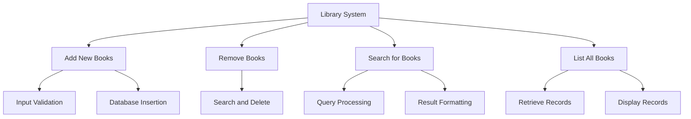

---

linkTitle: "1.4.1 Understanding the Problem Statement"
title: "Understanding the Problem Statement in Software Design"
description: "Learn how to effectively interpret and analyze programming problems to enhance your problem-solving skills in software development."
categories:
- Software Development
- Problem Solving
- Design Patterns
tags:
- Problem Analysis
- Software Design
- Programming
- Requirements
- Objectives
date: 2024-10-25
type: docs
nav_weight: 1410

---

## 1.4.1 Understanding the Problem Statement

In the world of software development, the ability to solve problems effectively is paramount. At the heart of this skill lies a fundamental task: understanding the problem statement. This section aims to equip you with the tools and techniques necessary to dissect and comprehend programming problems, ensuring that you can approach them with clarity and confidence.

### The Importance of Understanding the Problem Statement

Before diving into code, it's essential to grasp the problem you're trying to solve. Misunderstanding the problem can lead to wasted time, effort, and resources. A thorough understanding of the problem statement sets the stage for successful solution design and implementation.

**Key Points to Emphasize:**

- **Effective problem-solving** is critical in programming.
- **Thorough understanding** prevents errors and saves time.

### Analyzing Requirements

The first step in understanding a problem statement is to analyze its requirements. This involves careful reading and interpretation of the provided information.

#### Read the Problem Carefully

Begin by reading the problem statement multiple times. This may seem obvious, but it's crucial to ensure you haven't missed any details. Pay attention to every word, as nuances can significantly impact your understanding.

#### Identify Inputs and Desired Outputs

Once you have a good grasp of the problem, identify the inputs and outputs. These are often explicitly stated, but sometimes they require inference. Knowing what data you have to work with and what the expected results are will guide your solution.

**Example:**

Consider a problem statement for a simple calculator application:

- **Input:** Two numbers and an operation (addition, subtraction, multiplication, division).
- **Output:** The result of applying the operation to the numbers.

### Breaking Down the Problem

Complex problems can be overwhelming. Breaking them down into smaller, manageable parts makes them easier to tackle.

#### Divide and Conquer

Use the divide and conquer approach to break the problem into sub-problems. Each sub-problem should be simpler and more straightforward to solve. This method not only simplifies the problem but also helps in organizing your thoughts and approach.

#### Use Questioning Techniques

Questioning is a powerful tool for clarifying ambiguities. Ask yourself questions like:

- What are the core components of the problem?
- Are there any constraints or limitations?
- What assumptions am I making?

**Example:**

For our calculator application, you might break down the problem as follows:

1. **Input Parsing:** How will you read and validate the inputs?
2. **Operation Execution:** How will you perform the specified operation?
3. **Output Generation:** How will you format and display the result?

### Setting Objectives

Once you have a clear understanding of the problem, it's time to set objectives. This involves defining what success looks like and planning your approach.

#### Define Success

Clearly outline what a successful solution entails. This could include performance benchmarks, user interface requirements, or other specific criteria.

#### Prioritize Tasks and Plan the Approach

With your objectives in mind, prioritize the tasks needed to achieve them. Create a plan that outlines the steps you'll take, the order in which you'll tackle them, and any dependencies between tasks.

**Example:**

For the calculator application, success might look like:

- Accurate calculations for all supported operations.
- A user-friendly interface that handles invalid inputs gracefully.
- Efficient performance with minimal latency.

### Sample Problem Walkthrough

Let's walk through a sample problem to illustrate the analysis process.

#### Problem Statement

Design a system that manages a library's inventory. The system should allow users to:

- Add new books.
- Remove books.
- Search for books by title or author.
- List all available books.

#### Step-by-Step Analysis

1. **Read the Problem Carefully:**
   - Ensure you understand the requirements for each feature.

2. **Identify Inputs and Outputs:**
   - **Inputs:** Book details (title, author, ISBN), search queries.
   - **Outputs:** Confirmation messages, search results, book listings.

3. **Break Down the Problem:**
   - **Add New Books:** Input validation, database insertion.
   - **Remove Books:** Search and delete operations.
   - **Search for Books:** Query processing, result formatting.
   - **List Books:** Retrieve and display all records.

4. **Set Objectives:**
   - Ensure data integrity and prevent duplicates.
   - Provide fast search and retrieval times.
   - Maintain an intuitive user interface.

### Visualizing Problem Breakdown

To further aid in understanding, let's use a mind map to visualize the breakdown of a problem. Mind maps are excellent tools for organizing thoughts and seeing the relationships between different parts of a problem.

### Conclusion

Understanding the problem statement is a foundational skill in software development. By carefully analyzing requirements, breaking down complex problems, and setting clear objectives, you position yourself for success. This approach not only enhances your problem-solving skills but also ensures that your solutions are efficient, effective, and aligned with user needs.

### Encouragement for Continued Learning

As you continue your journey in software development, practice these techniques regularly. With time, you'll find that your ability to interpret and solve complex problems improves significantly, paving the way for more innovative and impactful solutions.

## Quiz Time!



### What is the first step in understanding a problem statement?

- [x] Read the problem carefully.
- [ ] Start coding immediately.
- [ ] Identify the solution.
- [ ] Write test cases.

> **Explanation:** Reading the problem carefully ensures that you understand all the details and nuances before proceeding to other steps.

### What should you identify after understanding the problem?

- [x] Inputs and desired outputs.
- [ ] The programming language to use.
- [ ] The database schema.
- [ ] The user interface design.

> **Explanation:** Identifying inputs and outputs is crucial as it guides the development process and helps in defining the solution scope.

### How can complex problems be simplified?

- [x] By breaking them down into smaller parts.
- [ ] By ignoring certain requirements.
- [ ] By choosing a different problem.
- [ ] By using complex algorithms.

> **Explanation:** Breaking down problems into smaller, manageable parts makes them easier to tackle and solve.

### What technique can help clarify ambiguities in a problem?

- [x] Questioning techniques.
- [ ] Random guessing.
- [ ] Coding without a plan.
- [ ] Ignoring unclear parts.

> **Explanation:** Questioning techniques help in clarifying ambiguities by addressing uncertainties directly.

### What is the purpose of setting objectives in problem-solving?

- [x] To define what success looks like.
- [ ] To determine the programming language.
- [ ] To choose a database.
- [ ] To decide on a user interface framework.

> **Explanation:** Setting objectives helps in defining the criteria for a successful solution, guiding the development process.

### What is a mind map used for in problem-solving?

- [x] To visualize the breakdown of a problem.
- [ ] To write code.
- [ ] To create a database schema.
- [ ] To design a user interface.

> **Explanation:** Mind maps are used to organize thoughts and visualize the relationships between different parts of a problem.

### What should be prioritized when planning the approach to solving a problem?

- [x] Tasks needed to achieve objectives.
- [ ] The color scheme of the application.
- [ ] The programming language syntax.
- [ ] The font style of the code editor.

> **Explanation:** Prioritizing tasks helps in organizing the development process and ensuring that objectives are met efficiently.

### Why is it important to define success in problem-solving?

- [x] To have clear criteria for evaluating the solution.
- [ ] To choose the right programming language.
- [ ] To select appropriate hardware.
- [ ] To decide on a team structure.

> **Explanation:** Defining success provides a benchmark for evaluating the effectiveness and completeness of the solution.

### What should you do if you encounter ambiguities in a problem statement?

- [x] Use questioning techniques to clarify them.
- [ ] Ignore them and proceed.
- [ ] Change the problem statement.
- [ ] Guess the missing information.

> **Explanation:** Clarifying ambiguities ensures that you have a complete understanding of the problem, leading to better solutions.

### Understanding the problem statement is crucial because:

- [x] It prevents errors and saves time.
- [ ] It allows you to skip testing.
- [ ] It eliminates the need for documentation.
- [ ] It guarantees a perfect solution.

> **Explanation:** A thorough understanding of the problem statement helps in preventing errors and saving time during the development process.



By mastering the art of understanding problem statements, you're well on your way to becoming a proficient problem solver and a more effective software developer. Keep practicing, and remember that every problem is an opportunity to learn and grow.
