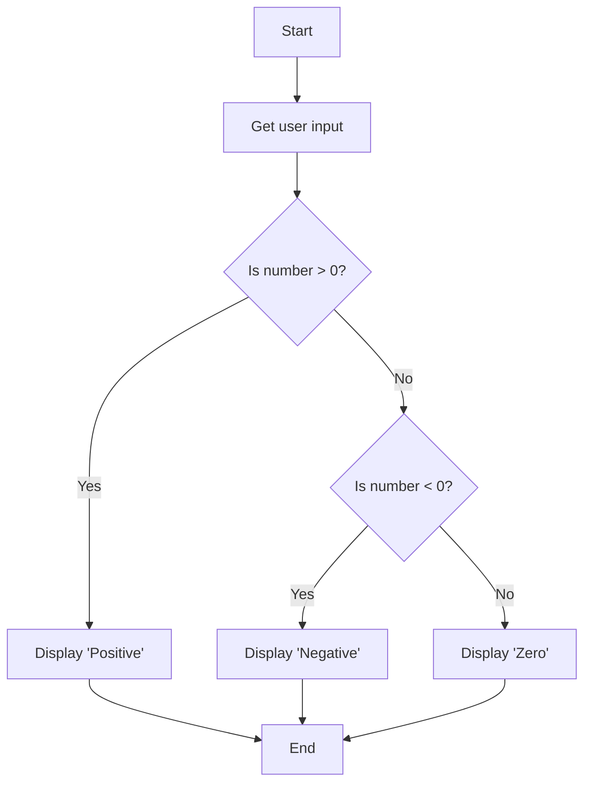

## 1.4.3 Using Flowcharts to Plan Logic

In the realm of software development, visual tools like flowcharts play a crucial role in simplifying complex logic and enhancing communication. This section delves into the art of using flowcharts to plan and visualize program logic, offering a structured approach to problem-solving in programming.

### Flowchart Basics

Flowcharts are diagrammatic representations of an algorithm or a step-by-step process. They use various symbols to denote different types of actions or steps in a process. Understanding these symbols is fundamental to creating and interpreting flowcharts effectively.

#### Common Symbols and Their Meanings

1. **Start/End (Terminator):**
   - **Symbol:** Oval
   - **Purpose:** Denotes the beginning or end of a flowchart.

2. **Process:**
   - **Symbol:** Rectangle
   - **Purpose:** Represents a process or an operation, such as a calculation or a data manipulation step.

3. **Decision:**
   - **Symbol:** Diamond
   - **Purpose:** Indicates a decision point in the process, typically a yes/no or true/false question.

4. **Input/Output:**
   - **Symbol:** Parallelogram
   - **Purpose:** Represents data input or output, such as reading data from a user or displaying results.

5. **Flow Lines:**
   - **Symbol:** Arrows
   - **Purpose:** Show the direction of flow and connect the various symbols.

6. **Connector:**
   - **Symbol:** Circle
   - **Purpose:** Used to connect different parts of a flowchart, particularly when the chart spans multiple pages.

These symbols form the building blocks of flowcharts, enabling developers to map out the logic of their programs visually.

### Creating Flowcharts

Creating a flowchart involves translating pseudocode or a conceptual algorithm into a visual format. This process can enhance clarity and ensure that all logical steps are accounted for before coding begins.

#### Steps to Translate Pseudocode into a Flowchart

1. **Identify Key Steps:**
   - Start by breaking down the pseudocode into its fundamental steps. Each step should correspond to a specific action or decision.

2. **Choose Appropriate Symbols:**
   - For each step, select the appropriate flowchart symbol based on the action type (e.g., process, decision).

3. **Arrange Sequentially:**
   - Arrange the symbols in the order they should be executed, using arrows to indicate the flow of logic.

4. **Incorporate Decisions:**
   - Use diamond symbols for any decision points, clearly indicating the possible outcomes and subsequent steps for each.

5. **Review and Refine:**
   - Review the flowchart for completeness and clarity. Ensure that each step logically follows the previous one and that all possible paths are accounted for.

#### Best Practices for Clarity and Readability

- **Keep It Simple:** Avoid overly complex diagrams. Break down complex processes into smaller, manageable sub-processes.
- **Consistent Symbol Use:** Use symbols consistently to avoid confusion.
- **Label Clearly:** Label all symbols and arrows clearly to indicate their purpose and direction.
- **Use Connectors Wisely:** For large flowcharts, use connectors to maintain readability without overcrowding.

### Applications of Flowcharts

Flowcharts are versatile tools that can significantly aid in various aspects of software development, from planning and debugging to communication.

#### Aiding in Debugging

Flowcharts provide a clear view of the logic flow, making it easier to identify logical errors or inefficiencies. By tracing through the flowchart, developers can pinpoint where a process might be going wrong and make necessary adjustments before implementing the code.

#### Enhancing Communication

Flowcharts serve as an excellent communication tool among team members, especially in collaborative environments. They provide a visual representation of the logic that is easy to understand, even for those who may not be deeply familiar with the codebase. This can facilitate better collaboration and understanding among developers, designers, and stakeholders.

### Code Example and Corresponding Flowchart

Let's consider a simple program that checks if a number is positive, negative, or zero, and displays an appropriate message. Below is the Python code for this logic:

```python
def check_number(num):
    if num > 0:
        print("Positive")
    elif num < 0:
        print("Negative")
    else:
        print("Zero")

check_number(10)  # Output: Positive
check_number(-5)  # Output: Negative
check_number(0)   # Output: Zero
```

The corresponding flowchart for this logic can be represented as follows:



### Key Points to Emphasize

- **Visual Representation:** Flowcharts provide a visual representation of program logic, making it easier to understand and follow complex processes.
- **Problem-Solving:** By mapping out logic before coding, developers can identify potential issues and optimize processes.
- **Communication:** Flowcharts are valuable tools for communicating logic and processes to others, facilitating better collaboration and understanding.

### Conclusion

Flowcharts are an indispensable tool in the software developer's toolkit. By offering a visual representation of program logic, they simplify complex processes, aid in debugging, and enhance communication among team members. As you continue your journey in software development, mastering the use of flowcharts will undoubtedly enhance your problem-solving capabilities and improve your ability to design efficient, effective software solutions.

## Quiz Time!



### What is the primary purpose of a flowchart in software development?

- [x] To visually represent program logic
- [ ] To write detailed code
- [ ] To replace pseudocode
- [ ] To compile programs

> **Explanation:** Flowcharts are used to visually represent program logic, helping to clarify and communicate the steps involved in a process.

### Which symbol is used to represent a decision point in a flowchart?

- [ ] Oval
- [ ] Rectangle
- [x] Diamond
- [ ] Parallelogram

> **Explanation:** A diamond symbol is used to represent a decision point, indicating a branching in the flow based on a condition.

### How can flowcharts aid in debugging?

- [x] By providing a clear view of the logic flow
- [ ] By executing the code
- [ ] By optimizing algorithms automatically
- [ ] By generating test cases

> **Explanation:** Flowcharts help identify logical errors by providing a clear visual representation of the process flow, making it easier to trace and correct issues.

### What is a best practice when creating flowcharts?

- [x] Keep it simple and clear
- [ ] Use as many symbols as possible
- [ ] Avoid using labels
- [ ] Make it as detailed as possible

> **Explanation:** Keeping flowcharts simple and clear ensures they are easy to understand and follow, avoiding unnecessary complexity.

### Which of the following is NOT a common flowchart symbol?

- [ ] Oval
- [ ] Rectangle
- [ ] Diamond
- [x] Triangle

> **Explanation:** A triangle is not a standard flowchart symbol. Common symbols include ovals, rectangles, diamonds, and parallelograms.

### What is the role of arrows in a flowchart?

- [x] To show the direction of flow
- [ ] To indicate errors
- [ ] To label processes
- [ ] To connect unrelated symbols

> **Explanation:** Arrows are used to indicate the direction of flow between different steps or processes in a flowchart.

### How do flowcharts enhance communication in a team?

- [x] By providing a visual representation of logic
- [ ] By replacing meetings
- [ ] By eliminating the need for documentation
- [ ] By reducing the need for coding

> **Explanation:** Flowcharts enhance communication by providing a visual representation of logic that is easy for team members to understand and discuss.

### What should be done if a flowchart becomes too complex?

- [x] Break it down into smaller sub-processes
- [ ] Add more symbols
- [ ] Remove decision points
- [ ] Use fewer labels

> **Explanation:** Breaking down complex flowcharts into smaller sub-processes helps maintain clarity and readability.

### Which symbol represents input/output operations in a flowchart?

- [ ] Oval
- [ ] Rectangle
- [ ] Diamond
- [x] Parallelogram

> **Explanation:** A parallelogram is used to represent input/output operations in a flowchart.

### True or False: Flowcharts can replace detailed code documentation.

- [ ] True
- [x] False

> **Explanation:** Flowcharts complement code documentation by providing a visual representation of logic, but they do not replace the need for detailed documentation.


