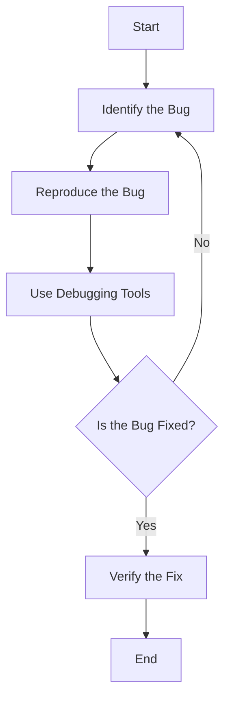

## 1.4.4 Implementing and Testing Solutions

In the world of software development, implementing and testing solutions is a critical phase that transforms your abstract ideas and plans into tangible, working software. This section will guide you through the process of coding your planned solutions, ensuring they work correctly, and refining them through testing and debugging. Whether you're a beginner or looking to solidify your understanding, mastering these skills is essential for producing reliable and efficient software.

### Translating Plans into Code

#### From Pseudocode to Actual Code

Pseudocode and flowcharts are powerful tools for planning your software solutions. They allow you to outline the logic and structure of your program in a language-agnostic way. The next step is to translate these plans into actual code.

**Why Use Pseudocode?**

- **Clarity:** Pseudocode helps clarify your thoughts and ensures you understand the problem before diving into coding.
- **Language Independence:** It allows you to focus on the logic rather than syntax, which can be adapted to any programming language.
- **Communication:** Pseudocode is an excellent way to communicate your ideas to others, whether they are developers or stakeholders.

**Example Pseudocode:**

```plaintext
1. Start
2. Initialize total to 0
3. For each number in the list:
    a. Add the number to total
4. Print total
5. End
```

**Translating to Python Code:**

```python
def calculate_total(numbers):
    total = 0
    for number in numbers:
        total += number
    print(total)

calculate_total([1, 2, 3, 4, 5])
```

**Translating to JavaScript Code:**

```javascript
function calculateTotal(numbers) {
    let total = 0;
    for (let number of numbers) {
        total += number;
    }
    console.log(total);
}

// Example usage
calculateTotal([1, 2, 3, 4, 5]);
```

The key to successful translation is maintaining the logical structure outlined in your pseudocode. Pay attention to details like loop structures, conditionals, and data manipulation.

### Incremental Development

Incremental development is a strategy where you build and test your code in small, manageable chunks. This approach minimizes errors and makes debugging easier.

#### Benefits of Incremental Development

- **Early Detection of Errors:** By testing small parts of your code as you go, you can catch errors early in the development process.
- **Simplified Debugging:** Smaller code segments are easier to debug than large, complex ones.
- **Continuous Feedback:** Regular testing provides immediate feedback, allowing you to adjust your approach as needed.

**Step-by-Step Approach:**

1. **Write a Small Piece of Code:** Implement a small, functional part of your program.
2. **Test It:** Use print statements or a debugger to verify that it works as expected.
3. **Refine and Expand:** Once you're confident in its functionality, build upon it by adding more code.
4. **Repeat:** Continue this cycle until your program is complete.

**Example: Building a Calculator**

Let's say you're building a simple calculator that can add and subtract numbers. You can start by implementing the addition functionality:

```python
def add(a, b):
    return a + b

print(add(5, 3))  # Output: 8
```

Once you're sure the addition works, you can add subtraction:

```python
def subtract(a, b):
    return a - b

print(subtract(5, 3))  # Output: 2
```

### Testing Your Code

Testing is a crucial step in ensuring your code works correctly and handles all expected scenarios. There are several types of testing, each serving a different purpose.

#### Types of Testing

1. **Manual Testing:** Involves running the program and checking the output manually. Useful for initial testing but not scalable for large projects.
2. **Automated Testing:** Uses scripts and tools to automatically test your code. Essential for larger projects and continuous integration.

#### Writing Test Cases

Test cases are specific scenarios you create to test your code. They should cover a range of inputs and edge cases to ensure your program behaves as expected.

**Example Test Cases for a Calculator:**

```python
def test_calculator():
    assert add(1, 1) == 2
    assert subtract(5, 3) == 2
    assert add(-1, 1) == 0
    assert subtract(0, 0) == 0
    print("All tests passed!")

test_calculator()
```

In this example, we're using assertions to check that the output of our functions matches the expected results. If any assertion fails, it will raise an error, indicating that there's a bug in the code.

### Debugging Techniques

Debugging is the process of identifying and fixing errors in your code. It requires patience and a systematic approach to locate the source of the problem.

#### Common Debugging Techniques

1. **Print Statements:** Insert print statements in your code to track variable values and program flow.
2. **Debugger Tools:** Use integrated development environment (IDE) debuggers to step through your code and inspect variables.
3. **Error Messages:** Carefully read error messages to understand what went wrong and where.

#### Interpreting Error Messages

Error messages can be cryptic, but they often provide valuable clues. Pay attention to:

- **Error Type:** Indicates the nature of the error (e.g., syntax error, type error).
- **Error Location:** Shows where in the code the error occurred.
- **Stack Trace:** Provides a trace of function calls leading to the error.

**Example Debugging Process:**

```python
def divide(a, b):
    return a / b

try:
    print(divide(10, 0))
except ZeroDivisionError as e:
    print("Error:", e)
```

In this example, we're handling a potential division by zero error using a try-except block. This prevents the program from crashing and provides a meaningful error message.

### Visualizing the Debugging Process

To better understand the debugging process, let's visualize it using a flowchart:



This flowchart outlines a typical debugging workflow. You start by identifying and reproducing the bug, then use debugging tools to locate and fix it. Finally, you verify the fix to ensure the bug is resolved.

### Key Points to Emphasize

- **Testing and Debugging:** These are integral parts of programming. They ensure your code is reliable and performs as expected.
- **Patience and Attention to Detail:** Successful implementation requires careful attention to detail and a methodical approach.
- **Iterative Improvement:** Continuously refine and improve your code through testing and debugging.

### Conclusion

Implementing and testing solutions is a fundamental aspect of software development. By translating plans into code, developing incrementally, and mastering testing and debugging techniques, you can create robust and reliable software. Remember, patience and attention to detail are your allies in this process. Keep practicing, and you'll become proficient in turning your ideas into working solutions.

## Quiz Time!



### What is the primary purpose of using pseudocode?

- [x] To outline the logic and structure of a program in a language-agnostic way.
- [ ] To write code that can be executed directly.
- [ ] To create a user interface design.
- [ ] To perform automated testing.

> **Explanation:** Pseudocode helps in planning the logic and structure of a program without focusing on syntax, making it adaptable to any programming language.

### What is the main advantage of incremental development?

- [x] It allows early detection of errors and simplifies debugging.
- [ ] It requires writing the entire program before testing.
- [ ] It focuses on optimizing code performance.
- [ ] It involves creating detailed documentation before coding.

> **Explanation:** Incremental development involves building and testing small parts of a program, which helps in identifying errors early and makes debugging easier.

### Which type of testing involves running the program and checking the output manually?

- [x] Manual Testing
- [ ] Automated Testing
- [ ] Integration Testing
- [ ] Unit Testing

> **Explanation:** Manual testing involves manually executing the program and verifying the output, which is useful for initial testing.

### What is a common use of print statements in debugging?

- [x] To track variable values and program flow.
- [ ] To generate error messages.
- [ ] To optimize code performance.
- [ ] To create user interfaces.

> **Explanation:** Print statements are used in debugging to monitor variable values and understand the program's execution flow.

### What does a stack trace provide?

- [x] A trace of function calls leading to an error.
- [ ] A list of all variables in a program.
- [x] A detailed error message.
- [ ] A performance analysis of the program.

> **Explanation:** A stack trace shows the sequence of function calls that led to an error, helping in identifying the source of the problem.

### What is the purpose of assertions in test cases?

- [x] To check that the output of functions matches the expected results.
- [ ] To generate random input data for testing.
- [ ] To measure code execution time.
- [ ] To create user-friendly error messages.

> **Explanation:** Assertions are used in test cases to verify that the actual output of a function matches the expected result, indicating correctness.

### What does a try-except block help with in debugging?

- [x] Handling exceptions and preventing program crashes.
- [ ] Optimizing code performance.
- [x] Generating detailed documentation.
- [ ] Creating user interfaces.

> **Explanation:** A try-except block is used to handle exceptions gracefully, preventing the program from crashing and allowing for meaningful error messages.

### What is the first step in the debugging process according to the flowchart?

- [x] Identify the Bug
- [ ] Verify the Fix
- [ ] Reproduce the Bug
- [ ] Use Debugging Tools

> **Explanation:** The first step in the debugging process is to identify the bug, which involves recognizing that there is an issue in the code.

### What is the benefit of using automated testing?

- [x] It allows for scalable and continuous testing of code.
- [ ] It eliminates the need for any manual testing.
- [ ] It ensures 100% bug-free code.
- [ ] It requires no initial setup.

> **Explanation:** Automated testing uses scripts and tools to test code automatically, making it scalable and suitable for continuous integration.

### True or False: Debugging is only necessary when the program crashes.

- [x] False
- [ ] True

> **Explanation:** Debugging is necessary whenever there are unexpected behaviors or errors in a program, not just when it crashes.



By following these guidelines and practicing regularly, you'll develop the skills needed to effectively implement and test solutions, ensuring your software is both functional and reliable.
