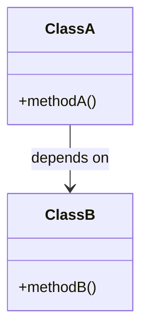
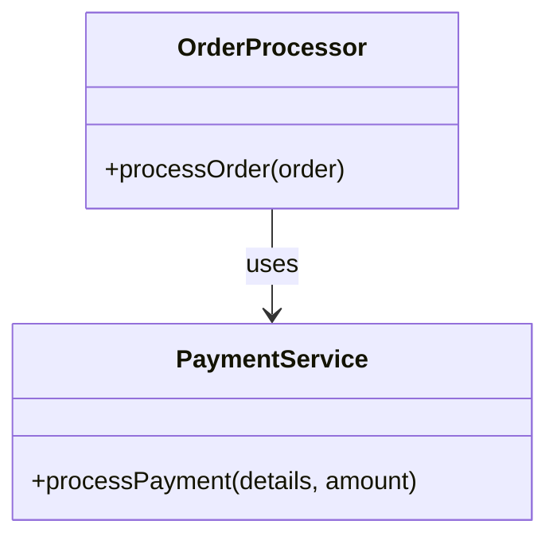

## 10.1.1 Recognizing Code Smells

In the journey of software development, writing code that is clean, maintainable, and scalable is a perpetual goal. However, as systems grow and evolve, certain "smells" may emerge that hint at deeper design issues. Recognizing these code smells is crucial for maintaining a healthy codebase and ensuring long-term success of a software project.

### Understanding Code Smells

**Code smells** are surface-level indicators that suggest underlying problems in a system's design or implementation. They are not bugs or errors but rather symptoms that could lead to more significant issues if left unaddressed. Identifying code smells is the first step towards effective refactoring, which can improve code quality, readability, and maintainability.

#### Characteristics of Code Smells

- **Subtle and Subjective:** Code smells are often subtle and can vary in interpretation based on context and experience.
- **Indicators, Not Certainties:** They suggest potential issues but do not guarantee problems. Further investigation is necessary.
- **Opportunities for Improvement:** Recognizing smells provides opportunities to refactor and enhance code quality.

### Common Code Smells

Let's explore some of the most prevalent code smells that developers encounter and discuss strategies to address them.

#### 1. Duplicated Code

Duplicated code is one of the most common and problematic smells. It occurs when the same or similar code appears in multiple places, leading to increased maintenance efforts and a higher likelihood of bugs.

**Problems with Duplicated Code:**

- **Increased Maintenance:** Changes must be made in multiple places, increasing the risk of inconsistencies.
- **Bug Propagation:** Errors in one section are likely to exist in others, complicating debugging.

**Example of Duplicated Code:**

```python
def calculate_area_rectangle(width, height):
    return width * height

def calculate_area_square(side):
    return side * side

def calculate_area_rectangle(width, height=None):
    if height is None:
        height = width  # Square case
    return width * height
```

**Explanation:** By refactoring, we generalized the `calculate_area_rectangle` function to handle both rectangles and squares, reducing duplication.

#### 2. Long Methods and Classes

Long methods and classes can be difficult to understand, test, and maintain. They often do too much and violate the Single Responsibility Principle.

**Problems with Long Methods and Classes:**

- **Complexity:** Harder to read and understand, leading to increased cognitive load.
- **Testing Challenges:** Difficult to test thoroughly due to their size and complexity.

**Refactoring Strategy:**

- **Extract Method:** Break down long methods into smaller, more focused functions.
- **Class Decomposition:** Split large classes into smaller, more cohesive classes.

#### 3. Poor Naming

Naming is a critical aspect of code readability. Poorly named variables, methods, and classes can obscure the code's intent and make it difficult to understand.

**Problems with Poor Naming:**

- **Ambiguity:** Makes it hard to discern the purpose and usage of code elements.
- **Misleading:** Can lead to incorrect assumptions about what the code does.

**Best Practices for Naming:**

- **Descriptive Names:** Use names that clearly describe the purpose and behavior.
- **Consistency:** Follow consistent naming conventions throughout the codebase.

#### 4. Tight Coupling

Tight coupling occurs when classes are heavily dependent on each other, reducing flexibility and making changes more challenging.

**Problems with Tight Coupling:**

- **Reduced Flexibility:** Changes in one class often necessitate changes in others.
- **Difficult Testing:** Harder to isolate components for testing.

**Example of Tight Coupling:**



**Explanation:** ClassA depends directly on ClassB, indicating tight coupling. Refactoring might involve introducing interfaces or abstract classes to decouple these dependencies.

#### 5. Fragile Base Class

A fragile base class problem arises when changes to a base class cause unexpected side effects in its subclasses, leading to bugs and maintenance headaches.

**Problems with Fragile Base Class:**

- **Unintended Consequences:** Changes in the base class can break functionality in subclasses.
- **Difficulty in Extension:** Hard to extend the system without introducing errors.

**Refactoring Strategy:**

- **Composition over Inheritance:** Favor composition to avoid deep inheritance hierarchies.
- **Interface Segregation:** Use interfaces to segregate functionalities and reduce dependencies.

#### 6. Excessive Use of Global Variables

Global variables can lead to unpredictable behavior and difficulties in debugging due to their widespread accessibility and potential for unintended modifications.

**Problems with Global Variables:**

- **Unpredictable State:** Hard to track changes and understand the current state.
- **Debugging Challenges:** Difficult to identify where and why the state was altered.

**Refactoring Strategy:**

- **Encapsulation:** Encapsulate global state within classes or modules.
- **Dependency Injection:** Use dependency injection to manage state and dependencies.

### Tools and Techniques for Detecting Code Smells

While manual inspection is valuable, leveraging tools can enhance the process of identifying code smells. Here are some popular tools and techniques:

#### Static Code Analysis Tools

- **SonarQube:** An open-source platform that continuously inspects code quality and security.
- **ESLint:** A tool for identifying and fixing problems in JavaScript code.
- **Pylint:** A Python tool that checks for errors and enforces coding standards.

#### Code Reviews and Pair Programming

- **Regular Code Reviews:** Encourage regular peer reviews to catch smells early and share knowledge.
- **Pair Programming:** Collaborate with another developer to identify issues and brainstorm solutions.

### Code Examples and Refactoring

Let's dive deeper into code examples showcasing common smells and their refactored versions.

#### Example: Long Method

**Before Refactoring:**

```python
def process_order(order):
    # Validate order
    if not validate_order(order):
        raise ValueError("Invalid order")

    # Calculate total
    total = 0
    for item in order.items:
        total += item.price * item.quantity

    # Apply discount
    if order.discount_code:
        total -= apply_discount(total, order.discount_code)

    # Process payment
    if not process_payment(order.payment_details, total):
        raise ValueError("Payment failed")

    # Ship order
    ship_order(order)
```

**After Refactoring:**

```python
def process_order(order):
    validate_order(order)
    total = calculate_total(order)
    total = apply_discount_if_applicable(total, order.discount_code)
    process_payment(order.payment_details, total)
    ship_order(order)

def calculate_total(order):
    return sum(item.price * item.quantity for item in order.items)

def apply_discount_if_applicable(total, discount_code):
    if discount_code:
        return total - apply_discount(total, discount_code)
    return total
```

**Explanation:** The refactored version breaks down the `process_order` function into smaller, more focused functions, improving readability and maintainability.

### Visualizing Code Smells

Visual aids can help illustrate complex relationships and highlight problematic areas in code. For instance, class diagrams can effectively show tight coupling or overly complex hierarchies.

#### Example Diagram: Tight Coupling



**Explanation:** This diagram shows the `OrderProcessor` class directly using the `PaymentService`, indicating a potential tight coupling. Refactoring might involve introducing an interface for payment processing to decouple these classes.

### Key Points to Emphasize

- **Indicators, Not Certainties:** Code smells are not definitive issues but should prompt further investigation.
- **Continuous Improvement:** Regularly assess and refactor code to maintain quality.
- **Collaborative Efforts:** Encourage team collaboration through code reviews and pair programming to identify and address smells early.

### Conclusion

Recognizing code smells is an essential skill for any developer aiming to write high-quality software. By identifying and addressing these smells, you can improve the design, readability, and maintainability of your codebase. Remember, code smells are opportunities for improvement, not failures. Embrace them as part of a continuous journey towards better software design.

## Quiz Time!



### What are code smells?

- [x] Surface indications of deeper problems in the code
- [ ] Syntax errors in the code
- [ ] Compiler errors
- [ ] Runtime exceptions

> **Explanation:** Code smells are surface indications that usually correspond to deeper problems in the system.

### Which of the following is a common problem with duplicated code?

- [x] Increased maintenance effort
- [ ] Easier code readability
- [ ] Reduced testing requirements
- [ ] Simplified debugging

> **Explanation:** Duplicated code increases maintenance effort as changes must be made in multiple places.

### What is a common issue with long methods?

- [x] They are difficult to understand and maintain
- [ ] They are easier to test
- [ ] They improve performance
- [ ] They reduce the need for documentation

> **Explanation:** Long methods can be difficult to understand and maintain due to their complexity.

### What is the main problem with poor naming in code?

- [x] It makes the code hard to understand
- [ ] It improves code performance
- [ ] It reduces code size
- [ ] It simplifies debugging

> **Explanation:** Poor naming makes it difficult to discern the purpose and usage of code elements.

### How does tight coupling affect software design?

- [x] It reduces flexibility and makes changes more difficult
- [ ] It improves code performance
- [ ] It simplifies code structure
- [ ] It enhances modularity

> **Explanation:** Tight coupling reduces flexibility and makes changes more challenging due to interdependencies.

### What is a fragile base class problem?

- [x] Changes to a base class cause unexpected side effects in subclasses
- [ ] A class that cannot be extended
- [ ] A class that is too large
- [ ] A class with too many methods

> **Explanation:** A fragile base class problem occurs when changes to a base class cause unexpected side effects in its subclasses.

### Why is excessive use of global variables problematic?

- [x] It leads to unpredictable behavior and difficulties in debugging
- [ ] It improves code readability
- [ ] It enhances performance
- [ ] It simplifies code maintenance

> **Explanation:** Excessive use of global variables can lead to unpredictable behavior and make debugging difficult.

### Which tool can help detect code smells in Python?

- [x] Pylint
- [ ] ESLint
- [ ] JSLint
- [ ] TSLint

> **Explanation:** Pylint is a tool that checks for errors and enforces coding standards in Python.

### What is one benefit of using static code analysis tools?

- [x] They help identify code smells automatically
- [ ] They write code for you
- [ ] They compile code faster
- [ ] They reduce the need for testing

> **Explanation:** Static code analysis tools can automatically identify code smells and potential issues.

### True or False: Code smells are definitive indicators of bugs in the code.

- [ ] True
- [x] False

> **Explanation:** Code smells are not definitive indicators of bugs; they suggest potential issues that warrant further investigation.


