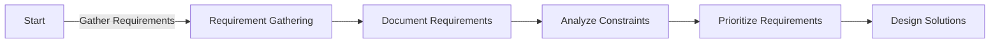

## 10.1.2 Analyzing Requirements and Constraints

In the realm of software design, understanding and analyzing requirements and constraints is a foundational step that significantly influences the success of a project. This section will guide you through the essential processes of gathering, documenting, and analyzing requirements and constraints. We will explore how these elements inform design decisions and the selection of appropriate design patterns.

### Understanding Requirements

Requirements are the backbone of any software project. They define what the software must achieve and how it should perform. Properly gathered and analyzed requirements ensure that the final product meets user expectations and business goals.

#### Requirement Gathering Techniques

Gathering requirements is a critical phase that involves collecting information from various stakeholders to understand their needs and expectations. Several techniques can be employed to gather requirements effectively:

1. **Stakeholder Interviews:**
   - Conducting interviews with stakeholders is a direct way to gather detailed insights. Prepare a set of questions to guide the conversation and ensure that all relevant topics are covered.

2. **Surveys and Questionnaires:**
   - Surveys can reach a larger audience and collect quantitative data. They are useful when you need to gather opinions from a broad user base.

3. **User Stories:**
   - User stories are short, simple descriptions of a feature told from the perspective of the end user. They help in understanding user needs and expectations.

4. **Workshops and Brainstorming Sessions:**
   - Engaging stakeholders in workshops can foster collaboration and generate innovative ideas. These sessions encourage open dialogue and collective problem-solving.

5. **Observation and Shadowing:**
   - Observing users in their natural environment can provide insights into their workflows and challenges. Shadowing involves following users as they perform tasks to understand their interactions with existing systems.

6. **Document Analysis:**
   - Reviewing existing documentation, such as business process documents, can provide context and background information.

### Functional vs. Non-Functional Requirements

Requirements are typically categorized into functional and non-functional requirements, each serving a distinct purpose in the design and development process.

#### Functional Requirements

Functional requirements define what the system should do. They describe the features and capabilities that the software must provide to meet user needs.

- **Use Cases:**
  - Use cases describe how users interact with the system to achieve a specific goal. They outline the steps involved in each interaction and the expected outcomes.

- **User Stories:**
  - As mentioned earlier, user stories are narrative descriptions that capture user needs. They are often written in the format: "As a [user], I want [feature] so that [benefit]."

- **Acceptance Criteria:**
  - Acceptance criteria specify the conditions that must be met for a feature to be considered complete. They provide a clear definition of done and help ensure that the system meets user expectations.

#### Non-Functional Requirements

Non-functional requirements define the system's attributes and constraints. They address how the system should perform rather than what it should do.

- **Performance:**
  - Performance requirements specify the system's speed, responsiveness, and throughput. They are crucial for applications that handle large volumes of data or require real-time processing.

- **Security:**
  - Security requirements address the protection of data and resources. They include authentication, authorization, encryption, and auditing measures.

- **Usability:**
  - Usability requirements focus on the user experience, ensuring that the system is easy to use and accessible to its intended audience.

- **Reliability and Availability:**
  - These requirements ensure that the system operates consistently and is available when needed. They are critical for mission-critical applications.

- **Scalability:**
  - Scalability requirements address the system's ability to handle increased loads without compromising performance.

### Documenting Requirements

Clear and comprehensive documentation is essential for communicating requirements to all stakeholders. A well-documented Software Requirements Specification (SRS) serves as a reference throughout the project lifecycle.

- **Software Requirements Specification (SRS):**
  - An SRS document outlines all functional and non-functional requirements in detail. It serves as a contract between stakeholders and the development team, ensuring that everyone has a shared understanding of the project scope.

- **Clarity and Unambiguity:**
  - Use clear and unambiguous language in the SRS to avoid misunderstandings. Define all technical terms and acronyms to ensure that the document is accessible to all stakeholders.

- **Version Control:**
  - Maintain version control of the SRS to track changes and updates. This practice ensures that the development team is always working with the latest requirements.

### Analyzing Constraints

Constraints are limitations or restrictions that affect the design and implementation of the software. Analyzing constraints is crucial for making informed design decisions.

#### Technical Constraints

Technical constraints arise from the existing technology environment and architectural decisions.

- **Legacy Systems:**
  - Integrating with legacy systems can impose constraints on technology choices and design patterns. Consider compatibility and interoperability when designing new systems.

- **Technology Stack Choices:**
  - The choice of programming languages, frameworks, and tools can impact the system's architecture and design. Evaluate the strengths and weaknesses of each option in the context of the project requirements.

- **Interoperability:**
  - Interoperability constraints require the system to work seamlessly with other systems and platforms. Consider standards and protocols that facilitate integration.

#### Business Constraints

Business constraints are driven by organizational goals and resources.

- **Budget:**
  - Financial constraints can limit the scope of the project and influence technology choices. Prioritize features based on their value and impact.

- **Timelines:**
  - Project timelines affect the feasibility of certain design decisions. Consider the trade-offs between time, cost, and quality when planning the project.

- **Team Expertise:**
  - The skills and experience of the development team can influence technology and design choices. Leverage the team's strengths and provide training where necessary.

#### Regulatory Constraints

Regulatory constraints are imposed by laws and standards that govern the industry.

- **Compliance with Standards and Laws:**
  - Ensure that the system complies with relevant regulations, such as GDPR for data protection or HIPAA for healthcare privacy. Non-compliance can result in legal and financial penalties.

### Prioritizing Requirements

Not all requirements are equally important. Prioritizing requirements helps focus on delivering the most valuable features first.

- **MoSCoW Method:**
  - The MoSCoW method categorizes requirements into four groups:
    - **Must have:** Essential features that are critical to the system's success.
    - **Should have:** Important features that add significant value but are not critical.
    - **Could have:** Desirable features that enhance the system but are not essential.
    - **Won't have:** Features that are not included in the current scope but may be considered for future releases.

### Impact on Design Patterns

Requirements and constraints have a direct impact on the choice of design patterns. Understanding these influences helps in selecting patterns that align with project goals.

- **Scalability Needs:**
  - High scalability requirements may suggest using design patterns that support distributed systems, such as the Microservices pattern or the Event-Driven Architecture pattern.

- **Security Requirements:**
  - Security constraints might lead to patterns that enforce access control, such as the Role-Based Access Control (RBAC) pattern or the Secure Token pattern.

- **Performance Constraints:**
  - Performance requirements may necessitate patterns that optimize resource usage, such as the Singleton pattern to manage shared resources or the Proxy pattern to enhance performance.

- **Usability Considerations:**
  - Usability requirements can influence the choice of patterns that enhance the user interface, such as the Model-View-Controller (MVC) pattern.

### Visualizing the Requirement Analysis Process

To better understand the process of analyzing requirements and constraints, let's visualize it using a flowchart:

This flowchart illustrates the sequential steps involved in analyzing requirements and constraints, leading to informed design decisions.

### Key Points to Emphasize

- **Deep Understanding of Requirements:**
  - A thorough understanding of requirements is crucial for effective software design. It ensures that the final product meets user needs and business objectives.

- **Constraints Dictate Design Decisions:**
  - Constraints often dictate architectural decisions and pattern selection. They must be carefully analyzed to avoid potential roadblocks.

- **Clear Documentation:**
  - Clear and comprehensive documentation facilitates communication among stakeholders and team members. It serves as a reference throughout the project lifecycle.

### Conclusion

Analyzing requirements and constraints is a fundamental step in the software design process. By thoroughly understanding and documenting these elements, you can make informed design decisions that align with project goals and constraints. This analysis not only guides the selection of design patterns but also ensures that the final product meets user expectations and business objectives.

## Quiz Time!



### What is the purpose of gathering requirements in software design?

- [x] To understand user needs and expectations
- [ ] To determine the project's budget
- [ ] To select the appropriate programming language
- [ ] To finalize the project's timeline

> **Explanation:** Gathering requirements helps in understanding user needs and expectations, which are essential for designing a system that meets those needs.

### Which of the following is a functional requirement?

- [x] The system should allow users to create an account
- [ ] The system should be available 99.9% of the time
- [ ] The system should encrypt all user data
- [ ] The system should respond to user queries within 2 seconds

> **Explanation:** Functional requirements define what the system should do, such as allowing users to create an account.

### What does the MoSCoW method help with?

- [x] Prioritizing requirements
- [ ] Designing user interfaces
- [ ] Selecting programming languages
- [ ] Estimating project costs

> **Explanation:** The MoSCoW method helps prioritize requirements by categorizing them into Must have, Should have, Could have, and Won't have.

### Which of the following is a non-functional requirement?

- [ ] The system should allow users to reset their passwords
- [x] The system should be secure and protect user data
- [ ] The system should provide a search feature
- [ ] The system should generate monthly reports

> **Explanation:** Non-functional requirements define system attributes, such as security, which is about protecting user data.

### What type of constraint is related to compliance with laws?

- [x] Regulatory constraints
- [ ] Technical constraints
- [ ] Business constraints
- [ ] Performance constraints

> **Explanation:** Regulatory constraints involve compliance with laws and standards, such as GDPR or HIPAA.

### How can legacy systems impose constraints on new software projects?

- [x] By requiring compatibility and interoperability
- [ ] By increasing the project's budget
- [ ] By reducing the number of stakeholders
- [ ] By simplifying the design process

> **Explanation:** Legacy systems can impose constraints by requiring compatibility and interoperability with new software.

### What is the role of an SRS document?

- [x] To outline all functional and non-functional requirements
- [ ] To provide a detailed project timeline
- [ ] To list all potential stakeholders
- [ ] To describe the project's budget

> **Explanation:** An SRS document outlines all functional and non-functional requirements, serving as a reference throughout the project lifecycle.

### Which design pattern might be influenced by high scalability needs?

- [x] Microservices pattern
- [ ] Singleton pattern
- [ ] Observer pattern
- [ ] Factory pattern

> **Explanation:** High scalability needs may suggest using the Microservices pattern, which supports distributed systems.

### What is a key benefit of clear and comprehensive requirement documentation?

- [x] It facilitates communication among stakeholders
- [ ] It reduces the project's budget
- [ ] It eliminates the need for testing
- [ ] It ensures the project is completed on time

> **Explanation:** Clear and comprehensive documentation facilitates communication among stakeholders and serves as a reference throughout the project lifecycle.

### True or False: Non-functional requirements are less important than functional requirements.

- [ ] True
- [x] False

> **Explanation:** Non-functional requirements are equally important as they define system attributes like performance, security, and usability, which are critical to the system's success.



By mastering the art of analyzing requirements and constraints, you lay a solid foundation for designing robust and effective software solutions. Continue to practice these skills, and you'll be well-equipped to tackle complex design challenges in your software development journey.
