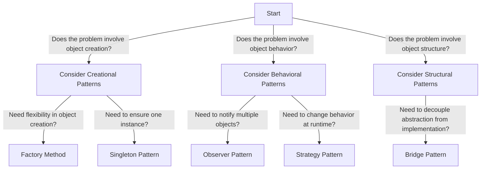

## 10.1.3 Mapping Problems to Patterns

Design patterns are powerful tools in software engineering, offering tried-and-tested solutions to common problems. However, the effectiveness of these patterns hinges on correctly identifying the problem at hand and selecting the most suitable pattern. This section delves into the art and science of mapping software design problems to patterns, providing a systematic approach to enhance your problem-solving toolkit.

### Understanding the Problem

Before diving into pattern selection, it's crucial to thoroughly understand the problem you're trying to solve. This involves breaking down complex issues into smaller, more manageable parts. By dissecting the problem, you can uncover the core issue that needs addressing.

#### Breaking Down Problems

1. **Define the Core Issue:**
   - Start by asking yourself, "What is the primary challenge?" Is it related to object creation, structure, or behavior?
   - Example: If your application needs to ensure only one instance of a class exists, the core issue is controlling object instantiation.

2. **Identify Constraints and Requirements:**
   - What are the specific constraints? Are there performance considerations, scalability needs, or specific user requirements?
   - Example: If your application needs to notify multiple objects when the state of an object changes, you have a requirement for a notification mechanism.

3. **Analyze Current Solutions:**
   - What solutions are currently in place? Are they inadequate, or do they need improvement?
   - Example: If current solutions for decoupling an abstraction from its implementation are too rigid, there might be a need for a more flexible architecture.

### Pattern Matching: A Systematic Approach

Once the problem is clearly defined, the next step is to match it with an appropriate design pattern. This involves a systematic approach:

#### Step 1: Define the Problem Clearly

Clarify the core issue by categorizing it into one of the following:

- **Creational Problems:** Involve object creation mechanisms, aiming for flexibility and control over the instantiation process.
- **Structural Problems:** Concerned with the composition of classes or objects, focusing on simplifying relationships.
- **Behavioral Problems:** Deal with object collaboration and communication, emphasizing flexible interactions.

#### Step 2: Identify Pattern Categories

Determine which category the problem falls into:

- **Creational Patterns:** Address object creation mechanisms.
  - Example: Singleton, Factory Method, Abstract Factory.
- **Structural Patterns:** Focus on class and object composition.
  - Example: Adapter, Bridge, Composite.
- **Behavioral Patterns:** Concerned with object interaction and responsibility.
  - Example: Observer, Strategy, Command.

#### Step 3: Consult Pattern Catalogs

Utilize resources such as the Gang of Four (GoF) patterns or online repositories to find a pattern that fits the problem:

- **Gang of Four Patterns:** A foundational set of 23 patterns categorized into creational, structural, and behavioral patterns.
- **Online Repositories:** Websites like SourceMaking or Refactoring.Guru offer comprehensive pattern catalogs.

### Examples of Mapping Problems to Patterns

Let's explore some examples to illustrate how specific problems can be mapped to design patterns.

#### Example 1: Singleton Pattern

**Problem:** Ensure only one instance of a class exists.

**Solution:** Use the Singleton pattern.

**Code Example (Python):**

```python
class SingletonMeta(type):
    _instances = {}

    def __call__(cls, *args, **kwargs):
        if cls not in cls._instances:
            instance = super().__call__(*args, **kwargs)
            cls._instances[cls] = instance
        return cls._instances[cls]

class Singleton(metaclass=SingletonMeta):
    def some_business_logic(self):
        # Business logic here
        pass

singleton1 = Singleton()
singleton2 = Singleton()
assert singleton1 is singleton2
```

#### Example 2: Bridge Pattern

**Problem:** Decouple an abstraction from its implementation.

**Solution:** Use the Bridge pattern.

**Code Example (JavaScript):**

```javascript
// Abstraction
class RemoteControl {
  constructor(device) {
    this.device = device;
  }
  togglePower() {
    if (this.device.isEnabled()) {
      this.device.disable();
    } else {
      this.device.enable();
    }
  }
}

// Implementation
class TV {
  isEnabled() {
    // Check if TV is on
  }
  enable() {
    // Turn on TV
  }
  disable() {
    // Turn off TV
  }
}

// Usage
const tv = new TV();
const remote = new RemoteControl(tv);
remote.togglePower();
```

#### Example 3: Observer Pattern

**Problem:** Notify multiple objects when the state of an object changes.

**Solution:** Use the Observer pattern.

**Code Example (Java):**

```java
import java.util.ArrayList;
import java.util.List;

interface Observer {
    void update(String message);
}

class Subject {
    private List<Observer> observers = new ArrayList<>();

    void addObserver(Observer observer) {
        observers.add(observer);
    }

    void notifyObservers(String message) {
        for (Observer observer : observers) {
            observer.update(message);
        }
    }
}

class ConcreteObserver implements Observer {
    private String name;

    ConcreteObserver(String name) {
        this.name = name;
    }

    @Override
    public void update(String message) {
        System.out.println(name + " received: " + message);
    }
}

// Usage
Subject subject = new Subject();
Observer observer1 = new ConcreteObserver("Observer 1");
subject.addObserver(observer1);
subject.notifyObservers("Hello Observers!");
```

### Pattern Selection Criteria

Selecting the right pattern involves evaluating several criteria:

#### Applicability

- **Does the pattern address the problem?**
  - Ensure the pattern's intent aligns with the core issue.

#### Consequences

- **Consider the trade-offs and impacts.**
  - Patterns often introduce complexity; weigh the benefits against potential downsides.

#### Implementation Complexity

- **Is the pattern appropriate given the project's scope and resources?**
  - Consider the team's expertise and the project's timeline.

### Pattern Combinations

Sometimes, a single pattern may not suffice. Complex problems might require a combination of patterns to provide a comprehensive solution.

#### Example: Combining Patterns

**Problem:** A system needs flexible object creation and a mechanism to notify observers of changes.

**Solution:** Combine Factory Method and Observer patterns.

**Code Example (JavaScript):**

```javascript
// Factory Method
class NotificationFactory {
  createNotification(type) {
    if (type === 'email') {
      return new EmailNotification();
    } else if (type === 'sms') {
      return new SMSNotification();
    }
    throw new Error('Unsupported notification type');
  }
}

// Observer Pattern
class NotificationService {
  constructor() {
    this.subscribers = [];
  }

  subscribe(subscriber) {
    this.subscribers.push(subscriber);
  }

  notifyAll(message) {
    this.subscribers.forEach(subscriber => subscriber.update(message));
  }
}

// Usage
const factory = new NotificationFactory();
const emailNotification = factory.createNotification('email');
const notificationService = new NotificationService();
notificationService.subscribe(emailNotification);
notificationService.notifyAll('New Notification!');
```

### Visualizing Pattern Selection

To aid in pattern selection, visual tools like decision trees or flowcharts can be invaluable.

#### Decision Tree Example



### Key Points to Emphasize

- **Deep Understanding:** A thorough understanding of the problem is crucial before selecting a pattern.
- **Patterns as Tools:** Patterns are tools to aid in design, not strict rules to be applied blindly.
- **Context Matters:** Always consider the specific context and requirements when mapping problems to patterns.

### Conclusion

Mapping software design problems to patterns is a critical skill for any software engineer. By systematically identifying the core issue, categorizing the problem, and consulting pattern catalogs, you can effectively select the most appropriate design pattern. Remember, the goal is to enhance your design with patterns, not to overcomplicate it. With practice and experience, you'll develop an intuitive sense for which patterns best suit your project's needs.

## Quiz Time!



### What is the first step in mapping a problem to a pattern?

- [x] Define the problem clearly
- [ ] Select a pattern category
- [ ] Consult a pattern catalog
- [ ] Implement the pattern

> **Explanation:** The first step is to clearly define the problem to understand its core issue.

### Which category of design patterns deals with object creation mechanisms?

- [x] Creational Patterns
- [ ] Structural Patterns
- [ ] Behavioral Patterns
- [ ] Functional Patterns

> **Explanation:** Creational patterns focus on object creation mechanisms.

### What is the primary goal of the Singleton pattern?

- [x] Ensure only one instance of a class exists
- [ ] Decouple an abstraction from its implementation
- [ ] Notify multiple objects of state changes
- [ ] Provide a simplified interface to a complex system

> **Explanation:** The Singleton pattern ensures only one instance of a class exists.

### Which pattern would you use to decouple an abstraction from its implementation?

- [x] Bridge Pattern
- [ ] Observer Pattern
- [ ] Singleton Pattern
- [ ] Factory Method Pattern

> **Explanation:** The Bridge pattern is used to decouple an abstraction from its implementation.

### What should be considered when selecting a design pattern?

- [x] Applicability
- [ ] Consequences
- [x] Implementation Complexity
- [ ] All of the above

> **Explanation:** All these factors should be considered when selecting a design pattern.

### Which pattern is suitable for notifying multiple objects of state changes?

- [x] Observer Pattern
- [ ] Singleton Pattern
- [ ] Bridge Pattern
- [ ] Factory Method Pattern

> **Explanation:** The Observer pattern is suitable for notifying multiple objects of state changes.

### Can multiple design patterns be combined to solve complex problems?

- [x] Yes
- [ ] No

> **Explanation:** Multiple patterns can be combined to address complex problems.

### What is a key benefit of using design patterns?

- [x] They provide a proven solution to common problems
- [ ] They eliminate all design issues
- [ ] They make code less readable
- [ ] They are mandatory for all projects

> **Explanation:** Design patterns provide proven solutions to common problems, enhancing design quality.

### What is a common pitfall when using design patterns?

- [x] Overusing patterns without understanding the problem
- [ ] Not using enough patterns
- [ ] Patterns always increase performance
- [ ] Patterns are too simple

> **Explanation:** Overusing patterns without understanding the problem can lead to unnecessary complexity.

### Patterns are tools to aid in design, not strict rules to be applied blindly.

- [x] True
- [ ] False

> **Explanation:** Patterns are tools that should be applied thoughtfully, considering the specific context and problem.


