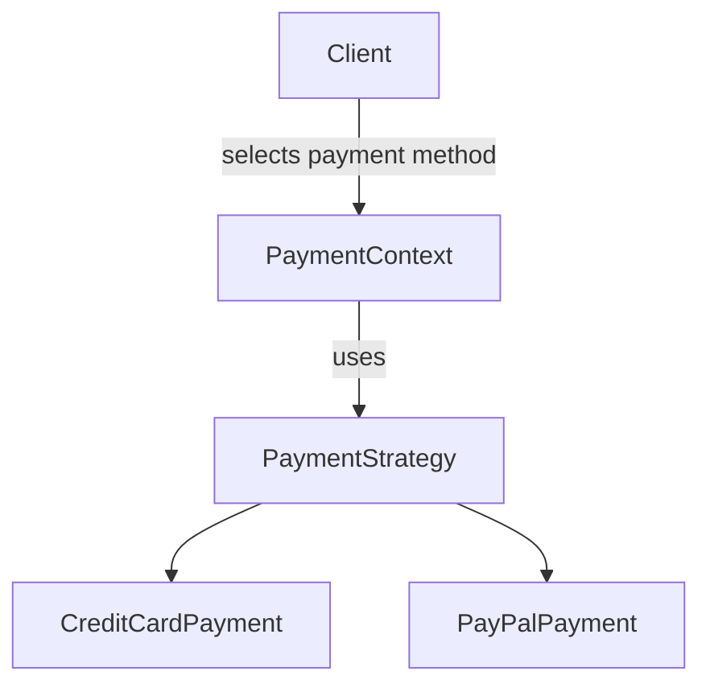
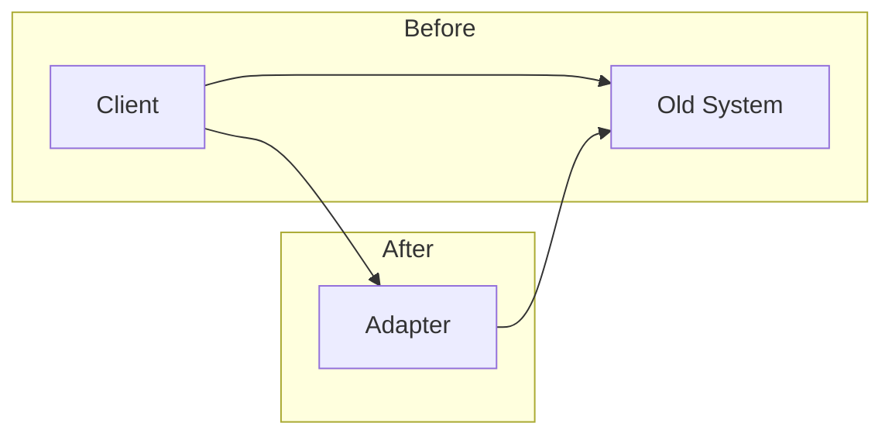

## 10.1.4 Case Studies of Problem-Solving

In the realm of software development, design patterns serve as vital tools for addressing recurring challenges with proven solutions. This section delves into real-world case studies that demonstrate the effective application of design patterns to overcome specific software design problems. Through these examples, you will gain insights into the decision-making process, understand the rationale behind choosing particular patterns, and appreciate the tangible benefits they bring to software systems.

### Case Study 1: E-commerce Platform Scaling

#### Background

Imagine an e-commerce platform that has gained significant traction in the market. As the user base grows exponentially, the platform starts experiencing performance bottlenecks. The company faces the daunting task of scaling its infrastructure to handle increased traffic while maintaining a seamless user experience.

#### Challenges

The primary challenges included:

- **Increased Traffic:** The platform needed to manage a surge in user requests without compromising on speed.
- **Complex Business Logic:** Handling various payment methods, discounts, and promotions added complexity to the system.
- **Responsiveness:** Ensuring the platform remained responsive under heavy load was critical to retaining customers.

#### Solution

To address these challenges, the development team employed several design patterns:

1. **Facade Pattern:** Simplified interactions with complex subsystems, such as inventory management and order processing, by providing a unified interface. This reduced the complexity for the client code and improved maintainability.

2. **Strategy Pattern:** Facilitated the dynamic selection of different payment processing algorithms. This pattern allowed the system to switch between payment gateways seamlessly, accommodating various user preferences and regional requirements.

3. **Observer Pattern:** Implemented for real-time inventory management notifications. This pattern enabled the system to update stock levels and alert relevant stakeholders immediately when inventory changes occurred.

```python

class PaymentStrategy:
    def pay(self, amount):
        pass

class CreditCardPayment(PaymentStrategy):
    def pay(self, amount):
        print(f"Processing credit card payment of {amount}")

class PayPalPayment(PaymentStrategy):
    def pay(self, amount):
        print(f"Processing PayPal payment of {amount}")

class PaymentContext:
    def __init__(self, strategy: PaymentStrategy):
        self._strategy = strategy

    def execute_payment(self, amount):
        self._strategy.pay(amount)

payment_method = PayPalPayment()
context = PaymentContext(payment_method)
context.execute_payment(100)  # Outputs: Processing PayPal payment of 100
```



#### Outcome

The application of these design patterns resulted in:

- **Improved Performance:** By decoupling complex interactions and enabling dynamic behavior, the platform became more efficient.
- **Easier Maintenance:** The use of design patterns facilitated cleaner code architecture, making it easier to update and maintain.
- **Scalability:** The platform could now handle increased traffic without degradation in performance, supporting further business growth.

#### Lessons Learned

- **Modular Design:** The use of design patterns encouraged a modular approach, which is crucial for scaling applications.
- **Flexibility and Adaptability:** Patterns like Strategy and Observer provided the flexibility needed to adapt to changing business requirements.

### Case Study 2: Legacy System Modernization

#### Background

A company with a long-standing legacy system needed to modernize its application to integrate new features and technologies. The challenge was to do this without disrupting the existing functionality that the business relied on.

#### Challenges

The main challenges included:

- **Incompatible Interfaces:** The legacy system's interfaces were outdated and incompatible with modern software components.
- **Risk of Bugs:** Introducing new features posed a risk of destabilizing the existing system.

#### Solution

To tackle these issues, the team applied the following design patterns:

1. **Adapter Pattern:** Bridged the gap between the old system and new modules, allowing them to work together without modifying the legacy code.

2. **Decorator Pattern:** Enabled the addition of new functionalities to existing components without altering their structure, thus minimizing the risk of bugs.

```python

class OldSystem:
    def old_method(self):
        print("This is the old method.")

class NewInterface:
    def new_method(self):
        pass

class Adapter(NewInterface):
    def __init__(self, adaptee):
        self.adaptee = adaptee

    def new_method(self):
        self.adaptee.old_method()

old_system = OldSystem()
adapter = Adapter(old_system)
adapter.new_method()  # Calls old_method through the adapter
```



#### Outcome

The modernization effort was successful, resulting in:

- **Seamless Integration:** New features were integrated smoothly with the existing system, thanks to the Adapter Pattern.
- **Minimal Impact:** The use of the Decorator Pattern allowed enhancements without altering the core functionality, reducing the risk of introducing bugs.

#### Lessons Learned

- **Incremental Modernization:** Design patterns like Adapter and Decorator facilitate incremental upgrades, reducing the risk associated with large-scale changes.
- **Preserving Legacy Investments:** By using design patterns, companies can extend the life of legacy systems while integrating modern technologies.

### Analysis

The choice of design patterns in these case studies was driven by the specific challenges faced and the desired outcomes. Here are some key considerations:

- **Facade Pattern:** Chosen for its ability to simplify complex systems, making them more manageable and maintainable.
- **Strategy Pattern:** Selected for its flexibility in handling varying algorithms and behaviors dynamically.
- **Observer Pattern:** Used to enable real-time updates and notifications, critical for responsive systems.
- **Adapter Pattern:** Essential for bridging incompatible interfaces, allowing legacy systems to integrate with modern components.
- **Decorator Pattern:** Ideal for adding new features without altering existing code, minimizing risk.

### Trade-offs and Alternatives

While the chosen patterns were effective, alternative approaches could have been considered:

- **Microservices Architecture:** For the e-commerce platform, a microservices approach might offer even greater scalability but at the cost of increased complexity.
- **Refactoring:** For the legacy system, refactoring the entire codebase could provide a cleaner integration path but would require significant resources and time.

### Conclusion

These case studies highlight the power of design patterns in solving real-world software design challenges. By understanding the context and carefully selecting appropriate patterns, developers can enhance system performance, maintainability, and scalability. Reflecting on these outcomes provides valuable lessons for future projects, emphasizing the importance of a strategic approach to software design.

## Quiz Time!



### Which pattern was used to simplify interactions with complex subsystems in the e-commerce platform case study?

- [x] Facade Pattern
- [ ] Strategy Pattern
- [ ] Observer Pattern
- [ ] Adapter Pattern

> **Explanation:** The Facade Pattern was used to simplify interactions with complex subsystems, providing a unified interface.

### What was the primary challenge faced by the e-commerce platform?

- [ ] Incompatible interfaces
- [ ] Risk of introducing bugs
- [x] Increased traffic
- [ ] Lack of features

> **Explanation:** The primary challenge was managing increased traffic while maintaining performance.

### Which pattern allowed dynamic selection of payment processing algorithms?

- [ ] Facade Pattern
- [x] Strategy Pattern
- [ ] Observer Pattern
- [ ] Adapter Pattern

> **Explanation:** The Strategy Pattern facilitated dynamic selection of payment processing algorithms.

### How did the Observer Pattern benefit the e-commerce platform?

- [x] Enabled real-time inventory notifications
- [ ] Simplified subsystem interactions
- [ ] Bridged incompatible interfaces
- [ ] Added new features

> **Explanation:** The Observer Pattern was used for real-time inventory management notifications.

### What was the key outcome of applying design patterns to the e-commerce platform?

- [x] Improved performance and scalability
- [ ] Seamless integration of new features
- [ ] Reduced risk of bugs
- [ ] Enhanced code readability

> **Explanation:** The application of design patterns improved performance and scalability.

### Which pattern bridged the gap between old and new modules in the legacy system?

- [ ] Facade Pattern
- [ ] Strategy Pattern
- [ ] Observer Pattern
- [x] Adapter Pattern

> **Explanation:** The Adapter Pattern was used to bridge the gap between old and new modules.

### How did the Decorator Pattern benefit the legacy system?

- [x] Added new features without altering existing code
- [ ] Simplified subsystem interactions
- [ ] Enabled real-time notifications
- [ ] Allowed dynamic algorithm selection

> **Explanation:** The Decorator Pattern allowed adding new features without altering existing code.

### What was a potential alternative approach for the e-commerce platform?

- [x] Microservices Architecture
- [ ] Monolithic Architecture
- [ ] Waterfall Model
- [ ] Spiral Model

> **Explanation:** A microservices architecture could offer greater scalability but with increased complexity.

### Why is the Adapter Pattern important in legacy system modernization?

- [x] It allows integration with modern components
- [ ] It simplifies complex interactions
- [ ] It enables real-time updates
- [ ] It adds new features

> **Explanation:** The Adapter Pattern allows legacy systems to integrate with modern components.

### True or False: The Facade Pattern was used to enable real-time notifications in the e-commerce platform.

- [ ] True
- [x] False

> **Explanation:** The Observer Pattern, not the Facade Pattern, was used for real-time notifications.


