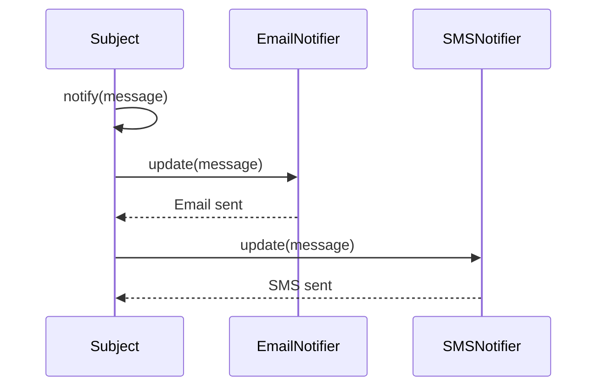

## 10.2.2 Applying the Observer Pattern

In the realm of software design, the Observer pattern stands out as a quintessential solution for scenarios where multiple components need to be informed of changes in another component. This pattern is particularly useful in building notification systems, where the need to notify multiple subscribers of events is a common requirement. In this section, we will delve into the application of the Observer pattern to construct a robust notification system, exploring its rationale, implementation, and the benefits it offers in terms of decoupling and flexibility.

### Rationale for Using the Observer Pattern

The Observer pattern is a behavioral design pattern that defines a one-to-many dependency between objects. In this setup, when one object (the subject) changes state, all its dependents (observers) are notified and updated automatically. This pattern is ideal for situations where:

- **Multiple Subscribers Need Notification:** In a notification system, various channels such as email, SMS, and push notifications may need to be informed when a particular event occurs, like a new message or an order being placed.
- **Decoupling of Sender and Receivers:** By decoupling the sender (event source) from the receivers (notification channels), the system becomes more modular and easier to maintain. This separation allows for the dynamic addition or removal of notification channels without altering the core logic of the event source.

### Implementation Steps

To implement the Observer pattern in a notification system, we need to define two main components: the **Subject** and the **Observers**.

#### 1. Subject (Event Source)

The Subject is responsible for maintaining a list of observers and notifying them of any changes. It provides methods to attach, detach, and notify observers. In the context of a notification system, the Subject could represent events such as "New Message" or "Order Placed".

```python
class NotificationSubject:
    def __init__(self):
        self._observers = []

    def attach(self, observer):
        self._observers.append(observer)

    def detach(self, observer):
        self._observers.remove(observer)

    def notify(self, message):
        for observer in self._observers:
            observer.update(message)
```

#### 2. Observers (Notification Channels)

Observers are the components that need to be notified of changes. Each observer implements an `update` method that defines how it handles notifications. In a notification system, observers could include different channels like email, SMS, and push notifications.

```python
from abc import ABC, abstractmethod

class NotificationObserver(ABC):
    @abstractmethod
    def update(self, message):
        pass

class EmailNotifier(NotificationObserver):
    def update(self, message):
        # Code to send email
        print(f"Email sent with message: {message}")

class SMSNotifier(NotificationObserver):
    def update(self, message):
        # Code to send SMS
        print(f"SMS sent with message: {message}")

class PushNotifier(NotificationObserver):
    def update(self, message):
        # Code to send push notification
        print(f"Push notification sent with message: {message}")
```

### Code Examples and Usage

Let's see how these components work together in a practical example:

```python
subject = NotificationSubject()
email_notifier = EmailNotifier()
sms_notifier = SMSNotifier()
push_notifier = PushNotifier()

subject.attach(email_notifier)
subject.attach(sms_notifier)

subject.notify("Your package has been shipped!")
```

In this example, when the `notify` method is called on the `subject`, all attached observers are notified and execute their respective `update` methods.

### Handling Dynamic Observers

One of the key strengths of the Observer pattern is its ability to handle dynamic observers. Users can change their notification preferences at runtime by attaching or detaching observers. This flexibility is crucial for modern applications where user preferences can vary widely.

```python
subject.detach(email_notifier)
subject.attach(push_notifier)

subject.notify("Your order has been delivered!")
```

### Visuals and Diagrams

To better understand the flow of notifications, consider the following sequence diagram:



This diagram illustrates the sequence of interactions between the subject and its observers, highlighting how notifications are propagated.

### Key Points to Emphasize

- **Efficient Management of Dynamic Subscriptions:** The Observer pattern allows for efficient management of dynamic subscriptions, enabling users to modify their notification preferences without impacting the core system.
- **Decoupling and Modularity:** By decoupling the subject from its observers, the system becomes more modular and easier to extend. New notification channels can be added with minimal changes to the existing codebase.
- **Extensibility and Maintainability:** The pattern supports extensibility by allowing new types of observers to be added easily. This makes the system more maintainable and adaptable to future requirements.

### Real-World Applications

The Observer pattern is widely used in various real-world applications, such as:

- **Social Media Platforms:** Notifications for likes, comments, and shares are often implemented using the Observer pattern, allowing users to subscribe to updates on specific posts or profiles.
- **E-Commerce Systems:** Order status updates, shipping notifications, and promotional alerts can be managed using this pattern to ensure timely communication with customers.
- **Financial Services:** Real-time updates on stock prices, account transactions, and alerts are efficiently handled using the Observer pattern.

### Best Practices and Common Pitfalls

When implementing the Observer pattern, consider the following best practices and potential pitfalls:

- **Avoid Memory Leaks:** Ensure that observers are properly detached when they are no longer needed to avoid memory leaks.
- **Limit the Number of Observers:** While the pattern supports multiple observers, too many can lead to performance issues. Consider batching notifications or using other optimization techniques.
- **Handle Exceptions Gracefully:** Ensure that exceptions in one observer do not affect the notification of others. Implement error handling to maintain system stability.

### Conclusion

The Observer pattern is a powerful tool in the software design arsenal, offering a flexible and efficient way to manage notifications. By decoupling the subject from its observers, it enables dynamic subscriptions and enhances the system's maintainability and extensibility. As you implement this pattern in your projects, remember to consider best practices and potential pitfalls to maximize its benefits.

## Quiz Time!



### What is the primary purpose of the Observer pattern?

- [x] To define a one-to-many dependency between objects
- [ ] To encapsulate a request as an object
- [ ] To provide a way to access elements of an aggregate object sequentially
- [ ] To ensure a class has only one instance

> **Explanation:** The Observer pattern defines a one-to-many dependency between objects, allowing multiple observers to be notified of changes in a subject.

### Which of the following is a benefit of using the Observer pattern?

- [x] Decoupling the sender from the receivers
- [ ] Reducing the number of classes in a system
- [ ] Ensuring thread safety
- [ ] Simplifying complex algorithms

> **Explanation:** The Observer pattern decouples the sender (subject) from the receivers (observers), making the system more modular and maintainable.

### In the Observer pattern, what role does the subject play?

- [x] It maintains a list of observers and notifies them of changes
- [ ] It processes data and sends it to a database
- [ ] It acts as a proxy for another object
- [ ] It manages the lifecycle of objects

> **Explanation:** The subject maintains a list of observers and is responsible for notifying them of any changes.

### How can dynamic observers be managed in a notification system using the Observer pattern?

- [x] By attaching or detaching observers at runtime
- [ ] By using a static list of observers
- [ ] By hardcoding notification preferences
- [ ] By using a singleton pattern

> **Explanation:** Dynamic observers can be managed by attaching or detaching them at runtime, allowing for flexible notification preferences.

### What is a common pitfall when implementing the Observer pattern?

- [x] Memory leaks due to not detaching observers
- [ ] Overloading the subject with too many responsibilities
- [ ] Using too many design patterns in one system
- [ ] Not having enough observers

> **Explanation:** A common pitfall is memory leaks, which can occur if observers are not properly detached when no longer needed.

### Which method is typically used by observers to receive notifications?

- [x] update
- [ ] notify
- [ ] attach
- [ ] detach

> **Explanation:** Observers typically use the `update` method to receive notifications from the subject.

### What is a real-world application of the Observer pattern?

- [x] Notification systems in social media platforms
- [ ] Database management systems
- [ ] Compiler design
- [ ] File compression algorithms

> **Explanation:** The Observer pattern is commonly used in notification systems, such as those in social media platforms, to manage updates.

### Why is decoupling important in software design?

- [x] It enhances maintainability and flexibility
- [ ] It reduces the need for documentation
- [ ] It eliminates the need for testing
- [ ] It simplifies user interfaces

> **Explanation:** Decoupling enhances maintainability and flexibility by allowing components to be modified or replaced independently.

### What should be done to avoid performance issues with too many observers?

- [x] Consider batching notifications or optimizing the notification process
- [ ] Limit the number of subjects
- [ ] Use a different design pattern
- [ ] Increase the system's hardware resources

> **Explanation:** To avoid performance issues, consider batching notifications or optimizing the notification process when dealing with many observers.

### True or False: The Observer pattern is only suitable for small-scale applications.

- [ ] True
- [x] False

> **Explanation:** False. The Observer pattern is suitable for both small and large-scale applications, providing flexibility and modularity in various contexts.


