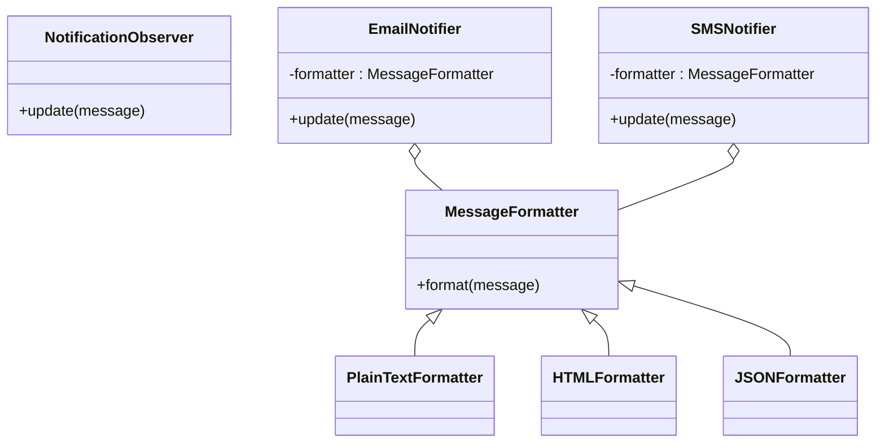

## 10.2.3 Integrating Strategy for Message Formatting

In this section, we delve into the integration of the Strategy design pattern to address the challenge of message formatting in a notification system. The Strategy pattern is an essential tool in software design that allows for the dynamic selection of algorithms at runtime. This flexibility is particularly beneficial in systems that need to handle multiple formats for different communication channels.

### The Need for Formatting Strategies

In any robust notification system, messages need to be tailored to fit the requirements of various channels such as SMS, email, and push notifications. Each of these channels may have distinct formatting needs:

- **SMS** typically requires plain text due to character limitations and lack of support for rich text.
- **Email** often supports HTML, allowing for rich formatting that enhances readability and engagement.
- **Push Notifications** might require JSON formatting to handle structured data.

The challenge is to design a system that can accommodate these diverse formatting needs without becoming unwieldy or difficult to maintain. This is where the Strategy pattern comes into play.

### Applying the Strategy Pattern

#### Context: A Versatile Notification System

Imagine a notification system designed to send alerts and updates to users via multiple channels. The system must ensure that each message is formatted appropriately for its target channel. Rather than hardcoding the formatting logic into each notification handler, we can leverage the Strategy pattern to encapsulate the formatting logic.

#### Strategy Interface

The first step in applying the Strategy pattern is to define a common interface for all formatting strategies. This interface will declare a method for formatting messages, which each concrete strategy will implement according to its specific requirements.

```python
from abc import ABC, abstractmethod

class MessageFormatter(ABC):
    @abstractmethod
    def format(self, message):
        pass
```

#### Concrete Strategies

Next, we implement concrete strategies for each channel. These strategies will provide the specific formatting logic required by each channel.

```python
class PlainTextFormatter(MessageFormatter):
    def format(self, message):
        return message  # No formatting

class HTMLFormatter(MessageFormatter):
    def format(self, message):
        return f"<html><body><p>{message}</p></body></html>"

class JSONFormatter(MessageFormatter):
    def format(self, message):
        import json
        return json.dumps({'message': message})
```

#### Updating Observers to Use Formatting Strategies

The notification system's observers, which handle the delivery of messages, need to be updated to use these formatting strategies. Each observer will be initialized with a specific formatter that it will use to prepare messages before sending.

```python
class EmailNotifier(NotificationObserver):
    def __init__(self, formatter):
        self.formatter = formatter

    def update(self, message):
        formatted_message = self.formatter.format(message)
        # Code to send email with formatted_message
        print(f"Email sent with message: {formatted_message}")

class SMSNotifier(NotificationObserver):
    def __init__(self, formatter):
        self.formatter = formatter

    def update(self, message):
        formatted_message = self.formatter.format(message)
        # Code to send SMS with formatted_message
        print(f"SMS sent with message: {formatted_message}")
```

#### Usage Example

To see the Strategy pattern in action, let's instantiate some formatters and use them in our notification system.

```python
plain_text_formatter = PlainTextFormatter()
html_formatter = HTMLFormatter()

email_notifier = EmailNotifier(html_formatter)
sms_notifier = SMSNotifier(plain_text_formatter)

subject.attach(email_notifier)
subject.attach(sms_notifier)

subject.notify("Hello, this is a test message.")
```

### Benefits of the Strategy Pattern

The Strategy pattern offers several key benefits in the context of message formatting:

- **Separation of Concerns:** By decoupling the formatting logic from the notification logic, we achieve a cleaner and more modular design. This separation makes the system easier to understand and maintain.
- **Flexibility and Extensibility:** New formatting strategies can be added with minimal changes to the existing codebase. This aligns with the Open/Closed Principle, which advocates for systems to be open for extension but closed for modification.
- **Reusability:** Formatting strategies can be reused across different parts of the system or even in different projects, promoting code reuse and reducing duplication.

### Visualizing the Strategy Pattern

To better understand the relationships between the components in our system, let's look at a class diagram illustrating the Strategy pattern in this context.



### Key Points to Emphasize

- **Interchangeability of Algorithms:** The Strategy pattern allows different formatting algorithms to be used interchangeably, providing the flexibility to choose the most appropriate strategy for each situation.
- **Adherence to Design Principles:** By promoting the Open/Closed Principle, the Strategy pattern facilitates the addition of new strategies without altering existing code, enhancing the maintainability and scalability of the system.
- **Improved Code Maintainability:** The separation of formatting logic from the notification logic not only makes the codebase easier to manage but also reduces the risk of errors when changes are made.

### Conclusion

Integrating the Strategy pattern into a notification system for message formatting is a powerful approach that addresses the need for flexibility and scalability. By encapsulating the formatting logic within interchangeable strategies, we create a system that is both robust and adaptable to future changes.

In the next sections, we will explore additional design patterns and their applications in solving common software design challenges. As you continue your journey through design patterns, consider how the principles and patterns discussed can be applied to your own projects to enhance their design and functionality.

## Quiz Time!



### Which design pattern is used to handle different message formatting strategies?

- [x] Strategy Pattern
- [ ] Observer Pattern
- [ ] Singleton Pattern
- [ ] Factory Pattern

> **Explanation:** The Strategy pattern is used to encapsulate different message formatting strategies, allowing them to be selected and applied dynamically.

### What is the main advantage of using the Strategy pattern for message formatting?

- [x] It separates the formatting logic from the notification logic.
- [ ] It makes the system slower.
- [ ] It reduces the number of classes needed.
- [ ] It increases the complexity of the system.

> **Explanation:** The Strategy pattern separates the formatting logic from the notification logic, improving modularity and maintainability.

### In the provided code example, what does the `format` method in the `MessageFormatter` interface do?

- [x] It defines the contract for formatting a message.
- [ ] It sends the message.
- [ ] It logs the message.
- [ ] It deletes the message.

> **Explanation:** The `format` method in the `MessageFormatter` interface defines the contract for how a message should be formatted by different strategies.

### How does the Strategy pattern promote the Open/Closed Principle?

- [x] By allowing new strategies to be added without modifying existing code.
- [ ] By requiring changes to all existing classes when a new strategy is added.
- [ ] By closing the system to new extensions.
- [ ] By making all classes open to modification.

> **Explanation:** The Strategy pattern allows new strategies to be added without modifying existing code, adhering to the Open/Closed Principle.

### Which of the following is a concrete strategy in the provided example?

- [x] PlainTextFormatter
- [x] HTMLFormatter
- [ ] MessageFormatter
- [ ] NotificationObserver

> **Explanation:** `PlainTextFormatter` and `HTMLFormatter` are concrete strategies that implement the `MessageFormatter` interface.

### What role does the `EmailNotifier` class play in the Strategy pattern implementation?

- [x] It acts as a context that uses a specific formatting strategy.
- [ ] It is a concrete strategy.
- [ ] It is an interface.
- [ ] It is a factory class.

> **Explanation:** The `EmailNotifier` class acts as a context that uses a specific formatting strategy to format messages before sending them.

### Why is it beneficial to use different formatting strategies for different notification channels?

- [x] Different channels may have different formatting requirements.
- [ ] It makes the system more complex.
- [ ] It reduces the number of messages sent.
- [ ] It ensures all messages look the same.

> **Explanation:** Different notification channels may have different formatting requirements, making it beneficial to use different strategies.

### What would be a potential new strategy to add to the system?

- [x] XMLFormatter
- [ ] EmailSender
- [ ] MessageDeleter
- [ ] NotificationLogger

> **Explanation:** An `XMLFormatter` would be a potential new strategy to handle XML formatting requirements.

### What is the purpose of the `update` method in the `NotificationObserver` class?

- [x] To receive and process messages using a specific formatting strategy.
- [ ] To format messages.
- [ ] To send messages.
- [ ] To log messages.

> **Explanation:** The `update` method is used to receive and process messages using a specific formatting strategy.

### True or False: The Strategy pattern requires modifying existing strategies when adding a new strategy.

- [ ] True
- [x] False

> **Explanation:** The Strategy pattern allows new strategies to be added without modifying existing ones, adhering to the Open/Closed Principle.


