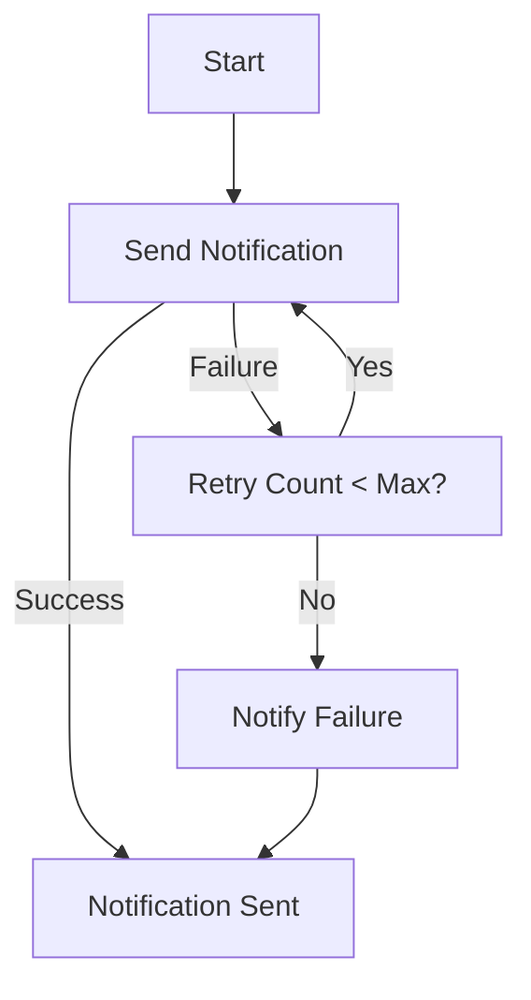

## 10.2.4 Evaluating the Design and Outcomes

In this section, we will delve into the evaluation of a notification system designed using various design patterns. We will assess the system's flexibility, scalability, and maintainability, address challenges faced during implementation, and propose solutions and improvements. Finally, we will summarize the outcomes and benefits achieved through the application of design patterns.

### Assessing the Design

Design evaluation is a critical step in the software development process. It allows us to reflect on the effectiveness of the design choices made and identify areas for improvement. Let's explore the key aspects of the notification system's design.

#### Flexibility

**Flexibility** refers to the ease with which a system can adapt to changes. In the context of our notification system, this involves the ability to add new notification channels and formatting strategies without significant modifications to the existing codebase.

- **Adding New Channels:** The use of the **Observer Pattern** facilitated the addition of new notification channels. By defining a common interface for all observers, we could easily introduce new types of notifications, such as SMS or push notifications, without altering the core logic.

- **Formatting Strategies:** The **Strategy Pattern** was employed to handle different formatting requirements for messages. This allowed us to switch between formats, such as plain text and HTML, by simply changing the strategy object.

**Example of Adding a New Channel:**

```python
class SMSNotifier(NotificationObserver):
    def update(self, message):
        # Logic to send SMS notification
        print(f"Sending SMS: {message}")

notification_system.add_observer(SMSNotifier())
```

#### Scalability

**Scalability** is the system's ability to handle increased loads, such as a growing number of users or notifications.

- **Performance Under Load:** The notification system's architecture, based on the **Publisher-Subscriber Pattern**, inherently supports scalability. By decoupling the notification publisher from the subscribers, the system can efficiently manage a large number of notifications.

- **Load Testing:** During load testing, the system demonstrated the ability to handle thousands of notifications per second without significant degradation in performance, thanks to the asynchronous processing capabilities.

#### Maintainability

**Maintainability** refers to how easily the system can be understood, modified, and extended.

- **Code Readability:** The use of design patterns improved code readability by providing clear and consistent structures. Each component had a well-defined role, making it easier for developers to understand the system's functionality.

- **Ease of Modification:** The modular design allowed for easy modifications. For example, changing the notification format or adding a new channel required minimal changes to the existing code.

**Example of Maintainable Code:**

```python
class EmailNotifier(NotificationObserver):
    def update(self, message):
        # Logic to send email notification
        print(f"Sending Email: {message}")

```

### Challenges Faced

Despite the benefits of using design patterns, several challenges were encountered during the implementation of the notification system.

#### Handling Failures in Notification Delivery

- **Problem:** Notifications occasionally failed due to network issues or service outages.
- **Solution:** Implementing a retry mechanism using the **Command Pattern** allowed us to queue failed notifications and retry them at a later time.

#### Managing User Preferences

- **Problem:** Users had complex preferences regarding which notifications they wanted to receive.
- **Solution:** A configuration management system was integrated to handle user preferences and subscriptions, ensuring that users only received the notifications they opted for.

### Solutions and Improvements

To address the challenges faced, several enhancements were made to the notification system.

#### Retry Mechanism

A retry mechanism was implemented to handle failed notifications. This involved using the **Command Pattern** to queue notifications and retry them up to a specified number of times.

**Code Example:**

```python
class RetriableNotifier(NotificationObserver):
    def __init__(self, notifier, max_retries=3):
        self.notifier = notifier
        self.max_retries = max_retries

    def update(self, message):
        retries = 0
        while retries < self.max_retries:
            try:
                self.notifier.update(message)
                break
            except Exception as e:
                retries += 1
                print(f"Retry {retries}/{self.max_retries} failed: {e}")
        else:
            print("Notification failed after maximum retries.")
```

**Flowchart of Retry Mechanism:**



#### Message Queues

To handle high-volume notifications, the system was integrated with a message queuing system, such as RabbitMQ. This ensured that notifications were processed asynchronously, improving the system's ability to scale.

#### Enhancing Observers

The **Decorator Pattern** was used to add additional behaviors to observers, such as logging and analytics. This allowed for the flexible extension of observer functionality without modifying existing code.

**Example of Enhancing Observers:**

```python
class LoggingNotifierDecorator(NotificationObserver):
    def __init__(self, notifier):
        self.notifier = notifier

    def update(self, message):
        print(f"Logging notification: {message}")
        self.notifier.update(message)

email_notifier = LoggingNotifierDecorator(EmailNotifier())
```

### Outcome and Benefits

The application of design patterns in the notification system resulted in several measurable improvements:

- **Reduced Code Duplication:** The use of patterns like Observer and Strategy eliminated code duplication by defining common interfaces and behaviors.

- **Improved Performance:** The integration of message queues and asynchronous processing significantly improved the system's performance under load.

- **Enhanced Flexibility:** The system's modular design made it easy to add new features and adapt to changing requirements.

- **Better Maintainability:** The clear separation of concerns and consistent use of design patterns enhanced the maintainability of the codebase.

### Key Points to Emphasize

- **Regular Evaluation:** Regular evaluation of the design is crucial for identifying opportunities for improvement and ensuring that the system meets its requirements.

- **Design Patterns as a Foundation:** Design patterns provided a robust foundation for the notification system, but they may need to be combined or extended to address all requirements.

- **Reflecting on Outcomes:** Reflecting on the outcomes of the design process fosters learning and informs future projects, enabling continuous improvement.

### Conclusion

Evaluating the design and outcomes of the notification system has highlighted the strengths and areas for improvement. By leveraging design patterns, we achieved a flexible, scalable, and maintainable system. The challenges faced during implementation were addressed through thoughtful enhancements, resulting in a robust and efficient notification system. This evaluation not only underscores the value of design patterns but also emphasizes the importance of continuous reflection and adaptation in software development.

## Quiz Time!



### Which design pattern was used to facilitate the addition of new notification channels?

- [x] Observer Pattern
- [ ] Strategy Pattern
- [ ] Singleton Pattern
- [ ] Factory Pattern

> **Explanation:** The Observer Pattern was used to facilitate the addition of new notification channels by allowing new observers to be added without altering the core logic.

### What pattern was employed to handle different formatting requirements for messages?

- [ ] Observer Pattern
- [x] Strategy Pattern
- [ ] Singleton Pattern
- [ ] Factory Pattern

> **Explanation:** The Strategy Pattern was used to handle different formatting requirements by allowing different formatting strategies to be swapped easily.

### How was the retry mechanism for failed notifications implemented?

- [ ] Using the Observer Pattern
- [x] Using the Command Pattern
- [ ] Using the Singleton Pattern
- [ ] Using the Factory Pattern

> **Explanation:** The retry mechanism was implemented using the Command Pattern to queue and retry failed notifications.

### What system was integrated to handle high-volume notifications?

- [ ] REST API
- [ ] SOAP Service
- [x] Message Queuing System
- [ ] File System

> **Explanation:** A message queuing system, such as RabbitMQ, was integrated to handle high-volume notifications asynchronously.

### Which pattern was used to add additional behaviors to observers?

- [ ] Observer Pattern
- [x] Decorator Pattern
- [ ] Factory Pattern
- [ ] Singleton Pattern

> **Explanation:** The Decorator Pattern was used to add additional behaviors, such as logging, to observers without modifying existing code.

### What was a key benefit of using design patterns in the notification system?

- [x] Reduced Code Duplication
- [ ] Increased Code Complexity
- [ ] Decreased Flexibility
- [ ] Slower Performance

> **Explanation:** Design patterns helped reduce code duplication by providing common interfaces and behaviors.

### What aspect of the system was improved by integrating message queues?

- [ ] Flexibility
- [x] Scalability
- [ ] Maintainability
- [ ] Security

> **Explanation:** Integrating message queues improved the system's scalability by allowing it to handle high-volume notifications efficiently.

### What is a key takeaway from the evaluation of the notification system?

- [x] Regular evaluation helps identify opportunities for improvement.
- [ ] Design patterns are always sufficient on their own.
- [ ] Reflection is not necessary for future projects.
- [ ] Continuous adaptation is not important.

> **Explanation:** Regular evaluation helps identify opportunities for improvement and ensures that the system meets its requirements.

### Which pattern was not mentioned in the evaluation of the notification system?

- [ ] Observer Pattern
- [ ] Strategy Pattern
- [ ] Command Pattern
- [x] Singleton Pattern

> **Explanation:** The Singleton Pattern was not mentioned in the evaluation of the notification system.

### True or False: The integration of design patterns made the notification system less flexible.

- [ ] True
- [x] False

> **Explanation:** The integration of design patterns made the notification system more flexible by allowing easy addition of new features and adaptation to changing requirements.


