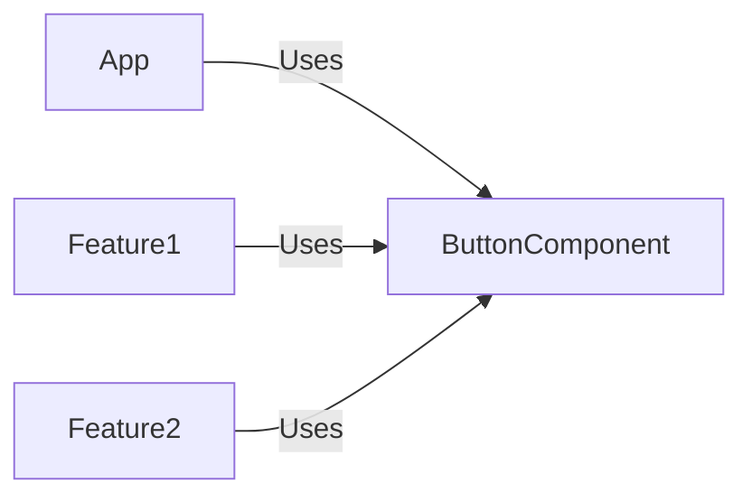

## 10.3.1 Understanding the Need for Reusable Components

In the fast-paced world of software development, creating efficient, maintainable, and scalable applications is paramount. One of the key strategies to achieve these goals is through the use of **reusable UI components**. This section delves into the significance of reusable components, the challenges they address in UI development, and how adopting a component-based architecture can revolutionize your development process.

### The Importance of Reusable Components

Reusable components are the building blocks of modern user interfaces. They encapsulate functionality and styling into self-contained units that can be easily reused across different parts of an application. Here are some of the primary benefits of adopting reusable components:

#### 1. Consistency in User Interfaces

Consistency is crucial for creating intuitive and user-friendly interfaces. Reusable components ensure that UI elements look and behave the same across an application. This uniformity not only enhances the user experience but also reinforces brand identity.

#### 2. Reduced Development Time

By leveraging reusable components, developers can significantly reduce the time spent on building and maintaining UI elements. Instead of writing new code for each feature, developers can simply integrate existing components, allowing them to focus on more complex and unique aspects of the application.

#### 3. Ease of Maintenance

Maintaining a large codebase can be daunting, especially when UI changes are required. Reusable components simplify this process by localizing changes. When a component is updated, all instances of that component across the application reflect the change, reducing the risk of inconsistencies and errors.

#### 4. Facilitating Collaboration

In collaborative environments, where multiple developers contribute to the UI, reusable components serve as a common language. They provide a clear structure and set of guidelines, making it easier for teams to work together without stepping on each other's toes.

### Challenges in UI Development

Despite the benefits, UI development poses several challenges that reusable components help mitigate:

#### 1. Code Duplication

Without reusable components, developers often resort to copying and pasting code to replicate UI elements across an application. This practice leads to code duplication, increasing the risk of bugs and inconsistencies.

#### 2. Inconsistency

Manually maintaining UI elements can result in inconsistencies, where the same component might look or behave differently in various parts of the application. This inconsistency can confuse users and degrade the overall experience.

#### 3. Difficulty in Updating UI Elements

Updating UI elements across a large application can be a nightmare if each instance is manually coded. Reusable components streamline this process, allowing developers to make changes in one place and propagate them throughout the application.

### Component-Based Architecture

The solution to these challenges lies in adopting a **component-based architecture**. This approach involves breaking down the UI into smaller, manageable components that can be developed, tested, and reused independently.

#### Popular Frameworks

Several modern frameworks embrace component-based architecture, making it easier for developers to create reusable components:

- **React**: A JavaScript library for building user interfaces, React promotes the use of components and has become a staple in modern web development.
- **Vue.js**: Known for its simplicity and flexibility, Vue.js allows developers to build reusable components with ease.
- **Angular**: A comprehensive framework for building dynamic web applications, Angular supports component-based development with its modular architecture.

### Scenarios Highlighting the Need for Reusable Components

To illustrate the power of reusable components, let's explore some common scenarios where they enhance the development workflow:

#### Example 1: Form Elements

Forms are ubiquitous in web applications, and reusable form components can save significant development time. By creating a generic form component that handles validation, styling, and submission, developers can reuse it across different forms with minimal effort.

#### Example 2: Buttons

Buttons are another common UI element that benefits from reusability. A well-designed button component can be customized with different labels, styles, and click handlers, allowing it to be used throughout the application without duplicating code.

#### Example 3: Modal Dialogs

Modal dialogs often require complex logic and styling. By encapsulating this functionality into a reusable component, developers can easily integrate modals into various parts of the application, ensuring consistency and reducing development time.

### Code Example: A Simple React Button Component

Let's look at a simple example of a reusable button component in React:

```javascript
// Button.js
import React from 'react';

const Button = ({ label, onClick, styleType }) => {
  return (
    <button className={`btn btn-${styleType}`} onClick={onClick}>
      {label}
    </button>
  );
};

export default Button;
```

#### Explanation

The `Button` component is designed to be flexible and reusable. It accepts three props: `label`, `onClick`, and `styleType`. This design allows developers to use the same component with different labels, styles, and click handlers, promoting consistency and reducing code duplication.

### Visual Representation

To better understand how reusable components fit into an application, consider the following diagram:



This diagram illustrates how a single `ButtonComponent` can be utilized across different features of an application, highlighting the efficiency and consistency provided by reusable components.

### Key Points to Emphasize

- **Promoting Consistency and Efficiency**: Reusable components ensure that UI elements are consistent across an application, enhancing user experience and reducing development time.
- **Facilitating Scalability**: As applications grow, maintaining consistency becomes more challenging. Reusable components simplify this process, making it easier to scale applications.
- **Simplifying Updates**: By centralizing UI logic and styling, reusable components make it easier to implement updates and new features without introducing errors.

### Conclusion

Understanding the need for reusable components is crucial for any developer looking to build efficient, maintainable, and scalable applications. By adopting a component-based architecture and leveraging modern frameworks, developers can overcome common UI development challenges and create applications that are both robust and user-friendly.

## Quiz Time!



### Why are reusable components important in UI development?

- [x] They ensure consistency across the application.
- [ ] They increase code duplication.
- [ ] They complicate the development process.
- [ ] They are only useful for small projects.

> **Explanation:** Reusable components ensure consistency across an application, which is crucial for a cohesive user experience.

### What is a major benefit of using reusable components?

- [x] Reduced development time
- [ ] Increased maintenance burden
- [ ] Greater code complexity
- [ ] Limited scalability

> **Explanation:** Reusable components reduce development time by allowing developers to reuse existing code instead of writing new code for each feature.

### Which of the following is a challenge addressed by reusable components?

- [x] Code duplication
- [ ] Increased testing requirements
- [ ] Decreased performance
- [ ] Limited functionality

> **Explanation:** Reusable components help eliminate code duplication by allowing developers to reuse code across different parts of an application.

### What is component-based architecture?

- [x] An approach that breaks down the UI into smaller, manageable components
- [ ] A method of writing monolithic code
- [ ] A way to increase code complexity
- [ ] An outdated software design practice

> **Explanation:** Component-based architecture involves breaking down the UI into smaller, manageable components that can be developed, tested, and reused independently.

### Which framework is known for its component-based architecture?

- [x] React
- [ ] jQuery
- [ ] PHP
- [ ] Python

> **Explanation:** React is a popular JavaScript library that promotes the use of components and is widely used for building modern web applications.

### How do reusable components facilitate collaboration?

- [x] By providing a clear structure and set of guidelines
- [ ] By increasing code complexity
- [ ] By limiting developer creativity
- [ ] By requiring more documentation

> **Explanation:** Reusable components provide a clear structure and set of guidelines, making it easier for teams to work together without conflicts.

### What is a common UI element that benefits from reusability?

- [x] Buttons
- [ ] Database queries
- [ ] Server configurations
- [ ] Network protocols

> **Explanation:** Buttons are a common UI element that can be reused throughout an application, promoting consistency and reducing code duplication.

### What does the `Button` component in the example do?

- [x] It can be reused with different labels, click handlers, and styles.
- [ ] It is a unique component for each button.
- [ ] It increases code duplication.
- [ ] It is not customizable.

> **Explanation:** The `Button` component is designed to be flexible and reusable, allowing it to be used with different labels, styles, and click handlers.

### What challenge does updating UI elements across a large application pose?

- [x] It can be difficult if each instance is manually coded.
- [ ] It is always easy and straightforward.
- [ ] It requires no testing.
- [ ] It does not affect consistency.

> **Explanation:** Updating UI elements across a large application can be difficult if each instance is manually coded, but reusable components simplify this process.

### True or False: Reusable components complicate the development process.

- [ ] True
- [x] False

> **Explanation:** Reusable components simplify the development process by reducing code duplication and ensuring consistency across the application.


