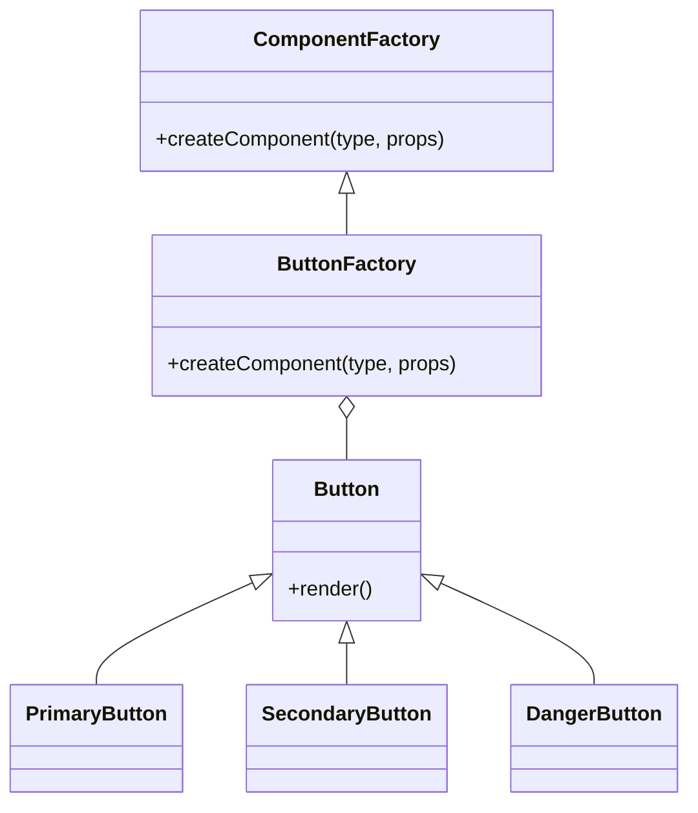

## 10.3.2 Utilizing the Factory Method for Component Creation

In modern software development, particularly in the realm of UI (User Interface) design, flexibility and extensibility are paramount. As applications grow in complexity, the need to dynamically create components based on user interactions or configuration settings becomes increasingly important. This is where the Factory Method design pattern comes into play. By leveraging this pattern, developers can create a flexible and scalable architecture that allows for the dynamic instantiation of UI components, thereby adhering to the principles of clean code and maintainability.

### Understanding the Factory Method in a UI Context

The Factory Method is a creational design pattern that provides an interface for creating objects in a superclass but allows subclasses to alter the type of objects that will be created. This pattern is particularly useful in scenarios where the exact types of objects are not known until runtime, which is often the case in UI development.

#### Key Characteristics of the Factory Method Pattern

1. **Decoupling Object Creation from Usage**: The Factory Method pattern decouples the process of object creation from its usage. This separation allows for greater flexibility and scalability, as the creation logic can be modified without affecting the code that uses the objects.

2. **Adherence to the Open/Closed Principle**: By using the Factory Method pattern, new types of components can be introduced without modifying existing code. This adheres to the Open/Closed Principle, one of the SOLID principles of object-oriented design.

3. **Runtime Decision Making**: The pattern allows for decisions about which class to instantiate to be made at runtime, based on configuration, user input, or other criteria.

In the context of UI components, the Factory Method pattern can be used to create various types of UI elements, such as buttons, modals, and forms, dynamically. This is particularly useful in applications where the UI needs to adapt to different themes, user roles, or device types.

### Implementing the Factory Method for UI Components

To implement the Factory Method pattern for UI components, we need to define a structure that allows for the creation of different types of components based on specified criteria. This involves creating an abstract `ComponentFactory` class and concrete factory classes for specific component categories.

#### The Creator Class: `ComponentFactory`

The `ComponentFactory` class serves as the abstract creator in our pattern. It defines a method, `createComponent`, which will be overridden by concrete factory classes to instantiate specific components.

```javascript
// ComponentFactory.js
class ComponentFactory {
  createComponent(type, props) {
    throw new Error('This method should be overridden.');
  }
}

export default ComponentFactory;
```

In this abstract class, the `createComponent` method is defined but not implemented. This method will be responsible for creating components based on the `type` and `props` parameters.

#### Concrete Creator Classes: `ButtonFactory`

Concrete creator classes extend the `ComponentFactory` and implement the `createComponent` method to create specific types of components. For instance, a `ButtonFactory` class can be used to create different styles of buttons.

```javascript
// ButtonFactory.js
import ComponentFactory from './ComponentFactory';
import PrimaryButton from './PrimaryButton';
import SecondaryButton from './SecondaryButton';
import DangerButton from './DangerButton';

class ButtonFactory extends ComponentFactory {
  createComponent(type, props) {
    switch (type) {
      case 'primary':
        return new PrimaryButton(props);
      case 'secondary':
        return new SecondaryButton(props);
      case 'danger':
        return new DangerButton(props);
      default:
        throw new Error(`Unknown button type: ${type}`);
    }
  }
}

export default ButtonFactory;
```

In this `ButtonFactory` class, the `createComponent` method is implemented to return different button instances based on the `type` parameter. This pattern allows new button types to be added easily by simply extending the `Button` class and updating the factory logic.

### Example Scenario: Dynamic Button Creation

Consider a scenario where you need to create buttons with different styles based on user preferences or configuration settings. Using the Factory Method pattern, you can achieve this dynamically without hardcoding the button types.

```javascript
// App.js
import ButtonFactory from './ButtonFactory';

const buttonFactory = new ButtonFactory();
const saveButton = buttonFactory.createComponent('primary', { label: 'Save', onClick: saveData });
const cancelButton = buttonFactory.createComponent('secondary', { label: 'Cancel', onClick: cancel });

// Render buttons in the UI
```

In this example, the `ButtonFactory` is used to create `saveButton` and `cancelButton` dynamically based on the specified type. This approach not only simplifies the creation process but also enhances the flexibility of the UI.

### Visual Representation of the Factory Method Pattern

To better understand the structure of the Factory Method pattern applied to UI components, consider the following class diagram:



This diagram illustrates the relationships between the abstract `ComponentFactory`, the concrete `ButtonFactory`, and the various button types. The `ButtonFactory` is responsible for creating instances of `Button` subclasses based on the specified type.

### Key Points to Emphasize

- **Flexibility and Extensibility**: The Factory Method pattern allows for the dynamic creation of UI components, enhancing the flexibility and extensibility of the application.

- **Centralized Creation Logic**: By centralizing the component creation logic in factory classes, the pattern promotes maintainability and scalability.

- **Runtime Adaptability**: The pattern enables the UI to adapt at runtime based on user preferences, configuration settings, or other criteria, providing a more personalized user experience.

### Hands-On Guidance: Implementing Your Own Factory Method

To solidify your understanding of the Factory Method pattern, try implementing your own version for another set of UI components, such as modals or forms. Follow these steps:

1. **Define the Abstract Factory**: Create an abstract class with a method for creating components.

2. **Implement Concrete Factories**: Extend the abstract class to create specific component types.

3. **Test Dynamic Creation**: Use your factories to dynamically create components based on different criteria.

By experimenting with different component types and criteria, you'll gain a deeper understanding of how the Factory Method pattern can be applied to enhance the flexibility and scalability of your UI applications.

### Conclusion

The Factory Method design pattern is a powerful tool for creating flexible and extensible UI components. By decoupling the creation logic from the component usage, it allows developers to build dynamic and adaptable interfaces that can evolve with changing requirements. Whether you're building a simple web application or a complex enterprise system, the Factory Method pattern can help you manage component creation efficiently and effectively.

## Quiz Time!



### What is the primary benefit of using the Factory Method pattern in UI component creation?

- [x] It allows for dynamic component creation at runtime.
- [ ] It reduces the number of classes needed.
- [ ] It eliminates the need for abstract classes.
- [ ] It simplifies the user interface design.

> **Explanation:** The Factory Method pattern enables the dynamic creation of components at runtime, which is essential for flexible and adaptable UI design.

### How does the Factory Method pattern adhere to the Open/Closed Principle?

- [x] By allowing new component types to be added without modifying existing code.
- [ ] By requiring all components to inherit from a single base class.
- [ ] By using only concrete classes for component creation.
- [ ] By eliminating the need for interfaces.

> **Explanation:** The Factory Method pattern adheres to the Open/Closed Principle by allowing new types of components to be introduced through subclassing without altering existing code.

### In the context of the Factory Method pattern, what is the role of the abstract `ComponentFactory` class?

- [x] It defines a method for creating components that must be implemented by subclasses.
- [ ] It directly creates instances of all component types.
- [ ] It provides a user interface for component selection.
- [ ] It manages the lifecycle of all created components.

> **Explanation:** The abstract `ComponentFactory` class defines a method for creating components, which is implemented by concrete subclasses to instantiate specific component types.

### What is a key advantage of centralizing component creation logic in factory classes?

- [x] It enhances maintainability and scalability of the application.
- [ ] It reduces the need for error handling.
- [ ] It eliminates the need for testing.
- [ ] It simplifies the user interface layout.

> **Explanation:** Centralizing component creation logic in factory classes enhances maintainability and scalability by providing a single point of modification for component creation logic.

### Which of the following is a characteristic of the Factory Method pattern?

- [x] Decoupling object creation from usage.
- [ ] Direct instantiation of all objects.
- [x] Runtime decision making for object creation.
- [ ] Elimination of abstract classes.

> **Explanation:** The Factory Method pattern is characterized by decoupling object creation from usage and allowing runtime decision making for object creation.

### How can the Factory Method pattern improve user experience in UI applications?

- [x] By allowing the UI to adapt based on user preferences or configuration settings.
- [ ] By reducing the number of components available.
- [ ] By enforcing a single UI design for all users.
- [ ] By eliminating the need for user input.

> **Explanation:** The Factory Method pattern can improve user experience by enabling the UI to adapt dynamically based on user preferences or configuration settings.

### What is the purpose of the `createComponent` method in the Factory Method pattern?

- [x] To create components based on specified criteria.
- [ ] To render components directly on the UI.
- [ ] To manage component state.
- [ ] To define component styles.

> **Explanation:** The `createComponent` method is used to create components based on specified criteria, allowing for dynamic and flexible component instantiation.

### In the provided example, what is the role of the `ButtonFactory` class?

- [x] To create different button instances based on the type specified.
- [ ] To directly render buttons on the UI.
- [ ] To manage button state and lifecycle.
- [ ] To define button styles and themes.

> **Explanation:** The `ButtonFactory` class is responsible for creating different button instances based on the type specified, centralizing the creation logic.

### Which of the following is NOT a benefit of using the Factory Method pattern?

- [ ] Flexibility in component creation.
- [ ] Centralized creation logic.
- [ ] Runtime adaptability.
- [x] Reduced need for testing.

> **Explanation:** While the Factory Method pattern offers flexibility, centralized logic, and runtime adaptability, it does not inherently reduce the need for testing.

### True or False: The Factory Method pattern eliminates the need for concrete classes in component creation.

- [ ] True
- [x] False

> **Explanation:** False. The Factory Method pattern does not eliminate the need for concrete classes; rather, it uses them to implement specific creation logic.



By understanding and applying the Factory Method pattern, you can create more dynamic and adaptable UI components, ultimately leading to more flexible and maintainable software designs.
