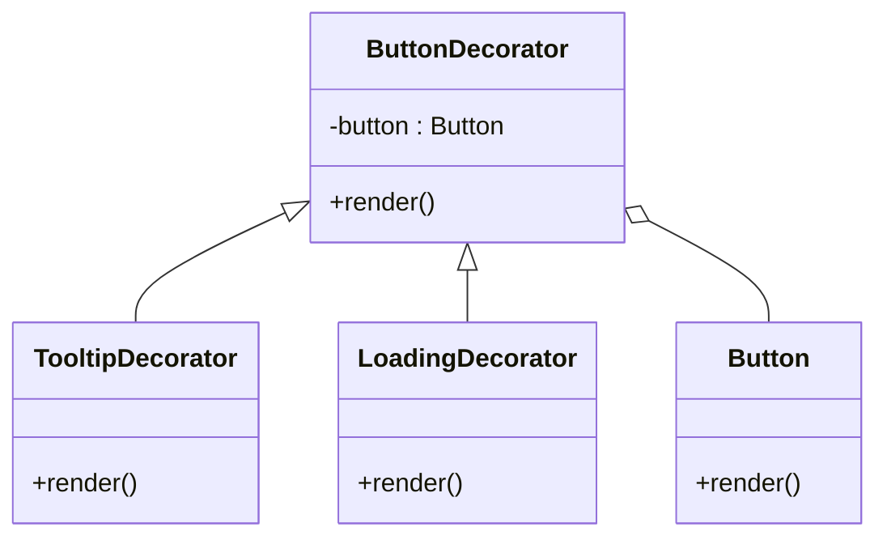

## 10.3.3 Applying the Decorator Pattern for Enhancements

In the realm of software design, particularly in UI development, flexibility and scalability are paramount. As applications grow, the need to extend functionality without altering existing code becomes critical. This is where the Decorator Pattern shines. By allowing the dynamic addition of responsibilities to objects, the Decorator Pattern offers a robust solution for enhancing UI components. This section delves into the application of the Decorator Pattern, illustrating how it can be employed to augment UI components like buttons with additional features such as tooltips and loading indicators.

### Understanding the Decorator Pattern in UI

The Decorator Pattern is a structural design pattern that enables behavior to be added to individual objects, either statically or dynamically, without affecting the behavior of other objects from the same class. This pattern is particularly useful in UI development, where components often require additional features like theming, styling, or event handling.

**Key Characteristics of the Decorator Pattern:**

- **Flexibility:** Allows for the dynamic composition of behaviors at runtime.
- **Adherence to the Open/Closed Principle:** Enhancements can be made without modifying existing code, keeping components open for extension but closed for modification.
- **Reusability:** Decorators can be reused across different components, promoting DRY (Don't Repeat Yourself) principles.

In UI design, the Decorator Pattern can be used to wrap components, adding layers of functionality. For instance, a basic button component can be wrapped with decorators that add tooltips, logging, or loading indicators, as needed.

### Implementing the Decorator Pattern

To effectively implement the Decorator Pattern, we need to define a clear structure comprising the component interface, concrete components, a decorator class, and concrete decorators.

#### Component Interface

The component interface defines the core structure that all UI components will implement. This interface ensures that decorators can wrap any component adhering to this structure.

```javascript
// Button.js
class Button {
  constructor(props) {
    this.props = props;
  }

  render() {
    // Render base button
    const buttonElement = document.createElement('button');
    buttonElement.innerText = this.props.label;
    buttonElement.onclick = this.props.onClick;
    return buttonElement;
  }
}

export default Button;
```

#### Concrete Components

Concrete components implement the core functionality defined by the component interface. In our example, the `Button` class represents a basic UI button.

#### Decorator Class

The decorator class serves as a wrapper for the components, providing a base for concrete decorators to extend and add new behaviors.

```javascript
// ButtonDecorator.js
import Button from './Button';

class ButtonDecorator extends Button {
  constructor(button) {
    super(button.props);
    this.button = button;
  }

  render() {
    return this.button.render();
  }
}

export default ButtonDecorator;
```

#### Concrete Decorators

Concrete decorators extend the decorator class to implement specific enhancements. For example, a `TooltipDecorator` can add tooltip functionality to a button.

```javascript
// TooltipDecorator.js
import ButtonDecorator from './ButtonDecorator';

class TooltipDecorator extends ButtonDecorator {
  constructor(button, tooltipText) {
    super(button);
    this.tooltipText = tooltipText;
  }

  render() {
    const buttonElement = super.render();
    // Enhance buttonElement with tooltip
    buttonElement.setAttribute('title', this.tooltipText);
    return buttonElement;
  }
}

export default TooltipDecorator;
```

### Example Scenario: Enhancing Buttons

Consider a scenario where we have a basic button component that needs to be enhanced with additional features like tooltips or loading indicators. By applying the Decorator Pattern, we can achieve this without altering the original button code.

#### Usage Example

```javascript
// App.js
import Button from './Button';
import TooltipDecorator from './TooltipDecorator';

const baseButton = new Button({ label: 'Submit', onClick: handleSubmit });
const tooltipButton = new TooltipDecorator(baseButton, 'Click to submit your data');

// Render the enhanced button in the UI
document.body.appendChild(tooltipButton.render());
```

In this example, the `TooltipDecorator` adds tooltip functionality to the base `Button` without modifying its code. This approach allows for multiple decorators to be stacked, adding various enhancements as needed.

### Visuals and Diagrams

To better understand the structure and relationships within the Decorator Pattern, consider the following class diagram:



This diagram illustrates how the `ButtonDecorator` class serves as a base for specific decorators like `TooltipDecorator` and `LoadingDecorator`, each adding unique functionality to the `Button`.

### Key Points to Emphasize

- **Flexibility and Scalability:** The Decorator Pattern provides a flexible way to extend the functionality of UI components, enabling dynamic composition of features at runtime.
- **Open/Closed Principle:** By allowing behavior to be added without modifying existing code, the Decorator Pattern adheres to the Open/Closed Principle, a core tenet of software design.
- **Reusability and Maintainability:** Decorators can be reused across different components, promoting maintainability and reducing code duplication.

### Real-World Applications

The Decorator Pattern is widely used in modern software development, particularly in frameworks and libraries that emphasize component-based architecture. For example, in React, higher-order components (HOCs) are a form of the Decorator Pattern, allowing developers to enhance components with additional props and behaviors.

### Best Practices and Common Pitfalls

When implementing the Decorator Pattern, consider the following best practices:

- **Keep Decorators Focused:** Each decorator should add a single, well-defined piece of functionality. This keeps decorators simple and reusable.
- **Chain Decorators Wisely:** Be mindful of the order in which decorators are applied, as it can affect the final behavior of the component.
- **Avoid Over-Decorating:** While decorators provide flexibility, overusing them can lead to complex and difficult-to-maintain code.

### Conclusion

The Decorator Pattern is a powerful tool for enhancing UI components, offering a flexible and scalable approach to adding functionality without altering existing code. By adhering to the Open/Closed Principle and promoting reusability, the Decorator Pattern is an essential technique for modern software development, particularly in UI design.

By mastering the Decorator Pattern, developers can create more dynamic, maintainable, and scalable applications, ultimately leading to a better user experience and more robust software solutions.

## Quiz Time!



### What is the primary benefit of using the Decorator Pattern in UI development?

- [x] It allows dynamic enhancement of components without altering their structure.
- [ ] It simplifies the code by reducing the number of classes.
- [ ] It increases the performance of UI components.
- [ ] It enforces strict type checking.

> **Explanation:** The Decorator Pattern allows for the dynamic addition of responsibilities to objects, enhancing components without changing their original structure.

### Which principle does the Decorator Pattern adhere to?

- [x] Open/Closed Principle
- [ ] Single Responsibility Principle
- [ ] Liskov Substitution Principle
- [ ] Dependency Inversion Principle

> **Explanation:** The Decorator Pattern adheres to the Open/Closed Principle by allowing behavior to be added without modifying existing code.

### In the provided example, what does the `TooltipDecorator` add to the button?

- [x] A tooltip with additional information
- [ ] A loading indicator
- [ ] A click event handler
- [ ] A new style

> **Explanation:** The `TooltipDecorator` adds a tooltip to the button, providing additional information when hovered over.

### What is a key characteristic of the Decorator Pattern?

- [x] Flexibility in adding behaviors at runtime
- [ ] Reducing the number of classes
- [ ] Enforcing compile-time checks
- [ ] Simplifying the inheritance hierarchy

> **Explanation:** The Decorator Pattern is flexible, allowing behaviors to be added dynamically at runtime.

### How does the Decorator Pattern promote reusability?

- [x] By allowing decorators to be reused across different components
- [ ] By reducing the number of methods in a class
- [ ] By enforcing strict access controls
- [ ] By minimizing the use of inheritance

> **Explanation:** Decorators can be applied to different components, promoting reusability and reducing code duplication.

### What should be considered when chaining multiple decorators?

- [x] The order in which decorators are applied
- [ ] The number of methods in each decorator
- [ ] The size of the component being decorated
- [ ] The type of data being processed

> **Explanation:** The order of decorators can affect the final behavior of the component, so it should be considered carefully.

### What is a common pitfall of using the Decorator Pattern?

- [x] Over-decorating, leading to complex code
- [ ] Reducing the flexibility of the code
- [ ] Increasing the number of classes
- [ ] Making the code less readable

> **Explanation:** While decorators add flexibility, overusing them can lead to complex and difficult-to-maintain code.

### Which of the following is an example of a real-world application of the Decorator Pattern?

- [x] Higher-order components in React
- [ ] Singleton pattern in database connections
- [ ] Factory pattern in object creation
- [ ] Observer pattern in event handling

> **Explanation:** Higher-order components in React are a form of the Decorator Pattern, used to enhance components with additional props and behaviors.

### What is the role of the base decorator class in the Decorator Pattern?

- [x] To serve as a wrapper for components, providing a base for specific decorators
- [ ] To implement the core functionality of the component
- [ ] To define the interface for all decorators
- [ ] To enforce strict type checking

> **Explanation:** The base decorator class wraps components and provides a foundation for specific decorators to extend and add new behaviors.

### True or False: The Decorator Pattern can only be used with UI components.

- [ ] True
- [x] False

> **Explanation:** False. The Decorator Pattern can be applied to any object-oriented design, not just UI components, to add responsibilities dynamically.


