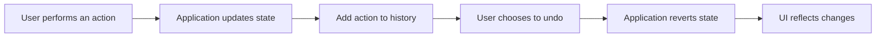

## 10.4.1 Defining the Requirements

In this section, we delve into the foundational step of implementing undo and redo functionality in an application: defining the requirements. This functionality is crucial for enhancing user experience by allowing users to revert or reapply actions, thereby providing flexibility and control over their interactions with the application. To achieve this, we will outline both functional and non-functional requirements, identify potential challenges, and establish constraints that will guide the implementation process.

### Objective

The primary objective of this section is to establish a clear and comprehensive set of requirements for adding undo and redo capabilities to an application. This will set the stage for applying the Command pattern, a design pattern well-suited for encapsulating requests as objects, thereby enabling parameterization of clients with queues, requests, and operations.

### Functional Requirements

Functional requirements define the specific behaviors and functions of the system. For undo and redo functionality, these include:

#### 1. Allow Users to Undo and Redo Actions

The core function of this feature is to enable users to undo and redo their actions. This can include:

- **Text Edits:** Users should be able to undo and redo changes made to text, such as typing, deleting, or formatting.
- **Object Manipulations:** In applications like graphic editors, users should be able to revert or reapply transformations, movements, or deletions of objects.
- **State Changes:** Any change in the application state that can be triggered by user actions should be reversible.

#### 2. Support Multiple Levels of Undo and Redo

The system should maintain a history of user actions to allow multiple levels of undo and redo. This means users can undo several actions sequentially and redo them if needed. The depth of this history should be configurable based on application needs and memory constraints.

### Non-Functional Requirements

Non-functional requirements focus on how the system performs certain functions, emphasizing efficiency, reliability, and usability.

#### 1. Efficiency in Memory and Performance

- **Memory Usage:** The system should manage memory efficiently, especially when maintaining a history of actions. This involves deciding on data structures that balance performance with memory consumption.
- **Performance:** Undo and redo operations should be executed swiftly to maintain a seamless user experience. This requires optimizing the algorithms used to revert or reapply actions.

#### 2. Consistency of Application State

The application must ensure that its state remains consistent after undo and redo operations. This involves:

- **Data Integrity:** Ensuring that all data affected by an action is correctly reverted or reapplied.
- **UI Consistency:** The user interface should accurately reflect the current state of the application after an undo or redo operation.

### Identifying Challenges

Implementing undo and redo functionality presents several challenges that must be addressed during the design phase:

#### 1. Tracking User Actions

One of the primary challenges is accurately tracking user actions and their effects on the application state. This involves:

- **Action Representation:** Deciding how to represent actions in a way that captures all necessary information for reversal.
- **Action History:** Maintaining an efficient history of actions that can be easily traversed for undoing and redoing.

#### 2. Ensuring Actions are Reversible

Not all actions are inherently reversible. The system must ensure that:

- **Reversible Actions:** Actions are designed to be reversible, either by storing necessary state information before the action or by implementing complementary operations.
- **Complex Operations:** For operations involving multiple sub-actions, the system must handle each sub-action appropriately to ensure overall reversibility.

#### 3. Handling Complex Operations

Complex operations, such as batch updates or transactions, may involve multiple sub-actions. The system must:

- **Sub-action Management:** Track and manage each sub-action to ensure the entire operation can be undone or redone as a single unit.
- **Atomicity:** Ensure that complex operations are treated atomically, maintaining consistency if an error occurs during undo or redo.

### Constraints

When defining requirements, it's important to consider constraints that may impact the implementation:

#### 1. Platform and Environment

The application could be desktop, web-based, or mobile. Each platform has its own constraints regarding memory, processing power, and user interaction patterns.

#### 2. Integration with Existing Codebase

The undo and redo functionality should integrate seamlessly with the existing codebase. This means:

- **Minimal Refactoring:** Avoiding significant changes to existing code to reduce the risk of introducing bugs.
- **Compatibility:** Ensuring compatibility with current application architecture and design patterns.

### Visual Representation

To better understand the process from a user's perspective, consider the following flowchart illustrating the undo/redo process:

### Key Points to Emphasize

- **Clear Understanding:** A clear understanding of both functional and non-functional requirements is crucial for designing an effective undo/redo system.
- **Anticipate Challenges:** Anticipating potential challenges and planning for them during the design phase can prevent costly rework later.
- **User-Friendly Design:** The system should prioritize user-friendliness, ensuring that undo and redo operations are intuitive and maintain the integrity of the application.

### Conclusion

Defining the requirements for implementing undo and redo functionality is a critical step that lays the groundwork for a robust and user-friendly system. By thoroughly understanding the functional and non-functional requirements, identifying challenges, and considering constraints, developers can design a solution that enhances user experience and maintains application integrity. This sets the stage for applying the Command pattern, which will be explored in subsequent sections.

---

## Quiz Time!



### Which of the following is a functional requirement for undo/redo functionality?

- [x] Allow users to undo and redo actions.
- [ ] Ensure the application uses minimal memory.
- [ ] Maintain a consistent application state.
- [ ] Handle complex operations efficiently.

> **Explanation:** Allowing users to undo and redo actions is a core functional requirement, focusing on the behavior of the application.

### What is a non-functional requirement when implementing undo/redo functionality?

- [ ] Users can undo text edits.
- [x] The system must be efficient in terms of memory.
- [ ] Actions include object manipulations.
- [ ] Support multiple levels of undo.

> **Explanation:** Efficiency in memory and performance is a non-functional requirement, focusing on how the system performs tasks.

### What challenge involves ensuring actions can be reversed?

- [ ] Tracking user actions.
- [x] Ensuring actions are reversible.
- [ ] Handling complex operations.
- [ ] Integrating with existing codebase.

> **Explanation:** Ensuring actions are reversible is about designing actions so they can be undone, which is a specific challenge in implementation.

### Which constraint might affect implementing undo/redo functionality?

- [ ] Allow users to redo actions.
- [ ] Support multiple levels of undo.
- [ ] Maintain UI consistency.
- [x] Integrate with existing codebase.

> **Explanation:** Integration with the existing codebase is a constraint that can affect how undo/redo functionality is implemented.

### How should complex operations be handled in undo/redo functionality?

- [x] Treat them atomically.
- [ ] Ignore them.
- [ ] Handle them as separate actions.
- [ ] Avoid using them.

> **Explanation:** Complex operations should be treated atomically to ensure consistency during undo/redo operations.

### What is the role of action history in undo/redo functionality?

- [x] Maintain a sequence of user actions for reversal.
- [ ] Store user preferences.
- [ ] Manage application settings.
- [ ] Track performance metrics.

> **Explanation:** Action history is used to maintain a sequence of user actions, allowing the system to undo or redo them.

### Which of the following is a key point to emphasize when designing undo/redo functionality?

- [x] Anticipate potential challenges.
- [ ] Ensure minimal user interaction.
- [ ] Focus only on UI design.
- [ ] Ignore non-functional requirements.

> **Explanation:** Anticipating potential challenges is crucial for designing an effective undo/redo system.

### What is a primary objective of defining requirements for undo functionality?

- [ ] To ensure minimal memory usage.
- [ ] To focus on UI design.
- [x] To set the stage for applying the Command pattern.
- [ ] To reduce user interactions.

> **Explanation:** Defining requirements helps set the stage for applying the Command pattern in the implementation.

### Why is memory efficiency important in undo/redo functionality?

- [x] To manage the history of actions without excessive resource use.
- [ ] To improve UI design.
- [ ] To simplify user interactions.
- [ ] To enhance graphics performance.

> **Explanation:** Memory efficiency is important to manage the history of actions without using excessive resources.

### True or False: Undo/redo functionality should integrate with existing codebase without significant refactoring.

- [x] True
- [ ] False

> **Explanation:** Integrating with the existing codebase without significant refactoring helps maintain stability and reduces the risk of introducing bugs.


