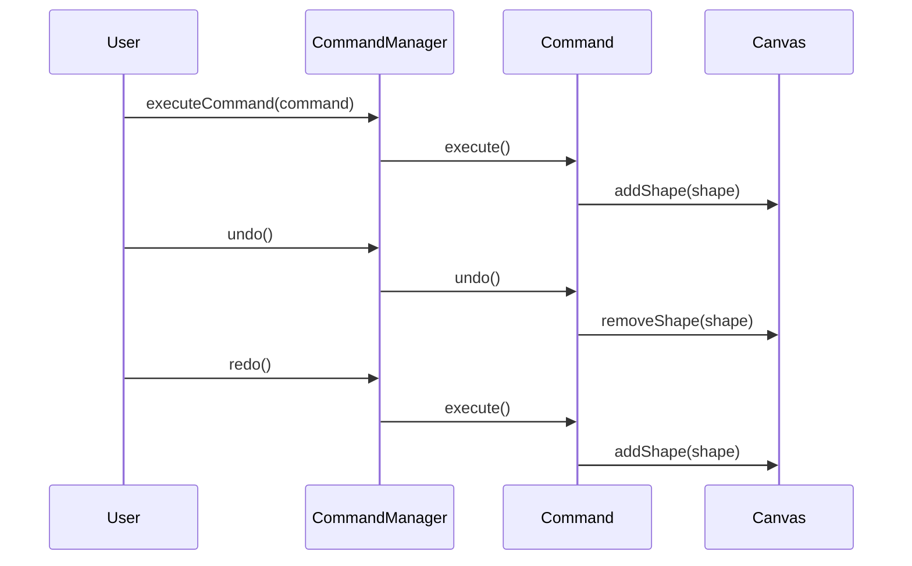

## 10.4.2 Using the Command Pattern

In the realm of software design, especially when developing applications that require user interaction, implementing undo and redo functionality is often a critical feature. This capability not only enhances user experience by providing flexibility and control but also demands a robust and scalable design solution. The Command Pattern emerges as an elegant solution to this problem, encapsulating actions as objects, thereby facilitating the execution, undoing, and redoing of operations in a seamless manner.

### Understanding the Command Pattern in this Context

The Command Pattern is a behavioral design pattern that turns a request into a stand-alone object containing all the information about the request. This transformation allows for parameterizing clients with queues, requests, and operations. In the context of undo and redo functionality, the Command Pattern is particularly useful because it allows actions to be encapsulated as objects that can be executed and undone independently.

#### Core Concepts of the Command Pattern

1. **Command Interface**: At the heart of the Command Pattern is the Command interface, which declares methods for executing and undoing operations. This interface acts as a contract for all concrete command classes.

2. **Concrete Commands**: These classes implement the Command interface and encapsulate the details of the operations that can be executed and undone. Each concrete command corresponds to a specific action in the application.

3. **Invoker**: The invoker is responsible for executing commands and maintaining a history of executed commands to facilitate undo and redo operations. It acts as a command manager, orchestrating the flow of command execution and reversal.

4. **Receiver**: The receiver is the component that performs the actual work. In a drawing application, for example, the receiver could be the canvas or the drawing context.

### Implementing the Command Pattern

To illustrate the application of the Command Pattern, let's consider a scenario involving a simple drawing application. This application allows users to draw shapes, move them, and delete them, with the ability to undo and redo these actions.

#### Command Interface

The Command interface defines the structure for executing and undoing actions. In JavaScript, this can be represented as follows:

```javascript
// ICommand.js
class ICommand {
  execute() {
    throw new Error('Method execute() must be implemented.');
  }

  undo() {
    throw new Error('Method undo() must be implemented.');
  }
}

export default ICommand;
```

This interface ensures that all command classes implement the `execute` and `undo` methods, providing a consistent way to handle actions.

#### Concrete Commands

Concrete commands implement the Command interface and encapsulate the logic for specific actions. For instance, adding a shape to a canvas can be encapsulated in the `AddShapeCommand` class:

```javascript
// AddShapeCommand.js
import ICommand from './ICommand';

class AddShapeCommand extends ICommand {
  constructor(shape, canvas) {
    super();
    this.shape = shape;
    this.canvas = canvas;
  }

  execute() {
    this.canvas.addShape(this.shape);
  }

  undo() {
    this.canvas.removeShape(this.shape);
  }
}

export default AddShapeCommand;
```

In this example, the `AddShapeCommand` class takes a shape and a canvas as parameters. It implements the `execute` method to add the shape to the canvas and the `undo` method to remove it.

#### Command Manager (Invoker)

The Command Manager is responsible for executing commands and managing the undo and redo stacks. It ensures that commands are executed in the correct order and that undo and redo operations are handled appropriately.

```javascript
// CommandManager.js
class CommandManager {
  constructor() {
    this.undoStack = [];
    this.redoStack = [];
  }

  executeCommand(command) {
    command.execute();
    this.undoStack.push(command);
    this.redoStack = []; // Clear redo stack
  }

  undo() {
    if (this.undoStack.length === 0) return;
    const command = this.undoStack.pop();
    command.undo();
    this.redoStack.push(command);
  }

  redo() {
    if (this.redoStack.length === 0) return;
    const command = this.redoStack.pop();
    command.execute();
    this.undoStack.push(command);
  }
}

export default CommandManager;
```

The `CommandManager` class maintains two stacks: one for undo operations and another for redo operations. When a command is executed, it is pushed onto the undo stack, and the redo stack is cleared. Undo operations pop commands from the undo stack, execute their undo method, and push them onto the redo stack. Redo operations reverse this process.

#### Example Scenario: Drawing Application

Let's see how these components come together in a simple drawing application:

```javascript
const canvas = new Canvas();
const commandManager = new CommandManager();

const circle = new Circle(100, 100, 50);
const addCircleCommand = new AddShapeCommand(circle, canvas);

// Execute the command
commandManager.executeCommand(addCircleCommand);

// User decides to undo the action
commandManager.undo();

// User redoes the action
commandManager.redo();
```

In this example, a circle is added to the canvas using the `AddShapeCommand`. The command is executed, and the user can undo or redo the action using the command manager.

### Visualizing the Command Pattern

To better understand the flow of command execution, undo, and redo operations, consider the following sequence diagram:



This diagram illustrates the interaction between the user, the command manager, the command, and the canvas during command execution, undo, and redo operations.

### Key Points to Emphasize

- **Encapsulation**: The Command Pattern encapsulates actions and their reversible counterparts, allowing for flexible and maintainable code.

- **Separation of Concerns**: By separating the logic for executing and undoing actions into distinct command classes, the pattern promotes a clear separation of concerns.

- **Scalability**: The Command Pattern can easily accommodate new actions by adding new command classes, making it a scalable solution for complex applications.

- **Maintainability**: With actions encapsulated in command objects, the codebase becomes easier to maintain and extend.

### Conclusion

The Command Pattern provides an elegant solution for implementing undo and redo functionality in applications. By encapsulating actions as objects, it enables flexible and maintainable code that can handle complex user interactions. Whether you're developing a drawing application or any other software requiring reversible operations, the Command Pattern is a powerful tool in your design arsenal.

## Quiz Time!



### What is the primary purpose of the Command Pattern?

- [x] To encapsulate actions as objects that can be executed and undone
- [ ] To optimize memory usage in applications
- [ ] To facilitate network communication
- [ ] To enhance user interface design

> **Explanation:** The Command Pattern encapsulates actions as objects, allowing them to be executed and undone independently.

### Which method must be implemented in a Command interface?

- [x] execute
- [x] undo
- [ ] redo
- [ ] initialize

> **Explanation:** The Command interface requires the implementation of `execute` and `undo` methods to handle actions and their reversals.

### In the Command Pattern, what is the role of the Invoker?

- [x] To execute commands and manage undo/redo stacks
- [ ] To perform the actual work of the command
- [ ] To define the command interface
- [ ] To store application data

> **Explanation:** The Invoker executes commands and manages undo/redo stacks, orchestrating the flow of command execution and reversal.

### What does a Concrete Command do?

- [x] Implements the Command interface and encapsulates specific actions
- [ ] Manages the history of executed commands
- [ ] Provides a user interface for command execution
- [ ] Defines the structure for commands

> **Explanation:** A Concrete Command implements the Command interface and encapsulates the logic for specific actions.

### In a drawing application, what role does the Canvas play in the Command Pattern?

- [x] Receiver
- [ ] Command
- [ ] Invoker
- [ ] Client

> **Explanation:** In the Command Pattern, the Canvas acts as the Receiver, performing the actual work of the command.

### How does the Command Manager handle redo operations?

- [x] By popping commands from the redo stack and executing them
- [ ] By directly executing commands without tracking
- [ ] By storing commands in a database
- [ ] By sending commands to the server

> **Explanation:** The Command Manager handles redo operations by popping commands from the redo stack and executing them.

### What happens to the redo stack when a new command is executed?

- [x] It is cleared
- [ ] It is merged with the undo stack
- [ ] It remains unchanged
- [ ] It is saved to a file

> **Explanation:** The redo stack is cleared when a new command is executed to maintain the correct state for undo/redo operations.

### Which of the following is NOT a benefit of using the Command Pattern?

- [ ] Encapsulation of actions
- [ ] Separation of concerns
- [x] Improved network performance
- [ ] Enhanced maintainability

> **Explanation:** The Command Pattern does not directly improve network performance; its benefits lie in encapsulation, separation of concerns, and maintainability.

### What is the relationship between a Command and a Receiver?

- [x] A Command calls methods on a Receiver to perform an action
- [ ] A Receiver executes commands directly
- [ ] A Command stores data for the Receiver
- [ ] A Receiver manages the command history

> **Explanation:** A Command calls methods on a Receiver to perform the actual action.

### The Command Pattern is particularly useful for implementing which type of functionality?

- [x] Undo and redo
- [ ] Real-time data processing
- [ ] Network communication
- [ ] User authentication

> **Explanation:** The Command Pattern is particularly useful for implementing undo and redo functionality by encapsulating actions as objects.



By understanding and implementing the Command Pattern, developers can create applications that are not only functional but also intuitive and user-friendly, providing users with the control they expect in modern software environments.
