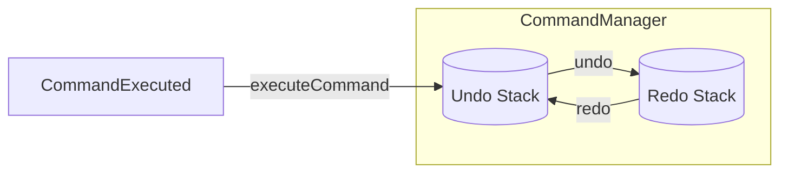

## 10.4.3 Managing Command History and State

In the realm of software design, particularly when implementing features such as undo and redo, managing command history and maintaining consistent application state are critical. This section delves into the strategies and patterns that facilitate these functionalities, ensuring a seamless user experience and robust application behavior.

### Understanding Command History Management

Command history management is a pivotal aspect of implementing undo and redo functionalities. It involves maintaining a record of executed commands, which allows users to revert or reapply actions as needed. Let's explore the key components involved in this process:

#### Undo Stack: The Backbone of Reversibility

The undo stack is a Last In, First Out (LIFO) data structure that stores executed commands. When a user performs an action, the corresponding command is pushed onto this stack. If the user decides to undo the action, the command is popped off the stack and its `undo` method is invoked.

**Key Characteristics of the Undo Stack:**

- **LIFO Order:** Ensures that the most recent action is undone first, maintaining the logical sequence of operations.
- **Command Storage:** Stores instances of command objects, each encapsulating the logic to undo a specific action.

**Example of an Undo Stack in Action:**

```javascript
class CommandManager {
  constructor() {
    this.undoStack = [];
    this.redoStack = [];
  }

  executeCommand(command) {
    command.execute();
    this.undoStack.push(command);
    this.redoStack = []; // Clear redo stack on new action
  }

  undo() {
    const command = this.undoStack.pop();
    if (command) {
      command.undo();
      this.redoStack.push(command);
    }
  }

  redo() {
    const command = this.redoStack.pop();
    if (command) {
      command.execute();
      this.undoStack.push(command);
    }
  }
}
```

In this example, the `CommandManager` class manages the execution and undoing of commands, utilizing both undo and redo stacks.

#### Redo Stack: Reapplying Undone Actions

The redo stack complements the undo stack by storing commands that have been undone. This allows users to reapply actions if they change their minds after an undo operation.

**Key Characteristics of the Redo Stack:**

- **LIFO Order:** Similar to the undo stack, it follows a LIFO order to ensure the logical sequence of redoing actions.
- **Command Storage:** Stores commands that were previously undone, ready to be executed again if needed.

### Ensuring State Consistency

Maintaining a consistent application state is crucial when implementing command history management. The state must accurately reflect the effects of executed or undone commands to prevent inconsistencies or unexpected behavior.

#### Handling Complex Commands

Complex commands that affect multiple objects or properties require careful management to ensure state consistency. This often involves:

- **Atomic Execution:** Ensuring that all parts of a complex command are executed or undone as a single unit.
- **State Validation:** Verifying that the application state is valid after each command execution or undo operation.

**Example of a Complex Command:**

```javascript
class MoveCommand {
  constructor(shape, newPosition) {
    this.shape = shape;
    this.newPosition = newPosition;
    this.previousPosition = shape.position;
  }

  execute() {
    this.shape.move(this.newPosition);
  }

  undo() {
    this.shape.move(this.previousPosition);
  }
}
```

In this example, the `MoveCommand` class encapsulates the logic for moving a shape to a new position, including the ability to undo the move by reverting to the previous position.

### Implementing Composite Commands

Composite commands are a powerful tool for grouping several actions into a single undoable operation. This is particularly useful for actions that involve multiple steps or affect multiple objects.

#### Creating Composite Commands

A composite command consists of multiple individual commands, executed and undone as a single unit. This pattern simplifies the management of complex operations and ensures consistency across related actions.

**Example of a Composite Command:**

```javascript
// CompositeCommand.js
import ICommand from './ICommand';

class CompositeCommand extends ICommand {
  constructor(commands) {
    super();
    this.commands = commands;
  }

  execute() {
    this.commands.forEach((command) => command.execute());
  }

  undo() {
    // Reverse order for undo
    for (let i = this.commands.length - 1; i >= 0; i--) {
      this.commands[i].undo();
    }
  }
}

export default CompositeCommand;
```

**Usage of Composite Command:**

```javascript
// Execute multiple commands as one
const compositeCommand = new CompositeCommand([command1, command2, command3]);
commandManager.executeCommand(compositeCommand);
```

### Command Serialization (Optional)

In some applications, it may be beneficial to serialize commands to support persistent undo/redo across sessions. This involves saving the command history to a persistent storage medium, allowing users to resume their work with the same undo/redo capabilities after restarting the application.

#### Benefits of Command Serialization

- **Session Persistence:** Maintains command history across application restarts, enhancing user experience.
- **Data Integrity:** Ensures that the application state can be accurately restored.

### Performance Considerations

Managing command history and state can have performance implications, particularly in applications with extensive command histories or complex state management requirements.

#### Limiting Command History Size

To manage memory usage, it's important to limit the size of the command history. This can be achieved by:

- **Configurable Limits:** Allowing users to set a maximum number of commands to retain in history.
- **Automatic Pruning:** Removing the oldest commands when the history size exceeds the limit.

#### Efficient State Snapshots

For applications that require state snapshots, efficient data structures and algorithms are essential to minimize performance overhead.

### Handling Edge Cases

When implementing command history management, it's important to consider edge cases that may arise, such as:

#### Irreversible Commands

Some commands may not be easily undone, such as those involving irreversible actions. In such cases, it's crucial to:

- **Warn Users:** Inform users about the irreversible nature of the action before execution.
- **Provide Alternatives:** Offer alternative actions or confirmations to prevent accidental execution.

#### Application Crashes or Unexpected Shutdowns

To handle application crashes or unexpected shutdowns, consider implementing:

- **Auto-Save:** Regularly save the command history and application state to minimize data loss.
- **Recovery Mechanisms:** Provide mechanisms to recover the last known state upon restart.

### Visualizing Command History Management

To better understand the flow of commands between undo and redo stacks, consider the following diagram:



This diagram illustrates how commands move between the undo and redo stacks, providing a visual representation of the command history management process.

### Key Points to Emphasize

- **Proper Management:** Effective command history management is crucial for reliable undo/redo functionality.
- **Composite Commands:** These provide flexibility for grouping actions, simplifying complex operations.
- **Consistent State:** Ensuring a consistent application state is essential for a seamless user experience.

By implementing these strategies and patterns, developers can create robust applications with intuitive and reliable undo/redo functionalities, enhancing both user satisfaction and application reliability.

## Quiz Time!



### What is the primary purpose of the undo stack in command history management?

- [x] To store executed commands for potential undo operations.
- [ ] To store commands that have been undone.
- [ ] To execute commands in a specific order.
- [ ] To manage application state directly.

> **Explanation:** The undo stack is used to store executed commands, allowing them to be undone later if needed.

### How does the redo stack complement the undo stack?

- [x] It stores commands that have been undone, allowing them to be redone.
- [ ] It stores executed commands for potential undo operations.
- [ ] It manages application state directly.
- [ ] It executes commands in reverse order.

> **Explanation:** The redo stack stores commands that have been undone, enabling users to redo actions if desired.

### What is a composite command?

- [x] A command that groups several actions into a single undoable operation.
- [ ] A command that cannot be undone.
- [ ] A command that directly manages application state.
- [ ] A command that only affects a single object.

> **Explanation:** A composite command is a collection of multiple commands executed and undone as a single unit.

### Why might command serialization be beneficial?

- [x] To support persistent undo/redo across sessions.
- [ ] To execute commands in a specific order.
- [ ] To directly manage application state.
- [ ] To limit memory usage.

> **Explanation:** Command serialization allows command history to be saved, enabling undo/redo functionality to persist across application sessions.

### What is a key consideration when managing command history for performance?

- [x] Limiting the size of the command history to manage memory usage.
- [ ] Ensuring commands are executed in reverse order.
- [ ] Storing all commands indefinitely.
- [ ] Directly managing application state.

> **Explanation:** Limiting the size of the command history helps manage memory usage and improve performance.

### How can applications handle irreversible commands?

- [x] Warn users about the irreversible nature of the action.
- [ ] Automatically undo the command.
- [ ] Execute the command without confirmation.
- [ ] Store the command in the redo stack.

> **Explanation:** Users should be informed about irreversible actions to prevent accidental execution.

### What is an efficient way to handle application crashes concerning command history?

- [x] Implement auto-save and recovery mechanisms.
- [ ] Store all commands indefinitely.
- [ ] Execute commands in reverse order.
- [ ] Directly manage application state.

> **Explanation:** Auto-save and recovery mechanisms help minimize data loss and restore the last known state after a crash.

### What is the LIFO order in the context of undo and redo stacks?

- [x] Last In, First Out order, ensuring the most recent action is undone or redone first.
- [ ] First In, First Out order, ensuring the oldest action is undone or redone first.
- [ ] Random order of execution.
- [ ] Predefined order based on command type.

> **Explanation:** LIFO order ensures that the most recent action is addressed first, maintaining logical operation sequences.

### Why is consistent application state important in command history management?

- [x] To ensure a seamless user experience and prevent inconsistencies.
- [ ] To execute commands in a specific order.
- [ ] To limit memory usage.
- [ ] To directly manage the undo stack.

> **Explanation:** Consistent application state is crucial for reliable application behavior and user satisfaction.

### True or False: Composite commands cannot be undone.

- [ ] True
- [x] False

> **Explanation:** Composite commands can be undone as they encapsulate multiple actions into a single undoable operation.


