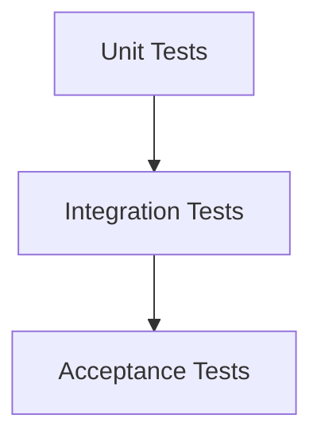

## 11.1.4 Testing and Code Quality Assurance

In the ever-evolving landscape of software development, ensuring the quality and reliability of code is paramount. Testing and code quality assurance play a critical role in this process, especially when integrating design patterns into your projects. This section delves into the importance of testing, introduces various testing methodologies, and explores how Test-Driven Development (TDD) can lead to cleaner, more robust code.

### The Role of Testing in Code Quality

Testing is not merely a phase in the development cycle; it is an ongoing process that ensures software meets its requirements and functions as expected. By identifying defects early, testing reduces the cost and effort required to fix issues later in the development process. Moreover, testing provides a safety net when refactoring code or implementing design patterns, ensuring that new changes do not break existing functionality.

#### Early Detection of Defects

Identifying defects early in the development cycle is crucial. The later a defect is found, the more expensive it is to fix. Testing allows developers to catch these issues before they propagate through the system, saving time and resources.

#### Verifying Refactoring and Design Pattern Implementations

When refactoring code or applying design patterns, testing ensures that changes do not introduce new bugs. By running tests after each modification, developers can verify that the system still behaves as expected, maintaining the integrity of the application.

### Types of Testing

Testing can be categorized into several types, each serving a different purpose in the software development lifecycle. Here, we focus on unit testing, integration testing, and acceptance testing.

#### Unit Testing

Unit testing involves testing individual components or functions in isolation. The goal is to validate that each unit of the software performs as expected. Unit tests are typically automated and written using testing frameworks.

**Python Example: Using `unittest`**

```python
import unittest

def add(a, b):
    return a + b

class TestMathOperations(unittest.TestCase):
    
    def test_add(self):
        self.assertEqual(add(1, 2), 3)
        self.assertEqual(add(-1, 1), 0)
        self.assertEqual(add(-1, -1), -2)

if __name__ == '__main__':
    unittest.main()
```

**JavaScript Example: Using `Jest`**

```javascript
// math.js
function add(a, b) {
    return a + b;
}

module.exports = add;

// math.test.js
const add = require('./math');

test('adds 1 + 2 to equal 3', () => {
    expect(add(1, 2)).toBe(3);
});

test('adds -1 + 1 to equal 0', () => {
    expect(add(-1, 1)).toBe(0);
});
```

#### Integration Testing

Integration testing focuses on verifying the interactions between different components or systems. This type of testing ensures that integrated parts of the application work together as intended.

**When to Perform Integration Tests**

Integration tests are typically performed after unit tests. They are crucial when multiple components or services need to communicate, especially in microservices architectures or applications with complex dependencies.

**Example Scenario**

Consider an e-commerce application where the payment service needs to interact with the inventory service. An integration test would validate that a purchase correctly updates the inventory.

#### Acceptance Testing

Acceptance testing, also known as user acceptance testing (UAT), validates the software against business requirements. It ensures that the system meets the needs of the end-users and stakeholders.

**Tools and Methodologies**

- **Behavior-Driven Development (BDD):** BDD frameworks like Cucumber allow writing tests in a natural language style, bridging the gap between technical and non-technical stakeholders.

**Example with Cucumber**

```gherkin
Feature: Purchase product

  Scenario: Successful purchase
    Given the product is in stock
    When the customer buys the product
    Then the inventory should be reduced by one
    And the customer should receive a confirmation email
```

### Test-Driven Development (TDD)

Test-Driven Development is a software development approach where tests are written before the code itself. The TDD cycle involves writing a test, seeing it fail, writing the minimum code to pass the test, refactoring, and repeating the process.

#### The TDD Cycle

1. **Write a Test:** Start by writing a test for the next bit of functionality you want to add.
2. **See it Fail:** Run the test suite to ensure that the new test fails.
3. **Write Code:** Write the minimum amount of code necessary to make the test pass.
4. **Refactor:** Clean up the code, ensuring it adheres to design principles and patterns.
5. **Repeat:** Continue the cycle, gradually building up the functionality.

#### Benefits of TDD

- **Modular and Testable Code:** TDD encourages writing smaller, more focused units of code, which are easier to test and maintain.
- **Better Design Decisions:** By focusing on testability, TDD often leads to better design choices and cleaner architecture.
- **Confidence in Code Changes:** With a comprehensive suite of tests, developers can refactor code and implement design patterns with confidence.

#### Implementing TDD: A Step-by-Step Example

**Python Example**

Let's implement a simple calculator using TDD in Python.

1. **Write a Test**

```python
import unittest

class TestCalculator(unittest.TestCase):
    
    def test_add(self):
        calc = Calculator()
        self.assertEqual(calc.add(1, 2), 3)

if __name__ == '__main__':
    unittest.main()
```

2. **See it Fail**

Run the test suite to see the test fail, as the `Calculator` class and `add` method do not exist yet.

3. **Write Code**

```python
class Calculator:
    def add(self, a, b):
        return a + b
```

4. **Refactor**

Ensure the code is clean and adheres to design principles.

5. **Repeat**

Continue adding tests for other operations like subtraction, multiplication, etc.

#### Challenges and Best Practices

- **Initial Time Investment:** TDD can initially slow down development as writing tests takes time. However, the long-term benefits often outweigh the initial cost.
- **Maintainability of Tests:** As the codebase grows, maintaining the test suite can become challenging. Regularly refactor tests and remove obsolete ones.
- **Cultural Shift:** Adopting TDD requires a mindset shift in the development team. Training and practice are essential for successful implementation.

### The Testing Pyramid

The testing pyramid is a concept that visualizes the different types of tests and their relative quantities. It suggests having more unit tests than integration tests, and more integration tests than acceptance tests.



### Exercises

1. **Write Unit Tests for a Simple Function:**
   - Choose a simple function, like a string reverser, and write unit tests in both Python and JavaScript.

2. **Create an Integration Test:**
   - For a basic web application, write an integration test to ensure that the login and dashboard components communicate correctly.

3. **Implement a Feature Using TDD:**
   - Choose a small feature, such as user registration, and implement it using the TDD approach.

### Relationship Between Testing and Design Patterns

Testing is integral to the successful application of design patterns. By providing a robust testing framework, developers can confidently refactor code and apply patterns without fear of breaking existing functionality. Testing ensures that patterns are implemented correctly and function as intended, leading to cleaner, more maintainable code.

### Conclusion

Testing and code quality assurance are essential components of modern software development. By understanding and applying various testing methodologies and embracing practices like TDD, developers can ensure that their software is robust, reliable, and ready to meet the demands of today's users. As you continue to explore design patterns, remember that testing is your ally in building high-quality software.

## Quiz Time!



### What is the primary benefit of identifying defects early in the development process?

- [x] Reducing the cost of fixes
- [ ] Increasing development speed
- [ ] Improving user interface design
- [ ] Enhancing application performance

> **Explanation:** Early detection of defects reduces the cost and effort required to fix them, as issues are easier to address before they propagate through the system.

### Which testing type focuses on verifying interactions between components?

- [ ] Unit Testing
- [x] Integration Testing
- [ ] Acceptance Testing
- [ ] System Testing

> **Explanation:** Integration testing ensures that different components or systems work together as intended.

### What is the primary goal of unit testing?

- [x] Testing individual components or functions in isolation
- [ ] Validating business requirements
- [ ] Ensuring system-wide functionality
- [ ] Testing user interfaces

> **Explanation:** Unit testing focuses on testing individual components or functions in isolation to ensure they perform as expected.

### Which tool is commonly used for behavior-driven development (BDD)?

- [ ] Mocha
- [ ] Jest
- [x] Cucumber
- [ ] JUnit

> **Explanation:** Cucumber is a tool commonly used for BDD, allowing tests to be written in a natural language style.

### What is the first step in the TDD cycle?

- [x] Write a test
- [ ] Refactor code
- [ ] Write code to pass the test
- [ ] Deploy the application

> **Explanation:** The first step in the TDD cycle is to write a test for the next bit of functionality you want to add.

### What is a key benefit of Test-Driven Development (TDD)?

- [x] More modular and testable code
- [ ] Faster initial development
- [ ] Elimination of all bugs
- [ ] Simplified user interfaces

> **Explanation:** TDD encourages writing smaller, more focused units of code, which are easier to test and maintain, leading to more modular and testable code.

### In the testing pyramid, which type of test should be most numerous?

- [x] Unit Tests
- [ ] Integration Tests
- [ ] Acceptance Tests
- [ ] System Tests

> **Explanation:** The testing pyramid suggests having more unit tests than integration or acceptance tests.

### How does TDD influence design decisions?

- [x] Encourages better design choices
- [ ] Forces premature optimization
- [ ] Limits creativity
- [ ] Discourages refactoring

> **Explanation:** By focusing on testability, TDD often leads to better design choices and cleaner architecture.

### What is the primary focus of acceptance testing?

- [ ] Testing individual components
- [ ] Verifying interactions between systems
- [x] Validating software against business requirements
- [ ] Enhancing code performance

> **Explanation:** Acceptance testing validates the software against business requirements, ensuring it meets the needs of end-users and stakeholders.

### True or False: TDD can initially slow down development but offers long-term benefits.

- [x] True
- [ ] False

> **Explanation:** TDD can initially slow down development due to the time taken to write tests, but it offers long-term benefits such as improved code quality and easier maintenance.


