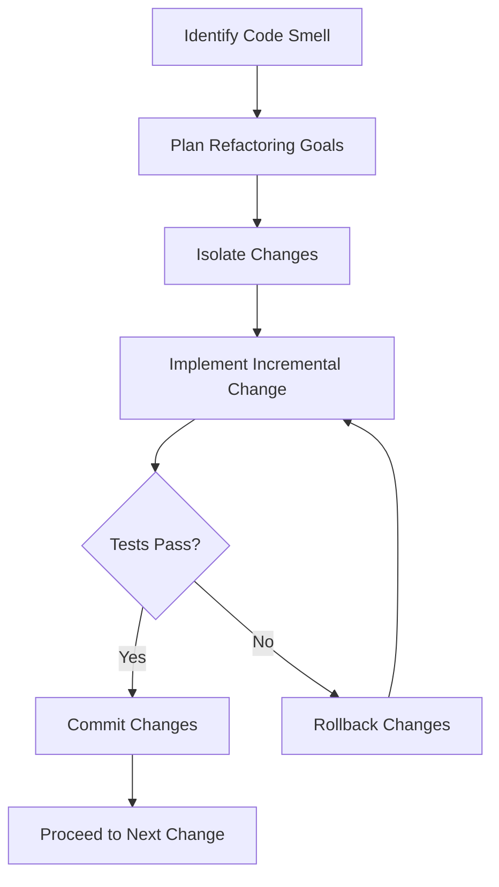

---

linkTitle: "11.3.2 Step-by-Step Refactoring Process"
title: "Step-by-Step Refactoring Process: Systematic Refactoring with Design Patterns"
description: "Learn a systematic approach to refactoring using design patterns, emphasizing planning, isolation of changes, effective use of version control, and comprehensive testing to enhance software quality and maintainability."
categories:
- Software Development
- Design Patterns
- Refactoring
tags:
- Refactoring
- Design Patterns
- Version Control
- Software Testing
- Incremental Changes
date: 2024-10-25
type: docs
nav_weight: 11320

---

## 11.3.2 Step-by-Step Refactoring Process

Refactoring is a crucial part of maintaining and improving software systems. It involves restructuring existing code without changing its external behavior, primarily to improve nonfunctional attributes. This section provides a detailed, systematic approach to refactoring using design patterns, ensuring your codebase remains clean, efficient, and maintainable.

### Overview of the Refactoring Process

Refactoring is not just about cleaning up code; it's about making strategic improvements to your software's architecture. By incorporating design patterns into your refactoring process, you can enhance code readability, reduce complexity, and increase the potential for reuse. Let's explore a systematic approach to refactoring, emphasizing planning, making incremental changes, utilizing version control, and rigorous testing.

### 1. Plan Refactoring

#### Define Clear Goals

Before diving into refactoring, it's essential to identify specific goals. These goals might include improving performance, reducing code duplication, or making the code easier to understand. Defining these objectives will guide your refactoring efforts and help measure success.

- **Identify Pain Points:** Start by identifying areas in your code that are difficult to maintain or extend. These are often referred to as "code smells."
- **Set Priorities:** Determine which areas to refactor first based on their impact on the project and alignment with your goals.
- **Consult with Stakeholders:** Ensure that the refactoring aligns with business objectives and involves input from team members who understand the system's requirements and constraints.

#### Example: Planning Refactoring in a Web Application

Consider a web application with a monolithic architecture. The goal might be to refactor it into a more modular, microservices-based architecture. This plan would involve identifying tightly coupled components that can be isolated and refactored independently.

### 2. Isolate Changes

#### Make Small, Incremental Changes

One of the core principles of effective refactoring is to make small, incremental changes. This approach minimizes risk and makes it easier to identify and fix issues.

- **Focus on One Change at a Time:** Tackle one aspect of the code at a time, such as extracting a method or renaming variables for clarity.
- **Incremental Refactoring:** Implement changes in small steps, committing each change to version control before moving on to the next.

#### Benefits of Incremental Changes

- **Reduced Risk:** Smaller changes are less likely to introduce new bugs.
- **Ease of Debugging:** If a bug is introduced, it's easier to pinpoint the change that caused it.
- **Psychological Benefits:** Making steady progress can boost morale and motivation.

#### Rollback Strategies

In case a refactoring change introduces issues, having a rollback strategy is crucial. This involves using version control to revert to a previous stable state.



### 3. Use Version Control Effectively

Version control systems (VCS) like Git are indispensable tools in the refactoring process. They provide a safety net and facilitate collaboration among team members.

#### Best Practices for Using Version Control

- **Commit Regularly:** Make frequent commits to capture each small change. This makes it easier to track progress and revert if necessary.
- **Use Branches:** Create separate branches for refactoring efforts to isolate changes from the main codebase.
- **Write Descriptive Commit Messages:** Clearly describe what each commit does and why it was made, aiding future understanding and collaboration.

#### Example: Using Git for Refactoring

```bash
git checkout -b refactor/feature-extraction

git add .
git commit -m "Extracted feature X into a separate module"

git push origin refactor/feature-extraction
```

### 4. Emphasize Testing Before and After Changes

Testing is a critical component of the refactoring process. It ensures that your changes do not introduce regressions and that the software continues to function as expected.

#### Testing Before Refactoring

- **Run Existing Tests:** Ensure that all existing tests pass before making any changes. This confirms that the current functionality is stable.
- **Write Missing Tests:** If there are areas of the code without test coverage, write tests to cover critical functionality before refactoring.

#### Testing After Refactoring

- **Run the Full Test Suite:** After making changes, run all tests to ensure no regressions have been introduced.
- **Add New Tests if Necessary:** If new functionality or changes require it, write additional tests to cover these areas.

#### Example: Testing in Python

```python
import unittest

class TestFeatureExtraction(unittest.TestCase):
    def test_feature_extraction(self):
        # Test setup
        data = "sample data"
        expected_output = "processed data"
        
        # Execute feature extraction
        result = feature_extraction(data)
        
        # Assert the result is as expected
        self.assertEqual(result, expected_output)

if __name__ == '__main__':
    unittest.main()
```

### 5. Document Refactoring Efforts

Transparency and communication are vital when refactoring, especially in team settings. Documenting your efforts helps keep everyone informed and aligned.

#### Tips for Effective Documentation

- **Maintain a Refactoring Log:** Keep a detailed log of changes made, including the reasons for each change and any issues encountered.
- **Update Code Comments:** Ensure that code comments are updated to reflect changes, maintaining clarity for future developers.
- **Share with the Team:** Regularly update your team on the status of refactoring efforts through meetings or shared documentation.

### Conclusion

Refactoring is a powerful tool for improving the quality and maintainability of your codebase. By following a systematic approach that includes planning, making incremental changes, using version control, and emphasizing testing, you can refactor with confidence. Incorporating design patterns into this process not only enhances your code's architecture but also prepares it for future growth and adaptation.

### Additional Resources

- **Books:** "Refactoring: Improving the Design of Existing Code" by Martin Fowler.
- **Online Courses:** Refactoring courses on platforms like Coursera or Udemy.
- **Documentation:** Official Git documentation for advanced version control techniques.

## Quiz Time!



### What is the primary goal of refactoring?

- [x] To improve the nonfunctional attributes of the code
- [ ] To add new features to the software
- [ ] To fix bugs in the existing code
- [ ] To change the external behavior of the software

> **Explanation:** Refactoring aims to improve the internal structure of the code without altering its external behavior.

### Why is it important to make small, incremental changes during refactoring?

- [x] It reduces the risk of introducing new bugs
- [ ] It speeds up the refactoring process
- [ ] It eliminates the need for testing
- [ ] It ensures all changes are visible to users

> **Explanation:** Small changes are less likely to introduce errors and make it easier to identify and correct issues.

### What should you do if you encounter a bug after refactoring?

- [x] Rollback the changes using version control
- [ ] Ignore the bug and continue refactoring
- [ ] Start the refactoring process over from scratch
- [ ] Immediately release the software to users

> **Explanation:** Using version control to rollback changes allows you to revert to a stable state and address the issue.

### Why is version control essential in the refactoring process?

- [x] It provides a safety net and facilitates collaboration
- [ ] It automatically fixes code issues
- [ ] It eliminates the need for testing
- [ ] It ensures code is always up-to-date with the latest features

> **Explanation:** Version control systems help manage changes and enable collaboration among team members.

### What is the purpose of running tests before refactoring?

- [x] To ensure existing functionality is stable
- [ ] To identify new features to add
- [ ] To automatically refactor the code
- [ ] To eliminate the need for documentation

> **Explanation:** Running tests before refactoring confirms that the current code is functioning as expected.

### How can you document refactoring efforts effectively?

- [x] Maintain a detailed refactoring log
- [ ] Only update code comments
- [ ] Rely solely on verbal communication
- [ ] Avoid sharing changes with the team

> **Explanation:** A detailed log helps keep track of changes and ensures transparency with the team.

### What should you do if tests fail after refactoring?

- [x] Investigate and fix the issues before proceeding
- [ ] Ignore the failures and continue refactoring
- [ ] Immediately release the software
- [ ] Rollback all changes without investigation

> **Explanation:** Investigating and fixing test failures ensures that no regressions have been introduced.

### Why is it beneficial to use branches in version control during refactoring?

- [x] To isolate changes from the main codebase
- [ ] To automatically merge changes
- [ ] To speed up the refactoring process
- [ ] To eliminate the need for testing

> **Explanation:** Branches allow you to work on refactoring separately from the main codebase, reducing risk.

### What is a rollback strategy in refactoring?

- [x] A plan to revert changes if issues arise
- [ ] A method to speed up refactoring
- [ ] A technique to add new features
- [ ] A way to avoid using version control

> **Explanation:** A rollback strategy involves reverting to a previous stable state if problems occur.

### True or False: Refactoring should change the external behavior of the software.

- [ ] True
- [x] False

> **Explanation:** Refactoring should only change the internal structure of the code, not its external behavior.



By following these guidelines and strategies, you'll be well-equipped to undertake refactoring projects that enhance your software's quality and maintainability. Happy refactoring!
