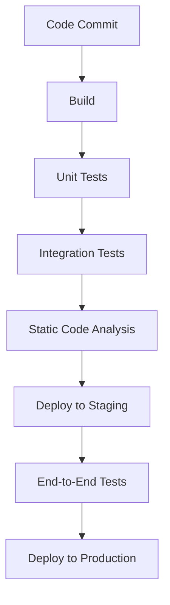

---

linkTitle: "11.4.4 Continuous Integration and Deployment"
title: "Continuous Integration and Deployment: Enhancing Software Delivery with CI/CD Pipelines"
description: "Explore the significance of Continuous Integration and Deployment (CI/CD) in software development, focusing on automation, testing, and design patterns for scalable and reliable deployments."
categories:
- Software Development
- Agile Practices
- DevOps
tags:
- CI/CD
- Continuous Integration
- Continuous Deployment
- Software Testing
- Design Patterns
date: 2024-10-25
type: docs
nav_weight: 11440

---

## 11.4.4 Continuous Integration and Deployment

In the fast-evolving landscape of software development, the need for rapid delivery without compromising quality is paramount. Continuous Integration (CI) and Continuous Deployment (CD) have emerged as critical practices in achieving this balance. They automate the building, testing, and deployment processes, enabling teams to deliver software more efficiently and reliably. This section delves into the importance of CI/CD pipelines, the role of automated testing and quality assurance, and how design patterns support scalable and reliable deployments.

### The Importance of CI/CD Pipelines

Continuous Integration and Continuous Deployment are practices that have revolutionized software development by automating and streamlining the release process. Let's explore how these pipelines function and why they are essential.

#### Automating the Software Development Lifecycle

CI/CD pipelines automate the stages of building, testing, and deploying code. This automation minimizes human error, reduces manual workload, and ensures that software can be released quickly and reliably.

- **Continuous Integration (CI):** Developers frequently integrate code into a shared repository, triggering automated builds and tests. This practice helps identify integration issues early, reducing the time and effort required to fix them.

- **Continuous Deployment (CD):** Once the code passes the CI stage, it is automatically deployed to production environments. This ensures that the latest features and fixes are available to users without delay.

The automation provided by CI/CD pipelines supports rapid delivery while maintaining high standards of quality. By catching issues early and ensuring consistent deployment processes, teams can focus on delivering value to users.

#### Supporting Rapid Delivery with Quality

CI/CD pipelines enable rapid delivery by ensuring that every code change is automatically tested and deployed. This approach aligns with Agile principles, which emphasize iterative development and frequent releases.

- **Faster Time to Market:** Automated pipelines reduce the time between writing code and delivering it to users, allowing teams to respond quickly to market demands and user feedback.

- **Consistent Quality:** Automated testing and deployment ensure that every release meets predefined quality standards, reducing the risk of introducing defects into production.

By integrating CI/CD into their workflow, teams can achieve a balance between speed and quality, delivering reliable software that meets user expectations.

### Testing and Quality Assurance in Automated Environments

Automated testing and quality assurance are integral components of CI/CD pipelines. They ensure that code changes do not introduce defects and that the software remains reliable and performant.

#### Automated Testing

Automated testing is a cornerstone of CI/CD, providing confidence that code changes do not break existing functionality. Various types of tests are used to validate different aspects of the software.

- **Unit Tests:** These tests verify individual components or functions in isolation. They are typically fast and form the foundation of automated testing.

- **Integration Tests:** These tests verify the interactions between components, ensuring that they work together as expected.

- **End-to-End Tests:** These tests simulate real user scenarios, validating the entire application flow from start to finish.

By incorporating these tests into the CI/CD pipeline, teams can quickly identify and fix issues, ensuring that only high-quality code is deployed.

#### Static Code Analysis

Static code analysis tools automatically review code against predefined rules and design principles. They help maintain code quality by identifying potential issues, such as code smells, security vulnerabilities, and violations of design patterns.

- **Code Quality Tools:** Tools like SonarQube and ESLint analyze code for adherence to coding standards and best practices.

- **Design Pattern Adherence:** Static analysis tools can also check for adherence to design patterns, ensuring that the code remains modular and maintainable.

Integrating static code analysis into the CI/CD pipeline ensures that code quality is continuously monitored and maintained, reducing the risk of technical debt.

### How Patterns Support Scalable and Reliable Deployments

Design patterns play a crucial role in supporting scalable and reliable deployments by promoting modularity and decoupling. Let's explore how these patterns facilitate testing and deployment.

#### Modular Design

Design patterns encourage modular design, where software is composed of independent components that can be developed, tested, and deployed separately.

- **Separation of Concerns:** Patterns like the Model-View-Controller (MVC) separate application logic into distinct components, making it easier to test and modify individual parts without affecting others.

- **Reusable Components:** Patterns like Singleton and Factory promote the creation of reusable components, reducing duplication and simplifying maintenance.

By promoting modularity, design patterns make it easier to integrate changes and deploy updates without disrupting the entire system.

#### Decoupling with Dependency Injection

Decoupling is a key principle in software design, allowing components to interact without being tightly bound to each other. Dependency Injection (DI) is a pattern that facilitates decoupling by providing components with their dependencies.

- **Mock Implementations:** DI allows for the use of mock implementations in testing, enabling isolated testing of components without relying on external systems.

- **Flexible Configurations:** DI supports flexible configurations, allowing components to be easily swapped or updated without modifying the entire system.

By enabling decoupling, design patterns like Dependency Injection enhance the testability and flexibility of software, supporting reliable deployments.

### Integrating Testing and Code Analysis Tools into the Pipeline

To fully leverage the benefits of CI/CD, it is essential to integrate testing and code analysis tools into the pipeline. Let's explore how this can be achieved.

#### Setting Up a CI/CD Pipeline

A typical CI/CD pipeline consists of several stages, each responsible for a specific aspect of the software development lifecycle. Here's an example of a CI/CD pipeline:

- **Build Stage:** Compiles the code and prepares it for testing.

- **Test Stages:** Run automated tests to validate the functionality and quality of the code.

- **Analysis Stage:** Uses static code analysis tools to ensure code quality and adherence to design patterns.

- **Deployment Stages:** Deploy the code to staging and production environments.

By automating these stages, teams can ensure consistent and reliable software delivery.

#### Integrating Testing Tools

Integrating testing tools into the CI/CD pipeline involves configuring the pipeline to automatically run tests at each stage.

- **Unit Testing Frameworks:** Use frameworks like JUnit (Java) or PyTest (Python) to automate unit tests.

- **Integration Testing Tools:** Use tools like Postman or Selenium to automate integration and end-to-end tests.

By integrating these tools, teams can ensure that tests are consistently executed, providing immediate feedback on code quality.

#### Integrating Code Analysis Tools

Integrating static code analysis tools involves configuring the pipeline to automatically analyze code at each stage.

- **Code Quality Tools:** Use tools like SonarQube or ESLint to automatically analyze code for quality and adherence to design patterns.

- **Security Analysis Tools:** Use tools like OWASP ZAP or Snyk to automatically analyze code for security vulnerabilities.

By integrating these tools, teams can ensure that code quality and security are continuously monitored and maintained.

### Best Practices for Maintaining Code Quality in Fast-Paced Environments

Maintaining code quality in fast-paced development environments requires a combination of best practices and automated tools. Here are some key practices to consider:

- **Frequent Code Reviews:** Conduct regular code reviews to ensure adherence to coding standards and design patterns.

- **Automated Testing:** Continuously integrate automated tests into the CI/CD pipeline to catch issues early.

- **Static Code Analysis:** Use static code analysis tools to automatically enforce coding standards and identify potential issues.

- **Continuous Monitoring:** Use monitoring tools to track the performance and reliability of deployed software.

By following these best practices, teams can maintain high standards of code quality, even in fast-paced environments.

### Conclusion

Continuous Integration and Deployment are essential practices for modern software development, enabling rapid delivery and consistent quality. By automating the building, testing, and deployment processes, CI/CD pipelines support Agile principles and enhance the reliability of software releases. Design patterns play a crucial role in this process, promoting modularity and decoupling, which facilitate testing and deployment. By integrating testing and code analysis tools into the pipeline and following best practices, teams can maintain code quality and deliver reliable software that meets user expectations.

## Quiz Time!



### What is the primary purpose of Continuous Integration (CI)?

- [x] To frequently integrate code into a shared repository and automate builds and tests
- [ ] To deploy code to production environments
- [ ] To manually test code changes
- [ ] To write documentation for code

> **Explanation:** Continuous Integration (CI) involves frequently integrating code into a shared repository and automating builds and tests to identify integration issues early.

### Which of the following is NOT a type of automated test commonly used in CI/CD pipelines?

- [ ] Unit Tests
- [ ] Integration Tests
- [ ] End-to-End Tests
- [x] Manual Tests

> **Explanation:** Manual tests are not automated and therefore not typically part of CI/CD pipelines. Unit, integration, and end-to-end tests are automated.

### What role do static code analysis tools play in CI/CD pipelines?

- [x] They automatically review code against predefined rules and design principles.
- [ ] They execute manual tests.
- [ ] They deploy code to production.
- [ ] They compile code.

> **Explanation:** Static code analysis tools automatically review code against predefined rules and design principles to maintain code quality.

### How do design patterns support modular design?

- [x] By promoting separation of concerns and creating reusable components
- [ ] By increasing code duplication
- [ ] By tightly coupling components
- [ ] By eliminating all testing

> **Explanation:** Design patterns support modular design by promoting separation of concerns and creating reusable components, which simplifies testing and maintenance.

### What is the benefit of using Dependency Injection in software design?

- [x] It facilitates decoupling and allows for the use of mock implementations in testing.
- [ ] It increases the complexity of code.
- [ ] It reduces the flexibility of configurations.
- [ ] It eliminates the need for testing.

> **Explanation:** Dependency Injection facilitates decoupling and allows for the use of mock implementations in testing, enhancing testability and flexibility.

### Which stage in a CI/CD pipeline is responsible for compiling code and preparing it for testing?

- [x] Build Stage
- [ ] Test Stage
- [ ] Analysis Stage
- [ ] Deployment Stage

> **Explanation:** The Build Stage is responsible for compiling code and preparing it for testing in a CI/CD pipeline.

### Why is automated testing important in CI/CD pipelines?

- [x] It provides confidence that code changes do not break existing functionality.
- [ ] It eliminates the need for code reviews.
- [ ] It slows down the development process.
- [ ] It replaces all manual testing.

> **Explanation:** Automated testing provides confidence that code changes do not break existing functionality, ensuring high-quality software delivery.

### Which tool is commonly used for static code analysis in JavaScript projects?

- [x] ESLint
- [ ] JUnit
- [ ] PyTest
- [ ] Selenium

> **Explanation:** ESLint is commonly used for static code analysis in JavaScript projects to enforce coding standards and identify potential issues.

### What is a key benefit of integrating static code analysis tools into CI/CD pipelines?

- [x] Continuous monitoring and maintenance of code quality and security
- [ ] Increased manual testing
- [ ] Slower deployment times
- [ ] Elimination of all testing

> **Explanation:** Integrating static code analysis tools into CI/CD pipelines ensures continuous monitoring and maintenance of code quality and security.

### True or False: CI/CD pipelines eliminate the need for manual testing.

- [ ] True
- [x] False

> **Explanation:** While CI/CD pipelines automate many testing processes, they do not eliminate the need for manual testing, which is still important for exploratory and usability testing.


