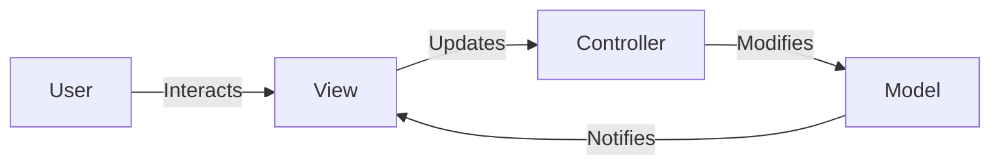
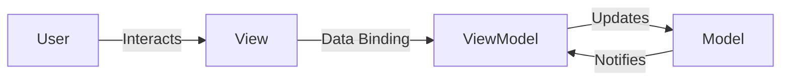

## 12.1.1 MVC and MVVM Frameworks

In the ever-evolving world of web development, understanding design patterns is crucial for building scalable, maintainable, and testable applications. Two of the most prominent patterns in this domain are the Model-View-Controller (MVC) and Model-View-ViewModel (MVVM) frameworks. This section delves deep into these patterns, exploring their components, usage in popular frameworks, and practical applications in structuring web applications.

### Understanding the Model-View-Controller (MVC) Pattern

#### Definition and Components

The **Model-View-Controller (MVC)** is a design pattern that divides an application into three interconnected components: Model, View, and Controller. This separation of concerns facilitates modular development, making it easier to manage complex applications.

- **Model:**
  - The Model represents the data structure and business logic of the application. It manages the data and rules, ensuring that the application's state is consistent and valid.
  - The Model is responsible for retrieving data from databases, processing it, and notifying the View of any changes.

- **View:**
  - The View represents the user interface components that display data to the user. It handles the presentation layer, rendering the Model's data in a format suitable for user interaction.
  - The View listens for updates from the Model and refreshes the display accordingly.

- **Controller:**
  - The Controller acts as an intermediary between the Model and the View. It processes user input, manipulates data in the Model, and updates the View.
  - The Controller interprets user actions, such as button clicks or form submissions, and triggers appropriate responses in the Model and View.

##### Diagram: MVC Architecture



#### Usage in Web Frameworks

One of the most popular implementations of the MVC pattern in web development is through the **Django** framework in Python. Although Django refers to its architecture as MTV (Model-Template-View), it closely resembles the MVC structure.

- **Routing Requests:**
  - In Django, the Controller role is fulfilled by views.py, which handles incoming HTTP requests. The URL dispatcher routes requests to the appropriate view function.
  - The Model is defined in models.py, where data structures and database interactions are specified.
  - Templates serve as the View, rendering HTML pages with data from the Model.

##### Example: Django MVC (MTV) Flow

```python
from django.db import models

class BlogPost(models.Model):
    title = models.CharField(max_length=100)
    content = models.TextField()
    created_at = models.DateTimeField(auto_now_add=True)

from django.shortcuts import render
from .models import BlogPost

def index(request):
    posts = BlogPost.objects.all()
    return render(request, 'index.html', {'posts': posts})

from django.urls import path
from . import views

urlpatterns = [
    path('', views.index, name='index'),
]


  <h2>{{ post.title }}</h2>
  <p>{{ post.content }}</p>
  <small>{{ post.created_at }}</small>

```

#### Benefits of MVC in Web Applications

- **Separation of Concerns:** By dividing the application into distinct components, MVC promotes organized code and easier maintenance.
- **Improved Testability:** Each component can be tested independently, enhancing the reliability of the application.
- **Scalability:** MVC facilitates the addition of new features and functionalities without disrupting existing code.

### Understanding the Model-View-ViewModel (MVVM) Pattern

#### Definition and Differences from MVC

The **Model-View-ViewModel (MVVM)** pattern is a variation of MVC that introduces an additional layer: the ViewModel. This pattern is particularly popular in modern JavaScript frameworks, providing a more dynamic and interactive user experience.

- **ViewModel:**
  - The ViewModel serves as an abstraction of the View, managing the data and behavior of UI components.
  - It facilitates data binding between the View and the Model, allowing for automatic synchronization of data.

##### Diagram: MVVM Architecture



#### Usage in Modern JavaScript Frameworks

Frameworks like **Angular** and **React** (with Redux) implement the MVVM pattern, offering powerful tools for building reactive and dynamic user interfaces.

- **Angular:**
  - Angular employs two-way data binding, allowing changes in the View to automatically reflect in the ViewModel and vice versa.
  - The Angular framework uses components as the building blocks, where each component acts as a ViewModel.

##### Example: Angular Component

```typescript
// app.component.ts
import { Component } from '@angular/core';

@Component({
  selector: 'app-root',
  templateUrl: './app.component.html',
  styleUrls: ['./app.component.css']
})
export class AppComponent {
  title = 'Hello World';

  updateTitle(newTitle: string) {
    this.title = newTitle;
  }
}

// app.component.html
<h1>{{ title }}</h1>
<input [(ngModel)]="title" placeholder="Enter new title">
```

- **React with Redux:**
  - React uses a unidirectional data flow, where the ViewModel is represented by the Redux store.
  - Components in React are connected to the Redux store, allowing them to receive updates and dispatch actions.

##### Example: React with Redux

```javascript
// actions.js
export const updateTitle = (title) => ({
  type: 'UPDATE_TITLE',
  payload: title,
});

// reducer.js
const initialState = { title: 'Hello World' };

const titleReducer = (state = initialState, action) => {
  switch (action.type) {
    case 'UPDATE_TITLE':
      return { ...state, title: action.payload };
    default:
      return state;
  }
};

// App.js
import React from 'react';
import { useSelector, useDispatch } from 'react-redux';
import { updateTitle } from './actions';

function App() {
  const title = useSelector(state => state.title);
  const dispatch = useDispatch();

  const handleChange = (e) => {
    dispatch(updateTitle(e.target.value));
  };

  return (
    <div>
      <h1>{title}</h1>
      <input value={title} onChange={handleChange} placeholder="Enter new title" />
    </div>
  );
}

export default App;
```

#### Benefits of MVVM in Web Applications

- **Reactive UIs:** MVVM promotes two-way data binding, enabling dynamic and responsive user interfaces.
- **Separation of Logic:** The ViewModel separates UI logic from business logic, enhancing maintainability.
- **Scalability and Reusability:** Components and ViewModels can be reused across different parts of the application, promoting scalability.

### Structuring Web Applications with MVC and MVVM

#### Code Examples and Folder Structures

Understanding how to structure an application using MVC or MVVM is crucial for effective development. Below are examples of how these patterns are organized in popular frameworks.

- **Django (MVC):**

```
myproject/
├── myapp/
│   ├── migrations/
│   ├── __init__.py
│   ├── admin.py
│   ├── apps.py
│   ├── models.py
│   ├── tests.py
│   ├── views.py
│   └── templates/
│       └── index.html
├── myproject/
│   ├── __init__.py
│   ├── settings.py
│   ├── urls.py
│   └── wsgi.py
└── manage.py
```

- **Angular (MVVM):**

```
my-angular-app/
├── src/
│   ├── app/
│   │   ├── app.component.ts
│   │   ├── app.component.html
│   │   ├── app.component.css
│   │   └── app.module.ts
│   ├── assets/
│   ├── environments/
│   ├── index.html
│   ├── main.ts
│   └── styles.css
└── angular.json
```

#### Practical Application: Sample Project

To illustrate the practical application of these patterns, consider a simple blog application:

- **Using MVC (Django):**
  - The Model represents blog posts and comments.
  - The View handles the display of posts and allows users to submit comments.
  - The Controller processes user inputs, such as creating new posts or comments.

- **Using MVVM (Angular):**
  - The Model manages the data of blog posts and comments.
  - The ViewModel (components) binds data to the View, allowing users to interact with posts and comments.
  - The View dynamically updates as users add or modify content.

### Comparing MVC and MVVM

#### When to Use Each Pattern

- **MVC:**
  - Ideal for traditional web applications with clearly defined data flows.
  - Best suited for server-side rendering frameworks like Django or Ruby on Rails.

- **MVVM:**
  - Suitable for applications requiring dynamic and interactive user interfaces.
  - Preferred for client-side frameworks like Angular, React, or Vue.js.

#### Benefits in Terms of Maintainability, Scalability, and Testability

- **Maintainability:** Both patterns promote clean separation of concerns, making code easier to manage and update.
- **Scalability:** Modular components and layers allow for easy expansion and feature addition.
- **Testability:** Isolated components and layers facilitate unit testing and debugging.

### Encouragement for Exploration

As you explore these patterns, consider how they can be applied to your projects. Experiment with both MVC and MVVM to understand their strengths and limitations. By mastering these design patterns, you'll be better equipped to build robust and efficient web applications.

## Quiz Time!



### What are the three main components of the MVC pattern?

- [x] Model, View, Controller
- [ ] Module, View, Component
- [ ] Model, View, Connector
- [ ] Manager, Viewer, Controller

> **Explanation:** MVC stands for Model, View, Controller, which are the three main components of this design pattern.

### In the MVC pattern, which component is responsible for handling user input and updating the model?

- [ ] Model
- [ ] View
- [x] Controller
- [ ] Connector

> **Explanation:** The Controller processes user input, manipulates the Model, and updates the View.

### Which of the following frameworks is known for implementing the MVC pattern?

- [x] Django
- [ ] Angular
- [ ] React
- [ ] Vue.js

> **Explanation:** Django is a Python framework that implements the MVC pattern (referred to as MTV in Django).

### What does the ViewModel component in MVVM manage?

- [ ] Database interactions
- [x] UI data and behavior
- [ ] User input handling
- [ ] Network requests

> **Explanation:** The ViewModel manages the data and behavior of UI components, facilitating data binding between the View and Model.

### Which JavaScript framework is commonly associated with the MVVM pattern?

- [ ] Django
- [ ] Ruby on Rails
- [x] Angular
- [ ] Flask

> **Explanation:** Angular is a JavaScript framework that implements the MVVM pattern, promoting two-way data binding.

### How does the MVVM pattern promote reactive user interfaces?

- [ ] By using server-side rendering
- [x] Through two-way data binding
- [ ] By separating business logic
- [ ] By using static data

> **Explanation:** MVVM promotes reactive UIs through two-way data binding, allowing automatic updates between the View and Model.

### In React, which library is often used to manage the ViewModel-like state?

- [ ] Angular
- [x] Redux
- [ ] Vuex
- [ ] Flask

> **Explanation:** Redux is often used in React applications to manage state, acting as a ViewModel-like layer.

### What is the primary benefit of separating concerns in MVC and MVVM patterns?

- [ ] Faster execution
- [x] Easier maintenance
- [ ] Reduced server load
- [ ] Increased complexity

> **Explanation:** Separating concerns makes the application easier to maintain and update, as each component handles a specific responsibility.

### Which pattern is more suitable for applications requiring dynamic user interfaces?

- [ ] MVC
- [x] MVVM
- [ ] MVT
- [ ] MVP

> **Explanation:** MVVM is more suitable for dynamic and interactive user interfaces due to its support for two-way data binding.

### True or False: In the MVVM pattern, the ViewModel directly updates the View.

- [x] True
- [ ] False

> **Explanation:** In MVVM, the ViewModel facilitates data binding, allowing direct updates to the View based on changes in the Model.


