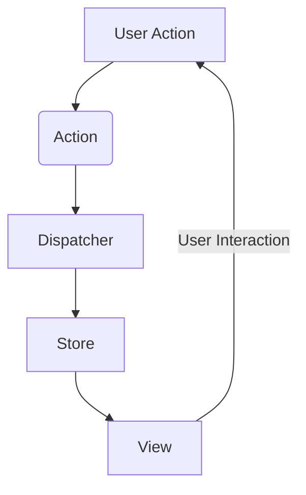
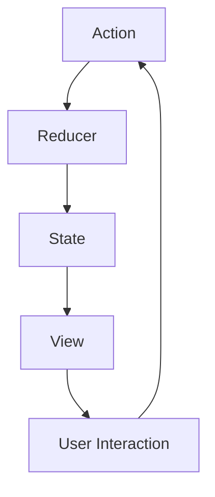

## 12.1.2 Single Page Applications and State Management

In the evolving landscape of web development, Single Page Applications (SPAs) have become a cornerstone for creating dynamic and responsive user experiences. This section delves into the challenges posed by SPAs and explores effective state management patterns that address these complexities.

### Understanding Single Page Applications (SPAs)

**Definition of SPAs:**

Single Page Applications (SPAs) are web applications that load a single HTML page and dynamically update the content as the user interacts with the app. Unlike traditional multi-page applications, SPAs do not reload the entire page for each interaction. Instead, they use JavaScript to modify the content within the page, providing a seamless and responsive user experience.

**Complexity in SPAs:**

While SPAs offer significant benefits in terms of user experience, they also introduce several challenges:

- **State Management:** Managing the state of an application becomes complex as the application grows. SPAs often require maintaining the state across different components and ensuring consistency.
- **Asynchronous Data Flows:** Handling asynchronous operations, such as fetching data from APIs, can lead to intricate data flows that are difficult to manage.
- **Performance:** Ensuring that the application remains performant, especially as the complexity increases, is crucial. SPAs must efficiently manage resources and minimize unnecessary re-renders.

**User Experience Considerations:**

The primary goal of SPAs is to enhance user experience by providing smooth navigation and real-time updates. Key considerations include:

- **Fast Load Times:** SPAs should load quickly and provide immediate feedback to user interactions.
- **Smooth Transitions:** Navigating between different views should be seamless, without noticeable delays or flickers.
- **Real-Time Updates:** SPAs often require real-time data updates, such as notifications or live feeds, which need to be handled efficiently.

### Patterns for State Management in SPAs

To address the challenges of state management in SPAs, several architectural patterns have emerged. We will explore some of the most popular ones: Flux, Redux, and MobX.

#### Flux Architecture

**Unidirectional Data Flow:**

Flux is an architectural pattern introduced by Facebook to manage data flow in SPAs. It emphasizes a unidirectional data flow, which simplifies the reasoning about state changes and data propagation.

**Core Concepts:**

- **Actions:** These are payloads of information that send data from the application to the dispatcher. Actions are typically triggered by user interactions or server responses.
- **Dispatcher:** This is a central hub that manages all the actions and dispatches them to the appropriate stores. It ensures that every store receives the action payload.
- **Stores:** Stores contain the application state and logic. They register with the dispatcher and update themselves based on the actions they receive.
- **Views:** Views are the components that render the user interface. They listen to changes in the stores and update themselves accordingly.

**Facebook's Flux Implementation:**

Facebook's implementation of Flux has influenced many libraries and frameworks. The unidirectional data flow ensures that data changes are predictable and easier to debug.



#### Redux: A Predictable State Container

**Introduction to Redux:**

Redux is a popular state management library inspired by Flux. It provides a predictable state container for JavaScript applications, making it easier to manage the state of complex applications.

**Core Concepts:**

- **Store:** The single source of truth that holds the entire state of the application.
- **Actions:** Plain JavaScript objects that describe what happened. They are the only way to send data to the store.
- **Reducers:** Pure functions that specify how the application's state changes in response to actions. They take the current state and an action as arguments and return a new state.
- **Immutability:** Redux enforces immutability, meaning the state is never directly modified. Instead, a new state object is returned after every change.

**Benefits of Redux:**

- **Predictability:** With a single source of truth, the state is predictable and easy to debug.
- **Ease of Debugging:** Redux tools allow developers to track changes in the state and actions, making it easier to identify issues.
- **Testing:** The use of pure functions (reducers) makes testing the application logic straightforward.



**Example: Integrating Redux with React**

Let's explore how Redux can be integrated into a React application through a simple to-do list example.

1. **Setting Up Redux:**

   First, install Redux and React-Redux:

   ```bash
   npm install redux react-redux
   ```

2. **Create Actions:**

   Define actions to add and toggle to-dos.

   ```javascript
   // actions.js
   export const ADD_TODO = 'ADD_TODO';
   export const TOGGLE_TODO = 'TOGGLE_TODO';

   export const addTodo = (text) => ({
     type: ADD_TODO,
     payload: { text }
   });

   export const toggleTodo = (index) => ({
     type: TOGGLE_TODO,
     payload: { index }
   });
   ```

3. **Create Reducers:**

   Implement reducers to handle actions and update the state.

   ```javascript
   // reducers.js
   import { ADD_TODO, TOGGLE_TODO } from './actions';

   const initialState = {
     todos: []
   };

   const todoReducer = (state = initialState, action) => {
     switch (action.type) {
       case ADD_TODO:
         return {
           ...state,
           todos: [...state.todos, { text: action.payload.text, completed: false }]
         };
       case TOGGLE_TODO:
         return {
           ...state,
           todos: state.todos.map((todo, index) =>
             index === action.payload.index ? { ...todo, completed: !todo.completed } : todo
           )
         };
       default:
         return state;
     }
   };

   export default todoReducer;
   ```

4. **Create the Store:**

   Set up the Redux store using the reducer.

   ```javascript
   // store.js
   import { createStore } from 'redux';
   import todoReducer from './reducers';

   const store = createStore(todoReducer);

   export default store;
   ```

5. **Connect React Components:**

   Use the `Provider` component to make the store available to the React application.

   ```javascript
   // App.js
   import React from 'react';
   import { Provider } from 'react-redux';
   import store from './store';
   import TodoApp from './TodoApp';

   const App = () => (
     <Provider store={store}>
       <TodoApp />
     </Provider>
   );

   export default App;
   ```

6. **Use Redux Hooks:**

   Utilize `useSelector` and `useDispatch` hooks to interact with the Redux store.

   ```javascript
   // TodoApp.js
   import React from 'react';
   import { useSelector, useDispatch } from 'react-redux';
   import { addTodo, toggleTodo } from './actions';

   const TodoApp = () => {
     const todos = useSelector(state => state.todos);
     const dispatch = useDispatch();

     const handleAddTodo = (text) => {
       dispatch(addTodo(text));
     };

     const handleToggleTodo = (index) => {
       dispatch(toggleTodo(index));
     };

     return (
       <div>
         <h1>Todo List</h1>
         <ul>
           {todos.map((todo, index) => (
             <li key={index} onClick={() => handleToggleTodo(index)} style={{ textDecoration: todo.completed ? 'line-through' : 'none' }}>
               {todo.text}
             </li>
           ))}
         </ul>
         <button onClick={() => handleAddTodo('New Todo')}>Add Todo</button>
       </div>
     );
   };

   export default TodoApp;
   ```

#### Vuex with Vue.js

**Introduction to Vuex:**

Vuex is a state management pattern and library for Vue.js applications. It serves as a centralized store for all the components in an application, ensuring that the state is predictable and easy to manage.

**Core Concepts:**

- **State:** The single source of truth that contains the application's state.
- **Getters:** Functions that compute derived state based on the store's state.
- **Mutations:** Synchronous functions that directly modify the state.
- **Actions:** Functions that can contain asynchronous operations and commit mutations.

**Example: State Management with Vuex**

Let's create a simple counter application using Vuex.

1. **Install Vuex:**

   ```bash
   npm install vuex
   ```

2. **Create the Store:**

   Define the state, getters, mutations, and actions.

   ```javascript
   // store.js
   import Vue from 'vue';
   import Vuex from 'vuex';

   Vue.use(Vuex);

   export default new Vuex.Store({
     state: {
       count: 0
     },
     getters: {
       doubleCount: state => state.count * 2
     },
     mutations: {
       increment(state) {
         state.count++;
       },
       decrement(state) {
         state.count--;
       }
     },
     actions: {
       asyncIncrement({ commit }) {
         setTimeout(() => {
           commit('increment');
         }, 1000);
       }
     }
   });
   ```

3. **Integrate with Vue:**

   Use the store in a Vue component.

   ```html
   <!-- Counter.vue -->
   <template>
     <div>
       <p>Count: {{ count }}</p>
       <p>Double Count: {{ doubleCount }}</p>
       <button @click="increment">Increment</button>
       <button @click="decrement">Decrement</button>
       <button @click="asyncIncrement">Async Increment</button>
     </div>
   </template>

   <script>
   import { mapState, mapGetters, mapMutations, mapActions } from 'vuex';

   export default {
     computed: {
       ...mapState(['count']),
       ...mapGetters(['doubleCount'])
     },
     methods: {
       ...mapMutations(['increment', 'decrement']),
       ...mapActions(['asyncIncrement'])
     }
   };
   </script>
   ```

4. **Use the Store in the App:**

   ```javascript
   // main.js
   import Vue from 'vue';
   import App from './App.vue';
   import store from './store';

   new Vue({
     store,
     render: h => h(App)
   }).$mount('#app');
   ```

#### MobX: Simplicity in State Management

**Introduction to MobX:**

MobX is a state management library that emphasizes simplicity and minimal boilerplate. It uses reactive programming to automatically track state changes and update the UI.

**Core Concepts:**

- **Observables:** State that MobX tracks for changes.
- **Actions:** Functions that modify the state.
- **Reactions:** Functions that automatically run when observables change.
- **Computed Values:** Derived state that automatically updates when dependencies change.

**Example: State Management with MobX**

Let's create a simple counter application using MobX.

1. **Install MobX:**

   ```bash
   npm install mobx mobx-react
   ```

2. **Define the Store:**

   Create a MobX store with observables and actions.

   ```javascript
   // counterStore.js
   import { makeAutoObservable } from 'mobx';

   class CounterStore {
     count = 0;

     constructor() {
       makeAutoObservable(this);
     }

     increment() {
       this.count++;
     }

     decrement() {
       this.count--;
     }
   }

   const counterStore = new CounterStore();
   export default counterStore;
   ```

3. **Use MobX in a React Component:**

   Use the `observer` higher-order component to make React components reactive.

   ```javascript
   // Counter.js
   import React from 'react';
   import { observer } from 'mobx-react';
   import counterStore from './counterStore';

   const Counter = observer(() => {
     return (
       <div>
         <p>Count: {counterStore.count}</p>
         <button onClick={() => counterStore.increment()}>Increment</button>
         <button onClick={() => counterStore.decrement()}>Decrement</button>
       </div>
     );
   });

   export default Counter;
   ```

4. **Integrate with React:**

   Render the MobX-powered component in your application.

   ```javascript
   // App.js
   import React from 'react';
   import Counter from './Counter';

   const App = () => (
     <div>
       <h1>MobX Counter</h1>
       <Counter />
     </div>
   );

   export default App;
   ```

### Best Practices in Managing State in SPAs

Managing state in SPAs requires careful consideration to ensure performance, maintainability, and scalability. Here are some best practices:

- **Keep State Minimal:** Only store the necessary state in your global store. Local component state can be used for UI-specific data.
- **Normalize State Shape:** Use normalized data structures to avoid redundancy and simplify updates.
- **Use Middleware:** Leverage middleware for handling side effects, such as asynchronous operations or logging.
- **Optimize Performance:** Use techniques like memoization and lazy loading to optimize performance.
- **Test State Logic:** Write tests for reducers, actions, and state logic to ensure reliability.

### Common Pitfalls and How to Avoid Them

State management in SPAs can be prone to certain pitfalls. Here are some common ones and how to avoid them:

- **Overcomplicating State Management:** Use the simplest solution that meets your needs. Avoid over-engineering your state management setup.
- **Ignoring Performance Impacts:** Be mindful of performance impacts, especially with large state trees or frequent updates.
- **Lack of Consistency:** Establish consistent patterns for managing state across your application to avoid confusion and errors.
- **Neglecting Documentation:** Document your state management logic and patterns to facilitate collaboration and maintenance.

### Encouragement to Implement State Management

State management is a crucial aspect of building scalable and maintainable SPAs. By understanding and implementing these patterns, developers can create robust applications that provide excellent user experiences. Experiment with these patterns in your projects to gain a deeper understanding and mastery of state management.

## Quiz Time!



### What is a Single Page Application (SPA)?

- [x] An application that loads a single HTML page and dynamically updates content.
- [ ] An application that requires multiple HTML pages for different views.
- [ ] An application that does not use JavaScript for dynamic content.
- [ ] An application that only works offline.

> **Explanation:** SPAs load a single HTML page and dynamically update the content as the user interacts with the app.

### What is a key challenge in SPAs?

- [x] Managing application state.
- [ ] Creating multiple pages for different views.
- [ ] Avoiding the use of JavaScript.
- [ ] Ensuring the application works offline.

> **Explanation:** Managing application state is a significant challenge in SPAs due to the complexity of maintaining consistency across different components.

### What is the core principle of Flux architecture?

- [x] Unidirectional data flow.
- [ ] Bidirectional data flow.
- [ ] No data flow.
- [ ] Random data flow.

> **Explanation:** Flux architecture is based on the principle of unidirectional data flow, which simplifies reasoning about state changes.

### In Redux, what is a reducer?

- [x] A pure function that specifies how the application's state changes.
- [ ] A component that renders the UI.
- [ ] A function that fetches data from an API.
- [ ] A utility for styling components.

> **Explanation:** A reducer is a pure function that specifies how the application's state changes in response to actions.

### What is the main benefit of using Redux?

- [x] Predictability and ease of debugging.
- [ ] Complex data flow management.
- [ ] Reduced application size.
- [ ] Increased network requests.

> **Explanation:** Redux provides a predictable state container, making it easier to debug and manage the application's state.

### What does Vuex use to modify the state?

- [x] Mutations.
- [ ] Actions.
- [ ] Getters.
- [ ] Components.

> **Explanation:** Vuex uses mutations to directly modify the state.

### What is a key feature of MobX?

- [x] Simplicity and minimal boilerplate.
- [ ] Complex configuration.
- [ ] Multiple sources of truth.
- [ ] Lack of reactivity.

> **Explanation:** MobX emphasizes simplicity and minimal boilerplate, making it easy to manage state with reactive programming.

### How does MobX track state changes?

- [x] Using observables.
- [ ] Using reducers.
- [ ] Using actions.
- [ ] Using components.

> **Explanation:** MobX uses observables to track state changes and automatically update the UI.

### What is a common pitfall in state management?

- [x] Overcomplicating the setup.
- [ ] Using too few components.
- [ ] Avoiding JavaScript.
- [ ] Ignoring CSS.

> **Explanation:** Overcomplicating state management setup can lead to unnecessary complexity and maintenance challenges.

### True or False: In Redux, the state is directly modified.

- [ ] True
- [x] False

> **Explanation:** In Redux, the state is never directly modified. Instead, a new state object is returned after every change to ensure immutability.



By understanding the intricacies of state management in SPAs and implementing these patterns, you can build robust and responsive applications that provide an excellent user experience.
