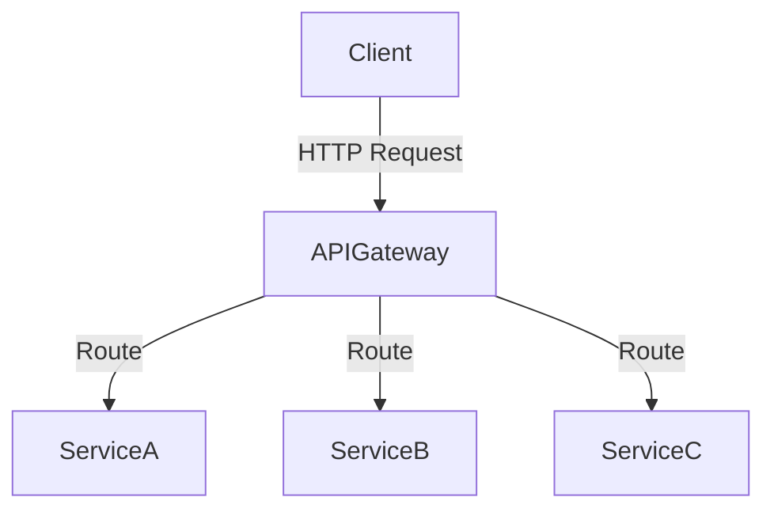
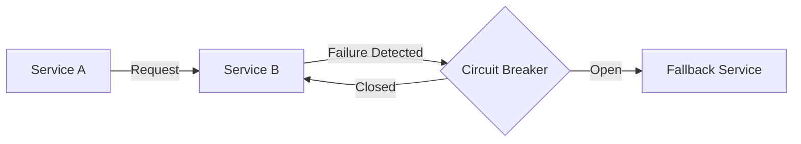
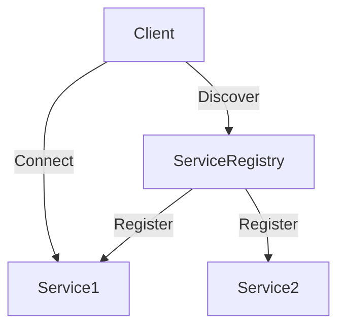

## 12.1.3 RESTful APIs and Microservices

In the rapidly evolving landscape of software development, the demand for scalable, maintainable, and efficient systems is higher than ever. RESTful APIs and microservices architecture have emerged as pivotal solutions to meet these demands. This section delves into the principles and practices of designing scalable APIs and explores the microservices architecture that empowers modern applications to achieve unprecedented levels of flexibility and resilience.

### Designing Scalable APIs with REST Principles

#### What is REST?

**REST (Representational State Transfer)** is an architectural style that provides a set of guidelines for designing networked applications. It was introduced by Roy Fielding in his doctoral dissertation in 2000 and has since become the backbone of the modern web. RESTful systems are characterized by their statelessness and reliance on standard HTTP methods, making them simple to implement and scale.

#### Key REST Constraints

1. **Client-Server Architecture**: This principle separates the user interface concerns from the data storage concerns, allowing for independent evolution of both components. The client is responsible for the user interface and user experience, while the server manages data and business logic.

2. **Statelessness**: Each request from a client to a server must contain all the information needed to understand and process the request. The server does not store any session information about the client, which simplifies scaling and improves reliability.

3. **Cacheability**: Responses must define themselves as cacheable or non-cacheable, improving performance by reducing the need to generate the same response repeatedly.

4. **Layered System**: A client cannot ordinarily tell whether it is connected directly to the end server or to an intermediary along the way. This promotes scalability and encapsulation.

5. **Uniform Interface**: REST relies on a uniform interface between components, simplifying the architecture and enabling each part to evolve independently. This includes resource identification, resource manipulation through representations, self-descriptive messages, and hypermedia as the engine of application state (HATEOAS).

#### Best Practices for RESTful API Design

- **HTTP Methods**: Use the appropriate HTTP methods for the action being performed:
  - **GET**: Retrieve a resource.
  - **POST**: Create a new resource.
  - **PUT**: Update an existing resource.
  - **DELETE**: Remove a resource.

- **Resource Naming Conventions**: Use nouns for resource names and avoid verbs. For example, use `/users` instead of `/getUsers`.

- **Versioning**: Implement versioning in your APIs to manage changes over time without breaking existing clients. This can be done via the URL (e.g., `/v1/users`) or headers.

- **Status Codes and Error Handling**: Use standard HTTP status codes to indicate the outcome of a request. Provide meaningful error messages and use error objects to convey additional information.

#### Example: Building a RESTful API with Flask (Python)

```python
from flask import Flask, jsonify, request

app = Flask(__name__)

users = [
    {"id": 1, "name": "Alice"},
    {"id": 2, "name": "Bob"}
]

@app.route('/users', methods=['GET'])
def get_users():
    return jsonify(users)

@app.route('/users/<int:user_id>', methods=['GET'])
def get_user(user_id):
    user = next((u for u in users if u['id'] == user_id), None)
    return jsonify(user) if user else ('', 404)

@app.route('/users', methods=['POST'])
def create_user():
    new_user = request.json
    users.append(new_user)
    return jsonify(new_user), 201

@app.route('/users/<int:user_id>', methods=['PUT'])
def update_user(user_id):
    user = next((u for u in users if u['id'] == user_id), None)
    if user:
        user.update(request.json)
        return jsonify(user)
    return ('', 404)

@app.route('/users/<int:user_id>', methods=['DELETE'])
def delete_user(user_id):
    global users
    users = [u for u in users if u['id'] != user_id]
    return ('', 204)

if __name__ == '__main__':
    app.run(debug=True)
```

### Microservices Architecture and Related Patterns

#### What are Microservices?

Microservices architecture is an approach to software development where an application is structured as a collection of loosely coupled services. Each service is self-contained and focuses on a specific business capability, enabling independent deployment and scaling.

#### Benefits of Microservices

- **Scalability**: Services can be scaled independently based on demand, optimizing resource usage.
- **Flexibility**: Teams can develop, deploy, and scale services independently, promoting agility.
- **Ease of Deployment**: Continuous deployment practices are easier to implement, reducing time to market.

#### Design Patterns in Microservices

1. **API Gateway Pattern**

An API Gateway acts as a single entry point for client requests. It routes requests to the appropriate microservice, handles authentication, and can provide additional services such as load balancing and caching.



2. **Circuit Breaker Pattern**

The Circuit Breaker pattern helps prevent cascading failures in distributed systems. It monitors for failures and, upon detecting a threshold of failures, stops further requests to the failing service, allowing time for recovery.



3. **Service Discovery**

Service Discovery is crucial for dynamic environments where services can be added or removed. It involves a service registry that maintains a list of available services and their locations, enabling clients to discover services dynamically.



### Inter-Service Communication

#### Synchronous vs. Asynchronous Communication

- **Synchronous Communication**: Typically involves RESTful APIs or gRPC, where a request-response model is used. It is suitable for real-time operations but can be less resilient to failures.

- **Asynchronous Communication**: Utilizes message queues or event streams, allowing services to communicate without waiting for a response. This approach enhances fault tolerance and decouples services.

#### Data Consistency in Microservices

- **Eventual Consistency**: In distributed systems, achieving immediate consistency across services is challenging. Eventual consistency allows systems to reach a consistent state over time, which is acceptable for many applications.

- **Saga Pattern**: A pattern for managing distributed transactions by breaking them into a series of smaller, independent transactions. Each step is compensated by another step in case of failure.

#### Security Considerations

- **Authentication and Authorization**: Implement robust security mechanisms such as OAuth 2.0 for authorization and JWT (JSON Web Tokens) for securely transmitting information between parties.

### Case Studies: Real-World Implementations

#### Netflix

Netflix is a prime example of successful microservices implementation. By transitioning from a monolithic architecture to microservices, Netflix improved its scalability and reduced downtime. The company employs patterns like the API Gateway and Circuit Breaker to manage its vast array of services efficiently.

#### Amazon

Amazon's transition to microservices has enabled it to scale its operations seamlessly. The use of service discovery and asynchronous communication has been pivotal in managing its global infrastructure.

### Trade-offs: Monolithic vs. Microservices Architectures

While microservices offer numerous benefits, they also introduce complexity. It's essential to weigh the trade-offs:

- **Monolithic Architecture**: Easier to develop and deploy initially but can become a bottleneck as applications grow.
- **Microservices Architecture**: Offers scalability and flexibility but requires careful management of inter-service communication and data consistency.

### Conclusion

RESTful APIs and microservices architecture have revolutionized how modern software systems are designed and deployed. By adhering to REST principles and leveraging microservices patterns, developers can build scalable, resilient, and flexible applications. As you embark on your journey to implement these architectures, consider the trade-offs and best practices discussed in this section to ensure your systems are robust and future-proof.

## Quiz Time!



### What is a key characteristic of RESTful systems?

- [x] Statelessness
- [ ] Stateful sessions
- [ ] Centralized data storage
- [ ] Client-side caching

> **Explanation:** RESTful systems are stateless, meaning each request must contain all the information needed for processing, without relying on stored session data.

### Which HTTP method is used to update an existing resource?

- [ ] GET
- [ ] POST
- [x] PUT
- [ ] DELETE

> **Explanation:** The PUT method is used to update an existing resource in RESTful APIs.

### What is the primary role of an API Gateway in microservices architecture?

- [ ] Store data
- [ ] Authenticate users
- [x] Act as a single entry point for client requests
- [ ] Monitor network traffic

> **Explanation:** An API Gateway acts as a single entry point for client requests, routing them to the appropriate microservices.

### Which pattern helps prevent cascading failures in distributed systems?

- [ ] API Gateway
- [x] Circuit Breaker
- [ ] Singleton
- [ ] Observer

> **Explanation:** The Circuit Breaker pattern helps prevent cascading failures by stopping requests to a failing service until it recovers.

### What is a benefit of microservices architecture?

- [x] Improved scalability
- [ ] Increased complexity
- [x] Flexibility
- [ ] Single point of failure

> **Explanation:** Microservices architecture improves scalability and flexibility by allowing independent deployment and scaling of services.

### Which communication method is typically used for real-time operations?

- [ ] Asynchronous
- [x] Synchronous
- [ ] Batch processing
- [ ] Event-driven

> **Explanation:** Synchronous communication, such as RESTful APIs, is typically used for real-time operations requiring immediate responses.

### What is eventual consistency?

- [x] A consistency model where the system eventually reaches a consistent state
- [ ] Immediate consistency across all services
- [x] A model used in distributed systems
- [ ] A method for synchronizing databases

> **Explanation:** Eventual consistency is a model where a system eventually reaches a consistent state, suitable for distributed systems.

### Which security mechanism is commonly used for authorization in microservices?

- [ ] Basic Auth
- [x] OAuth 2.0
- [ ] SSL/TLS
- [ ] API Keys

> **Explanation:** OAuth 2.0 is a widely used authorization mechanism in microservices for secure access control.

### What is the Saga pattern used for?

- [ ] Data replication
- [ ] Load balancing
- [x] Managing distributed transactions
- [ ] Caching data

> **Explanation:** The Saga pattern is used for managing distributed transactions by breaking them into smaller, compensatable transactions.

### True or False: Microservices architecture simplifies initial development compared to monolithic architecture.

- [ ] True
- [x] False

> **Explanation:** Microservices architecture introduces complexity in managing services and communication, making initial development more complex than monolithic architecture.


