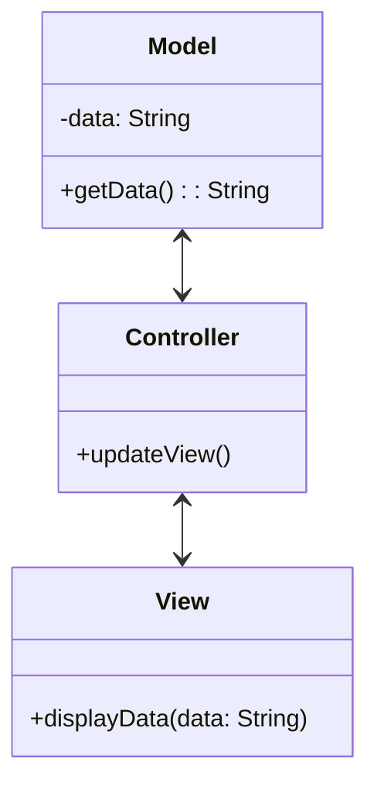
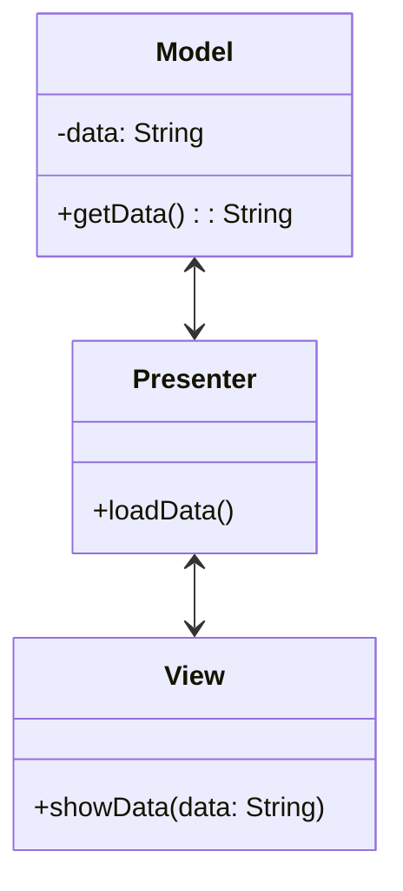
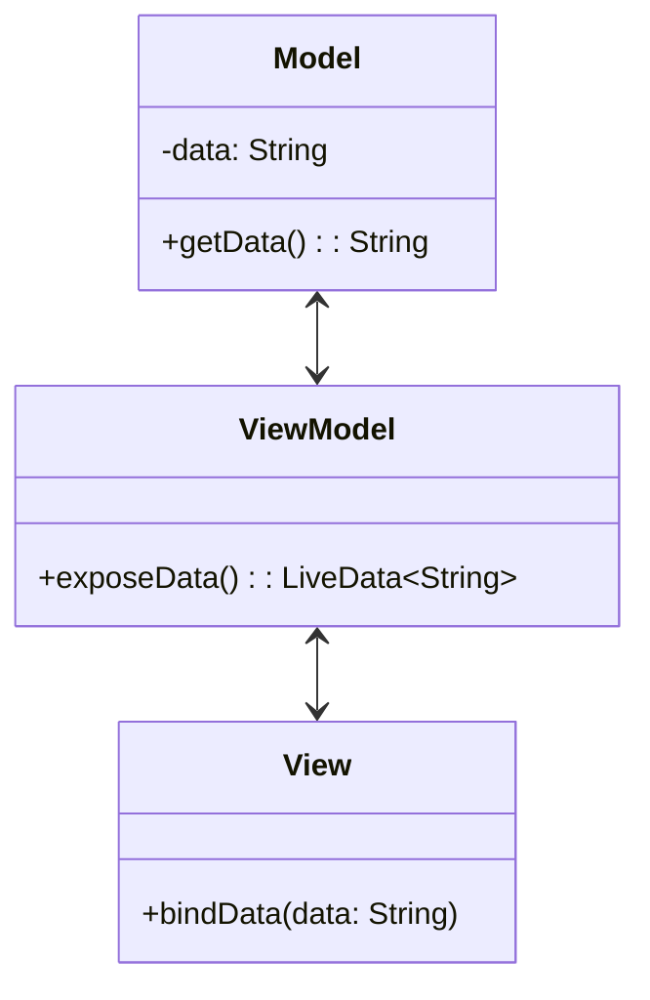

## 12.2.1 Adapting Patterns for Android and iOS

As mobile application development continues to evolve, understanding how to effectively apply design patterns in Android and iOS environments is crucial for creating robust, scalable, and maintainable applications. This section delves into adapting common design patterns to fit the unique requirements of Android and iOS platforms, emphasizing the importance of platform-specific considerations and architectural patterns such as MVC, MVP, and MVVM.

### Platform-Specific Considerations

#### Android Development

Android development primarily utilizes Java or Kotlin, with Kotlin being the preferred language due to its concise syntax, safety features, and interoperability with Java. Android applications are structured around components such as Activities, Fragments, Services, Broadcast Receivers, and Content Providers, which are managed by the Android operating system.

**Android Architecture Components:**

- **ViewModel:** Manages UI-related data in a lifecycle-conscious way. It survives configuration changes such as screen rotations.
- **LiveData:** A lifecycle-aware observable data holder class. It respects the lifecycle of other app components, such as activities, fragments, or services.
- **Room:** A persistence library that provides an abstraction layer over SQLite to allow fluent database access while harnessing the full power of SQLite.
- **Data Binding:** Binds UI components in layouts to data sources in your app using a declarative format.

**Guidelines for Android Development:**

- Follow the [Material Design Guidelines](https://material.io/design) for UI/UX consistency.
- Utilize Android Jetpack, a suite of libraries that help developers follow best practices and write code that works consistently across Android versions and devices.

#### iOS Development

iOS development is typically done using Swift, Apple's modern programming language, or Objective-C, the older but still prevalent language. iOS applications are built using the Cocoa Touch framework, which provides the necessary infrastructure for iOS apps.

**iOS Design Patterns and Conventions:**

- **MVC (Model-View-Controller):** A widespread architectural pattern in iOS, especially with UIKit.
- **Singleton:** Often used for shared resources or services.
- **Delegate:** A way to communicate between objects, commonly used in UIKit.
- **Observer:** Implemented via NotificationCenter or Key-Value Observing (KVO).

**Guidelines for iOS Development:**

- Adhere to [Human Interface Guidelines](https://developer.apple.com/design/human-interface-guidelines/) to ensure apps are intuitive and provide a consistent user experience.
- Utilize SwiftUI for declarative UI programming and Combine for reactive programming.

### Architectural Patterns in Mobile Apps

Architectural patterns play a vital role in structuring code, managing complexity, and ensuring maintainability. Let's explore how MVC, MVP, and MVVM are applied in mobile development.

#### MVC on Mobile

**Model-View-Controller (MVC)** is a design pattern that separates an application into three interconnected components:

- **Model:** Represents the data and business logic.
- **View:** Displays the data and sends user commands to the controller.
- **Controller:** Acts as an intermediary between Model and View.

**Implementing MVC in iOS:**

In iOS, MVC is often used with UIKit components. The View is typically a UIView or UIViewController, the Model is a data structure or database entity, and the Controller is a UIViewController that manages the View and Model.

```swift
import UIKit

class UserModel {
    var name: String
    var age: Int
    
    init(name: String, age: Int) {
        self.name = name
        self.age = age
    }
}

class UserViewController: UIViewController {
    var user: UserModel?
    
    override func viewDidLoad() {
        super.viewDidLoad()
        updateView()
    }
    
    func updateView() {
        // Update UI elements with user data
    }
}
```

**Pros and Cons of MVC:**

- **Pros:**
  - Clear separation of concerns.
  - Simplifies testing by isolating business logic.
- **Cons:**
  - Can lead to "Massive View Controller" problem where the controller becomes too large and complex.

#### MVP (Model-View-Presenter)

**Model-View-Presenter (MVP)** is a derivative of MVC that further decouples the View from the Model by introducing a Presenter.

- **Model:** Handles the data and business logic.
- **View:** Displays data and delegates user interactions to the Presenter.
- **Presenter:** Interacts with the Model and updates the View.

**Implementing MVP in Android:**

In Android, MVP is often used to separate the UI logic from the business logic, making it easier to test and maintain.

```kotlin
// Model
data class User(val name: String, val age: Int)

// View Interface
interface UserView {
    fun showUser(user: User)
    fun showError(message: String)
}

// Presenter
class UserPresenter(private val view: UserView) {
    fun loadUser() {
        // Simulate loading user data
        val user = User(name = "John Doe", age = 30)
        view.showUser(user)
    }
}

// Activity implementing the View
class UserActivity : AppCompatActivity(), UserView {
    private lateinit var presenter: UserPresenter
    
    override fun onCreate(savedInstanceState: Bundle?) {
        super.onCreate(savedInstanceState)
        setContentView(R.layout.activity_user)
        
        presenter = UserPresenter(this)
        presenter.loadUser()
    }
    
    override fun showUser(user: User) {
        // Update UI with user data
    }
    
    override fun showError(message: String) {
        // Show error message
    }
}
```

**Pros and Cons of MVP:**

- **Pros:**
  - Better separation of concerns compared to MVC.
  - Easier to unit test as the Presenter can be tested independently of the View.
- **Cons:**
  - Can lead to complex Presenter logic if not managed properly.

#### MVVM (Model-View-ViewModel)

**Model-View-ViewModel (MVVM)** is a pattern that facilitates data binding and separates the development of the graphical user interface from the business logic.

- **Model:** Represents the data and business logic.
- **View:** Displays the data and binds to the ViewModel.
- **ViewModel:** Exposes data and commands to the View, often using data binding.

**Implementing MVVM in Android with Kotlin:**

Android's Data Binding Library and LiveData are commonly used to implement MVVM.

```kotlin
// Model
data class User(val name: String, val age: Int)

// ViewModel
class UserViewModel : ViewModel() {
    private val _user = MutableLiveData<User>()
    val user: LiveData<User> get() = _user
    
    fun loadUser() {
        // Simulate loading user data
        _user.value = User(name = "John Doe", age = 30)
    }
}

// Activity with Data Binding
class UserActivity : AppCompatActivity() {
    private lateinit var binding: ActivityUserBinding
    private val viewModel: UserViewModel by viewModels()
    
    override fun onCreate(savedInstanceState: Bundle?) {
        super.onCreate(savedInstanceState)
        binding = DataBindingUtil.setContentView(this, R.layout.activity_user)
        binding.lifecycleOwner = this
        binding.viewModel = viewModel
        
        viewModel.loadUser()
    }
}
```

**Implementing MVVM in iOS with Swift:**

In iOS, MVVM can be implemented using SwiftUI and Combine for reactive programming.

```swift
import SwiftUI
import Combine

// Model
struct User: Identifiable {
    var id = UUID()
    var name: String
    var age: Int
}

// ViewModel
class UserViewModel: ObservableObject {
    @Published var user: User?
    
    func loadUser() {
        // Simulate loading user data
        self.user = User(name: "John Doe", age: 30)
    }
}

// View
struct UserView: View {
    @ObservedObject var viewModel = UserViewModel()
    
    var body: some View {
        VStack {
            if let user = viewModel.user {
                Text("Name: \\(user.name)")
                Text("Age: \\(user.age)")
            } else {
                Text("Loading...")
            }
        }
        .onAppear {
            viewModel.loadUser()
        }
    }
}
```

**Pros and Cons of MVVM:**

- **Pros:**
  - Strong separation of concerns.
  - Facilitates testability and reusability of components.
  - Reactive programming support through data binding.
- **Cons:**
  - Can be complex to implement and understand initially.
  - May introduce overhead in smaller applications.

### Diagrams and Visual Representation

To better understand how these patterns map onto mobile architectures, let's visualize them using diagrams.

#### MVC Diagram for iOS



#### MVP Diagram for Android



#### MVVM Diagram for Cross-Platform



### Differences and Similarities Between Android and iOS Implementations

- **Language and Frameworks:** Android uses Java/Kotlin with Android Jetpack, while iOS uses Swift/Objective-C with Cocoa Touch.
- **Lifecycle Management:** Android's ViewModel and LiveData handle lifecycle changes, whereas iOS uses Combine and SwiftUI for reactive updates.
- **UI Components:** Android utilizes XML layouts and Activities/Fragments, while iOS uses Storyboards/XIBs and ViewControllers.

### Pros and Cons of Each Pattern

When choosing a pattern, consider the following:

- **MVC:** Best for simple applications with straightforward UI logic.
- **MVP:** Suitable for applications that require a clear separation of UI and business logic.
- **MVVM:** Ideal for applications that benefit from data binding and reactive programming.

### User Experience and Performance Considerations

- **User Experience (UX):** Patterns should support a responsive and intuitive UI. Avoid blocking the main thread and ensure smooth transitions and animations.
- **Performance:** Optimize data loading and rendering. Use background threads for intensive operations and minimize memory usage.

### Conclusion

Adapting design patterns for Android and iOS requires understanding each platform's unique characteristics and leveraging the appropriate architectural patterns. By applying MVC, MVP, or MVVM, developers can create maintainable, scalable, and performant mobile applications. As you continue your journey in mobile development, remember to balance design patterns with user experience and performance considerations.

## Quiz Time!



### Which language is primarily used for Android development?

- [x] Kotlin
- [ ] Swift
- [ ] Objective-C
- [ ] JavaScript

> **Explanation:** Kotlin is the preferred language for Android development due to its modern features and interoperability with Java.

### What is the primary architectural pattern used in iOS development?

- [x] MVC
- [ ] MVP
- [ ] MVVM
- [ ] Singleton

> **Explanation:** MVC (Model-View-Controller) is the primary architectural pattern used in iOS development, especially with UIKit.

### Which component in Android's architecture components is lifecycle-aware?

- [x] LiveData
- [ ] View
- [ ] Model
- [ ] Controller

> **Explanation:** LiveData is a lifecycle-aware observable data holder class that respects the lifecycle of other app components.

### What is the main advantage of using MVVM in mobile development?

- [x] Facilitates data binding
- [ ] Simplifies UI design
- [ ] Reduces code complexity
- [ ] Enhances security

> **Explanation:** MVVM facilitates data binding, which allows the UI to automatically update when the underlying data changes.

### In MVP, which component is responsible for handling user interactions?

- [x] Presenter
- [ ] Model
- [ ] View
- [ ] Controller

> **Explanation:** In MVP, the Presenter handles user interactions and updates the View with data from the Model.

### Which framework is used for reactive programming in iOS?

- [x] Combine
- [ ] RxJava
- [ ] Angular
- [ ] Redux

> **Explanation:** Combine is used for reactive programming in iOS, allowing developers to handle asynchronous events in a declarative manner.

### What is a common problem associated with the MVC pattern in iOS?

- [x] Massive View Controller
- [ ] Complex Model
- [ ] Slow View updates
- [ ] Poor data binding

> **Explanation:** The "Massive View Controller" problem occurs when the controller becomes too large and complex, handling too much logic.

### Which pattern is best suited for applications that require a clear separation of UI and business logic?

- [x] MVP
- [ ] MVC
- [ ] MVVM
- [ ] Singleton

> **Explanation:** MVP is best suited for applications that require a clear separation of UI and business logic, as it decouples the View from the Model.

### What is the role of the ViewModel in MVVM?

- [x] Exposes data and commands to the View
- [ ] Manages the application's UI
- [ ] Handles user interactions
- [ ] Stores data in a database

> **Explanation:** The ViewModel exposes data and commands to the View, facilitating data binding and reactive updates.

### True or False: MVVM is only applicable to Android development.

- [ ] True
- [x] False

> **Explanation:** MVVM is applicable to both Android and iOS development, providing benefits like data binding and separation of concerns.




