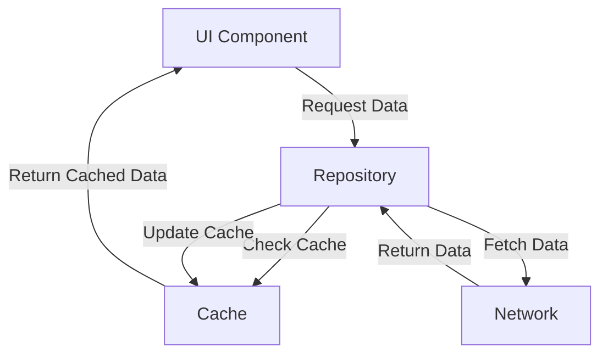

## 12.2.2 Handling Network Operations and Data Caching

In the realm of mobile development, efficient handling of network operations and data caching is crucial for creating responsive and performant applications. This section delves into various design patterns and strategies that developers can employ to manage asynchronous networking and caching effectively.

### Patterns for Asynchronous Networking

Asynchronous networking is essential in mobile applications to ensure that network operations do not block the main thread, which could lead to a poor user experience. Here, we explore several patterns used to handle asynchronous operations.

#### Callback Pattern

The callback pattern is one of the simplest and most widely used approaches for handling asynchronous operations. In this pattern, a function (the callback) is passed as an argument to another function, which executes the callback once the asynchronous operation is complete.

**Example in JavaScript:**

```javascript
function fetchData(url, callback) {
    fetch(url)
        .then(response => response.json())
        .then(data => callback(null, data))
        .catch(error => callback(error, null));
}

fetchData('https://api.example.com/data', (error, data) => {
    if (error) {
        console.error('Error fetching data:', error);
    } else {
        console.log('Data received:', data);
    }
});
```

**Issues with Callbacks:**

While callbacks are straightforward, they can lead to "callback hell," where nested callbacks become difficult to manage and read. This issue can be mitigated by using more structured approaches like Promises or async/await.

#### Future/Promise Pattern

The Future/Promise pattern provides a more manageable way to handle asynchronous operations by representing a value that may be available now, or in the future, or never.

**JavaScript Promises Example:**

```javascript
function fetchData(url) {
    return fetch(url)
        .then(response => response.json());
}

fetchData('https://api.example.com/data')
    .then(data => console.log('Data received:', data))
    .catch(error => console.error('Error fetching data:', error));
```

**Kotlin Coroutines Example:**

Kotlin's coroutines provide a straightforward way to handle asynchronous code in a sequential manner.

```kotlin
suspend fun fetchData(url: String): String {
    return withContext(Dispatchers.IO) {
        URL(url).readText()
    }
}

GlobalScope.launch {
    try {
        val data = fetchData("https://api.example.com/data")
        println("Data received: $data")
    } catch (e: Exception) {
        println("Error fetching data: ${e.message}")
    }
}
```

**Swift async/await Example:**

Swift's async/await syntax offers a clean approach to asynchronous programming.

```swift
func fetchData(from url: URL) async throws -> Data {
    let (data, _) = try await URLSession.shared.data(from: url)
    return data
}

Task {
    do {
        let data = try await fetchData(from: URL(string: "https://api.example.com/data")!)
        print("Data received: \\(data)")
    } catch {
        print("Error fetching data: \\(error)")
    }
}
```

#### Reactive Programming

Reactive programming offers a declarative approach to handling asynchronous data streams. Libraries like RxJava for Android and Combine for iOS facilitate this paradigm.

**RxJava Example:**

```java
Observable<String> dataObservable = Observable.fromCallable(() -> {
    return fetchDataFromNetwork();
});

dataObservable
    .subscribeOn(Schedulers.io())
    .observeOn(AndroidSchedulers.mainThread())
    .subscribe(
        data -> System.out.println("Data received: " + data),
        error -> System.err.println("Error: " + error)
    );
```

**Combine Example in Swift:**

```swift
let url = URL(string: "https://api.example.com/data")!
let publisher = URLSession.shared.dataTaskPublisher(for: url)
    .map(\.data)
    .decode(type: YourDataType.self, decoder: JSONDecoder())
    .receive(on: DispatchQueue.main)
    .sink(
        receiveCompletion: { completion in
            if case .failure(let error) = completion {
                print("Error: \\(error)")
            }
        },
        receiveValue: { data in
            print("Data received: \\(data)")
        }
    )
```

### Caching Strategies for Performance

Caching is a critical component in mobile applications to enhance performance and reduce network usage. Let's explore various caching strategies and patterns.

#### Types of Caching

- **In-Memory Caching:** Stores data in RAM for quick access. It's fast but volatile.
- **Disk Caching:** Stores data on the device's storage, providing persistence across sessions.
- **HTTP Caching:** Utilizes HTTP headers to manage cache control and expiration.

#### Caching Patterns

**Repository Pattern:**

The Repository Pattern abstracts the data layer, providing a clean API for data access. It can manage data from multiple sources, like network and cache, seamlessly.

**Example in Android using Room:**

```kotlin
class DataRepository(private val apiService: ApiService, private val dataDao: DataDao) {

    fun getData(): LiveData<Data> {
        return liveData {
            val cachedData = dataDao.getCachedData()
            if (cachedData != null) {
                emit(cachedData)
            }
            try {
                val freshData = apiService.fetchData()
                dataDao.cacheData(freshData)
                emit(freshData)
            } catch (exception: Exception) {
                emit(cachedData)
            }
        }
    }
}
```

**Cache Invalidation Strategies:**

Cache invalidation is crucial to ensure data freshness. Strategies include time-based expiration, manual invalidation, and versioning.

#### Offline Support

Handling network unavailability is critical for mobile apps. Strategies include:

- **Local Data Storage:** Using databases like SQLite or Core Data to store data locally.
- **Queueing Requests:** Queue network requests to be sent when connectivity is restored.

### Examples Using Popular Libraries

#### Networking Libraries

- **Android:**
  - **Retrofit:** A type-safe HTTP client for Android and Java.
  - **OkHttp:** An efficient HTTP client for Android.

**Retrofit Example:**

```kotlin
interface ApiService {
    @GET("data")
    suspend fun fetchData(): Response<Data>
}

val retrofit = Retrofit.Builder()
    .baseUrl("https://api.example.com/")
    .addConverterFactory(GsonConverterFactory.create())
    .build()

val apiService = retrofit.create(ApiService::class.java)
```

- **iOS:**
  - **Alamofire:** An elegant HTTP networking library for Swift.

**Alamofire Example:**

```swift
AF.request("https://api.example.com/data")
    .responseJSON { response in
        switch response.result {
        case .success(let data):
            print("Data received: \\(data)")
        case .failure(let error):
            print("Error: \\(error)")
        }
    }
```

#### Caching Libraries

- **Android:**
  - **Room Database:** A persistence library that provides an abstraction layer over SQLite.

**Room Example:**

```kotlin
@Entity
data class DataEntity(
    @PrimaryKey val id: Int,
    val data: String
)

@Dao
interface DataDao {
    @Query("SELECT * FROM dataentity WHERE id = :id")
    fun getCachedData(id: Int): DataEntity?

    @Insert(onConflict = OnConflictStrategy.REPLACE)
    fun cacheData(data: DataEntity)
}
```

- **iOS:**
  - **Core Data:** A framework for managing object graphs and persistence.

**Core Data Example:**

```swift
let fetchRequest: NSFetchRequest<DataEntity> = DataEntity.fetchRequest()
do {
    let cachedData = try context.fetch(fetchRequest)
    // Use cached data
} catch {
    print("Error fetching cached data: \\(error)")
}
```

### Best Practices for Network Operations and Caching

- **Efficient Network Usage:** Minimize data usage and conserve battery by optimizing network calls.
- **Error Handling and Retries:** Implement robust error handling and retry mechanisms for network requests.
- **Data Synchronization:** Ensure data consistency between local cache and remote server.

### Diagrams and Data Flow

To visualize the interaction between network, cache, and UI components, consider the following diagram:



### Conclusion

Handling network operations and data caching effectively is vital for building responsive and efficient mobile applications. By leveraging design patterns like Callbacks, Promises, and Reactive Programming, along with caching strategies, developers can significantly enhance app performance and user experience.

## Quiz Time!



### Which pattern is commonly used to handle asynchronous operations by passing a function as an argument?

- [x] Callback Pattern
- [ ] Singleton Pattern
- [ ] Observer Pattern
- [ ] Factory Pattern

> **Explanation:** The Callback Pattern involves passing a function as an argument to another function, which is executed after an asynchronous operation completes.

### What issue can arise from using nested callbacks in JavaScript?

- [x] Callback Hell
- [ ] Memory Leak
- [ ] Deadlock
- [ ] Race Condition

> **Explanation:** Callback Hell occurs when there are many nested callbacks, making the code difficult to read and maintain.

### Which pattern is used to represent a value that may be available now, in the future, or never?

- [x] Future/Promise Pattern
- [ ] Singleton Pattern
- [ ] Adapter Pattern
- [ ] Observer Pattern

> **Explanation:** The Future/Promise Pattern is used to handle asynchronous operations by representing a value that may be available in the future.

### Which library is used for reactive programming in Android?

- [x] RxJava
- [ ] Retrofit
- [ ] OkHttp
- [ ] Alamofire

> **Explanation:** RxJava is a library for reactive programming in Android, allowing developers to work with asynchronous data streams.

### What is the primary purpose of caching in mobile applications?

- [x] Enhance performance and reduce network usage
- [ ] Increase app size
- [ ] Improve security
- [ ] Simplify code

> **Explanation:** Caching is used to enhance performance by storing data locally, reducing the need for frequent network requests.

### Which caching strategy involves storing data in RAM for quick access?

- [x] In-Memory Caching
- [ ] Disk Caching
- [ ] HTTP Caching
- [ ] Cloud Caching

> **Explanation:** In-Memory Caching stores data in RAM, providing fast access but is volatile.

### Which library provides a type-safe HTTP client for Android?

- [x] Retrofit
- [ ] Alamofire
- [ ] Combine
- [ ] Core Data

> **Explanation:** Retrofit is a type-safe HTTP client for Android and Java, used for making network requests.

### What is a common strategy for handling network unavailability in mobile apps?

- [x] Local Data Storage
- [ ] Increasing API calls
- [ ] Ignoring errors
- [ ] Using synchronous operations

> **Explanation:** Local Data Storage allows apps to function offline by storing data on the device.

### Which iOS framework is used for managing object graphs and persistence?

- [x] Core Data
- [ ] Room Database
- [ ] SQLite
- [ ] Alamofire

> **Explanation:** Core Data is an iOS framework for managing object graphs and persistence.

### Efficient network usage in mobile apps helps to:

- [x] Conserve battery and data
- [ ] Increase app size
- [ ] Slow down performance
- [ ] Complicate code

> **Explanation:** Efficient network usage conserves battery and data, enhancing the user experience.




