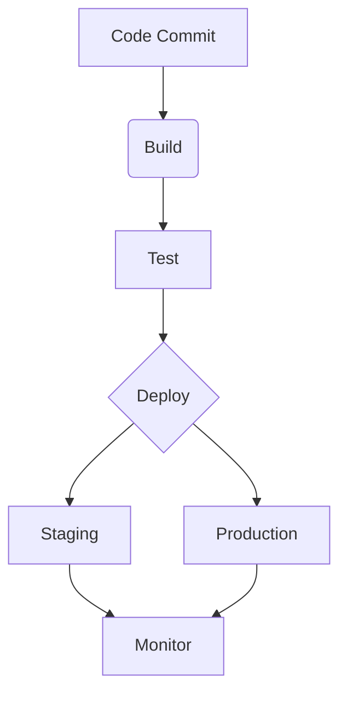

## 12.3.4 Deployment and Infrastructure as Code

In the rapidly evolving world of software development, deployment and infrastructure management have become pivotal components that directly influence the agility and reliability of applications. This section delves into the concepts of Deployment and Infrastructure as Code (IaC), exploring the patterns, tools, and strategies that empower developers to automate and streamline these processes effectively.

### Understanding Infrastructure as Code (IaC)

Infrastructure as Code (IaC) is a paradigm shift in the way infrastructure is managed and provisioned. It involves defining and managing infrastructure through code, allowing for automation, consistency, and repeatability in deployment processes.

#### Benefits of IaC

- **Consistency**: IaC ensures that the same configuration is applied across different environments, reducing discrepancies and configuration drift.
- **Automation**: Automating infrastructure provisioning reduces manual intervention, minimizing human errors and speeding up deployment.
- **Scalability**: Infrastructure can be scaled up or down programmatically, adapting to changing demands efficiently.
- **Version Control**: Infrastructure configurations can be versioned, enabling tracking of changes and rollbacks if necessary.

### Mutable vs. Immutable Infrastructure

The choice between mutable and immutable infrastructure significantly impacts deployment strategies.

#### Mutable Infrastructure

- **Definition**: In a mutable infrastructure, servers and resources are updated or modified in place.
- **Implications**: While this approach can be flexible, it may lead to configuration drift and inconsistencies over time.
- **Use Cases**: Suitable for environments where rapid changes are necessary, but it requires careful management to ensure consistency.

#### Immutable Infrastructure

- **Definition**: Immutable infrastructure involves replacing entire servers or resources with new versions rather than modifying them.
- **Implications**: This approach enhances consistency and reliability, as each deployment is a fresh start with a known configuration.
- **Use Cases**: Ideal for environments where stability and predictability are paramount, such as production systems.

### Tools for Infrastructure as Code

Several tools have emerged to facilitate the implementation of IaC, with Terraform and AWS CloudFormation being among the most popular.

#### Terraform

Terraform is an open-source tool that allows developers to define and provision infrastructure across multiple cloud providers using a high-level configuration language.

- **Multi-Provider Support**: Terraform supports a wide range of cloud providers, enabling infrastructure management across different platforms from a single tool.
- **Configuration Language**: Terraform uses HashiCorp Configuration Language (HCL), which is both human-readable and machine-friendly.

##### Writing Terraform Configuration Files

Let's explore a basic example of a Terraform configuration file to provision an AWS EC2 instance:

```hcl
provider "aws" {
  region = "us-west-2"
}

resource "aws_instance" "example" {
  ami           = "ami-0c55b159cbfafe1f0"
  instance_type = "t2.micro"

  tags = {
    Name = "TerraformExample"
  }
}
```

- **Provider Block**: Specifies the cloud provider and region.
- **Resource Block**: Defines the AWS EC2 instance, including the Amazon Machine Image (AMI) and instance type.

##### Step-by-Step Guide to Using Terraform

1. **Install Terraform**: Download and install Terraform from the [official website](https://www.terraform.io/downloads.html).
2. **Initialize Directory**: Run `terraform init` to initialize the working directory containing the configuration files.
3. **Plan Deployment**: Use `terraform plan` to create an execution plan, previewing the changes Terraform will make.
4. **Apply Configuration**: Execute `terraform apply` to provision the infrastructure as defined in the configuration files.
5. **Manage State**: Terraform maintains a state file to keep track of resources, ensuring consistency between the real-world infrastructure and the configuration.

#### AWS CloudFormation

AWS CloudFormation is a service that provides a common language for describing and provisioning all the infrastructure resources in your cloud environment.

- **Templates**: CloudFormation uses JSON or YAML templates to define AWS resources and their dependencies.
- **Stack Management**: Resources are managed as a stack, enabling easy updates and rollbacks.

##### Defining AWS Resources with CloudFormation

Here's a simple example of a CloudFormation template to create an S3 bucket:

```yaml
Resources:
  MyS3Bucket:
    Type: 'AWS::S3::Bucket'
    Properties:
      BucketName: 'my-cloudformation-bucket'
```

- **Resources Section**: Defines the AWS resources to be created.
- **Properties**: Specifies the configuration details for each resource.

##### Managing CloudFormation Stacks

1. **Create Stack**: Use the AWS Management Console or CLI to create a stack from a CloudFormation template.
2. **Update Stack**: Modify the template and update the stack to reflect changes in the infrastructure.
3. **Delete Stack**: Remove all resources associated with the stack by deleting it.

### Continuous Deployment Pipelines

Continuous Deployment (CD) pipelines automate the process of delivering software updates to production, ensuring that new features and fixes are deployed quickly and reliably.

#### CI/CD Tools

Several tools facilitate the implementation of CI/CD pipelines, each offering unique features and integrations.

- **Jenkins**: An open-source automation server that supports building, deploying, and automating software development processes.
- **CircleCI**: A cloud-based CI/CD service that automates the build, test, and deployment stages.
- **GitLab CI/CD**: Integrated directly into GitLab, providing a seamless experience for managing code repositories and deployment pipelines.
- **GitHub Actions**: Enables automation of workflows directly in GitHub repositories, supporting CI/CD processes.

#### Pipeline Stages

A typical CI/CD pipeline consists of several stages, each performing specific tasks to ensure the quality and reliability of software releases.

1. **Build**: Compile the source code and generate executable artifacts.
2. **Test**: Run automated tests to verify the functionality and integrity of the code.
3. **Deploy**: Deploy the application to a staging or production environment.
4. **Monitor**: Continuously monitor the application for performance and stability issues.



#### Deployment Strategies

Choosing the right deployment strategy is crucial for minimizing downtime and ensuring a smooth transition between software versions.

- **Blue-Green Deployments**: Maintain two identical environments (blue and green). Traffic is routed to one environment while the other is updated, allowing for quick rollbacks if necessary.
- **Canary Releases**: Gradually roll out changes to a small subset of users before deploying to the entire user base, reducing the risk of widespread issues.
- **Rolling Updates**: Incrementally update instances in a deployment group, ensuring that some instances remain operational throughout the process.

### Challenges in Deployment and IaC

Despite the numerous benefits, implementing IaC and continuous deployment pipelines comes with its own set of challenges.

#### Managing Secrets

- **Secure Storage**: Use tools like AWS Secrets Manager or HashiCorp Vault to securely store and manage sensitive information.
- **Environment Variables**: Avoid hardcoding secrets in configuration files; use environment variables or secret management tools.

#### Environment Configurations

- **Configuration Management**: Tools like Ansible or Chef can help manage environment-specific configurations, ensuring consistency across deployments.
- **Parameterization**: Use parameterized templates or scripts to dynamically configure environments based on context.

### Encouraging Implementation

To reinforce learning, readers are encouraged to implement a simple CI/CD pipeline using the tools and strategies discussed. Start with a basic application and gradually incorporate more complex features as you become comfortable with the process.

### Conclusion

Deployment and Infrastructure as Code are critical components of modern software development, enabling teams to deliver reliable and scalable applications efficiently. By leveraging tools like Terraform, AWS CloudFormation, and CI/CD pipelines, developers can automate and streamline their deployment processes, ensuring consistency and reducing the risk of errors. As you continue your journey in software development, embrace these practices to enhance your workflow and deliver high-quality software with confidence.

## Quiz Time!



### What is Infrastructure as Code (IaC)?

- [x] A method to manage and provision infrastructure through code
- [ ] A manual process of configuring servers
- [ ] A type of cloud service
- [ ] A programming language for web development

> **Explanation:** Infrastructure as Code (IaC) involves defining and managing infrastructure using code, allowing for automation and consistency.

### Which of the following is a benefit of immutable infrastructure?

- [x] Enhanced consistency and reliability
- [ ] Flexibility in making rapid changes
- [ ] Increased manual intervention
- [ ] Configuration drift over time

> **Explanation:** Immutable infrastructure enhances consistency and reliability by replacing entire resources with new versions rather than modifying them.

### What is the primary purpose of Terraform?

- [x] To provision infrastructure across multiple cloud providers
- [ ] To manage user authentication
- [ ] To develop mobile applications
- [ ] To create machine learning models

> **Explanation:** Terraform is used to provision and manage infrastructure across different cloud providers using a high-level configuration language.

### In AWS CloudFormation, what is a stack?

- [x] A collection of AWS resources managed as a single unit
- [ ] A type of database service
- [ ] A programming framework
- [ ] A security protocol

> **Explanation:** A stack in AWS CloudFormation is a collection of AWS resources that are managed as a single unit, allowing for easy updates and rollbacks.

### Which CI/CD tool is integrated directly into GitLab?

- [x] GitLab CI/CD
- [ ] Jenkins
- [ ] CircleCI
- [ ] GitHub Actions

> **Explanation:** GitLab CI/CD is integrated directly into GitLab, providing a seamless experience for managing code repositories and deployment pipelines.

### What is a blue-green deployment strategy?

- [x] A strategy that maintains two environments and routes traffic to one while updating the other
- [ ] A method for developing mobile applications
- [ ] A type of database replication
- [ ] A programming language for web development

> **Explanation:** Blue-green deployments maintain two identical environments (blue and green) and route traffic to one while the other is updated, allowing for quick rollbacks if necessary.

### What is the purpose of the build stage in a CI/CD pipeline?

- [x] To compile the source code and generate executable artifacts
- [ ] To deploy the application to production
- [ ] To monitor application performance
- [ ] To manage user authentication

> **Explanation:** The build stage in a CI/CD pipeline involves compiling the source code and generating executable artifacts for deployment.

### How can secrets be securely managed in a deployment pipeline?

- [x] Using tools like AWS Secrets Manager or HashiCorp Vault
- [ ] Hardcoding them in configuration files
- [ ] Storing them in plain text
- [ ] Sharing them via email

> **Explanation:** Secrets should be securely managed using tools like AWS Secrets Manager or HashiCorp Vault to prevent unauthorized access.

### What is a canary release?

- [x] A deployment strategy that gradually rolls out changes to a small subset of users
- [ ] A method for developing mobile applications
- [ ] A type of database replication
- [ ] A programming language for web development

> **Explanation:** A canary release is a deployment strategy that gradually rolls out changes to a small subset of users before deploying to the entire user base.

### True or False: Infrastructure as Code allows for manual configuration of servers.

- [ ] True
- [x] False

> **Explanation:** False. Infrastructure as Code automates the configuration of servers, reducing the need for manual intervention.


