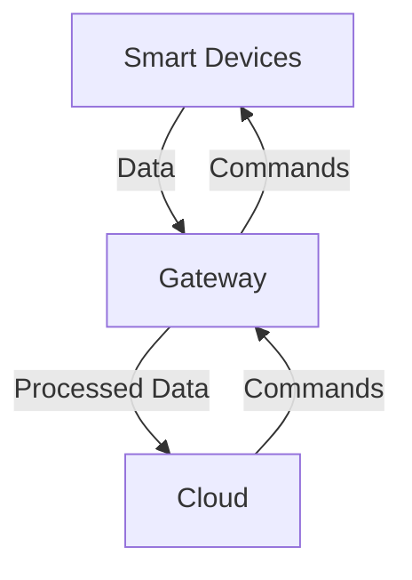

## 12.4.2 Internet of Things (IoT) Design Patterns

The Internet of Things (IoT) represents a massive shift in how devices interact with each other and with centralized systems. With billions of devices projected to be connected, understanding IoT design patterns is crucial for building scalable, efficient, and secure systems. This section delves into the key design patterns used in IoT, focusing on distributed devices and sensors, data aggregation, edge computing, and secure communication protocols.

### Patterns for Distributed Devices and Sensors

IoT systems are inherently distributed, consisting of numerous devices and sensors that need to communicate effectively. Two significant patterns emerge in this context: the **Gateway Pattern** and **Edge Computing**.

#### Gateway Pattern

The Gateway Pattern is essential in managing communication between IoT devices and the cloud. Gateways act as intermediaries that collect data from devices, process it if necessary, and then forward it to cloud services. They can also send commands back to the devices.

**Key Functions of Gateways:**

- **Protocol Translation:** Converting data from device-specific protocols to internet protocols.
- **Data Aggregation:** Combining data from multiple devices into a single stream.
- **Security Management:** Implementing encryption and authentication to secure data transmission.
- **Local Processing:** Performing computations locally to reduce data sent to the cloud.

**Example Scenario: Smart Home Systems**

In a smart home, various devices like thermostats, lights, and security cameras communicate through a central gateway. This gateway translates device-specific protocols into a unified protocol for cloud communication, allowing users to control their home devices remotely via a smartphone app.

#### Edge Computing

Edge computing involves processing data closer to the source of data generation rather than relying solely on cloud-based resources. This approach reduces latency, minimizes bandwidth usage, and enhances real-time processing capabilities.

**Benefits of Edge Computing:**

- **Reduced Latency:** Immediate processing of data at the edge reduces the time it takes to make decisions.
- **Bandwidth Efficiency:** Only essential data is sent to the cloud, reducing the amount of data transmitted.
- **Increased Privacy:** Sensitive data can be processed locally, minimizing exposure to potential breaches.

**Example Scenario: Industrial IoT**

In an industrial setting, edge computing enables real-time monitoring and control of machinery. Sensors on machines can detect anomalies and process this data locally to trigger immediate alerts or adjustments, ensuring minimal downtime and efficient operations.

### Data Aggregation and Edge Computing

Data aggregation and processing are critical in IoT systems where data is collected from numerous sources. Understanding when and where to process this data—on the device, at the edge, or in the cloud—is crucial for system efficiency.

#### Data Aggregation Patterns

Data aggregation involves collecting and combining data from multiple devices to provide meaningful insights. This can be done at various levels, depending on the system's architecture.

**Levels of Data Aggregation:**

- **Device Level:** Data is aggregated at the source, reducing the volume of data sent to the gateway.
- **Gateway Level:** The gateway collects data from multiple devices, processes it, and sends summarized information to the cloud.
- **Cloud Level:** Raw data is sent to the cloud, where powerful processing capabilities can analyze it.

**Example Scenario: Environmental Monitoring**

In an environmental monitoring system, sensors distributed across a region collect data on temperature, humidity, and air quality. This data is aggregated at the gateway level to provide a comprehensive view of environmental conditions, which can then be analyzed in the cloud for trends and predictions.

#### Edge vs. Cloud Processing

Deciding where to process data—on the device, at the edge, or in the cloud—depends on several factors, including latency requirements, bandwidth constraints, and data sensitivity.

**Considerations for Processing Location:**

- **Latency Requirements:** Real-time applications benefit from edge or device-level processing.
- **Bandwidth Constraints:** Limited connectivity favors local processing to minimize data transmission.
- **Data Sensitivity:** Sensitive data may require local processing to enhance privacy and security.

**Example Scenario: Autonomous Vehicles**

Autonomous vehicles rely on a mix of edge and cloud processing. Critical decisions, such as obstacle detection and navigation, are processed on the vehicle (edge) to ensure immediate response times. Meanwhile, non-critical data, such as route optimization and traffic analysis, can be processed in the cloud.

### Secure Communication Protocols

Security is paramount in IoT systems, where devices often operate in open and potentially hostile environments. Lightweight communication protocols and robust security patterns are essential to protect data and ensure reliable operation.

#### Lightweight Protocols: MQTT, CoAP, AMQP

**MQTT (Message Queuing Telemetry Transport):** A lightweight, publish-subscribe network protocol that is ideal for environments where a small code footprint is required, such as IoT devices.

**CoAP (Constrained Application Protocol):** Designed for constrained devices, CoAP is a web transfer protocol that allows devices to communicate over the internet efficiently.

**AMQP (Advanced Message Queuing Protocol):** A protocol for message-oriented middleware environments, AMQP is used for reliable communication in IoT systems.

**Example Scenario: Smart Agriculture**

In smart agriculture, sensors in the field use MQTT to transmit soil moisture and temperature data to a central server. This protocol's lightweight nature ensures minimal power consumption and efficient data transmission, even in remote areas with limited connectivity.

#### Security Patterns

Implementing security in IoT systems involves several patterns to ensure data integrity, confidentiality, and authenticity.

**Key Security Patterns:**

- **Encryption:** Using protocols like TLS/SSL to encrypt data in transit.
- **Authentication:** Verifying the identity of devices and users before allowing access.
- **Authorization:** Ensuring that devices and users have the appropriate permissions to access resources.

**Example Scenario: Smart Healthcare**

In a smart healthcare system, patient data is transmitted from wearable devices to healthcare providers. Encryption ensures that sensitive health information remains confidential, while authentication and authorization mechanisms prevent unauthorized access to patient records.

### Challenges in IoT Design Patterns

Despite the benefits, IoT systems face several challenges that must be addressed to ensure successful implementation.

#### Scalability

As the number of connected devices grows, IoT systems must scale efficiently. This requires robust architecture and design patterns that can handle increased data loads and device interactions.

**Example Solution:** Implementing a microservices architecture allows IoT systems to scale horizontally, adding new services and devices without disrupting existing operations.

#### Heterogeneity

IoT environments consist of diverse devices with varying capabilities and protocols. Ensuring interoperability and seamless communication between these devices is a significant challenge.

**Example Solution:** Using standardized protocols and middleware solutions can help bridge the gap between different devices, facilitating smooth interactions.

#### Power Consumption

Many IoT devices operate on limited power sources, making energy efficiency a critical consideration.

**Example Solution:** Implementing energy-efficient protocols and optimizing data transmission can extend the battery life of IoT devices, ensuring longer operation without frequent recharging.

### Encouraging Experimentation with IoT Devices

To fully grasp IoT design patterns, hands-on experimentation is invaluable. Platforms like Arduino and Raspberry Pi offer accessible entry points for prototyping and developing IoT solutions.

**Getting Started with Arduino:**

- **Setup:** Install the Arduino IDE and connect your Arduino board to your computer.
- **Example Project:** Build a simple temperature monitoring system using a temperature sensor and an Arduino board. Program the board to read temperature data and send it to a cloud service using MQTT.

**Getting Started with Raspberry Pi:**

- **Setup:** Install the Raspberry Pi OS and connect your Raspberry Pi to a monitor and keyboard.
- **Example Project:** Create a home automation system that controls lights and appliances using a Raspberry Pi and a relay module. Use Python to program the Raspberry Pi to respond to commands sent from a smartphone app.

By engaging with these platforms, readers can develop a deeper understanding of IoT design patterns and their practical applications.

### Conclusion

The Internet of Things is transforming industries by connecting devices and enabling new levels of automation and insight. Understanding and applying IoT design patterns is essential for building systems that are scalable, efficient, and secure. By leveraging patterns such as the Gateway Pattern, Edge Computing, Data Aggregation, and Secure Communication Protocols, developers can create robust IoT solutions that meet the demands of modern applications.

As you continue your journey in IoT development, remember to experiment with different patterns and technologies. The field is rapidly evolving, and staying informed about the latest trends and best practices will ensure your success in creating innovative IoT solutions.

## Quiz Time!



### What is the primary role of a gateway in IoT systems?

- [x] To manage communication between devices and the cloud.
- [ ] To replace cloud computing entirely.
- [ ] To serve as a standalone device for processing all data.
- [ ] To function as a backup system for data storage.

> **Explanation:** Gateways manage communication between IoT devices and the cloud by translating protocols, aggregating data, and ensuring secure transmission.

### Which protocol is specifically designed for constrained devices in IoT?

- [ ] MQTT
- [x] CoAP
- [ ] AMQP
- [ ] HTTP

> **Explanation:** CoAP (Constrained Application Protocol) is specifically designed for constrained devices, allowing them to communicate efficiently over the internet.

### What is a key advantage of edge computing in IoT?

- [x] Reduced latency and real-time processing capabilities.
- [ ] Increased dependence on cloud resources.
- [ ] Higher bandwidth usage.
- [ ] Centralized data processing.

> **Explanation:** Edge computing reduces latency by processing data closer to the source, enabling real-time decision-making without relying on cloud resources.

### How does data aggregation benefit IoT systems?

- [x] By combining data from multiple devices to provide meaningful insights.
- [ ] By increasing the volume of data sent to the cloud.
- [ ] By decentralizing data processing entirely.
- [ ] By complicating data analysis.

> **Explanation:** Data aggregation combines data from multiple devices, reducing the volume of data sent to the cloud and providing comprehensive insights for analysis.

### Which security pattern ensures that only authorized devices and users can access IoT resources?

- [ ] Encryption
- [ ] Data Aggregation
- [x] Authentication and Authorization
- [ ] Protocol Translation

> **Explanation:** Authentication verifies the identity of devices and users, while authorization ensures they have the appropriate permissions to access IoT resources.

### What challenge does heterogeneity pose in IoT environments?

- [x] Ensuring interoperability between diverse devices with varying capabilities and protocols.
- [ ] Reducing the number of connected devices.
- [ ] Increasing power consumption.
- [ ] Simplifying device communication.

> **Explanation:** Heterogeneity in IoT environments involves diverse devices with different capabilities and protocols, making interoperability a significant challenge.

### Which protocol is known for its lightweight nature, making it suitable for IoT devices?

- [x] MQTT
- [ ] HTTP
- [ ] FTP
- [ ] SMTP

> **Explanation:** MQTT (Message Queuing Telemetry Transport) is a lightweight protocol ideal for IoT devices, enabling efficient data transmission with minimal power consumption.

### Why is power consumption a critical consideration in IoT systems?

- [x] Many IoT devices operate on limited power sources, requiring energy-efficient solutions.
- [ ] IoT devices always have unlimited power supply.
- [ ] Power consumption is irrelevant in IoT systems.
- [ ] High power consumption is desired for better performance.

> **Explanation:** Many IoT devices rely on limited power sources, so energy-efficient protocols and optimized data transmission are essential to prolong device operation.

### What is a practical application of edge computing in IoT?

- [x] Real-time monitoring and control of machinery in industrial settings.
- [ ] Storing all data in the cloud for later processing.
- [ ] Replacing all cloud-based operations.
- [ ] Eliminating the need for gateways.

> **Explanation:** Edge computing enables real-time monitoring and control of machinery by processing data locally, ensuring immediate response times and efficient operations.

### True or False: Edge computing can help enhance privacy in IoT systems.

- [x] True
- [ ] False

> **Explanation:** Edge computing can enhance privacy by processing sensitive data locally, reducing exposure to potential breaches and minimizing data transmission to the cloud.


