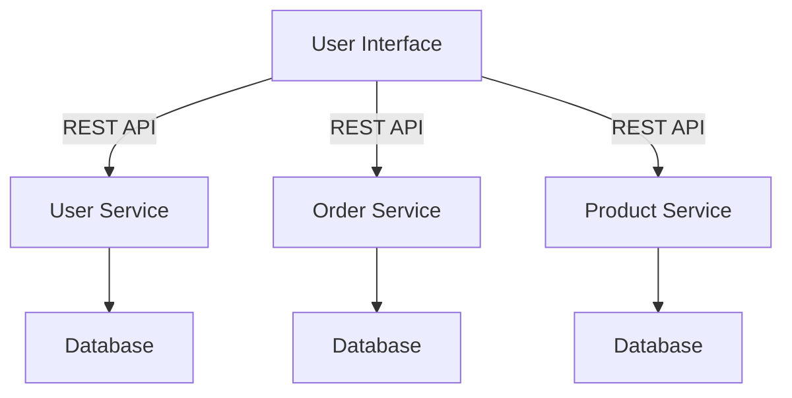
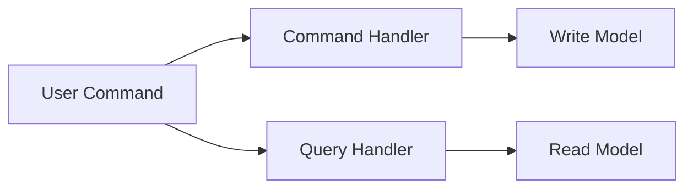

---

linkTitle: "Conclusion of Chapter 12"
title: "Design Patterns in Modern Software Development: Conclusion of Chapter 12"
description: "Explore the enduring relevance of design patterns in modern software development, addressing challenges in web, mobile, cloud computing, and future technologies."
categories:
- Software Development
- Design Patterns
- Technology Trends
tags:
- Design Patterns
- Web Development
- Mobile Development
- Cloud Computing
- Future Trends
date: 2024-10-25
type: docs
nav_weight: 125000

---

## Conclusion of Chapter 12

In Chapter 12, we've journeyed through the dynamic landscape of modern software development, exploring how design patterns remain integral in addressing the challenges posed by emerging technologies. As the software industry continues to evolve, the principles of design patterns adapt alongside, proving their enduring relevance and flexibility.

### The Integral Role of Design Patterns

Design patterns have long been the cornerstone of effective software engineering, providing solutions to common problems and promoting best practices. In modern software development, these patterns continue to be indispensable. They offer a structured approach to solving complex problems, ensuring that software is both robust and scalable.

#### Web Development: Patterns at the Core

Web development has seen significant transformations with the advent of new technologies and frameworks. Design patterns like MVC (Model-View-Controller) and MVVM (Model-View-ViewModel) have become foundational in building scalable and maintainable web applications. Frameworks such as Django, Angular, and React exemplify how these patterns facilitate a clear separation of concerns, enhance testability, and promote efficient team collaboration.

**Example: MVC in Django**

Django, a high-level Python web framework, leverages the MVC pattern to separate data (Model), user interface (View), and control logic (Controller). This separation allows developers to manage complex applications by dividing responsibilities, making the codebase easier to maintain and extend.

```python
from django.db import models

class Product(models.Model):
    name = models.CharField(max_length=100)
    price = models.DecimalField(max_digits=10, decimal_places=2)

from django.shortcuts import render
from .models import Product

def product_list(request):
    products = Product.objects.all()
    return render(request, 'product_list.html', {'products': products})

# product_list.html

  <div>{{ product.name }}: ${{ product.price }}</div>

```

In this example, the `Product` model handles data, the `product_list` view retrieves data and renders it, and the HTML template displays the data to the user.

#### State Management in Single Page Applications

The rise of Single Page Applications (SPAs) has introduced complexities in state management. Patterns like Flux and Redux have been instrumental in managing state predictably, allowing developers to create responsive and user-friendly web experiences. Redux, for instance, centralizes application state and logic, making it easier to debug and maintain.

**Example: Redux in React**

```javascript
// Redux Action
const increment = () => {
  return {
    type: 'INCREMENT'
  };
};

// Redux Reducer
const counter = (state = 0, action) => {
  switch (action.type) {
    case 'INCREMENT':
      return state + 1;
    default:
      return state;
  }
};

// Redux Store
import { createStore } from 'redux';
const store = createStore(counter);

// React Component
import React from 'react';
import { useDispatch, useSelector } from 'react-redux';

function Counter() {
  const count = useSelector(state => state);
  const dispatch = useDispatch();

  return (
    <div>
      <button onClick={() => dispatch(increment())}>Increment</button>
      <p>Count: {count}</p>
    </div>
  );
}
```

In this example, Redux manages the state of a simple counter application, allowing the UI to react to state changes predictably.

#### Backend Development: RESTful APIs and Microservices

The implementation of RESTful APIs and microservices architecture has demonstrated how design patterns contribute to building scalable, high-performance backends, essential for modern applications. Microservices, in particular, allow for the decomposition of applications into smaller, independent services, each responsible for a specific business capability.

**Example: Microservices Architecture**

In a microservices architecture, each service can be developed, deployed, and scaled independently. This approach enhances flexibility and allows teams to adopt technologies best suited for each service.



This diagram illustrates how a user interface interacts with different microservices, each with its own database, ensuring separation of concerns and independent scalability.

#### Security Patterns: Safeguarding Applications

Security patterns have become critical in safeguarding applications against evolving threats. Patterns such as authentication, authorization, and secure data transmission are essential in protecting sensitive information and ensuring user privacy.

### Mobile Development: Adapting Patterns for Diverse Platforms

Transitioning to mobile development, we recognized the unique demands of creating applications for diverse devices and platforms. By adapting patterns such as MVC, MVP (Model-View-Presenter), and MVVM, developers can build robust Android and iOS applications that offer consistent user experiences.

#### Handling Network Operations and Data Caching

Handling network operations and data caching emerged as vital components, where asynchronous patterns and efficient caching strategies ensure high performance and responsiveness. Patterns like Repository and Data Access Object (DAO) help manage data operations efficiently.

**Example: Asynchronous Network Operations in Android**

```kotlin
// Using Kotlin Coroutines for Asynchronous Network Call
import kotlinx.coroutines.*

fun fetchData() {
    GlobalScope.launch(Dispatchers.IO) {
        val data = networkCall() // Simulate network call
        withContext(Dispatchers.Main) {
            // Update UI with data
        }
    }
}

suspend fun networkCall(): String {
    // Simulate network delay
    delay(1000)
    return "Data from network"
}
```

In this example, Kotlin Coroutines are used to perform network operations asynchronously, ensuring the UI remains responsive.

#### Designing Adaptive UIs

We also highlighted the significance of designing adaptive UIs, ensuring accessibility, and optimizing user experience across a multitude of devices. Patterns like Responsive Design and Adaptive Layouts are crucial in creating applications that perform well on various screen sizes and orientations.

### Cloud Computing: Building Scalable and Resilient Services

In our exploration of cloud computing, we examined how design patterns underpin the development of cloud-native applications. The 12-factor app principles provided a foundation for building scalable and resilient services, while serverless computing patterns offered insights into constructing applications without the overhead of server management.

#### Data Storage and Management Patterns

Data storage and management patterns like CQRS (Command Query Responsibility Segregation) and event sourcing are crucial for handling the vast and complex data ecosystems in cloud environments. These patterns ensure data consistency and enable efficient data retrieval and updates.

**Example: CQRS in Cloud Applications**

CQRS separates the read and write operations, allowing for optimized performance and scalability.



This diagram illustrates how user commands are processed through separate command and query handlers, each interacting with distinct models.

#### Infrastructure as Code: Automating Deployment

Infrastructure as Code (IaC) emerged as a transformative approach, automating deployment and enabling consistent, repeatable provisioning of resources. Tools like Terraform and AWS CloudFormation allow developers to define infrastructure through code, ensuring consistency across environments.

### Future Trends: Embracing New Challenges and Opportunities

Looking ahead, we delved into future trends, recognizing that the evolution of technology continually presents new challenges and opportunities. In artificial intelligence and machine learning, design patterns assist in integrating sophisticated models responsibly, addressing ethical considerations like bias and transparency.

#### Internet of Things: Managing Distributed Networks

The Internet of Things (IoT) expanded our perspective to a world of interconnected devices, where patterns help manage distributed networks securely and efficiently. Patterns like Gateway and Proxy are essential in managing communication between devices and central systems.

#### Emerging Architectural Patterns

We acknowledged emerging architectural patterns such as micro frontends and modular architectures, emphasizing the need for adaptability as new paradigms emerge. These patterns allow for the decomposition of frontend applications into smaller, manageable pieces, enhancing scalability and maintainability.

### The Timeless Value of Design Patterns

The overarching theme of this chapter is the timeless value of design patterns in navigating the complexities of modern software development. They serve not only as solutions to recurring problems but also as foundational tools that empower developers to innovate and adapt to new technologies. By understanding and applying these patterns, developers can build software that is not only functional but also scalable, maintainable, and resilient in the face of constant change.

### Continuous Learning and Openness to New Ideas

As we conclude this chapter, it's evident that continuous learning and an openness to new ideas are essential attributes for any software developer. The industry evolves rapidly, and staying current requires dedication and curiosity. Embracing new patterns and paradigms, engaging with the developer community, and committing to lifelong learning will not only enhance your skills but also contribute to the advancement of the software development field as a whole.

### Moving Forward: Applying Knowledge and Crafting Solutions

In moving forward, remember that design patterns are more than just templates—they are expressions of best practices shaped by collective experience. They bridge the gap between theory and practical application, enabling you to craft solutions that meet today's demands while being adaptable for tomorrow's innovations. Continue to explore, experiment, and apply the knowledge you've gained, and you'll be well-equipped to face the challenges and opportunities that lie ahead in your software development journey.

## Quiz Time!



### What is a primary benefit of using design patterns in software development?

- [x] They provide reusable solutions to common problems.
- [ ] They eliminate the need for testing.
- [ ] They make software development faster without learning.
- [ ] They replace the need for documentation.

> **Explanation:** Design patterns offer reusable solutions to common problems, promoting best practices and enhancing code maintainability.

### Which pattern is commonly used in web frameworks like Django and Angular?

- [x] MVC (Model-View-Controller)
- [ ] Singleton
- [ ] Factory
- [ ] Observer

> **Explanation:** MVC is a design pattern used in web frameworks to separate data, user interface, and control logic, enhancing maintainability.

### What design pattern is often used to manage state in Single Page Applications?

- [x] Redux
- [ ] Singleton
- [ ] Factory
- [ ] Observer

> **Explanation:** Redux is a pattern used for predictable state management in SPAs, centralizing application state and logic.

### In mobile development, which pattern helps ensure consistent user experiences across platforms?

- [x] MVVM (Model-View-ViewModel)
- [ ] Singleton
- [ ] Factory
- [ ] Observer

> **Explanation:** MVVM helps separate concerns in mobile applications, promoting consistent user experiences across platforms.

### What approach automates deployment and ensures consistent provisioning of resources in cloud computing?

- [x] Infrastructure as Code
- [ ] Manual Configuration
- [ ] Singleton
- [ ] Observer

> **Explanation:** Infrastructure as Code automates deployment and ensures consistent, repeatable provisioning of resources.

### Which pattern separates read and write operations to optimize performance in cloud applications?

- [x] CQRS (Command Query Responsibility Segregation)
- [ ] Singleton
- [ ] Factory
- [ ] Observer

> **Explanation:** CQRS separates read and write operations, optimizing performance and scalability in cloud applications.

### What is a key challenge addressed by design patterns in the Internet of Things?

- [x] Managing distributed networks securely
- [ ] Eliminating the need for hardware
- [ ] Making devices self-aware
- [ ] Replacing human intervention

> **Explanation:** Design patterns help manage distributed networks securely and efficiently in IoT environments.

### Which architectural pattern allows decomposition of frontend applications into smaller pieces?

- [x] Micro Frontends
- [ ] Singleton
- [ ] Factory
- [ ] Observer

> **Explanation:** Micro Frontends decompose frontend applications into smaller, manageable pieces, enhancing scalability.

### What is the role of design patterns in AI and machine learning?

- [x] Assisting in integrating models responsibly
- [ ] Eliminating the need for training data
- [ ] Making AI self-learning
- [ ] Replacing human decision-making

> **Explanation:** Design patterns assist in integrating AI models responsibly, addressing ethical considerations like bias.

### True or False: Design patterns are only useful for beginner developers.

- [ ] True
- [x] False

> **Explanation:** Design patterns are valuable for developers at all levels, providing solutions to common problems and promoting best practices.



By understanding and applying these concepts, you'll be well-prepared to leverage design patterns in your software development projects, ensuring your solutions are robust, scalable, and adaptable to future challenges.
