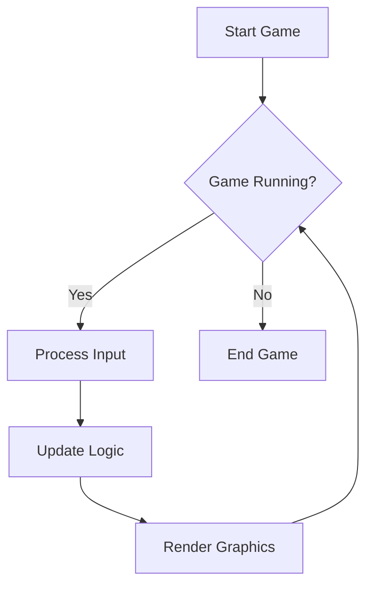
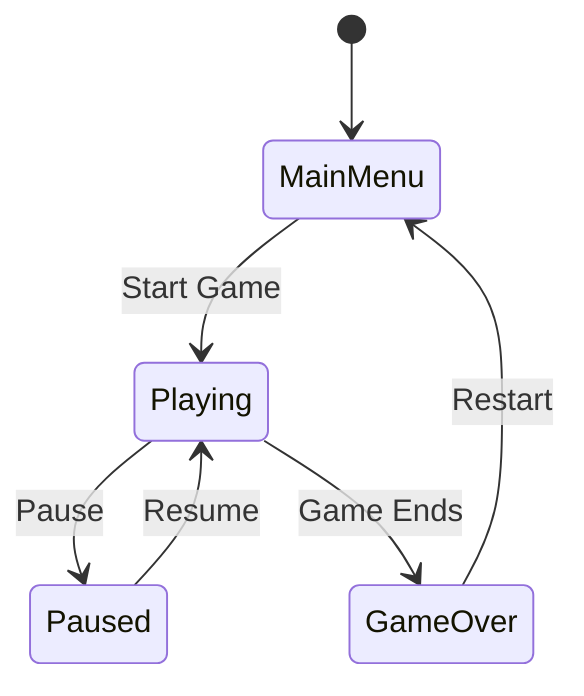

## 13.1.2 Implementing the Game Loop and State Management

In the world of game development, the **Game Loop** and **State Management** are foundational concepts that ensure a game runs smoothly and responds dynamically to user interactions. This section will delve into these concepts, providing you with a thorough understanding of how to implement them using design patterns and practical coding examples. By the end of this chapter, you'll be equipped to create a simple game with robust state management.

### Understanding the Game Loop Pattern

#### What is the Game Loop?

The **Game Loop** is the heartbeat of a game, a continuous cycle that ensures the game world is updated and rendered consistently. It is responsible for capturing input, updating game logic, and rendering graphics. This loop runs as fast as the hardware allows, typically aiming for a consistent frame rate to ensure smooth gameplay.

##### Components of the Game Loop

1. **Input Handling:** 
   - This component captures and processes user inputs, such as keyboard presses or mouse clicks, which are then used to affect game behavior.

2. **Update Logic:** 
   - Here, the game updates its state. This includes moving characters, detecting collisions, and managing game physics.

3. **Rendering:** 
   - This final component draws the updated game state to the screen, providing visual feedback to the player.

##### Simplified Pseudocode Example

Below is a basic structure of a game loop in pseudocode:

```plaintext
while game is running:
    process_input()
    update_game_logic()
    render_graphics()
```

This pseudocode highlights the cyclical nature of the game loop, continuously processing input, updating the game state, and rendering the output.

### Managing Game States

#### The Concept of Game States

Games often consist of multiple states, such as **Main Menu**, **Playing**, **Paused**, and **Game Over**. Each state represents a different mode of operation, with unique behaviors and rules.

#### Introducing the State Pattern

The **State Pattern** is a behavioral design pattern that allows an object to change its behavior when its internal state changes. It is particularly useful in game development for managing different game states. By encapsulating state-specific behaviors in separate classes, the game can transition smoothly between states.

##### Implementation Strategies

1. **State Machines:**
   - Use a state machine to manage transitions between states. This approach provides a clear and organized way to handle complex state transitions.

2. **Separate Classes for Each State:**
   - Implement each game state as a separate class. This modular approach enhances code maintainability and scalability.

### Practical Code Examples

#### Implementing the Game Loop in Python with Pygame

**Pygame** is a popular library for game development in Python. Here's how you can implement a basic game loop using Pygame:

```python
import pygame
import sys

pygame.init()

screen = pygame.display.set_mode((800, 600))
pygame.display.set_caption('Simple Game Loop')

running = True
while running:
    # Event handling
    for event in pygame.event.get():
        if event.type == pygame.QUIT:
            running = False

    # Update game logic
    # (e.g., move objects, check collisions)

    # Render graphics
    screen.fill((0, 0, 0))  # Clear screen with black
    # (draw game objects here)
    pygame.display.flip()  # Update the full display Surface to the screen

pygame.quit()
sys.exit()
```

**Code Explanation:**
- **Event Handling:** Captures user inputs such as closing the window.
- **Update Logic:** Placeholder for updating game objects and physics.
- **Rendering:** Clears the screen and renders updated objects.

#### Implementing the Game Loop in JavaScript with `requestAnimationFrame`

For web-based games, `requestAnimationFrame` is the preferred method for creating a game loop. It synchronizes with the display refresh rate, ensuring smooth animations.

```javascript
function gameLoop() {
    processInput();
    updateGameLogic();
    renderGraphics();
    requestAnimationFrame(gameLoop);
}

// Start the game loop
requestAnimationFrame(gameLoop);
```

**Code Explanation:**
- **`requestAnimationFrame`:** Efficiently manages the game loop by calling the `gameLoop` function before the next repaint.
- **Modular Functions:** `processInput`, `updateGameLogic`, and `renderGraphics` are modular functions for handling respective tasks.

### Timing and Frame Rates

Managing consistent timing is crucial for ensuring smooth gameplay. This involves calculating the **delta time** (the time difference between frames) to make movement and animations frame-independent.

#### Delta Time Calculation

Delta time allows you to update game objects based on the time elapsed since the last frame, ensuring consistent behavior regardless of frame rate variations.

```python
import time

previous_time = time.time()

while game_is_running:
    current_time = time.time()
    delta_time = current_time - previous_time
    previous_time = current_time

    update_game_objects(delta_time)
    render_graphics()
```

**Code Explanation:**
- **Delta Time:** Used to adjust movement and animations, making them independent of the frame rate.

### Visual Aids and Flowcharts

#### Game Loop Process Flowchart



This flowchart illustrates the continuous cycle of the game loop, emphasizing the repetitive nature of input processing, logic updates, and rendering.

#### State Transition Diagram



This diagram depicts the transitions between different game states, showcasing how the game can move from one state to another based on user actions or game events.

### Progressive Building and Hands-On Practice

To solidify your understanding, start with a minimal implementation of the game loop and progressively add features such as collision detection, scoring, and more complex state management. Experiment with the provided code examples, modify them, and observe how changes affect the game.

### Best Practices and Common Pitfalls

#### Best Practices

- **Modular Design:** Keep your code modular by separating concerns (input, logic, rendering).
- **Consistent Timing:** Use delta time for frame-independent updates.
- **State Management:** Use the State Pattern to handle different game states effectively.

#### Common Pitfalls

- **Ignoring Frame Rates:** Failing to account for varying frame rates can lead to inconsistent game behavior.
- **Complex State Transitions:** Overcomplicating state transitions can lead to difficult-to-maintain code. Use clear and concise state management strategies.

### Conclusion

Implementing a robust game loop and effective state management is crucial for creating engaging and responsive games. By understanding the Game Loop pattern and employing the State Pattern for managing game states, you can build games that are both dynamic and maintainable. As you experiment with the provided examples and explore further, you'll gain the skills needed to tackle more complex game development challenges.

## Quiz Time!



### What is the primary purpose of the Game Loop in game development?

- [x] To continuously update the game state and render graphics.
- [ ] To handle user authentication.
- [ ] To manage network connections.
- [ ] To store game data in a database.

> **Explanation:** The Game Loop is responsible for continuously updating the game state and rendering graphics to ensure smooth gameplay.

### Which of the following is NOT a component of the Game Loop?

- [ ] Input Handling
- [ ] Update Logic
- [x] Data Encryption
- [ ] Rendering

> **Explanation:** Data Encryption is not a component of the Game Loop. The Game Loop consists of Input Handling, Update Logic, and Rendering.

### What is the State Pattern used for in game development?

- [x] To manage different game states and their behaviors.
- [ ] To encrypt game data.
- [ ] To optimize game performance.
- [ ] To handle network communication.

> **Explanation:** The State Pattern is used to manage different game states and their specific behaviors, allowing the game to change its behavior when its state changes.

### How does `requestAnimationFrame` benefit a game loop in JavaScript?

- [x] It synchronizes with the display refresh rate for smooth animations.
- [ ] It encrypts data for secure transmission.
- [ ] It manages user authentication.
- [ ] It compresses game assets to reduce load times.

> **Explanation:** `requestAnimationFrame` synchronizes with the display refresh rate, ensuring smooth animations by calling the game loop before the next repaint.

### What is delta time used for in a game loop?

- [x] To make movement and animations frame-independent.
- [ ] To encrypt game data.
- [x] To ensure consistent timing across frames.
- [ ] To manage network latency.

> **Explanation:** Delta time is used to make movement and animations frame-independent, ensuring consistent timing across frames regardless of frame rate variations.

### In Pygame, what function is used to update the display after rendering graphics?

- [x] `pygame.display.flip()`
- [ ] `pygame.update()`
- [ ] `pygame.render()`
- [ ] `pygame.refresh()`

> **Explanation:** `pygame.display.flip()` is used to update the full display Surface to the screen after rendering graphics.

### What is a common pitfall when implementing a game loop?

- [x] Ignoring frame rates leading to inconsistent behavior.
- [ ] Using modular design.
- [x] Overcomplicating state transitions.
- [ ] Consistent timing.

> **Explanation:** Ignoring frame rates can lead to inconsistent game behavior, and overcomplicating state transitions can make the code difficult to maintain.

### Which diagram best represents state transitions in a game?

- [x] State Transition Diagram
- [ ] Flowchart
- [ ] Entity-Relationship Diagram
- [ ] Network Diagram

> **Explanation:** A State Transition Diagram best represents state transitions in a game, showing how the game moves from one state to another.

### What is the benefit of using separate classes for each game state?

- [x] It enhances code maintainability and scalability.
- [ ] It encrypts game data.
- [ ] It reduces memory usage.
- [ ] It speeds up rendering.

> **Explanation:** Using separate classes for each game state enhances code maintainability and scalability by keeping state-specific behaviors modular.

### True or False: The Game Loop is responsible for managing network connections.

- [ ] True
- [x] False

> **Explanation:** False. The Game Loop is not responsible for managing network connections; it focuses on updating the game state and rendering graphics.



By mastering the Game Loop and State Management, you lay the groundwork for developing more sophisticated games. Continue to explore and experiment with these concepts to expand your game development skills.
