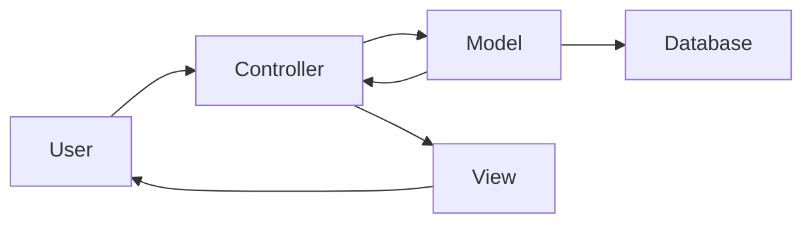

## 13.2.1 Defining Core Features and Architecture

In this section, we delve into the process of defining the core features and architecture for a blogging platform. This involves understanding the functional and non-functional requirements, selecting appropriate technologies, and planning the architectural structure. By the end of this chapter, you will have a comprehensive understanding of how to lay the groundwork for a robust blogging platform.

### Understanding the Requirements

Before diving into the technical details, it is crucial to outline the requirements of the blogging platform. This includes both functional and non-functional aspects that will guide the design and implementation process.

#### Functional Requirements

1. **User Registration and Authentication:**
   - Users should be able to register with a unique username and password.
   - Implement authentication mechanisms to secure user accounts and manage sessions.

2. **Creating, Editing, and Deleting Blog Posts:**
   - Users should have the ability to create new blog posts, edit existing ones, and delete posts they own.
   - Ensure a user-friendly interface for content creation and management.

3. **Commenting System:**
   - Allow readers to engage with content through comments.
   - Implement moderation features to manage inappropriate content.

4. **Categories or Tags:**
   - Organize posts using categories or tags to enhance discoverability and navigation.

5. **Administrative Interface:**
   - Provide an interface for administrators to manage users, posts, and comments.
   - Include analytics and reporting features to track platform performance.

#### Non-Functional Requirements

1. **Security:**
   - Implement secure data handling practices, including encryption and secure password storage.
   - Protect against common vulnerabilities such as SQL injection and cross-site scripting (XSS).

2. **Scalability:**
   - Design the platform to handle increasing numbers of users and content without performance degradation.

3. **Responsive Design:**
   - Ensure the platform is accessible on various devices, including desktops, tablets, and smartphones.

4. **SEO Optimization:**
   - Optimize the platform for search engines to improve visibility and traffic.

5. **Performance:**
   - Focus on fast load times and efficient resource usage to enhance user experience.

### Selecting Appropriate Technologies

Choosing the right technologies is a critical step in building a successful blogging platform. Here, we explore options for backend, database, and frontend technologies that align with the platform's requirements.

#### Backend Choices

For the backend, we consider both Python and JavaScript frameworks due to their popularity and beginner-friendly nature.

- **Python Frameworks:**
  - **Django:** A high-level Python web framework that encourages rapid development and clean, pragmatic design. It comes with built-in features for user authentication, an admin interface, and ORM for database interactions.
  - **Flask:** A lightweight Python web framework that provides flexibility and simplicity. It is suitable for smaller applications and allows for easy integration with various extensions.

- **JavaScript Frameworks:**
  - **Express.js with Node.js:** A minimal and flexible Node.js web application framework that provides a robust set of features for web and mobile applications. It is well-suited for building RESTful APIs and handling asynchronous operations.

#### Database Selection

Choosing the right database depends on the platform's complexity and scalability needs.

- **SQLite:** A lightweight, file-based database that is easy to set up and use. It is ideal for small to medium-sized applications.
- **PostgreSQL/MySQL:** More robust relational databases that offer advanced features such as transactions, indexing, and scalability. They are suitable for larger applications with complex data requirements.

#### Frontend Technologies

The frontend of the blogging platform should provide an intuitive and responsive user interface.

- **HTML, CSS, and JavaScript:** The foundational technologies for building web interfaces. They provide the structure, style, and interactivity needed for a user-friendly experience.
- **Frontend Frameworks:**
  - **React:** A JavaScript library for building user interfaces, known for its component-based architecture and efficient rendering.
  - **Vue.js:** A progressive JavaScript framework that is easy to integrate into projects and offers features like two-way data binding and component-based development.

### Planning the Platform's Architectural Structure

With the requirements and technologies in mind, we can now plan the architectural structure of the blogging platform. This involves defining the overall architecture, implementing design patterns, and ensuring modularity.

#### MVC Pattern Implementation

The Model-View-Controller (MVC) pattern is a popular architectural pattern that separates an application into three interconnected components.

- **Model:** Represents the data layer and business logic. It interacts with the database and performs operations such as data validation and processing.
- **View:** Handles the presentation layer and user interface. It displays data to the user and captures user input.
- **Controller:** Acts as an intermediary between the Model and View. It processes user input, updates the Model, and refreshes the View.

Here's a diagram illustrating the MVC architecture for our blogging platform:

#### RESTful API Design

If the frontend and backend are developed separately, designing a RESTful API is essential for data exchange. A RESTful API provides a standardized way for the frontend to interact with the backend.

- **Endpoints:** Define endpoints for various operations such as creating posts, fetching comments, and managing users.
- **HTTP Methods:** Use standard HTTP methods (GET, POST, PUT, DELETE) to perform CRUD operations.
- **Data Format:** Use JSON as the data format for requests and responses to ensure compatibility across platforms.

#### Modular Design

Modularity is crucial for maintaining and scaling the platform. By dividing the application into distinct modules, each responsible for a specific functionality, we can achieve better organization and easier maintenance.

- **User Module:** Handles user registration, authentication, and profile management.
- **Post Module:** Manages blog posts, including creation, editing, and deletion.
- **Comment Module:** Facilitates commenting functionality and moderation.
- **Admin Module:** Provides administrative tools for managing the platform.

### Practical Considerations

When building a blogging platform, several practical considerations must be addressed to ensure a smooth development process and a successful product.

#### Security Considerations

- **Data Protection:** Use HTTPS to encrypt data in transit and secure sensitive information.
- **Authentication:** Implement secure authentication methods, such as OAuth or JWT, to protect user accounts.
- **Input Validation:** Validate user input to prevent SQL injection, XSS, and other vulnerabilities.

#### Scalability and Performance

- **Caching:** Use caching mechanisms to reduce database load and improve response times.
- **Load Balancing:** Distribute traffic across multiple servers to handle high loads and ensure availability.
- **Database Optimization:** Optimize database queries and use indexing to enhance performance.

#### Responsive and Accessible Design

- **Responsive Layouts:** Use CSS frameworks like Bootstrap or Tailwind CSS to create responsive layouts that adapt to different screen sizes.
- **Accessibility:** Ensure the platform is accessible to users with disabilities by following WCAG guidelines and using semantic HTML.

### Encouraging Customization and Engagement

Encourage readers to think about customizing the platform to their interests and needs. This can involve adding new features, integrating third-party services, or experimenting with different design patterns.

- **Feature Extensions:** Consider adding features such as social media integration, email notifications, or analytics tracking.
- **Theming and Customization:** Allow users to customize the appearance of their blogs with themes and templates.
- **Community Building:** Implement features that foster community engagement, such as user profiles, forums, or social sharing.

### Conclusion

Defining the core features and architecture of a blogging platform is a critical step in the development process. By understanding the requirements, selecting appropriate technologies, and planning a robust architecture, you can lay a strong foundation for a successful platform. Remember to prioritize security, scalability, and user experience to meet the needs of both content creators and readers.

## Quiz Time!



### What is the primary purpose of user authentication in a blogging platform?

- [x] To secure user accounts and manage sessions
- [ ] To organize posts using categories
- [ ] To optimize the platform for search engines
- [ ] To create a user-friendly interface

> **Explanation:** User authentication is crucial for securing user accounts and managing sessions, ensuring that only authorized users can access certain features.

### Which Python framework is known for its rapid development and built-in features for web applications?

- [x] Django
- [ ] Flask
- [ ] Express.js
- [ ] React

> **Explanation:** Django is a high-level Python web framework known for its rapid development capabilities and built-in features like user authentication and an admin interface.

### What is a key benefit of using the MVC pattern in web development?

- [x] Separation of concerns into Model, View, and Controller components
- [ ] Improved SEO optimization
- [ ] Enhanced database performance
- [ ] Faster load times

> **Explanation:** The MVC pattern helps separate concerns into Model, View, and Controller components, improving organization and maintainability.

### Which database is recommended for small to medium-sized applications due to its simplicity?

- [x] SQLite
- [ ] PostgreSQL
- [ ] MySQL
- [ ] MongoDB

> **Explanation:** SQLite is a lightweight, file-based database that is easy to set up and use, making it ideal for small to medium-sized applications.

### What is the role of the Controller in the MVC architecture?

- [x] Acts as an intermediary between the Model and View
- [ ] Represents the data layer and business logic
- [ ] Handles the presentation layer and user interface
- [ ] Manages database interactions

> **Explanation:** The Controller acts as an intermediary between the Model and View, processing user input and updating the Model and View accordingly.

### Why is HTTPS important for a blogging platform?

- [x] To encrypt data in transit and secure sensitive information
- [ ] To improve load balancing
- [ ] To enhance database optimization
- [ ] To enable responsive design

> **Explanation:** HTTPS encrypts data in transit, securing sensitive information and protecting against eavesdropping and man-in-the-middle attacks.

### What is a RESTful API used for in a web application?

- [x] Standardizing data exchange between frontend and backend
- [ ] Improving SEO optimization
- [ ] Enhancing user interface design
- [ ] Managing database queries

> **Explanation:** A RESTful API provides a standardized way for the frontend to interact with the backend, facilitating data exchange and communication.

### Which frontend framework is known for its component-based architecture and efficient rendering?

- [x] React
- [ ] Vue.js
- [ ] Django
- [ ] Express.js

> **Explanation:** React is known for its component-based architecture and efficient rendering, making it a popular choice for building user interfaces.

### What is a common method for improving performance in a web application?

- [x] Caching
- [ ] Using semantic HTML
- [ ] Implementing OAuth
- [ ] Following WCAG guidelines

> **Explanation:** Caching reduces database load and improves response times, enhancing overall performance in a web application.

### True or False: Modularity in a web application makes it easier to maintain and scale.

- [x] True
- [ ] False

> **Explanation:** Modularity allows for better organization and separation of concerns, making it easier to maintain and scale a web application.


