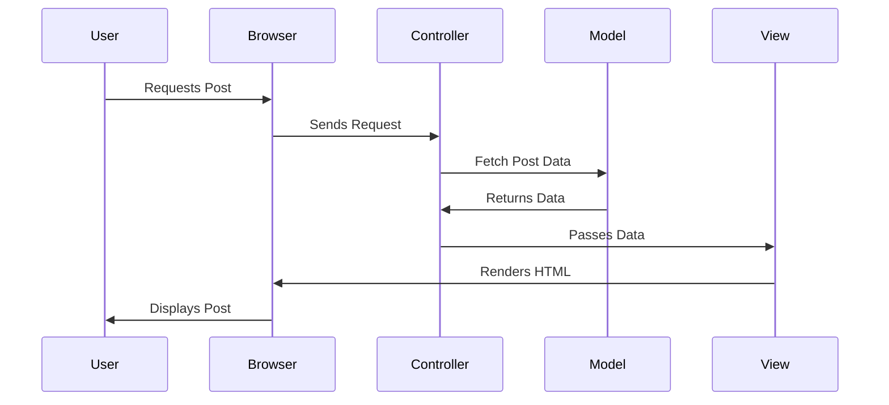

## 13.2.2 Implementing MVC Pattern for Web Application

In this section, we will delve into the implementation of the Model-View-Controller (MVC) pattern for web applications, focusing on building a blogging platform. We'll explore how to design the application using MVC, discuss the separation of concerns, and provide practical code examples using Python's Django framework and JavaScript's Express.js framework. By the end of this chapter, you'll have a solid understanding of how to implement MVC in a real-world scenario.

### Designing the Application Using the MVC Pattern

The MVC pattern is a software architectural pattern that separates an application into three main components: the Model, the View, and the Controller. This separation helps manage complexity by dividing the application into distinct sections with specific responsibilities.

#### Models

Models are the backbone of the MVC architecture, representing the data and business logic of the application. In our blogging platform, we will define data models for users, posts, comments, and categories.

1. **User Model:**
   - Represents the users of the blogging platform.
   - Attributes: `username`, `email`, `password`, `profile_picture`.

2. **Post Model:**
   - Represents individual blog posts.
   - Attributes: `title`, `content`, `author` (linked to User), `created_at`, `updated_at`.

3. **Comment Model:**
   - Represents comments made on blog posts.
   - Attributes: `content`, `post` (linked to Post), `author` (linked to User), `created_at`.

4. **Category Model:**
   - Represents categories for organizing posts.
   - Attributes: `name`, `description`.

**Relationships between Models:**

- **One-to-Many Relationship:** A user can author multiple posts, but each post is authored by a single user.
- **Many-to-One Relationship:** Multiple comments can be associated with a single post, but each comment is linked to a single post.
- **Many-to-Many Relationship:** Posts can belong to multiple categories, and categories can contain multiple posts.

```python

from django.db import models
from django.contrib.auth.models import User

class Category(models.Model):
    name = models.CharField(max_length=100)
    description = models.TextField()

class Post(models.Model):
    title = models.CharField(max_length=200)
    content = models.TextField()
    author = models.ForeignKey(User, on_delete=models.CASCADE)
    categories = models.ManyToManyField(Category)
    created_at = models.DateTimeField(auto_now_add=True)
    updated_at = models.DateTimeField(auto_now=True)

class Comment(models.Model):
    content = models.TextField()
    post = models.ForeignKey(Post, on_delete=models.CASCADE)
    author = models.ForeignKey(User, on_delete=models.CASCADE)
    created_at = models.DateTimeField(auto_now_add=True)
```

#### Views

Views are responsible for presenting data to the user. They render the user interface and display data from the models. In our blogging platform, views will include templates for displaying blog post pages, user profiles, and more.

- **Blog Post Page:** Displays the title, content, author, and comments of a post.
- **User Profile Page:** Shows user information and their authored posts.

**Responsive and Accessible Views:**

Ensuring that views are responsive and accessible is crucial for providing a good user experience. This involves using responsive design techniques and adhering to accessibility standards.

```html
<!-- Django Template Example -->




  <h1>{{ post.title }}</h1>
  <p>By {{ post.author.username }} on {{ post.created_at }}</p>
  <div>{{ post.content }}</div>
  <h3>Comments</h3>
  
    <p>{{ comment.author.username }}: {{ comment.content }}</p>
  

```

#### Controllers

Controllers handle user requests, process data, and return responses. They act as intermediaries between the model and the view.

- **Routing and URL Mapping:** Controllers map URLs to specific functions or methods that handle requests.
- **Logic Implementation:** Controllers contain the logic for processing requests, such as retrieving data from models and rendering views.

```python

from django.shortcuts import render, get_object_or_404
from .models import Post

def post_detail(request, post_id):
    post = get_object_or_404(Post, id=post_id)
    return render(request, 'post_detail.html', {'post': post})
```

### Discuss Separation of Concerns

Separation of concerns is a fundamental principle of the MVC pattern. It promotes organized code and simplifies debugging by dividing the application into distinct components with specific responsibilities.

#### Benefits

- **Organized Code:** MVC separates the application logic, making it easier to manage and understand.
- **Easier Debugging:** Isolating components reduces the complexity of debugging, as issues can be traced to specific parts of the application.

#### Implementation

Each component of the MVC pattern interacts while remaining independent. For example, a request from the browser is handled by a controller, which retrieves data from the model and passes it to the view for rendering.

**Example Request Flow:**

1. **Request:** A user requests a blog post by navigating to a specific URL.
2. **Controller:** The controller receives the request, retrieves the post from the model, and passes it to the view.
3. **View:** The view renders the post data into an HTML template and sends it back to the user's browser.



### Provide Code Examples in a Web Framework

#### Python Example (Django)

Django is a high-level Python web framework that encourages rapid development and clean, pragmatic design. It follows the MVC pattern, although it refers to it as MTV (Model-Template-View).

**Implementing Models:**

Django's ORM (Object-Relational Mapping) simplifies database interactions by allowing you to define models as Python classes.

```python

from django.db import models
from django.contrib.auth.models import User

class Post(models.Model):
    title = models.CharField(max_length=200)
    content = models.TextField()
    author = models.ForeignKey(User, on_delete=models.CASCADE)
    created_at = models.DateTimeField(auto_now_add=True)
    updated_at = models.DateTimeField(auto_now=True)
```

**Creating Views:**

Django supports both function-based and class-based views. Function-based views are simple to understand and use for straightforward logic.

```python

from django.shortcuts import render, get_object_or_404
from .models import Post

def post_detail(request, post_id):
    post = get_object_or_404(Post, id=post_id)
    return render(request, 'post_detail.html', {'post': post})
```

**Django Templates:**

Django templates are used to render HTML. They support template inheritance and a variety of built-in template tags and filters.

```html
<!-- Django Template Example -->




  <h1>{{ post.title }}</h1>
  <p>By {{ post.author.username }} on {{ post.created_at }}</p>
  <div>{{ post.content }}</div>
  <h3>Comments</h3>
  
    <p>{{ comment.author.username }}: {{ comment.content }}</p>
  

```

#### JavaScript Example (Express.js)

Express.js is a minimal and flexible Node.js web application framework that provides a robust set of features for building web applications. It follows the MVC pattern by organizing the application into routes, middleware, and views.

**Defining Routes:**

Routes in Express.js handle HTTP requests and define the application's endpoints.

```javascript
// Express.js Routes Example

const express = require('express');
const router = express.Router();
const Post = require('../models/post');

// Route to get a specific post
router.get('/post/:id', async (req, res) => {
  try {
    const post = await Post.findById(req.params.id);
    res.render('post', { post });
  } catch (error) {
    res.status(404).send('Post not found');
  }
});

module.exports = router;
```

**Using Middleware:**

Middleware functions in Express.js are functions that have access to the request object, the response object, and the next middleware function in the application’s request-response cycle.

```javascript
// Express.js Middleware Example

const express = require('express');
const app = express();

// Middleware to log requests
app.use((req, res, next) => {
  console.log(`${req.method} ${req.url}`);
  next();
});
```

**Integrating with a Templating Engine:**

Express.js can be integrated with templating engines like EJS or Handlebars to render HTML.

```html
<!-- EJS Template Example -->

<!DOCTYPE html>
<html>
<head>
    <title><%= post.title %></title>
</head>
<body>
    <h1><%= post.title %></h1>
    <p>By <%= post.author.username %> on <%= post.createdAt %></p>
    <div><%= post.content %></div>
</body>
</html>
```

### Encouraging Practice

To reinforce your understanding of the MVC pattern, try implementing additional features in the blogging platform. Here are some exercises:

1. **Search Functionality:** Implement a search feature that allows users to search for posts by title or content.
2. **User Profiles:** Create a user profile page that displays user information and their authored posts.
3. **Comment Moderation:** Add functionality for users to edit or delete their comments.

### Conclusion

Implementing the MVC pattern in web applications provides a structured approach to building scalable and maintainable software. By separating the application into models, views, and controllers, developers can manage complexity and enhance the user experience. Whether using Django or Express.js, understanding the MVC pattern is essential for modern web development.

## Quiz Time!



### What are the three main components of the MVC pattern?

- [x] Model, View, Controller
- [ ] Model, View, Component
- [ ] Module, View, Controller
- [ ] Model, Viewer, Controller

> **Explanation:** MVC stands for Model, View, and Controller, which are the three main components of this architectural pattern.

### In the MVC pattern, which component is responsible for handling user requests and processing data?

- [ ] Model
- [ ] View
- [x] Controller
- [ ] Component

> **Explanation:** The Controller is responsible for handling user requests, processing data, and returning responses.

### Which Django feature is used to define database interactions in the MVC pattern?

- [ ] Templates
- [x] ORM (Object-Relational Mapping)
- [ ] Middleware
- [ ] Views

> **Explanation:** Django's ORM is used to define models and interact with the database.

### What type of relationship exists between users and posts in the blogging platform?

- [x] One-to-Many
- [ ] Many-to-One
- [ ] Many-to-Many
- [ ] One-to-One

> **Explanation:** A user can author multiple posts, indicating a one-to-many relationship.

### Which templating engine can be used with Express.js to render HTML?

- [x] EJS
- [x] Handlebars
- [ ] Jinja
- [ ] Django Templates

> **Explanation:** EJS and Handlebars are popular templating engines used with Express.js.

### What is the main benefit of the separation of concerns in the MVC pattern?

- [x] Organized code and easier debugging
- [ ] Faster execution speed
- [ ] Reduced memory usage
- [ ] Increased complexity

> **Explanation:** Separation of concerns leads to organized code and simplifies debugging by isolating components.

### In Django, what is the purpose of a view?

- [ ] To define data models
- [x] To render templates and display data
- [ ] To handle database interactions
- [ ] To manage user authentication

> **Explanation:** In Django, views are responsible for rendering templates and displaying data to the user.

### Which Express.js feature is used to handle HTTP requests?

- [ ] Templates
- [x] Routes
- [ ] Models
- [ ] Views

> **Explanation:** Routes in Express.js handle HTTP requests and define the application's endpoints.

### What is the purpose of middleware in Express.js?

- [ ] To define database models
- [ ] To render HTML templates
- [x] To process requests and responses
- [ ] To handle URL mapping

> **Explanation:** Middleware functions in Express.js process requests and responses and have access to the request object, the response object, and the next middleware function.

### True or False: In the MVC pattern, the Model component is responsible for rendering the user interface.

- [ ] True
- [x] False

> **Explanation:** The Model component is responsible for representing the data and business logic, not rendering the user interface.


