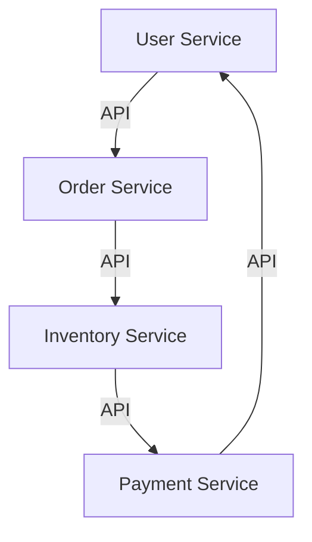
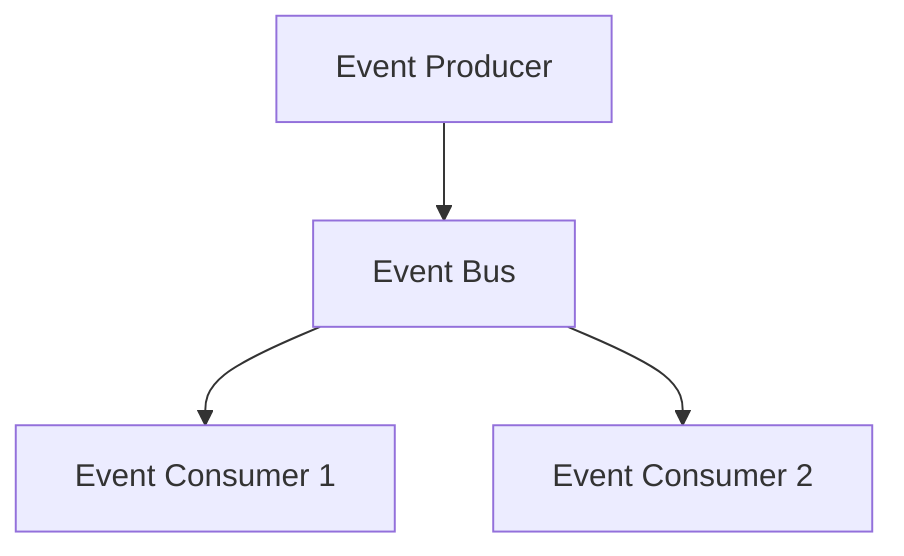
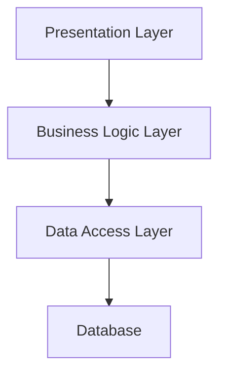

## 14.1.1 Advanced Design Patterns

As you progress in your software development journey, you'll encounter challenges that require more sophisticated solutions than those provided by fundamental design patterns. This section introduces advanced design patterns that can help you tackle these challenges, including Dependency Injection, Service Locator, Resource Acquisition Is Initialization (RAII), and Null Object Pattern. Additionally, we'll explore domain-specific patterns relevant to concurrency, enterprise integration, and distributed systems, as well as architectural patterns that shape the structure of complex applications.

### Advanced Patterns: Expanding Your Toolkit

While this book has covered essential design patterns, there exists a plethora of advanced patterns that address specific and complex problems in software design. Mastering these patterns can significantly enhance your problem-solving abilities and improve the quality of your software.

#### Dependency Injection

Dependency Injection (DI) is a pattern that facilitates loose coupling by removing the responsibility of instantiating dependencies from a class. Instead, dependencies are provided to the class, typically through its constructor or a setter method. This pattern is particularly useful in large applications where managing dependencies manually can become cumbersome.

**Example in Python:**

```python
class Database:
    def connect(self):
        print("Connecting to database...")

class UserService:
    def __init__(self, database: Database):
        self.database = database

    def perform_action(self):
        self.database.connect()
        print("Performing user action.")

db = Database()
user_service = UserService(db)
user_service.perform_action()
```

**Benefits:**
- Enhances testability by allowing mock dependencies.
- Promotes loose coupling and adherence to the Single Responsibility Principle.

#### Service Locator

The Service Locator pattern provides a centralized registry that offers access to various services. It abstracts the instantiation logic and allows components to request services from a central location.

**Example in JavaScript:**

```javascript
class ServiceLocator {
    constructor() {
        this.services = {};
    }

    addService(name, service) {
        this.services[name] = service;
    }

    getService(name) {
        return this.services[name];
    }
}

const locator = new ServiceLocator();
locator.addService('logger', console);
const logger = locator.getService('logger');
logger.log('Service Locator Pattern Example');
```

**Benefits:**
- Centralizes service management.
- Simplifies service retrieval and promotes reusability.

#### Resource Acquisition Is Initialization (RAII)

RAII is a pattern primarily used in languages like C++ to manage resource lifetimes. It ties resource management to object lifetime, ensuring resources are acquired during object creation and released during destruction.

**Conceptual Example:**

```cpp
class File {
public:
    File(const std::string& filename) {
        file.open(filename);
    }
    ~File() {
        file.close();
    }

private:
    std::ofstream file;
};
```

**Benefits:**
- Automatically manages resource allocation and deallocation.
- Reduces resource leaks and enhances exception safety.

#### Null Object Pattern

The Null Object Pattern provides an object with a neutral ("null") behavior to avoid null checks and simplify code logic.

**Example in Python:**

```python
class NullLogger:
    def log(self, message):
        pass  # Do nothing

class Application:
    def __init__(self, logger=None):
        self.logger = logger or NullLogger()

    def run(self):
        self.logger.log("Application is running.")

app = Application()
app.run()  # No need to check if logger is None
```

**Benefits:**
- Simplifies code by eliminating null checks.
- Provides a default behavior that can be easily extended.

### Domain-Specific Patterns

As software projects grow in complexity, domain-specific patterns become increasingly important. These patterns address challenges unique to specific domains, such as concurrency, enterprise integration, and distributed systems.

#### Concurrency Patterns

Concurrency patterns help manage the complexity of concurrent execution in software applications, ensuring safe and efficient data processing.

##### Producer-Consumer

The Producer-Consumer pattern manages asynchronous data exchange between processes or threads, decoupling the production of data from its consumption.

**Scenario:** A web server handling incoming requests can use a producer-consumer pattern to queue requests (produced by clients) and process them (consumed by worker threads).

**Example in Python:**

```python
import queue
import threading

def producer(q):
    for i in range(5):
        q.put(i)
        print(f"Produced {i}")

def consumer(q):
    while not q.empty():
        item = q.get()
        print(f"Consumed {item}")

q = queue.Queue()
producer_thread = threading.Thread(target=producer, args=(q,))
consumer_thread = threading.Thread(target=consumer, args=(q,))

producer_thread.start()
producer_thread.join()
consumer_thread.start()
consumer_thread.join()
```

**Benefits:**
- Enhances system throughput by decoupling production and consumption.
- Provides a buffer for handling variable load.

##### Thread Pool

The Thread Pool pattern optimizes resource usage by maintaining a pool of threads ready to execute tasks, reducing the overhead of thread creation and destruction.

**Scenario:** A server application that processes multiple requests simultaneously can use a thread pool to manage resources efficiently.

**Example in JavaScript (Node.js):**

```javascript
const { Worker, isMainThread, parentPort } = require('worker_threads');

if (isMainThread) {
    const pool = [];
    for (let i = 0; i < 4; i++) {
        const worker = new Worker(__filename);
        pool.push(worker);
    }
    pool.forEach(worker => worker.postMessage('Hello, Worker!'));
} else {
    parentPort.on('message', (message) => {
        console.log(`Worker received: ${message}`);
    });
}
```

**Benefits:**
- Reduces latency by reusing existing threads.
- Improves system scalability and performance.

##### Actor Model

The Actor Model is a concurrency pattern that treats "actors" as the fundamental units of computation. Actors communicate asynchronously through message passing, making it suitable for distributed systems.

**Scenario:** A chat application where each user is represented as an actor, handling messages independently.

**Conceptual Example:**

```plaintext
Actor A -> sends message -> Actor B
Actor B -> processes message -> sends response
```

**Benefits:**
- Simplifies concurrency by avoiding shared state.
- Scales well in distributed environments.

### Architectural Patterns

Architectural patterns define the overall structure of software applications, guiding the organization of code and components.

#### Microservices Architecture

Microservices Architecture decomposes applications into loosely coupled, independently deployable services. Each service focuses on a specific business capability and communicates with others through well-defined APIs.

**Benefits:**
- Enhances scalability and flexibility.
- Facilitates continuous deployment and integration.

**Diagram:**



#### Event-Driven Architecture

Event-Driven Architecture organizes systems around the production, detection, and consumption of events. It allows components to react asynchronously to changes, promoting decoupling and scalability.

**Benefits:**
- Supports real-time processing and responsiveness.
- Facilitates integration of heterogeneous systems.

**Diagram:**



#### Layered Architecture

Layered Architecture organizes code into distinct layers, such as presentation, business logic, and data access. This separation of concerns simplifies maintenance and enhances modularity.

**Benefits:**
- Promotes code organization and reusability.
- Simplifies testing and debugging.

**Diagram:**



### Resources for Further Study

To deepen your understanding of advanced design patterns, consider exploring the following resources:

#### Books

- *"Patterns of Enterprise Application Architecture"* by Martin Fowler
- *"Designing Data-Intensive Applications"* by Martin Kleppmann

#### Courses and Tutorials

- Online platforms like Coursera, Udemy, and Pluralsight offer courses on advanced design patterns and software architecture.

#### Communities and Forums

- Participate in forums such as Stack Overflow, Reddit's r/programming, and specialized groups for in-depth discussions and knowledge sharing.

### Encouraging Exploration

As you continue your journey in software development, exploring advanced design patterns that align with your interests or project needs can significantly enhance your skills. Mastering these patterns not only improves your problem-solving abilities but also prepares you to tackle complex software challenges effectively.

### Connecting to Previous Knowledge

The advanced patterns discussed in this section build upon the foundational concepts covered earlier in this book. By understanding these patterns, you can see the continuity in learning and how advanced techniques extend basic principles to address more complex scenarios.

## Quiz Time!



### What is the primary benefit of Dependency Injection?

- [x] It promotes loose coupling and enhances testability.
- [ ] It centralizes service management.
- [ ] It automatically manages resource allocation.
- [ ] It provides a neutral behavior for null objects.

> **Explanation:** Dependency Injection promotes loose coupling by allowing dependencies to be injected rather than instantiated within the class, enhancing testability and adherence to design principles.

### Which pattern provides a centralized registry for service access?

- [ ] Dependency Injection
- [x] Service Locator
- [ ] Null Object Pattern
- [ ] RAII

> **Explanation:** The Service Locator pattern provides a centralized registry that offers access to various services, abstracting the instantiation logic.

### What is a key advantage of the Null Object Pattern?

- [ ] It enhances resource management.
- [x] It simplifies code by eliminating null checks.
- [ ] It promotes loose coupling.
- [ ] It manages asynchronous data exchange.

> **Explanation:** The Null Object Pattern simplifies code by providing a default behavior that eliminates the need for null checks, ensuring consistent behavior.

### In which pattern do actors communicate asynchronously through message passing?

- [ ] Producer-Consumer
- [ ] Thread Pool
- [x] Actor Model
- [ ] Microservices Architecture

> **Explanation:** The Actor Model treats actors as fundamental units of computation that communicate asynchronously through message passing, suitable for distributed systems.

### Which architectural pattern decomposes applications into loosely coupled services?

- [x] Microservices Architecture
- [ ] Event-Driven Architecture
- [ ] Layered Architecture
- [ ] Concurrency Patterns

> **Explanation:** Microservices Architecture decomposes applications into loosely coupled, independently deployable services, each focusing on a specific business capability.

### What is the primary benefit of Event-Driven Architecture?

- [ ] It promotes code organization and reusability.
- [x] It supports real-time processing and responsiveness.
- [ ] It enhances testability.
- [ ] It automatically manages resource allocation.

> **Explanation:** Event-Driven Architecture supports real-time processing by organizing systems around the production and consumption of events, promoting decoupling and scalability.

### Which pattern optimizes resource usage by maintaining a pool of threads?

- [ ] Producer-Consumer
- [x] Thread Pool
- [ ] Actor Model
- [ ] Service Locator

> **Explanation:** The Thread Pool pattern optimizes resource usage by maintaining a pool of threads ready to execute tasks, reducing the overhead of thread creation and destruction.

### What is the primary goal of Layered Architecture?

- [ ] To manage asynchronous data exchange.
- [ ] To enhance resource management.
- [ ] To provide a neutral behavior for null objects.
- [x] To promote code organization and reusability.

> **Explanation:** Layered Architecture organizes code into distinct layers, such as presentation, business logic, and data access, promoting code organization and reusability.

### Which pattern is primarily used in languages like C++ for resource management?

- [ ] Dependency Injection
- [ ] Service Locator
- [x] RAII
- [ ] Null Object Pattern

> **Explanation:** RAII (Resource Acquisition Is Initialization) is a pattern used in languages like C++ to manage resource lifetimes, tying resource management to object lifetime.

### True or False: The Producer-Consumer pattern decouples the production of data from its consumption.

- [x] True
- [ ] False

> **Explanation:** The Producer-Consumer pattern decouples the production of data from its consumption, allowing asynchronous data exchange between processes or threads.


