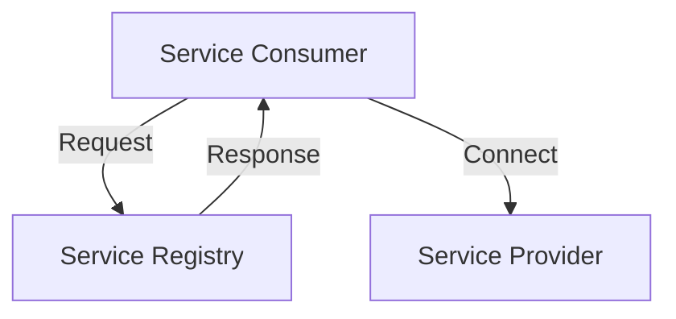

## 14.3.2 Distributed Systems and Microservices

In the ever-evolving landscape of software development, distributed systems and microservices have emerged as pivotal concepts that empower developers to build scalable, resilient, and efficient applications. As you prepare to delve into advanced topics, understanding these paradigms is crucial. This section will guide you through the complexities of distributed systems, the intricacies of microservices architecture, and the design patterns that can help manage these complexities.

### Understanding Distributed Systems

Distributed systems are collections of independent computers that appear to the users as a single coherent system. They are designed to solve complex problems by distributing the workload across multiple computing nodes. However, this distribution introduces several challenges that need to be addressed.

#### Challenges in Distributed Computing

1. **Network Unreliability:**
   - Networks are inherently unreliable. Messages can be delayed, lost, or duplicated. Handling these issues requires robust communication protocols and error-handling mechanisms.

2. **Latency:**
   - The time it takes for data to travel between nodes can affect system performance. Minimizing latency is crucial for maintaining a responsive system.

3. **Data Consistency:**
   - Ensuring data consistency across distributed nodes is challenging. Systems must decide between strong consistency and eventual consistency based on their requirements.

4. **Fault Tolerance:**
   - Systems must be resilient to failures. This involves designing for redundancy and implementing mechanisms to recover from failures without significant downtime.

#### Design Considerations for Distributed Systems

- **Eventual Consistency:**
  - In distributed systems, achieving immediate consistency is often impractical. Eventual consistency allows systems to remain available and partition-tolerant, with the understanding that data will become consistent over time.

- **Distributed Transactions:**
  - Managing transactions across multiple nodes requires careful coordination to ensure atomicity, consistency, isolation, and durability (ACID). Techniques like two-phase commit or compensating transactions can be employed.

- **Consensus Algorithms:**
  - Algorithms like Paxos and Raft are used to achieve consensus in distributed systems, ensuring that nodes agree on a single data value or course of action.

### Microservices Architecture

Microservices architecture is an approach to designing software applications as a collection of loosely coupled services. Each service is responsible for a specific business function and can be developed, deployed, and scaled independently.

#### Benefits of Microservices

- **Scalability:**
  - Services can be scaled independently based on demand, optimizing resource usage.

- **Flexibility:**
  - Teams can choose different technologies and frameworks for each service, allowing for innovation and experimentation.

- **Resilience:**
  - Failures in one service do not necessarily affect others, enhancing overall system robustness.

#### Drawbacks of Microservices

- **Increased Complexity:**
  - Managing multiple services, each with its own lifecycle, can be complex and require sophisticated orchestration.

- **Inter-Service Communication:**
  - Services need to communicate over the network, introducing latency and potential points of failure.

- **Data Management:**
  - Ensuring data consistency across services can be challenging, often requiring distributed data management strategies.

### Design Patterns for Distributed Systems and Microservices

Several design patterns have been developed to address the challenges of distributed systems and microservices.

#### Circuit Breaker Pattern

The Circuit Breaker pattern is used to detect failures and prevent them from cascading across systems. It acts as a proxy for operations that might fail, allowing the system to fail fast and recover gracefully.

```python
class CircuitBreaker:
    def __init__(self, failure_threshold, recovery_timeout):
        self.failure_threshold = failure_threshold
        self.recovery_timeout = recovery_timeout
        self.failure_count = 0
        self.last_failure_time = None

    def call(self, func, *args, **kwargs):
        if self.failure_count >= self.failure_threshold:
            if time.time() - self.last_failure_time < self.recovery_timeout:
                raise Exception("Circuit breaker is open")
            else:
                self.failure_count = 0

        try:
            result = func(*args, **kwargs)
            self.failure_count = 0
            return result
        except Exception as e:
            self.failure_count += 1
            self.last_failure_time = time.time()
            raise e
```

#### Bulkhead Pattern

The Bulkhead pattern isolates components to prevent a failure in one part of the system from affecting others. This pattern is inspired by the bulkheads in a ship, which prevent water from flooding the entire vessel.

```javascript
class Bulkhead {
    constructor(maxConcurrentRequests) {
        this.maxConcurrentRequests = maxConcurrentRequests;
        this.currentRequests = 0;
    }

    async execute(task) {
        if (this.currentRequests >= this.maxConcurrentRequests) {
            throw new Error("Bulkhead limit reached");
        }

        this.currentRequests++;
        try {
            return await task();
        } finally {
            this.currentRequests--;
        }
    }
}
```

#### Service Discovery Pattern

In a microservices architecture, services need to find each other dynamically. The Service Discovery pattern enables this by maintaining a registry of available services and their locations.



### Exploring Cloud-Native Architectures

Cloud-native architectures leverage the cloud to build and run scalable applications in modern, dynamic environments.

#### Containerization

Containerization involves packaging applications and their dependencies into containers, which can run consistently across different environments. Tools like Docker and Kubernetes are essential for managing containerized applications.

- **Docker:**
  - Docker allows developers to create, deploy, and run applications in containers. It ensures consistency across development, testing, and production environments.

- **Kubernetes:**
  - Kubernetes is an orchestration tool that automates the deployment, scaling, and management of containerized applications. It provides features like load balancing, self-healing, and automated rollouts.

#### Serverless Computing

Serverless computing allows developers to build applications without managing the underlying infrastructure. Functions-as-a-service (FaaS) is a serverless model where functions are executed in response to events.

- **Event-Driven Processing:**
  - Serverless functions are ideal for event-driven architectures, where functions are triggered by events such as HTTP requests, database changes, or message queue updates.

#### Cloud Providers

Experimenting with cloud services from providers like AWS, Azure, or Google Cloud can enhance your understanding of distributed systems and microservices.

- **AWS Lambda:**
  - AWS Lambda is a serverless compute service that runs code in response to events and automatically manages the compute resources.

- **Azure Functions:**
  - Azure Functions is a serverless solution that allows you to write less code, maintain less infrastructure, and save on costs.

- **Google Cloud Functions:**
  - Google Cloud Functions is a lightweight, event-driven compute solution for developers to create single-purpose functions.

### Practical Exercises

To solidify your understanding of distributed systems and microservices, consider building simple applications that incorporate these concepts.

1. **Build a Microservices Application:**
   - Create a simple e-commerce application with separate services for user management, product catalog, and order processing. Use Docker to containerize each service and Kubernetes for orchestration.

2. **Implement a Circuit Breaker:**
   - Develop a service that calls an external API and uses the Circuit Breaker pattern to handle failures gracefully.

3. **Explore Serverless Architectures:**
   - Create a serverless function that processes incoming data from a message queue and stores it in a database.

### Recommended Resources

To further your knowledge, explore the following resources:

- **Books:**
  - "Designing Data-Intensive Applications" by Martin Kleppmann
  - "Building Microservices" by Sam Newman

- **Online Courses:**
  - "Distributed Systems" by MIT OpenCourseWare
  - "Microservices with Node.js" on Coursera

- **Documentation:**
  - [Docker Documentation](https://docs.docker.com/)
  - [Kubernetes Documentation](https://kubernetes.io/docs/)

## Quiz Time!



### What is a primary challenge of distributed systems?

- [x] Network unreliability
- [ ] High availability
- [ ] Monolithic architecture
- [ ] Centralized control

> **Explanation:** Network unreliability is a key challenge in distributed systems, as it can lead to message delays, losses, or duplications.

### Which design pattern helps prevent cascading failures in microservices?

- [x] Circuit Breaker
- [ ] Singleton
- [ ] Observer
- [ ] Factory

> **Explanation:** The Circuit Breaker pattern prevents cascading failures by detecting failures and stopping operations before they propagate.

### What is a benefit of microservices architecture?

- [x] Scalability
- [ ] Increased complexity
- [ ] Single point of failure
- [ ] Tight coupling

> **Explanation:** Microservices architecture allows for independent scaling of services, which enhances scalability.

### Which tool is used for orchestrating containerized applications?

- [ ] Docker
- [x] Kubernetes
- [ ] Ansible
- [ ] Jenkins

> **Explanation:** Kubernetes is an orchestration tool that automates the deployment, scaling, and management of containerized applications.

### What does eventual consistency mean in distributed systems?

- [x] Data will become consistent over time
- [ ] Immediate consistency across all nodes
- [ ] No consistency required
- [ ] Consistency only during failures

> **Explanation:** Eventual consistency means that the system will eventually reach a consistent state, even if not immediately.

### What is the purpose of the Bulkhead pattern?

- [x] Isolate components to prevent failure propagation
- [ ] Enable service discovery
- [ ] Handle distributed transactions
- [ ] Manage network latency

> **Explanation:** The Bulkhead pattern isolates components to prevent a failure in one part of the system from affecting others.

### Which cloud service model is best for event-driven processing?

- [x] Serverless computing
- [ ] Infrastructure as a Service (IaaS)
- [ ] Platform as a Service (PaaS)
- [ ] Software as a Service (SaaS)

> **Explanation:** Serverless computing, particularly functions-as-a-service, is ideal for event-driven architectures.

### What is a drawback of microservices architecture?

- [ ] Scalability
- [ ] Flexibility
- [x] Increased complexity
- [ ] Resilience

> **Explanation:** Microservices architecture can lead to increased complexity due to the need to manage multiple independent services.

### Which service allows for serverless functions on AWS?

- [x] AWS Lambda
- [ ] Azure Functions
- [ ] Google Cloud Functions
- [ ] AWS EC2

> **Explanation:** AWS Lambda is a serverless compute service that allows you to run code in response to events.

### True or False: Docker is used for container orchestration.

- [ ] True
- [x] False

> **Explanation:** Docker is used for containerization, while Kubernetes is used for container orchestration.



By understanding and applying the principles of distributed systems and microservices, you can build robust, scalable applications that meet the demands of modern software development. Keep exploring and experimenting to deepen your expertise in these transformative technologies.
