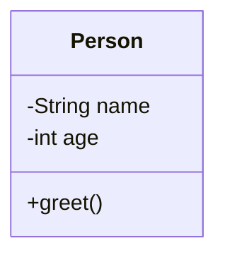

## 2.1.1 What Is OOP?

### Introduction

Object-Oriented Programming (OOP) is a revolutionary programming paradigm that has shaped the way software is designed and developed. At its core, OOP is about organizing software design around data, or objects, rather than focusing solely on functions and logic. This approach not only mirrors the way we perceive the real world but also enhances the modularity, flexibility, and maintainability of code. In this section, we will delve deep into the principles of OOP, explore its components, and understand how it compares with other programming paradigms, using practical examples in Python and JavaScript.

### Definition of OOP

OOP is a programming paradigm centered around the concept of "objects." An object is a self-contained unit that encapsulates data and the functions (or methods) that operate on that data. This encapsulation allows for data abstraction, where the internal workings of an object are hidden from the outside world, and interaction is done through a well-defined interface.

In OOP, software is designed by defining classes, which act as blueprints for creating objects. Each class can have attributes (data) and methods (functions) that define its behavior. This paradigm promotes a design approach that closely aligns with real-world entities and interactions.

### Real-World Analogies

To better understand OOP, consider how we interact with objects in the real world. Take, for instance, a car. A car is an object that has attributes such as color, model, and engine size, and it can perform actions like accelerating, braking, and turning. Similarly, in OOP, a car would be represented as an object with properties and methods that define its state and behavior.

This analogy extends to other real-world objects like phones, computers, or even more abstract concepts like bank accounts. By modeling these entities as objects, OOP allows us to create software that is intuitive and easier to manage.

### Components of OOP

#### Objects

Objects are the fundamental building blocks of OOP. They are instances of classes and encapsulate data and behavior. Each object can interact with other objects through methods, allowing for complex behaviors and interactions to be modeled in software.

#### Classes

Classes are the blueprints or templates from which objects are created. A class defines the properties (attributes) and behaviors (methods) that its objects will have. By using classes, developers can create multiple objects that share the same structure and behavior, promoting code reuse and consistency.

### Basic OOP Terminology

- **Class:** A blueprint for creating objects. It defines a set of attributes and methods that the created objects will have.
- **Object:** An instance of a class. It represents a specific entity with defined attributes and behaviors.
- **Method:** A function defined within a class that describes the behaviors of the objects.
- **Attribute:** A variable defined within a class that holds data specific to the object.
- **Message Passing:** The process by which objects communicate with each other by invoking methods.

### Programming Paradigms Comparison

#### Procedural Programming

Procedural programming is a paradigm that focuses on writing procedures or functions that operate on data. It is linear and structured, with a clear sequence of steps to be executed. While procedural programming is effective for small, simple tasks, it can become cumbersome and difficult to manage as software complexity increases.

#### Functional Programming

Functional programming is a paradigm that treats computation as the evaluation of mathematical functions. It emphasizes immutability and the avoidance of side effects. Functional programming can lead to more predictable and easier-to-test code, but it may not be as intuitive for modeling complex real-world interactions as OOP.

#### Object-Oriented Programming

OOP stands out by modeling software design around real-world entities. It allows for encapsulation, inheritance, and polymorphism, which are powerful tools for creating modular, reusable, and maintainable code. By focusing on objects rather than functions, OOP provides a more intuitive approach to software design, especially for complex systems.

### Code Examples

To illustrate the concepts of OOP, let's look at simple class definitions in Python and JavaScript.

#### Python Example

```python
class Person:
    def __init__(self, name, age):
        self.name = name
        self.age = age

    def greet(self):
        print(f"Hello, my name is {self.name}.")

person = Person("Alice", 30)
person.greet()
```

In this Python example, we define a `Person` class with two attributes, `name` and `age`, and a method `greet` that prints a greeting message. We then create an instance of the `Person` class, `person`, and call its `greet` method.

#### JavaScript Example

```javascript
class Person {
    constructor(name, age) {
        this.name = name;
        this.age = age;
    }

    greet() {
        console.log(`Hello, my name is ${this.name}.`);
    }
}

const person = new Person("Alice", 30);
person.greet();
```

Similarly, in JavaScript, we define a `Person` class with a constructor to initialize the attributes and a `greet` method. We then create an instance of `Person` and call the `greet` method.

### Visuals and Diagrams

To visualize the structure of the `Person` class, we can use a class diagram:



This diagram shows the `Person` class with its attributes `name` and `age`, and the `greet` method.

### Key Points to Emphasize

- **Encapsulation:** Objects combine data and behavior, promoting modularity and reuse. This encapsulation allows for data hiding and abstraction, making code easier to manage and understand.
- **Real-World Modeling:** OOP models software design closely to real-world concepts, making it intuitive and relatable. By using classes and objects, developers can create software that mirrors real-world interactions and entities.
- **Modularity and Reusability:** OOP encourages the creation of modular code that can be reused across different parts of a program or even in different projects. This reduces redundancy and improves maintainability.

### Conclusion

Object-Oriented Programming is a powerful paradigm that has transformed the way software is designed and developed. By focusing on objects and their interactions, OOP provides a more intuitive and flexible approach to programming, especially for complex systems. Through encapsulation, inheritance, and polymorphism, OOP promotes modularity, reusability, and maintainability, making it a preferred choice for many developers.

As you continue your journey in software development, understanding and mastering OOP will be crucial in building robust, scalable, and efficient software solutions. Whether you're working with Python, JavaScript, or any other object-oriented language, the principles of OOP will guide you in creating software that is both powerful and intuitive.

## Quiz Time!



### What is the main focus of Object-Oriented Programming (OOP)?

- [x] Organizing software design around data and objects
- [ ] Emphasizing the use of functions and logic
- [ ] Focusing on the sequential execution of tasks
- [ ] Avoiding the use of classes and methods

> **Explanation:** OOP organizes software design around data and objects, rather than functions and logic, allowing for encapsulation and modularity.


### What is an object in OOP?

- [x] An instance of a class that encapsulates data and behavior
- [ ] A blueprint for creating classes
- [ ] A function that operates on data
- [ ] A variable that holds data

> **Explanation:** An object is an instance of a class that encapsulates data and the methods that operate on that data.


### Which of the following is NOT a characteristic of OOP?

- [ ] Encapsulation
- [ ] Inheritance
- [ ] Polymorphism
- [x] Sequential execution

> **Explanation:** Sequential execution is a characteristic of procedural programming, not OOP, which focuses on encapsulation, inheritance, and polymorphism.


### In the context of OOP, what is a class?

- [x] A blueprint for creating objects
- [ ] A function that defines behavior
- [ ] A variable that stores data
- [ ] An instance of an object

> **Explanation:** A class is a blueprint or template for creating objects, defining their properties and behaviors.


### How does OOP differ from procedural programming?

- [x] OOP organizes code around objects, while procedural programming focuses on functions
- [ ] OOP is more efficient than procedural programming
- [x] OOP uses classes and objects, while procedural programming uses functions and procedures
- [ ] OOP is only used in web development

> **Explanation:** OOP organizes code around objects and uses classes, while procedural programming focuses on functions and procedures.


### What is encapsulation in OOP?

- [x] The practice of bundling data and methods within objects
- [ ] The ability to create new classes from existing ones
- [ ] The concept of objects taking many forms
- [ ] The process of executing code sequentially

> **Explanation:** Encapsulation is the practice of bundling data and methods within objects, allowing for data abstraction and hiding.


### What is a method in OOP?

- [x] A function defined within a class that describes the behaviors of objects
- [ ] A variable that holds data
- [x] A procedure that operates on data
- [ ] A blueprint for creating objects

> **Explanation:** A method is a function defined within a class that describes the behaviors of objects and operates on their data.


### What is the purpose of a constructor in a class?

- [x] To initialize the attributes of an object
- [ ] To define the behavior of an object
- [ ] To create a new class from an existing one
- [ ] To store data within an object

> **Explanation:** A constructor is used to initialize the attributes of an object when it is created.


### How do objects in OOP communicate with each other?

- [x] By invoking methods through message passing
- [ ] By sharing data directly
- [ ] By using global variables
- [ ] By executing functions sequentially

> **Explanation:** Objects communicate by invoking methods through message passing, allowing for interaction and behavior sharing.


### True or False: In OOP, a class can have multiple objects.

- [x] True
- [ ] False

> **Explanation:** True. A class can have multiple objects, each representing a unique instance with its own data and behavior.


