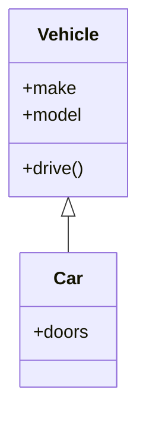

## 2.1.2 Benefits of OOP

In the ever-evolving landscape of software development, Object-Oriented Programming (OOP) stands as a cornerstone paradigm that addresses many of the challenges developers face. By structuring software around objects—entities that combine data and behavior—OOP offers a robust framework for building scalable, maintainable, and reusable code. This section delves into the core benefits of OOP, illustrating how it enhances software development practices.

### Modularity: Breaking Down Complexity

One of the primary benefits of OOP is its ability to break down complex problems into manageable, modular pieces. This modularity is achieved through the use of classes and objects, which encapsulate data and behavior in a single unit.

#### Understanding Modularity

Modularity in OOP allows developers to divide a program into discrete components. Each component, or class, is responsible for a specific part of the program's functionality. This separation of concerns makes it easier to manage, understand, and debug complex systems.

**Example: Modular Design in a Library System**

Consider a library management system. In a procedural approach, you might have a single script handling books, members, and transactions. In contrast, an OOP approach would involve creating separate classes for `Book`, `Member`, and `Transaction`. Each class would encapsulate its data and methods, such as `add_book`, `borrow_book`, and `return_book`.

```python
class Book:
    def __init__(self, title, author):
        self.title = title
        self.author = author

    def display_info(self):
        print(f"Title: {self.title}, Author: {self.author}")

class Member:
    def __init__(self, name, member_id):
        self.name = name
        self.member_id = member_id

    def borrow_book(self, book):
        print(f"{self.name} borrowed {book.title}")

book1 = Book("1984", "George Orwell")
member1 = Member("Alice", "M001")
member1.borrow_book(book1)
```

#### Advantages of Modularity

- **Easier Maintenance:** Changes in one module do not affect others, reducing the risk of introducing bugs.
- **Enhanced Collaboration:** Teams can work on different modules simultaneously without interfering with each other.
- **Improved Testing:** Individual modules can be tested independently, ensuring that each part functions correctly before integration.

### Code Reusability: Leveraging Inheritance

OOP promotes code reusability through inheritance, a mechanism that allows new classes to inherit properties and methods from existing ones. This not only reduces code duplication but also fosters a hierarchical organization of classes.

#### Understanding Inheritance

Inheritance enables a new class, known as a subclass, to inherit attributes and behaviors from an existing class, referred to as a superclass. This relationship allows subclasses to extend or override the functionalities of their superclasses.

**Example: Inheritance in Action**

Consider a base class `Vehicle` and a derived class `Car` that inherits from `Vehicle`. The `Car` class can reuse the `drive` method defined in `Vehicle`, avoiding code duplication.

```python
class Vehicle:
    def __init__(self, make, model):
        self.make = make
        self.model = model

    def drive(self):
        print("Driving...")

class Car(Vehicle):
    def __init__(self, make, model, doors):
        super().__init__(make, model)
        self.doors = doors

my_car = Car("Toyota", "Corolla", 4)
my_car.drive()
```



#### Advantages of Code Reusability

- **Reduced Redundancy:** Common functionalities are defined once in a superclass and reused by subclasses.
- **Consistency:** Changes made to the superclass automatically propagate to subclasses, ensuring consistent behavior.
- **Simplified Codebase:** A smaller codebase with less duplication is easier to manage and understand.

### Scalability and Maintainability: The Power of Encapsulation and Abstraction

OOP enhances scalability and maintainability through encapsulation and abstraction, two fundamental principles that simplify code management and evolution.

#### Encapsulation: Protecting Data

Encapsulation involves bundling data (attributes) and methods (functions) that operate on the data into a single unit, or class. It restricts direct access to some of an object's components, which can prevent the accidental modification of data.

**Example: Encapsulation in a Banking System**

In a banking application, the `Account` class encapsulates the balance and provides methods to deposit and withdraw funds. Direct access to the balance is restricted, ensuring that only authorized methods can modify it.

```python
class Account:
    def __init__(self, owner, balance=0):
        self.owner = owner
        self.__balance = balance

    def deposit(self, amount):
        self.__balance += amount
        print(f"Deposited {amount}. New balance: {self.__balance}")

    def withdraw(self, amount):
        if amount <= self.__balance:
            self.__balance -= amount
            print(f"Withdrew {amount}. New balance: {self.__balance}")
        else:
            print("Insufficient funds")

account = Account("John Doe", 1000)
account.deposit(500)
account.withdraw(200)
```

#### Abstraction: Simplifying Complex Systems

Abstraction allows developers to hide complex implementation details and expose only the necessary parts of an object. This simplifies interactions with objects, focusing on what they do rather than how they do it.

**Example: Abstraction in a Payment System**

In a payment processing system, the `Payment` class might provide a method `process_payment` without exposing the underlying details of how the payment is processed.

```python
class Payment:
    def process_payment(self, amount):
        # Complex logic for processing payment
        print(f"Processing payment of {amount}")

payment = Payment()
payment.process_payment(150)
```

#### Advantages of Scalability and Maintainability

- **Easier Updates:** Encapsulation and abstraction make it easier to update and extend systems without affecting existing code.
- **Improved Security:** Encapsulation protects sensitive data from unauthorized access and modification.
- **Simplified Interfaces:** Abstraction provides clear interfaces, making it easier to use and integrate components.

### Flexibility through Polymorphism

Polymorphism is a powerful feature of OOP that allows objects to be treated as instances of their parent class. It enables a single interface to represent different underlying forms (data types).

#### Understanding Polymorphism

Polymorphism allows methods to do different things based on the object it is acting upon, even though they share the same name. This is particularly useful for implementing interfaces or abstract classes.

**Example: Polymorphism in Action**

Consider a scenario where different types of `Shape` objects (e.g., `Circle`, `Rectangle`) implement a `draw` method. Polymorphism allows you to call `draw` on any shape without knowing its specific type.

```python
class Shape:
    def draw(self):
        raise NotImplementedError("Subclasses must implement this method")

class Circle(Shape):
    def draw(self):
        print("Drawing a circle")

class Rectangle(Shape):
    def draw(self):
        print("Drawing a rectangle")

shapes = [Circle(), Rectangle()]
for shape in shapes:
    shape.draw()
```

#### Advantages of Polymorphism

- **Flexible Code:** Polymorphism allows for writing more generic and flexible code.
- **Simplified Interfaces:** It provides a common interface for different types of objects.
- **Enhanced Extensibility:** New object types can be added with minimal changes to existing code.

### Real-World Examples of OOP

OOP is widely used in various domains, from GUI applications to game development, due to its ability to model real-world entities and interactions.

#### GUI Applications

In GUI applications, OOP is used to model windows, buttons, and other interface elements as objects. Each object handles its own events and behaviors, making the application easier to manage and extend.

#### Game Development

Game development often involves complex interactions between characters, environments, and game mechanics. OOP allows developers to create reusable classes for characters, items, and environments, facilitating easier updates and expansions.

### Key Points to Emphasize

- **DRY Principle:** OOP promotes the DRY (Don't Repeat Yourself) principle by allowing code reuse and reducing duplication.
- **Natural Alignment:** OOP aligns code structure with how people naturally think about systems and entities, making it intuitive and easier to understand.

### Conclusion

Object-Oriented Programming offers numerous benefits that enhance software development, from modularity and code reusability to scalability, maintainability, and flexibility. By organizing code around objects, OOP provides a powerful paradigm that simplifies complex systems, promotes code quality, and aligns with natural human thinking. As you continue your journey in software development, embracing OOP can lead to more robust, efficient, and maintainable applications.

## Quiz Time!



### What is one of the primary benefits of modularity in OOP?

- [x] It allows developers to divide a program into discrete components.
- [ ] It increases code duplication across the codebase.
- [ ] It makes testing more difficult.
- [ ] It complicates collaboration among team members.

> **Explanation:** Modularity allows developers to divide a program into discrete components, making it easier to manage, understand, and debug complex systems.

### How does inheritance promote code reusability?

- [x] By allowing new classes to inherit properties and methods from existing ones.
- [ ] By duplicating code across multiple classes.
- [ ] By making all methods private.
- [ ] By preventing subclasses from extending superclasses.

> **Explanation:** Inheritance allows new classes to inherit properties and methods from existing ones, reducing code duplication and fostering a hierarchical organization of classes.

### What is encapsulation in OOP?

- [x] Bundling data and methods that operate on the data into a single unit.
- [ ] Allowing direct access to all object components.
- [ ] Making all class methods static.
- [ ] Exposing all implementation details of a class.

> **Explanation:** Encapsulation involves bundling data and methods that operate on the data into a single unit, restricting direct access to some components to prevent accidental modifications.

### What does abstraction allow developers to do?

- [x] Hide complex implementation details and expose only necessary parts of an object.
- [ ] Expose all details of an object's implementation.
- [ ] Make all attributes of a class public.
- [ ] Increase the complexity of interactions with objects.

> **Explanation:** Abstraction allows developers to hide complex implementation details and expose only necessary parts of an object, simplifying interactions with objects.

### Which OOP feature allows objects to be treated as instances of their parent class?

- [x] Polymorphism
- [ ] Encapsulation
- [ ] Inheritance
- [ ] Abstraction

> **Explanation:** Polymorphism allows objects to be treated as instances of their parent class, enabling a single interface to represent different underlying forms.

### What is a real-world application of OOP in game development?

- [x] Creating reusable classes for characters, items, and environments.
- [ ] Writing all game logic in a single script.
- [ ] Using procedural programming to model interactions.
- [ ] Avoiding the use of classes for game mechanics.

> **Explanation:** In game development, OOP is used to create reusable classes for characters, items, and environments, facilitating easier updates and expansions.

### How does OOP align with natural human thinking?

- [x] By organizing code around objects that model real-world entities and interactions.
- [ ] By focusing on procedural steps and functions.
- [ ] By requiring developers to think in terms of low-level operations.
- [ ] By emphasizing the use of global variables.

> **Explanation:** OOP aligns with natural human thinking by organizing code around objects that model real-world entities and interactions, making it intuitive and easier to understand.

### What is the DRY principle in OOP?

- [x] Don't Repeat Yourself
- [ ] Do Repeat Yourself
- [ ] Debugging Requires You
- [ ] Duplicate Redundant Yield

> **Explanation:** The DRY principle stands for "Don't Repeat Yourself," promoting code reuse and reducing duplication in OOP.

### How does encapsulation improve security?

- [x] By protecting sensitive data from unauthorized access and modification.
- [ ] By making all data public.
- [ ] By allowing direct access to all object components.
- [ ] By exposing all class methods to external access.

> **Explanation:** Encapsulation improves security by protecting sensitive data from unauthorized access and modification through restricted access to object components.

### True or False: Polymorphism simplifies code by allowing a single interface to represent different underlying forms.

- [x] True
- [ ] False

> **Explanation:** True. Polymorphism simplifies code by allowing a single interface to represent different underlying forms, making it more flexible and easier to manage.


