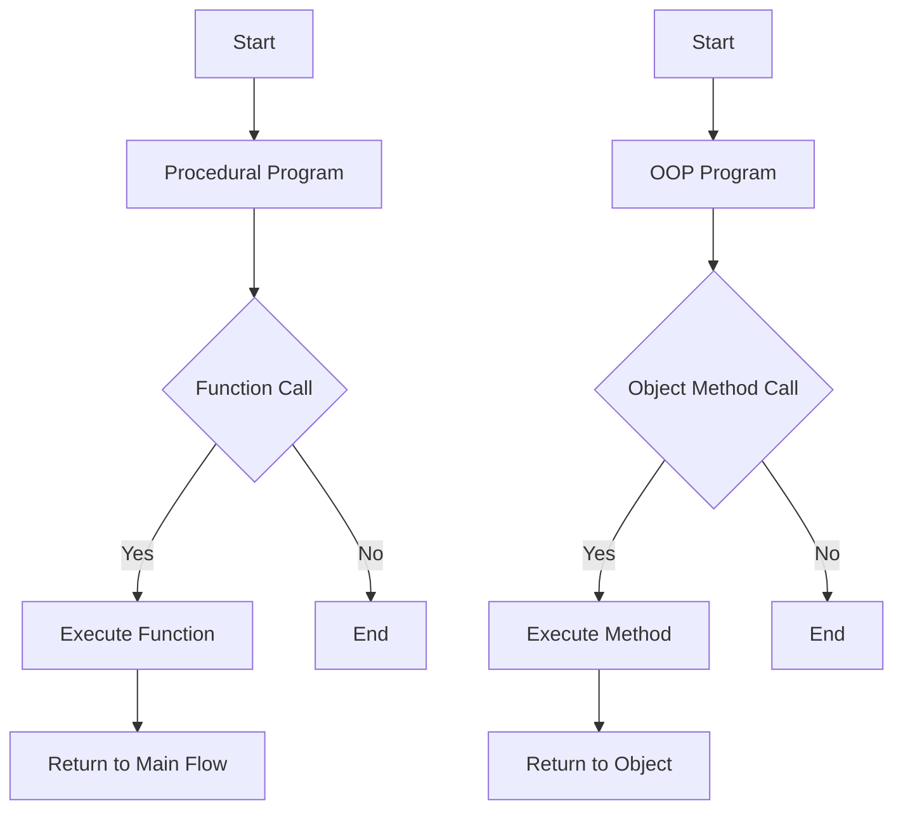

## 2.1.3 OOP vs. Procedural Programming

In the realm of software development, choosing the right programming paradigm is crucial to the success of a project. Two of the most prominent paradigms are Object-Oriented Programming (OOP) and Procedural Programming. Understanding their differences, advantages, and appropriate use cases can significantly impact the design and maintainability of your software. This section delves into these paradigms, providing a comprehensive comparison to guide you in selecting the best approach for your projects.

### Procedural Programming Overview

Procedural programming is a paradigm derived from structured programming, emphasizing a linear top-down approach. It is centered around the concept of procedures, also known as routines or functions, which are blocks of code designed to perform specific tasks. Languages such as C, Pascal, and Fortran are traditionally associated with this paradigm.

#### Characteristics of Procedural Programming

1. **Sequential Execution:**
   - Code is executed in a linear fashion, following a sequence of instructions.
2. **Function-Centric:**
   - Functions are the primary building blocks, each designed to perform a specific task.
3. **Global Data:**
   - Data is often stored in global variables, accessible by any function within the program.
4. **Modularity:**
   - Programs are divided into smaller, manageable functions, promoting code reuse.

#### Example of Procedural Programming in Python

```python
def calculate_area(length, width):
    return length * width

area = calculate_area(5, 3)
print(f"Area: {area}")
```

In this example, the `calculate_area` function takes two parameters, `length` and `width`, and returns the area. This function can be reused throughout the program whenever an area calculation is needed.

### Object-Oriented Programming Overview

Object-Oriented Programming (OOP) is a paradigm that organizes software design around data, or objects, rather than functions and logic. It is characterized by concepts such as classes, objects, encapsulation, inheritance, and polymorphism. Languages like Python, Java, and C++ are well-known for supporting OOP.

#### Characteristics of Object-Oriented Programming

1. **Encapsulation:**
   - Data and functions are bundled into objects, with access restricted to the object's methods.
2. **Abstraction:**
   - Complex systems are simplified by modeling real-world entities as objects.
3. **Inheritance:**
   - New classes can inherit properties and behaviors from existing classes, promoting code reuse.
4. **Polymorphism:**
   - Objects can be treated as instances of their parent class, allowing for dynamic method invocation.

#### Example of OOP in Python

```python
class Rectangle:
    def __init__(self, length, width):
        self.length = length
        self.width = width

    def calculate_area(self):
        return self.length * self.width

rect = Rectangle(5, 3)
print(f"Area: {rect.calculate_area()}")
```

In this OOP example, the `Rectangle` class encapsulates the properties `length` and `width` and the method `calculate_area`. This encapsulation allows for better data management and code organization.

### Comparison Points

#### Structure: Procedures vs. Classes and Objects

- **Procedural Programming:**
  - Focuses on procedures or functions. The program is structured as a collection of functions that operate on data.
- **OOP:**
  - Centers around objects created from classes. A class defines the blueprint for objects, encapsulating data and behavior.

#### Data Handling: Global Data vs. Encapsulated Data

- **Procedural Programming:**
  - Often uses global variables accessible by any function, which can lead to data inconsistency and difficulty in debugging.
- **OOP:**
  - Encapsulates data within objects, restricting access to the object's methods, enhancing data integrity and security.

#### Code Reuse and Maintenance

- **Procedural Programming:**
  - Encourages code reuse through functions, but maintaining and updating code can become challenging as the program grows.
- **OOP:**
  - Promotes easier maintenance and scalability through encapsulation, inheritance, and polymorphism, allowing changes to be made with minimal impact on other parts of the program.

### Use Cases

#### When to Use Procedural Programming

- **Small Scripts and Simple Tasks:**
  - Ideal for straightforward tasks where the overhead of defining classes is unnecessary.
- **Performance-Critical Applications:**
  - Procedural programming can offer performance benefits due to its straightforward execution model.

#### When to Use OOP

- **Large, Complex Systems:**
  - OOP is well-suited for large applications requiring modularity, scalability, and maintenance.
- **Applications Requiring Reusability and Extensibility:**
  - The ability to extend classes and reuse code makes OOP advantageous for evolving software projects.

### Migration from Procedural to OOP

Transitioning from procedural programming to OOP can be challenging but rewarding. Here are some tips for developers making this shift:

1. **Understand the Basics of OOP:**
   - Familiarize yourself with core OOP concepts like classes, objects, inheritance, and polymorphism.
2. **Practice Encapsulation:**
   - Start by encapsulating related functions and data into classes.
3. **Refactor Existing Code:**
   - Gradually refactor procedural code to an object-oriented structure, focusing on one module at a time.
4. **Leverage Libraries and Frameworks:**
   - Use OOP-centric libraries and frameworks to understand how they structure code and design patterns.

### Visuals and Diagrams

To better understand the differences between procedural and object-oriented programming, let's look at a diagram illustrating the flow of control in both approaches.



This diagram shows how procedural programming follows a linear flow of function calls, while OOP involves interactions between objects and their methods, providing a higher level of abstraction.

### Key Points to Emphasize

- **Higher Level of Abstraction in OOP:**
  - OOP abstracts complex systems into manageable objects, simplifying design and maintenance.
- **Choice Depends on Project Requirements:**
  - The decision to use procedural programming or OOP should be based on the specific needs of the project, considering factors like complexity, scalability, and team expertise.

### Conclusion

In conclusion, both procedural programming and object-oriented programming have their place in software development. Procedural programming is ideal for small, performance-critical tasks, while OOP excels in managing complexity and promoting code reuse in large systems. By understanding the strengths and weaknesses of each paradigm, developers can make informed decisions, choosing the right approach for their projects.

---

## Quiz Time!



### What is the primary focus of procedural programming?

- [x] Functions and procedures
- [ ] Objects and classes
- [ ] Data encapsulation
- [ ] Inheritance and polymorphism

> **Explanation:** Procedural programming centers around functions and procedures, which are blocks of code designed to perform specific tasks.

### Which programming paradigm is best suited for large, complex systems?

- [ ] Procedural Programming
- [x] Object-Oriented Programming
- [ ] Functional Programming
- [ ] Declarative Programming

> **Explanation:** Object-Oriented Programming is well-suited for large, complex systems due to its modularity, scalability, and maintainability.

### What is a key characteristic of OOP that enhances data integrity?

- [ ] Global variables
- [x] Encapsulation
- [ ] Sequential execution
- [ ] Function calls

> **Explanation:** Encapsulation in OOP restricts access to an object's data, enhancing data integrity and security.

### In procedural programming, how is data typically handled?

- [ ] Encapsulated within objects
- [x] Stored in global variables
- [ ] Managed through inheritance
- [ ] Accessed via polymorphism

> **Explanation:** Procedural programming often uses global variables, which can be accessed by any function within the program.

### Which concept allows new classes to inherit properties from existing classes in OOP?

- [x] Inheritance
- [ ] Polymorphism
- [ ] Encapsulation
- [ ] Abstraction

> **Explanation:** Inheritance allows new classes to inherit properties and behaviors from existing classes, promoting code reuse.

### What is a common use case for procedural programming?

- [ ] Large-scale web applications
- [x] Small scripts and simple tasks
- [ ] Complex game development
- [ ] Enterprise software solutions

> **Explanation:** Procedural programming is ideal for small scripts and simple tasks where the overhead of defining classes is unnecessary.

### What is the main advantage of OOP over procedural programming in terms of code maintenance?

- [x] Easier maintenance through encapsulation
- [ ] Faster execution speed
- [ ] Simpler syntax
- [ ] Less memory usage

> **Explanation:** OOP promotes easier maintenance and scalability through encapsulation, inheritance, and polymorphism.

### Which programming paradigm is associated with a linear top-down approach?

- [x] Procedural Programming
- [ ] Object-Oriented Programming
- [ ] Functional Programming
- [ ] Logic Programming

> **Explanation:** Procedural programming is characterized by a linear top-down approach, following a sequence of instructions.

### How does OOP handle code reuse?

- [ ] Through global variables
- [x] Through inheritance and polymorphism
- [ ] By using sequential execution
- [ ] Through function calls

> **Explanation:** OOP handles code reuse through inheritance and polymorphism, allowing new classes to extend existing ones.

### True or False: OOP provides a higher level of abstraction than procedural programming.

- [x] True
- [ ] False

> **Explanation:** OOP provides a higher level of abstraction by modeling real-world entities as objects, simplifying complex systems.


