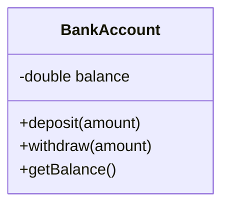

## 2.2.1 Encapsulation

Encapsulation is one of the fundamental pillars of object-oriented programming (OOP), alongside inheritance, polymorphism, and abstraction. It is a powerful concept that allows developers to bundle data and the methods that operate on that data into a single unit, typically a class. This bundling not only promotes data hiding and modularity but also ensures that the internal workings of an object are shielded from external interference and misuse. In this section, we will delve deep into the concept of encapsulation, exploring its definition, mechanisms, benefits, and practical applications in software development.

### Understanding Encapsulation

**Encapsulation** is the mechanism of restricting direct access to some of an object's components and can be thought of as a protective barrier that keeps the data safe from outside interference and misuse. This is achieved by defining the visibility of class members (attributes and methods) using access modifiers, which determine whether they can be accessed from outside the class.

#### Definition and Purpose

At its core, encapsulation serves two main purposes:

1. **Data Hiding:** By controlling access to the internal state of an object, encapsulation helps maintain the integrity of the data. It prevents external entities from altering the data in unexpected ways, which could lead to bugs and inconsistencies.

2. **Modularity and Maintainability:** Encapsulation allows developers to change the internal implementation of a class without affecting the code that uses the class. This separation of concerns makes it easier to maintain and extend the codebase.

### Data Hiding and Access Modifiers

Encapsulation is often implemented using access modifiers, which specify the visibility of class members. Different programming languages offer various levels of access control, commonly including:

- **Public:** Members declared as public can be accessed from anywhere in the program.
- **Private:** Members declared as private can only be accessed from within the class itself.
- **Protected:** Members declared as protected can be accessed within the class and by derived classes.

By appropriately using these access modifiers, developers can enforce data hiding and ensure that only the intended parts of an object are exposed to the outside world.

#### Example in Python

In Python, encapsulation is achieved through naming conventions, as the language does not have built-in access modifiers like some other languages. The convention is to prefix private attributes and methods with an underscore (`_`) or double underscore (`__`) to indicate that they should not be accessed directly.

```python
class BankAccount:
    def __init__(self):
        self.__balance = 0  # Private attribute

    def deposit(self, amount):
        if amount > 0:
            self.__balance += amount

    def withdraw(self, amount):
        if amount <= self.__balance:
            self.__balance -= amount

    def get_balance(self):
        return self.__balance

account = BankAccount()
account.deposit(100)
print(account.get_balance())  # Output: 100
```

In this example, the `__balance` attribute is private, meaning it cannot be accessed directly from outside the class. The `deposit`, `withdraw`, and `get_balance` methods provide controlled access to the balance, ensuring that the balance can only be modified in a safe and predictable manner.

#### Example in JavaScript

JavaScript achieves encapsulation through closures and, more recently, with the introduction of private class fields using the `#` prefix.

```javascript
class BankAccount {
    constructor() {
        let balance = 0; // Private variable using closure

        this.deposit = function (amount) {
            if (amount > 0) {
                balance += amount;
            }
        };

        this.withdraw = function (amount) {
            if (amount <= balance) {
                balance -= amount;
            }
        };

        this.getBalance = function () {
            return balance;
        };
    }
}

const account = new BankAccount();
account.deposit(100);
console.log(account.getBalance());  // Output: 100
```

In this JavaScript example, the `balance` variable is private to the `BankAccount` class due to the closure created by the constructor function. This ensures that the balance can only be accessed and modified through the provided methods.

### Getter and Setter Methods

To safely access and modify private attributes, classes often provide **getter** and **setter** methods. These methods act as an interface to the private data, allowing controlled access and modification.

#### Implementing Getters and Setters

Getters and setters not only provide access to private attributes but also allow for validation and logic to be executed when data is accessed or modified. This helps in maintaining data integrity and enforcing business rules.

**Python Example:**

```python
class Product:
    def __init__(self, price):
        self.__price = price

    def get_price(self):
        return self.__price

    def set_price(self, value):
        if value > 0:
            self.__price = value
        else:
            raise ValueError("Price must be positive")

product = Product(10)
print(product.get_price())  # Output: 10
product.set_price(20)
print(product.get_price())  # Output: 20
```

In this example, the `Product` class uses getter and setter methods to manage access to the `__price` attribute. The setter method includes validation to ensure that the price cannot be set to a negative value.

**JavaScript Example:**

```javascript
class Product {
    #price;

    constructor(price) {
        this.#price = price;
    }

    getPrice() {
        return this.#price;
    }

    setPrice(value) {
        if (value > 0) {
            this.#price = value;
        } else {
            throw new Error("Price must be positive");
        }
    }
}

const product = new Product(10);
console.log(product.getPrice());  // Output: 10
product.setPrice(20);
console.log(product.getPrice());  // Output: 20
```

Here, JavaScript uses the `#` syntax to denote private fields, and the `getPrice` and `setPrice` methods manage access to the `#price` field.

### Benefits of Encapsulation

The encapsulation principle offers several benefits that make it a cornerstone of robust software design:

1. **Improved Maintainability:** By encapsulating the internal state and behavior of a class, changes to the implementation can be made with minimal impact on the rest of the codebase. This makes the system easier to maintain and evolve over time.

2. **Enhanced Flexibility:** Encapsulation allows developers to change the internal representation of an object without affecting its external behavior. This flexibility is crucial for adapting to new requirements and optimizing performance.

3. **Easier Debugging and Testing:** Encapsulated code is generally more modular, making it easier to isolate and test individual components. This modularity simplifies debugging and enhances the reliability of the software.

4. **Protection from Unauthorized Access:** By controlling access to sensitive data, encapsulation helps prevent accidental or malicious interference with the internal state of an object.

### Visualizing Encapsulation with Class Diagrams

To better understand encapsulation, it's helpful to visualize the concept using class diagrams. These diagrams illustrate the visibility of attributes and methods, providing a clear picture of how encapsulation is implemented.



In the above class diagram, the `BankAccount` class has a private attribute `balance` and public methods `deposit`, `withdraw`, and `getBalance`. This encapsulation ensures that the balance can only be modified through the defined methods, protecting it from unauthorized access.

### Real-World Applications of Encapsulation

Encapsulation is not just a theoretical concept; it has practical applications in real-world software development. Here are a few scenarios where encapsulation plays a crucial role:

- **Banking Systems:** Encapsulation is used to protect sensitive financial data, such as account balances and transaction histories, from unauthorized access and manipulation.

- **Healthcare Applications:** Patient data is encapsulated to ensure privacy and compliance with regulations like HIPAA, allowing only authorized personnel to access and modify medical records.

- **E-commerce Platforms:** Encapsulation is employed to manage product data, pricing, and inventory levels, ensuring that changes to these elements do not disrupt the overall system.

### Best Practices for Implementing Encapsulation

To effectively implement encapsulation in your software projects, consider the following best practices:

- **Use Access Modifiers Wisely:** Choose appropriate access levels for class members based on their intended use. Keep attributes private whenever possible and provide public methods for controlled access.

- **Leverage Getters and Setters:** Use getter and setter methods to manage access to private attributes. Include validation logic in setters to enforce data integrity and business rules.

- **Design for Modularity:** Structure your classes and methods to promote modularity and separation of concerns. This will make your codebase easier to maintain and extend.

- **Document Your Code:** Clearly document the intended use of public methods and the constraints on private data. This will help other developers understand the encapsulation model and avoid unintended misuse.

### Common Pitfalls to Avoid

While encapsulation offers many benefits, there are common pitfalls that developers should be aware of:

- **Overexposure of Internal State:** Avoid making too many attributes public, as this can lead to unintended dependencies and reduce the flexibility of your code.

- **Inadequate Validation:** Ensure that setter methods include proper validation to prevent invalid data from corrupting the internal state of an object.

- **Complex Interfaces:** Keep the public interface of your classes simple and intuitive. Complex interfaces can lead to confusion and misuse.

### Conclusion

Encapsulation is a cornerstone of object-oriented programming that promotes data hiding, modularity, and maintainability. By bundling data and methods within a class and controlling access through access modifiers and getter/setter methods, encapsulation ensures that the internal state of an object is protected from external interference. This not only enhances the robustness and flexibility of software systems but also simplifies debugging and testing. As you continue your journey in software development, mastering encapsulation will empower you to design and build more reliable and maintainable applications.

## Quiz Time!



### What is encapsulation in object-oriented programming?

- [x] A mechanism of restricting direct access to some of an object's components.
- [ ] A way to inherit properties from a parent class.
- [ ] A method to execute multiple functions simultaneously.
- [ ] A technique for optimizing database queries.

> **Explanation:** Encapsulation is the mechanism of restricting direct access to some of an object's components and is fundamental to OOP.

### Which access modifier is used to make a class member accessible only within its own class?

- [ ] Public
- [x] Private
- [ ] Protected
- [ ] Internal

> **Explanation:** The `private` access modifier restricts access to the class member to within its own class.

### What is the primary purpose of getter and setter methods?

- [x] To provide controlled access to private attributes.
- [ ] To execute complex calculations.
- [ ] To enhance the performance of a program.
- [ ] To generate random numbers.

> **Explanation:** Getter and setter methods provide controlled access to private attributes, allowing for validation and data integrity.

### In Python, how is a private attribute typically indicated?

- [ ] By using the `private` keyword.
- [x] By prefixing the attribute name with a double underscore.
- [ ] By using the `protected` keyword.
- [ ] By writing the attribute name in uppercase.

> **Explanation:** In Python, private attributes are typically indicated by prefixing the attribute name with a double underscore.

### What benefit does encapsulation provide in terms of software maintenance?

- [x] It allows changes to the internal implementation without affecting external code.
- [ ] It increases the execution speed of the program.
- [ ] It reduces the memory usage of the application.
- [ ] It automatically generates documentation.

> **Explanation:** Encapsulation allows changes to the internal implementation of a class without affecting the code that uses the class, enhancing maintainability.

### Which of the following is NOT a benefit of encapsulation?

- [ ] Improved maintainability
- [ ] Enhanced flexibility
- [x] Increased compilation speed
- [ ] Easier debugging and testing

> **Explanation:** While encapsulation offers several benefits, increased compilation speed is not one of them.

### How does encapsulation help in protecting sensitive data?

- [x] By restricting access to private data through controlled interfaces.
- [ ] By encrypting all data within the class.
- [ ] By using complex algorithms to hide data.
- [ ] By storing data in external files.

> **Explanation:** Encapsulation protects sensitive data by restricting access to private data through controlled interfaces like getters and setters.

### In JavaScript, how can private fields be declared in a class?

- [ ] By using the `private` keyword.
- [ ] By using the `protected` keyword.
- [x] By prefixing the field name with a `#`.
- [ ] By declaring them inside a function.

> **Explanation:** In JavaScript, private fields can be declared by prefixing the field name with a `#`.

### Why is it important to include validation in setter methods?

- [x] To enforce data integrity and business rules.
- [ ] To increase the execution speed of the program.
- [ ] To automatically generate test cases.
- [ ] To simplify the user interface.

> **Explanation:** Including validation in setter methods is important to enforce data integrity and business rules, preventing invalid data from corrupting the object's state.

### True or False: Encapsulation allows for the internal representation of an object to be changed without affecting its external behavior.

- [x] True
- [ ] False

> **Explanation:** True. Encapsulation allows the internal representation of an object to be changed without affecting its external behavior, providing flexibility and maintainability.


