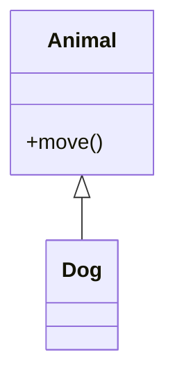

## 2.2.2 Inheritance

Inheritance is a cornerstone of object-oriented programming (OOP), offering a powerful mechanism to promote code reusability and establish a logical hierarchy within software applications. This comprehensive guide will delve into the concept of inheritance, its various forms, implementation in popular programming languages like Python and JavaScript, and practical applications in real-world scenarios.

### Understanding Inheritance

At its core, inheritance allows a new class, known as a child or subclass, to inherit attributes and methods from an existing class, referred to as a parent or superclass. This relationship enables subclasses to reuse and extend the functionality of superclasses, reducing code duplication and enhancing maintainability.

#### Key Benefits of Inheritance

- **Code Reusability:** By inheriting from existing classes, developers can leverage pre-existing code, reducing redundancy and effort.
- **Logical Hierarchy:** Inheritance helps organize code into a structured hierarchy, making it easier to understand and manage.
- **Extensibility:** Subclasses can extend or override superclass methods, allowing for customization and specialization.

### Types of Inheritance

Inheritance can be categorized into several types, each with its own characteristics and use cases.

#### Single Inheritance

Single inheritance refers to a subclass inheriting from one superclass. This is the most straightforward form of inheritance and is supported by most object-oriented languages, including Python and JavaScript.

#### Multiple Inheritance

Multiple inheritance allows a subclass to inherit from more than one superclass. While this can be powerful, it introduces complexity and potential conflicts, such as the "diamond problem," where a subclass inherits from two classes that have a common ancestor.

- **Python** supports multiple inheritance, providing mechanisms like the Method Resolution Order (MRO) to handle conflicts.
- **JavaScript** does not support multiple inheritance directly but can achieve similar effects through mixins or interfaces.

### Syntax of Inheritance

Let's explore how inheritance is implemented in Python and JavaScript, two widely-used programming languages.

#### Inheritance in Python

Python's syntax for inheritance is straightforward, using parentheses to specify the superclass.

```python
class Animal:
    def move(self):
        print("The animal moves")

class Dog(Animal):
    def move(self):
        print("The dog runs")

animal = Animal()
animal.move()

dog = Dog()
dog.move()
```

In this example, `Dog` inherits from `Animal`, and overrides the `move` method to provide a more specific behavior.

#### Inheritance in JavaScript

JavaScript uses the `extends` keyword to implement inheritance, allowing subclasses to inherit from superclasses.

```javascript
class Animal {
    move() {
        console.log("The animal moves");
    }
}

class Dog extends Animal {
    move() {
        console.log("The dog runs");
    }
}

const animal = new Animal();
animal.move();

const dog = new Dog();
dog.move();
```

Here, `Dog` extends `Animal`, overriding the `move` method to tailor its functionality.

### Overriding Methods

Overriding is a powerful feature of inheritance that enables subclasses to modify or extend the behavior of superclass methods. This allows for polymorphism, where the same method call can exhibit different behaviors depending on the object's class.

- **Python Example:**

  ```python
  class Bird(Animal):
      def move(self):
          print("The bird flies")

  bird = Bird()
  bird.move()
  ```

- **JavaScript Example:**

  ```javascript
  class Bird extends Animal {
      move() {
          console.log("The bird flies");
      }
  }

  const bird = new Bird();
  bird.move();
  ```

In both examples, the `Bird` class overrides the `move` method to reflect the unique way birds move.

### Use Cases of Inheritance

Inheritance is a versatile tool in software design, applicable in various scenarios:

- **Creating Specialized Classes:** Inheritance allows developers to create specialized versions of a general class. For instance, a `Vehicle` class can be extended to create `Car` and `Bike` subclasses, each with specific attributes and methods.
- **Avoiding Code Duplication:** By reusing code from superclasses, inheritance reduces redundancy, leading to cleaner and more maintainable codebases.

### Visualizing Inheritance

To better understand the concept of inheritance, let's visualize the relationship between classes using a class diagram.



This diagram illustrates the inheritance hierarchy, showing that `Dog` is a subclass of `Animal` and inherits its methods.

### Best Practices and Common Pitfalls

While inheritance is a powerful feature, it must be used judiciously to avoid potential issues.

#### Best Practices

- **Favor Composition Over Inheritance:** While inheritance is useful, it can lead to tightly coupled classes. Consider using composition, where classes are composed of other classes, to achieve greater flexibility.
- **Use Inheritance for "Is-a" Relationships:** Ensure that inheritance reflects a true "is-a" relationship. For example, a `Car` is a `Vehicle`, but a `Car` is not a `Driver`.
- **Override Methods Judiciously:** Be cautious when overriding methods. Ensure that the new implementation aligns with the expected behavior of the superclass.

#### Common Pitfalls

- **Overusing Inheritance:** Excessive use of inheritance can lead to complex and rigid class hierarchies. Use it only when necessary.
- **Ignoring the Liskov Substitution Principle:** Subclasses should be substitutable for their superclasses without altering the desirable properties of the program. Violating this principle can lead to unexpected behavior.

### Real-World Applications

Inheritance is widely used in software development, from building user interfaces to designing game engines. Let's explore a few real-world applications:

- **Web Development:** In frameworks like Django (Python) and React (JavaScript), inheritance is used to create reusable components and views, promoting code reuse and consistency.
- **Game Development:** Game engines often use inheritance to define entities and behaviors, allowing developers to create complex game worlds with minimal code duplication.

### Conclusion

Inheritance is a fundamental concept in object-oriented programming, offering a robust mechanism for code reuse, extensibility, and logical organization. By understanding its principles, syntax, and best practices, developers can leverage inheritance to build scalable and maintainable software solutions.

As you continue your journey in software development, remember that inheritance is just one tool in your toolkit. Combine it with other design principles and patterns to create efficient and elegant software architectures.

---

## Quiz Time!



### What is inheritance in object-oriented programming?

- [x] A mechanism where a class can inherit attributes and methods from another class
- [ ] A process of dividing a program into functions
- [ ] A method of storing data in a database
- [ ] A way to execute code asynchronously

> **Explanation:** Inheritance allows a class (child/subclass) to inherit attributes and methods from another class (parent/superclass), promoting code reuse.

### Which type of inheritance involves a subclass inheriting from more than one superclass?

- [ ] Single inheritance
- [x] Multiple inheritance
- [ ] Hierarchical inheritance
- [ ] Hybrid inheritance

> **Explanation:** Multiple inheritance allows a subclass to inherit from more than one superclass, introducing complexity and potential conflicts.

### How is inheritance implemented in Python?

- [x] Using parentheses to specify the superclass
- [ ] Using the `extends` keyword
- [ ] Using the `inherit` keyword
- [ ] Using the `super` keyword

> **Explanation:** In Python, inheritance is implemented by specifying the superclass in parentheses after the class name.

### How is inheritance implemented in JavaScript?

- [ ] Using parentheses to specify the superclass
- [x] Using the `extends` keyword
- [ ] Using the `inherit` keyword
- [ ] Using the `super` keyword

> **Explanation:** In JavaScript, inheritance is implemented using the `extends` keyword to create a subclass from a superclass.

### What is method overriding?

- [x] A subclass providing a specific implementation for a method already defined in its superclass
- [ ] A superclass providing a specific implementation for a method already defined in its subclass
- [ ] A mechanism to execute multiple methods simultaneously
- [ ] A way to prevent a method from being inherited

> **Explanation:** Method overriding allows a subclass to provide a specific implementation for a method already defined in its superclass, enabling polymorphism.

### What is a common pitfall of using inheritance?

- [x] Overusing inheritance can lead to complex and rigid class hierarchies
- [ ] Inheritance always leads to code duplication
- [ ] Inheritance makes code execution slower
- [ ] Inheritance is not supported in modern programming languages

> **Explanation:** Overusing inheritance can result in complex and tightly coupled class hierarchies, making the codebase difficult to maintain.

### What is the Liskov Substitution Principle?

- [x] Subclasses should be substitutable for their superclasses without altering the desirable properties of the program
- [ ] A principle that states methods should be overridden frequently
- [ ] A guideline for naming classes and methods
- [ ] A rule for optimizing code performance

> **Explanation:** The Liskov Substitution Principle ensures that subclasses can replace their superclasses without affecting the program's correctness.

### Which of the following is a best practice when using inheritance?

- [x] Favor composition over inheritance
- [ ] Use inheritance for all class relationships
- [ ] Override methods whenever possible
- [ ] Avoid using inheritance in large projects

> **Explanation:** Favoring composition over inheritance provides greater flexibility and reduces the risk of tightly coupled class hierarchies.

### Which programming language supports multiple inheritance?

- [x] Python
- [ ] JavaScript
- [ ] Java
- [ ] C#

> **Explanation:** Python supports multiple inheritance, allowing a subclass to inherit from multiple superclasses.

### Inheritance promotes code reuse and logical class hierarchy.

- [x] True
- [ ] False

> **Explanation:** Inheritance allows for code reuse by enabling subclasses to inherit methods and attributes from superclasses, and it helps organize code into a logical hierarchy.


