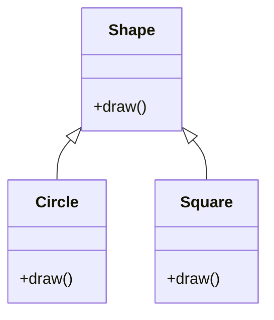

## 2.2.3 Polymorphism

Polymorphism is one of the core principles of object-oriented programming (OOP), alongside encapsulation, inheritance, and abstraction. The term polymorphism is derived from the Greek words "poly," meaning many, and "morph," meaning form. In the context of OOP, polymorphism refers to the ability of different classes to be treated as instances of the same class through inheritance. This powerful feature allows objects to be manipulated in a more generic way, enhancing the flexibility and integration of new subclasses into existing codebases.

### Understanding Polymorphism

At its core, polymorphism allows methods to do different things based on the object it is acting upon, even though they share the same name. This is achieved through the use of a common interface or superclass. Polymorphism enables a single function or method to work in different ways depending on the context, which is determined at runtime or compile-time.

#### Types of Polymorphism

Polymorphism can be broadly categorized into two types:

1. **Compile-time Polymorphism (Static Binding):** This type of polymorphism is resolved during compile time. The most common example is method overloading, where multiple methods have the same name but differ in the type or number of their parameters. However, this is not commonly used in languages like Python and JavaScript, which are dynamically typed.

2. **Run-time Polymorphism (Dynamic Binding):** This type of polymorphism is resolved at runtime. It is achieved through method overriding, where a method in a subclass has the same name and signature as a method in its superclass. The appropriate method to invoke is determined at runtime based on the object type.

### Benefits of Polymorphism

Polymorphism offers several advantages that make it an essential feature in OOP:

- **Code Simplification:** By allowing one interface to be used for a general class of actions, polymorphism simplifies code and reduces complexity. Developers can write more generic and reusable code, which can handle new requirements without significant modifications.

- **Flexibility and Extensibility:** Polymorphism enhances the flexibility of code, making it easier to integrate new subclasses. As new requirements emerge, new subclasses can be added with minimal changes to existing code.

- **Maintainability:** With polymorphism, the code is easier to maintain and extend. Changes in one part of the system can be made without affecting other parts, as long as the interface remains consistent.

### Implementing Polymorphism

Implementing polymorphism involves using base class references to refer to subclass objects. This allows the program to iterate over different objects and invoke overridden methods dynamically.

#### Example in Python

Let's explore a simple example in Python to illustrate polymorphism through method overriding.

```python
class Shape:
    def draw(self):
        raise NotImplementedError("Subclasses should implement this method")

class Circle(Shape):
    def draw(self):
        print("Drawing a circle")

class Square(Shape):
    def draw(self):
        print("Drawing a square")

shapes = [Circle(), Square()]

for shape in shapes:
    shape.draw()
```

**Explanation:**
- We define a base class `Shape` with an abstract method `draw()`.
- Two subclasses, `Circle` and `Square`, override the `draw()` method to provide specific implementations.
- We create a list of shape objects and iterate over them, invoking the `draw()` method. The correct method is called based on the actual object type, demonstrating polymorphism.

#### Example in JavaScript

Similarly, we can implement polymorphism in JavaScript using classes and inheritance.

```javascript
class Shape {
    draw() {
        throw new Error("Method 'draw()' must be implemented.");
    }
}

class Circle extends Shape {
    draw() {
        console.log("Drawing a circle");
    }
}

class Square extends Shape {
    draw() {
        console.log("Drawing a square");
    }
}

const shapes = [new Circle(), new Square()];

// Iterate over shapes and draw each one
shapes.forEach((shape) => {
    shape.draw();
});
```

**Explanation:**
- We define a base class `Shape` with a method `draw()`. The method throws an error if not implemented by subclasses.
- Subclasses `Circle` and `Square` extend `Shape` and provide their own implementation of the `draw()` method.
- We create an array of shape objects and iterate over them, calling the `draw()` method, which dynamically resolves to the correct subclass method.

### Visualizing Polymorphism

To better understand the concept of polymorphism, let's visualize the relationship between the classes using a class diagram.



**Diagram Explanation:**
- The `Shape` class is the base class with an abstract method `draw()`.
- The `Circle` and `Square` classes inherit from `Shape` and override the `draw()` method.
- The diagram illustrates the "is-a" relationship, where `Circle` and `Square` are types of `Shape`.

### Key Points to Emphasize

- **Flexibility and Integration:** Polymorphism allows for flexible and easily integrable code. New subclasses can be added with minimal changes to existing code, promoting scalability and adaptability.
- **Generic and Reusable Code:** By using polymorphism, developers can write more generic code that can handle a variety of object types, leading to reusable and maintainable solutions.

### Real-World Applications of Polymorphism

Polymorphism is widely used in software development to create flexible and scalable systems. Here are some real-world applications:

- **GUI Frameworks:** In graphical user interfaces, polymorphism allows different components (buttons, text fields, labels) to be treated as generic components, enabling uniform handling of events and rendering.
- **Game Development:** In games, polymorphism enables different game entities (players, enemies, obstacles) to be treated as generic entities, simplifying collision detection and rendering logic.
- **Data Processing Pipelines:** In data processing, polymorphism allows different data sources (databases, files, streams) to be treated uniformly, facilitating data transformation and aggregation.

### Best Practices and Common Pitfalls

- **Best Practices:**
  - Use polymorphism to simplify code and reduce redundancy.
  - Ensure that the base class defines a clear and consistent interface for subclasses to implement.
  - Leverage polymorphism to enhance code flexibility and maintainability.

- **Common Pitfalls:**
  - Avoid excessive use of polymorphism, which can lead to overly complex and difficult-to-understand code.
  - Ensure that subclasses provide meaningful implementations of overridden methods to avoid unexpected behavior.
  - Be cautious of performance implications, as dynamic method resolution can introduce overhead.

### Conclusion

Polymorphism is a fundamental concept in object-oriented programming that enables objects of different classes to be treated as instances of a common superclass. By allowing methods to do different things based on the object they act upon, polymorphism enhances code flexibility, maintainability, and reusability. Through practical examples in Python and JavaScript, we have explored how polymorphism can be implemented and leveraged to create scalable and adaptable software systems. As you continue your journey in software development, embracing polymorphism will empower you to write more efficient and elegant code.

## Quiz Time!



### What is polymorphism in object-oriented programming?

- [x] The ability for different classes to be treated as instances of the same class through inheritance.
- [ ] The process of hiding the implementation details of a class.
- [ ] The ability to create multiple methods with the same name in a single class.
- [ ] The concept of restricting access to certain components of an object.

> **Explanation:** Polymorphism allows objects of different classes to be treated as objects of a common superclass, enabling flexibility and integration.

### Which type of polymorphism is resolved at runtime?

- [x] Run-time polymorphism (Dynamic Binding)
- [ ] Compile-time polymorphism (Static Binding)
- [ ] Method overloading
- [ ] Abstraction

> **Explanation:** Run-time polymorphism, also known as dynamic binding, is resolved at runtime and is achieved through method overriding.

### What is method overriding?

- [x] A subclass provides a specific implementation of a method that is already defined in its superclass.
- [ ] A method with the same name but different parameters in the same class.
- [ ] A method that hides the implementation details from the user.
- [ ] A method that is only accessible within the class it is defined.

> **Explanation:** Method overriding occurs when a subclass provides a specific implementation of a method that is already defined in its superclass.

### In the provided Python example, what will be the output when the `draw()` method is called on the `shapes` list?

- [x] Drawing a circle
- [x] Drawing a square
- [ ] Drawing a triangle
- [ ] Error: Method not implemented

> **Explanation:** The `draw()` method is overridden in the `Circle` and `Square` classes, so the output will be "Drawing a circle" and "Drawing a square" respectively.

### What is the main benefit of using polymorphism?

- [x] It simplifies code by allowing one interface to be used for a general class of actions.
- [ ] It increases the complexity of the code by adding more methods.
- [ ] It restricts the flexibility of the code by limiting the number of subclasses.
- [ ] It reduces the maintainability of the code by making it harder to understand.

> **Explanation:** Polymorphism simplifies code and enhances flexibility by allowing one interface to be used for a general class of actions.

### Which of the following is a common pitfall of using polymorphism?

- [x] Overuse can lead to overly complex and difficult-to-understand code.
- [ ] It makes the code less flexible and harder to maintain.
- [ ] It restricts the number of subclasses that can be created.
- [ ] It prevents the use of inheritance in the codebase.

> **Explanation:** Overusing polymorphism can lead to complex code that is difficult to understand and maintain.

### How can polymorphism enhance the flexibility of a codebase?

- [x] By allowing new subclasses to be integrated with minimal changes to existing code.
- [ ] By restricting the number of methods that can be overridden.
- [ ] By preventing the use of interfaces in the codebase.
- [ ] By making the code less adaptable to new requirements.

> **Explanation:** Polymorphism allows new subclasses to be integrated with minimal changes, enhancing the flexibility and adaptability of the codebase.

### What is the role of the base class in implementing polymorphism?

- [x] It defines a consistent interface for subclasses to implement.
- [ ] It restricts the number of subclasses that can be created.
- [ ] It hides the implementation details of the subclasses.
- [ ] It prevents subclasses from overriding methods.

> **Explanation:** The base class defines a consistent interface that subclasses can implement, enabling polymorphism.

### In the JavaScript example, what will be the output when the `draw()` method is called on the `shapes` array?

- [x] Drawing a circle
- [x] Drawing a square
- [ ] Drawing a rectangle
- [ ] Error: Method not implemented

> **Explanation:** The `draw()` method is overridden in the `Circle` and `Square` classes, so the output will be "Drawing a circle" and "Drawing a square" respectively.

### True or False: Polymorphism can only be achieved through method overriding.

- [x] False
- [ ] True

> **Explanation:** Polymorphism can be achieved through both method overriding (dynamic polymorphism) and method overloading (static polymorphism), although method overloading is not common in dynamically typed languages like Python and JavaScript.


