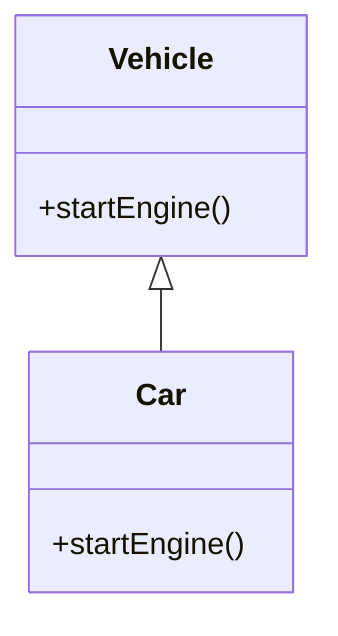

## 2.2.4 Abstraction

In the realm of software engineering, abstraction is a fundamental principle of object-oriented programming (OOP) that serves as a powerful tool to manage complexity. By focusing on the essential qualities of an object rather than the specific details, abstraction allows developers to create a simplified model of reality. This section explores the concept of abstraction, its implementation through abstract classes and interfaces, and the significant benefits it brings to software design.

### What is Abstraction?

Abstraction is the process of reducing complexity by hiding unnecessary details and exposing only the essential features of an object. It enables developers to focus on high-level functionalities without getting bogged down by the intricate workings of the underlying system. In essence, abstraction allows us to define the blueprint of an object, highlighting what it does rather than how it does it.

Consider the example of a vehicle. While vehicles can vary widely in terms of design and functionality, they all share some common features, such as the ability to start an engine. Abstraction allows us to model this commonality by defining a generic "Vehicle" class that encapsulates the essential characteristics shared by all vehicles, without delving into the specifics of any particular type of vehicle.

### Abstract Classes and Methods

Abstract classes serve as templates for other classes, providing a foundation upon which more specific classes can be built. An abstract class can define abstract methods—methods that are declared but not implemented. These methods act as placeholders, requiring subclasses to provide specific implementations.

#### Python Example Using the ABC Module

In Python, abstract classes are implemented using the `ABC` module, which stands for Abstract Base Class. Here's a simple example:

```python
from abc import ABC, abstractmethod

class Vehicle(ABC):
    @abstractmethod
    def start_engine(self):
        pass

class Car(Vehicle):
    def start_engine(self):
        print("Car engine started")

car = Car()
car.start_engine()
```

In this example, `Vehicle` is an abstract class with an abstract method `start_engine`. The `Car` class inherits from `Vehicle` and provides a concrete implementation of the `start_engine` method. Attempting to instantiate `Vehicle` directly would result in an error, as it contains abstract methods that need to be implemented by a subclass.

#### JavaScript Example Using Conventions

JavaScript does not have built-in support for abstract classes, but developers can simulate this behavior using conventions:

```javascript
class Vehicle {
    constructor() {
        if (this.constructor === Vehicle) {
            throw new Error("Cannot instantiate abstract class");
        }
    }

    startEngine() {
        throw new Error("Abstract method must be implemented");
    }
}

class Car extends Vehicle {
    startEngine() {
        console.log("Car engine started");
    }
}

const car = new Car();
car.startEngine();
```

In this JavaScript example, the `Vehicle` class serves as an abstract class by throwing an error if an attempt is made to instantiate it directly. The `startEngine` method is designed to be overridden by subclasses, ensuring that each subclass provides its own implementation.

### Interfaces

In languages like Java and TypeScript, interfaces are used to define method signatures without providing implementations. Interfaces specify a contract that classes must adhere to, ensuring that they implement the specified methods.

#### Java Interface Example

```java
interface Vehicle {
    void startEngine();
}

class Car implements Vehicle {
    public void startEngine() {
        System.out.println("Car engine started");
    }
}

public class Main {
    public static void main(String[] args) {
        Car car = new Car();
        car.startEngine();
    }
}
```

In this Java example, the `Vehicle` interface defines the `startEngine` method. The `Car` class implements the `Vehicle` interface, providing a concrete implementation of the `startEngine` method. Interfaces are particularly useful for defining a set of methods that multiple classes can implement, promoting the use of shared behaviors across different classes.

### Benefits of Abstraction

Abstraction offers several key benefits that make it an indispensable tool in software design:

1. **Simplification of Complex Reality**: By modeling classes that are appropriate to the problem, abstraction simplifies complex systems, making them easier to understand and manage.

2. **Promotion of Shared Behaviors**: Abstract classes and interfaces encourage the use of shared behaviors, reducing code duplication and promoting code reuse.

3. **Flexibility and Maintainability**: Abstraction allows developers to change the implementation details of a class without affecting the rest of the system, enhancing flexibility and maintainability.

4. **Clear Contract for Subclasses**: By defining a clear contract for subclasses to implement specific behaviors, abstraction ensures consistency and reliability in the behavior of objects.

### Visualizing Abstraction

To better understand the concept of abstraction, let's visualize the relationship between an abstract class and a concrete class using a class diagram:



In this diagram, `Vehicle` is an abstract class with a method `startEngine`, and `Car` is a concrete class that inherits from `Vehicle`. The arrow indicates the inheritance relationship, showing that `Car` implements the abstract method defined in `Vehicle`.

### Key Points to Emphasize

- **Focus on Relevant Attributes**: Abstraction helps manage complexity by focusing on the relevant attributes of an object, allowing developers to concentrate on what an object does rather than how it does it.

- **Clear Contract for Subclasses**: Abstraction provides a clear contract for subclasses to implement specific behaviors, ensuring consistency and reliability in the behavior of objects.

- **Encouragement of Code Reuse**: By promoting shared behaviors, abstraction encourages code reuse, reducing duplication and enhancing maintainability.

### Conclusion

Abstraction is a powerful tool in object-oriented programming that simplifies complexity by focusing on essential features and hiding unnecessary details. Through the use of abstract classes and interfaces, abstraction provides a clear contract for subclasses to implement specific behaviors, promoting shared behaviors and enhancing flexibility and maintainability. By understanding and applying the principles of abstraction, developers can create robust, scalable, and maintainable software systems.

### Further Exploration

For those interested in delving deeper into the topic of abstraction and its application in software design, consider exploring the following resources:

- **Books**: "Design Patterns: Elements of Reusable Object-Oriented Software" by Erich Gamma et al., "Clean Code: A Handbook of Agile Software Craftsmanship" by Robert C. Martin.
- **Online Courses**: Courses on platforms like Coursera or Udemy that focus on object-oriented programming and design patterns.
- **Documentation**: Official documentation for programming languages like Python, Java, and JavaScript, which provide detailed information on abstract classes and interfaces.

By mastering the concept of abstraction, you'll be well-equipped to tackle complex software design challenges and create elegant, efficient solutions.

## Quiz Time!



### What is the primary purpose of abstraction in object-oriented programming?

- [x] To hide unnecessary details and expose only essential features
- [ ] To increase the complexity of a program
- [ ] To eliminate the need for classes and objects
- [ ] To enforce strict data types

> **Explanation:** Abstraction focuses on reducing complexity by hiding unnecessary details and exposing only the essential features of an object.

### How are abstract methods defined in Python using the ABC module?

- [x] Using the `@abstractmethod` decorator
- [ ] By defining methods with an empty body
- [ ] By using the `abstract` keyword before the method name
- [ ] By creating a class without any methods

> **Explanation:** In Python, abstract methods are defined using the `@abstractmethod` decorator provided by the ABC module.

### What happens if you try to instantiate an abstract class directly in Python?

- [x] An error is raised
- [ ] The class is instantiated without any issues
- [ ] The abstract methods are automatically implemented
- [ ] The program crashes

> **Explanation:** Attempting to instantiate an abstract class directly in Python raises an error because abstract methods need to be implemented by a subclass.

### How can you simulate abstract classes in JavaScript?

- [x] By throwing an error in the constructor if the abstract class is instantiated
- [ ] By using the `abstract` keyword
- [ ] By defining methods with an empty body
- [ ] By using interfaces

> **Explanation:** In JavaScript, abstract classes can be simulated by throwing an error in the constructor if an attempt is made to instantiate the class directly.

### What is the role of interfaces in languages like Java or TypeScript?

- [x] To define method signatures without implementations
- [ ] To implement all methods in a class
- [ ] To store data in key-value pairs
- [ ] To provide default implementations for methods

> **Explanation:** Interfaces define method signatures without implementations, providing a contract that classes must adhere to.

### Which of the following is a benefit of using abstraction?

- [x] Simplifies complex reality by modeling classes appropriate to the problem
- [ ] Increases the complexity of the code
- [ ] Makes code less reusable
- [ ] Requires more memory

> **Explanation:** Abstraction simplifies complex reality by modeling classes that are appropriate to the problem, making systems easier to understand and manage.

### What must subclasses do when inheriting from an abstract class?

- [x] Provide implementations for all abstract methods
- [ ] Ignore the abstract methods
- [x] Use the `super` keyword to call abstract methods
- [ ] Instantiate the abstract class

> **Explanation:** Subclasses must provide implementations for all abstract methods defined in the abstract class.

### What is the relationship between an abstract class and a concrete class?

- [x] The concrete class inherits from the abstract class and implements its abstract methods
- [ ] The abstract class inherits from the concrete class
- [ ] Both classes are unrelated
- [ ] The concrete class is a standalone class

> **Explanation:** A concrete class inherits from an abstract class and provides implementations for its abstract methods.

### What is a key characteristic of abstract methods?

- [x] They are declared but not implemented in the base class
- [ ] They are fully implemented in the base class
- [ ] They cannot be overridden
- [ ] They are private methods

> **Explanation:** Abstract methods are declared but not implemented in the base class, requiring subclasses to provide specific implementations.

### True or False: Abstraction promotes the use of shared behaviors across different classes.

- [x] True
- [ ] False

> **Explanation:** True. Abstraction promotes the use of shared behaviors, reducing code duplication and enhancing code reuse across different classes.


