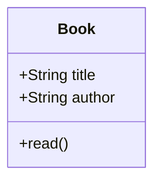

## 2.3.1 Defining Classes

In the world of software development, understanding how to define classes is a fundamental skill that underpins object-oriented programming (OOP). Classes serve as blueprints for creating objects, encapsulating data and behavior into reusable components. This section will guide you through the process of defining classes in both Python and JavaScript, two of the most popular programming languages in modern development. We will explore class syntax, constructors, attributes, and methods, providing practical examples and visual aids to solidify your understanding.

### Introduction to Classes

At its core, a class in programming is a template for creating objects. It defines a set of attributes (data) and methods (functions) that the created objects will have. This encapsulation of data and behavior is a cornerstone of OOP, promoting code reuse, scalability, and maintainability.

#### Why Use Classes?

1. **Encapsulation:** Classes allow you to bundle data and methods that operate on the data within a single unit.
2. **Reusability:** Once a class is defined, you can create multiple objects from it without rewriting code.
3. **Abstraction:** Classes provide a way to abstract complex systems into manageable components.
4. **Inheritance and Polymorphism:** Classes enable these advanced OOP concepts, allowing for more dynamic and flexible code.

### Class Syntax in Python and JavaScript

Let's start by examining the basic syntax for defining classes in Python and JavaScript, highlighting the similarities and differences between these two languages.

#### Python Class Syntax

In Python, a class is defined using the `class` keyword, followed by the class name in PascalCase. The class body is indented, containing methods and attributes.

```python
class ClassName:
    def __init__(self, parameter1, parameter2):
        self.attribute1 = parameter1
        self.attribute2 = parameter2

    def method_name(self):
        # method body
```

- **Naming Conventions:** Class names should be in PascalCase (e.g., `MyClass`).
- **Constructor:** The `__init__` method is the constructor in Python, used to initialize object attributes.

#### JavaScript Class Syntax

In JavaScript, classes are defined using the `class` keyword, with a similar PascalCase naming convention. The constructor is defined using the `constructor` method.

```javascript
class ClassName {
    constructor(parameter1, parameter2) {
        this.attribute1 = parameter1;
        this.attribute2 = parameter2;
    }

    methodName() {
        // method body
    }
}
```

- **Naming Conventions:** Class names follow PascalCase (e.g., `MyClass`).
- **Constructor:** The `constructor` method initializes object properties.

### Constructors: Initializing Objects

Constructors play a crucial role in class definitions by setting up initial states for objects. They are automatically called when a new instance of the class is created.

#### Python Constructors

In Python, the `__init__` method acts as the constructor. It is where you define the attributes of the class and assign initial values.

```python
class Book:
    def __init__(self, title, author):
        self.title = title
        self.author = author
```

- **`self` Keyword:** Refers to the instance of the class, allowing access to its attributes and methods.
- **Initialization:** Attributes like `title` and `author` are initialized within the constructor.

#### JavaScript Constructors

In JavaScript, the `constructor` function is used for initializing properties.

```javascript
class Book {
    constructor(title, author) {
        this.title = title;
        this.author = author;
    }
}
```

- **`this` Keyword:** Similar to `self` in Python, `this` refers to the current instance of the class.
- **Property Initialization:** Properties such as `title` and `author` are set within the constructor.

### Attributes and Methods: Defining Class Behavior

Understanding how to define attributes and methods is essential for creating functional classes.

#### Attributes

Attributes (or properties) represent the data stored within an object. They are defined within the constructor and can be accessed and modified using the `self` or `this` keyword.

- **Python Example:**
  ```python
  class Book:
      def __init__(self, title, author):
          self.title = title
          self.author = author
  ```

- **JavaScript Example:**
  ```javascript
  class Book {
      constructor(title, author) {
          this.title = title;
          this.author = author;
      }
  }
  ```

#### Methods

Methods define the behavior of a class. They are functions that operate on the data within the object.

- **Python Example:**
  ```python
  class Book:
      def read(self):
          print(f"Reading '{self.title}' by {self.author}")
  ```

- **JavaScript Example:**
  ```javascript
  class Book {
      read() {
          console.log(`Reading '${this.title}' by ${this.author}`);
      }
  }
  ```

### Example Class: The `Book` Class

Let's bring everything together with a complete example of a `Book` class in both Python and JavaScript.

#### Python `Book` Class

```python
class Book:
    def __init__(self, title, author):
        self.title = title
        self.author = author

    def read(self):
        print(f"Reading '{self.title}' by {self.author}")

my_book = Book("1984", "George Orwell")
my_book.read()
```

- **Attributes:** `title` and `author` store the book's title and author's name.
- **Method:** `read()` prints a message indicating that the book is being read.

#### JavaScript `Book` Class

```javascript
class Book {
    constructor(title, author) {
        this.title = title;
        this.author = author;
    }

    read() {
        console.log(`Reading '${this.title}' by ${this.author}`);
    }
}

const myBook = new Book("1984", "George Orwell");
myBook.read();
```

- **Properties:** `title` and `author` hold the book's title and author.
- **Method:** `read()` logs a message to the console indicating the book is being read.

### Visualizing the `Book` Class

To better understand the structure of the `Book` class, let's use a class diagram.



- **Class Diagram:** Illustrates the `Book` class with its attributes and method.

### Key Points to Emphasize

- **Blueprints for Objects:** Classes serve as templates for creating objects, encapsulating data and behavior.
- **Naming and Structure:** Consistent naming conventions (PascalCase) and structured syntax improve code readability and maintainability.
- **Constructors:** Essential for initializing object attributes, providing a starting state for new instances.
- **Attributes and Methods:** Define what data the class holds and what actions it can perform.

### Practical Applications

Understanding how to define classes is crucial for building scalable and maintainable software. Here are a few practical applications:

1. **Web Development:** Define models for data entities (e.g., users, products) in web applications.
2. **Game Development:** Create classes for game entities (e.g., characters, enemies) with specific behaviors and attributes.
3. **Data Processing:** Use classes to encapsulate data processing logic, making it reusable and organized.

### Best Practices and Common Pitfalls

- **Best Practices:**
  - Use meaningful class and method names.
  - Keep classes focused on a single responsibility.
  - Document your classes and methods for better maintainability.

- **Common Pitfalls:**
  - Avoid overly complex classes; break them down into smaller, manageable components.
  - Ensure proper use of `self` and `this` to avoid referencing issues.

### Conclusion

Defining classes is a foundational skill in software development, enabling the creation of organized, reusable, and scalable code. By mastering class syntax, constructors, attributes, and methods in Python and JavaScript, you lay the groundwork for more advanced programming concepts and design patterns. Continue practicing by creating your own classes and experimenting with different attributes and methods to deepen your understanding.

## Quiz Time!



### What is the primary purpose of a class in programming?

- [x] To serve as a blueprint for creating objects
- [ ] To execute code in a specific order
- [ ] To store data temporarily
- [ ] To manage memory allocation

> **Explanation:** A class serves as a blueprint for creating objects, encapsulating data and behavior.

### Which keyword is used to define a class in Python?

- [x] class
- [ ] def
- [ ] function
- [ ] object

> **Explanation:** In Python, the `class` keyword is used to define a class.

### What is the role of the `__init__` method in a Python class?

- [x] It acts as a constructor to initialize object attributes
- [ ] It defines a class method
- [ ] It deletes an object
- [ ] It serves as a destructor

> **Explanation:** The `__init__` method is the constructor in Python, used to initialize object attributes.

### In JavaScript, how do you define a constructor within a class?

- [x] Using the `constructor` method
- [ ] Using the `init` method
- [ ] Using the `setup` method
- [ ] Using the `initialize` method

> **Explanation:** In JavaScript, the `constructor` method is used to define a constructor within a class.

### What is the naming convention for class names in both Python and JavaScript?

- [x] PascalCase
- [ ] snake_case
- [ ] camelCase
- [ ] kebab-case

> **Explanation:** Class names in both Python and JavaScript follow the PascalCase convention.

### Which of the following is true about methods in a class?

- [x] They define the behavior of the class
- [ ] They are used only for data storage
- [ ] They cannot access class attributes
- [ ] They must always return a value

> **Explanation:** Methods define the behavior of a class, operating on the class's data.

### How do you access an object's attribute in Python?

- [x] Using the `self` keyword
- [ ] Using the `this` keyword
- [ ] Using the `object` keyword
- [ ] Using the `attr` keyword

> **Explanation:** In Python, the `self` keyword is used to access an object's attributes within a class.

### How do you access an object's property in JavaScript?

- [x] Using the `this` keyword
- [ ] Using the `self` keyword
- [ ] Using the `object` keyword
- [ ] Using the `prop` keyword

> **Explanation:** In JavaScript, the `this` keyword is used to access an object's properties within a class.

### What is the output of the following Python code snippet?
```python
class Book:
    def __init__(self, title):
        self.title = title

    def display(self):
        print(self.title)

book = Book("The Great Gatsby")
book.display()
```

- [x] The Great Gatsby
- [ ] book.title
- [ ] self.title
- [ ] None

> **Explanation:** The `display` method prints the `title` attribute of the `Book` object, which is "The Great Gatsby".

### True or False: In both Python and JavaScript, class methods can modify the attributes of the class.

- [x] True
- [ ] False

> **Explanation:** True, class methods can modify the attributes of the class in both Python and JavaScript.


