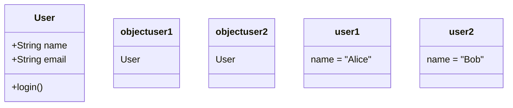

---

linkTitle: "2.3.2 Creating Objects"
title: "Creating Objects in Object-Oriented Programming: A Comprehensive Guide"
description: "Learn how to instantiate and use objects in programming, including memory management and garbage collection, with detailed examples in Python and JavaScript."
categories:
- Object-Oriented Programming
- Software Design
- Programming Fundamentals
tags:
- Object Creation
- Python
- JavaScript
- Memory Management
- Garbage Collection
date: 2024-10-25
type: docs
nav_weight: 232000
---

## 2.3.2 Creating Objects

In the realm of software development, understanding how to create and manipulate objects is a cornerstone of object-oriented programming (OOP). This section will guide you through the process of instantiating objects from classes, using them in your programs, and understanding the underlying mechanisms of memory management. We will explore practical examples in Python and JavaScript, two of the most popular programming languages today, and delve into concepts such as memory allocation and garbage collection.

### Instantiation: Breathing Life into Classes

At the heart of OOP is the concept of a class, which serves as a blueprint for creating objects. An object is an instance of a class, possessing the attributes and behaviors defined by its class. The process of creating an object is known as instantiation.

#### The Class Constructor

To instantiate an object, we typically use a special method called a constructor. In Python, this is the `__init__` method, while in JavaScript, it is simply a function within the class definition. The constructor initializes the object's attributes and sets its initial state.

**Python Example:**

```python
class User:
    def __init__(self, name, email):
        self.name = name
        self.email = email

user1 = User("Alice", "alice@example.com")
user2 = User("Bob", "bob@example.com")
```

**JavaScript Example:**

```javascript
class User {
    constructor(name, email) {
        this.name = name;
        this.email = email;
    }
}

const user1 = new User("Alice", "alice@example.com");
const user2 = new User("Bob", "bob@example.com");
```

In both examples, we create two instances of the `User` class. Each object (`user1` and `user2`) has its own `name` and `email` attributes, initialized with different values.

### Object Usage: Interacting with Instances

Once an object is instantiated, it can be used to access and modify its attributes and invoke its methods. This interaction is what makes objects powerful and versatile components of software systems.

#### Accessing Attributes

You can access an object's attributes using dot notation. This allows you to retrieve and modify the values stored within the object.

**Python Example:**

```python
print(user1.name)  # Output: Alice
user2.email = "bob.new@example.com"
print(user2.email)  # Output: bob.new@example.com
```

**JavaScript Example:**

```javascript
console.log(user1.name); // Output: Alice
user2.email = "bob.new@example.com";
console.log(user2.email); // Output: bob.new@example.com
```

#### Invoking Methods

Methods are functions defined within a class that operate on instances of that class. They can perform actions using the object's attributes and other methods.

**Python Example:**

```python
class User:
    def __init__(self, name, email):
        self.name = name
        self.email = email

    def login(self):
        print(f"{self.name} has logged in.")

user1.login()  # Output: Alice has logged in.
```

**JavaScript Example:**

```javascript
class User {
    constructor(name, email) {
        this.name = name;
        this.email = email;
    }

    login() {
        console.log(`${this.name} has logged in.`);
    }
}

user1.login(); // Output: Alice has logged in.
```

### Memory Allocation: Understanding Object Storage

When an object is created, it is stored in memory. Understanding how objects are allocated in memory is crucial for efficient programming.

#### Reference vs. Value Types

In many programming languages, objects are reference types, meaning that a variable holds a reference to the memory location where the object is stored, rather than the object itself. This is different from value types, which store the actual data in the variable.

In Python and JavaScript, all objects are reference types. This means that when you assign an object to a new variable, both variables point to the same object in memory.

**Python Example:**

```python
user3 = user1
user3.name = "Charlie"
print(user1.name)  # Output: Charlie
```

**JavaScript Example:**

```javascript
const user3 = user1;
user3.name = "Charlie";
console.log(user1.name); // Output: Charlie
```

In both examples, changing the `name` attribute of `user3` also affects `user1`, since they reference the same object.

### Garbage Collection: Automatic Memory Management

Garbage collection is a form of automatic memory management that reclaims memory occupied by objects that are no longer in use. This process helps prevent memory leaks and optimize resource usage.

#### Python's Garbage Collector

Python uses a built-in garbage collector that automatically deallocates memory for objects that are no longer referenced. It employs a reference counting mechanism and a cyclic garbage collector to manage memory efficiently.

#### JavaScript's Garbage Collector

JavaScript also features automatic garbage collection, primarily using a mark-and-sweep algorithm. The garbage collector identifies objects that are no longer reachable and reclaims their memory.

### Visualizing Object Creation

To better understand object creation and interaction, let's visualize the process using a class diagram.



This diagram illustrates two instances of the `User` class, `user1` and `user2`, each with distinct attribute values.

### Key Points to Emphasize

- **Objects are Instances:** An object is a specific instance of a class, with its own state and behavior.
- **Instantiation is Fundamental:** Creating objects is a fundamental aspect of OOP, enabling the use of classes in practical applications.
- **Memory Management:** Understanding how objects are stored and managed in memory is crucial for writing efficient code.

### Practical Exercise: Creating and Using Objects

To solidify your understanding, try creating a new class called `Product` with attributes `name`, `price`, and a method `apply_discount`. Instantiate multiple `Product` objects and interact with them by applying discounts and printing their details.

**Python Exercise:**

```python
class Product:
    def __init__(self, name, price):
        self.name = name
        self.price = price

    def apply_discount(self, discount):
        self.price -= self.price * (discount / 100)

product1 = Product("Laptop", 1200)
product2 = Product("Smartphone", 800)

product1.apply_discount(10)
product2.apply_discount(5)

print(product1.price)  # Output: 1080.0
print(product2.price)  # Output: 760.0
```

**JavaScript Exercise:**

```javascript
class Product {
    constructor(name, price) {
        this.name = name;
        this.price = price;
    }

    applyDiscount(discount) {
        this.price -= this.price * (discount / 100);
    }
}

const product1 = new Product("Laptop", 1200);
const product2 = new Product("Smartphone", 800);

product1.applyDiscount(10);
product2.applyDiscount(5);

console.log(product1.price); // Output: 1080
console.log(product2.price); // Output: 760
```

### Conclusion

Creating and using objects is a foundational skill in object-oriented programming. By understanding the process of instantiation, memory management, and garbage collection, you can write more efficient and maintainable code. As you continue your journey in software development, remember that mastering these concepts will empower you to design robust and scalable applications.

## Quiz Time!



### What is the process of creating an object from a class called?

- [x] Instantiation
- [ ] Initialization
- [ ] Compilation
- [ ] Execution

> **Explanation:** Instantiation is the process of creating an object from a class, using the class constructor to initialize its attributes.

### Which method is used as a constructor in Python?

- [x] `__init__`
- [ ] `__main__`
- [ ] `__start__`
- [ ] `__create__`

> **Explanation:** In Python, the `__init__` method is used as a constructor to initialize the attributes of an object when it is created.

### In JavaScript, how do you create a new instance of a class?

- [x] Using the `new` keyword
- [ ] Using the `create` keyword
- [ ] Using the `instantiate` keyword
- [ ] Using the `object` keyword

> **Explanation:** In JavaScript, the `new` keyword is used to create a new instance of a class.

### What is the primary purpose of a class constructor?

- [x] To initialize the object's attributes
- [ ] To compile the program
- [ ] To execute a method
- [ ] To delete an object

> **Explanation:** A class constructor initializes the object's attributes, setting its initial state when the object is created.

### How are objects typically stored in memory?

- [x] As reference types
- [ ] As value types
- [ ] As primitive types
- [ ] As static types

> **Explanation:** Objects are typically stored as reference types, meaning variables hold a reference to the object's memory location.

### What is the role of garbage collection in memory management?

- [x] To reclaim memory occupied by unused objects
- [ ] To allocate memory for new objects
- [ ] To increase program execution speed
- [ ] To compile the code

> **Explanation:** Garbage collection reclaims memory occupied by objects that are no longer in use, helping to prevent memory leaks.

### In Python, which mechanism is used for garbage collection?

- [x] Reference counting and cyclic garbage collector
- [ ] Manual memory management
- [ ] Static memory allocation
- [ ] Dynamic memory allocation

> **Explanation:** Python uses reference counting and a cyclic garbage collector to manage memory efficiently.

### In JavaScript, which algorithm is commonly used for garbage collection?

- [x] Mark-and-sweep
- [ ] Reference counting
- [ ] Manual deallocation
- [ ] Dynamic allocation

> **Explanation:** JavaScript commonly uses the mark-and-sweep algorithm for garbage collection, identifying unreachable objects and reclaiming their memory.

### What happens when you assign an object to a new variable?

- [x] Both variables reference the same object
- [ ] A new object is created
- [ ] The object is deleted
- [ ] The object's attributes are reset

> **Explanation:** When you assign an object to a new variable, both variables reference the same object in memory.

### True or False: In OOP, objects are individual instances of a class with their own state.

- [x] True
- [ ] False

> **Explanation:** True. Objects are individual instances of a class, each with its own state and behavior defined by the class.



By mastering the art of creating and manipulating objects, you lay the groundwork for building complex and dynamic software systems. Keep experimenting with different classes and objects to deepen your understanding and skills in object-oriented programming.
