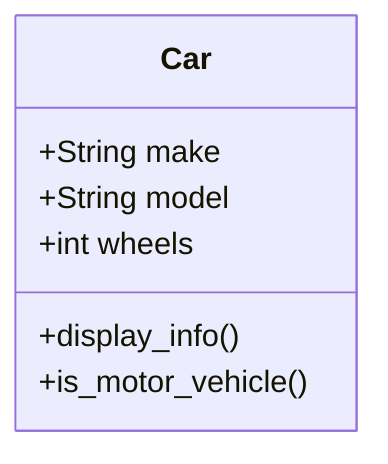

## 2.3.3 Class Members: Attributes and Methods

In the realm of object-oriented programming (OOP), the concepts of classes and objects form the backbone of software design. At the heart of these concepts are **class members**, which include attributes and methods. Understanding these elements is crucial for defining the state and behavior of objects, which are the fundamental building blocks of any OOP-based application.

### Understanding Attributes

Attributes, sometimes referred to as properties or fields, are variables that hold data specific to an object. They define the state of an object, and this state can vary from one instance of a class to another.

#### Instance Attributes

Instance attributes are unique to each instance of a class. They are typically defined within the `__init__` method in Python or the constructor in JavaScript. These attributes are created and initialized when an object is instantiated, and they can hold different values for each object.

**Python Example:**

```python
class Car:
    def __init__(self, make, model):
        self.make = make  # Instance attribute
        self.model = model  # Instance attribute

car1 = Car("Toyota", "Corolla")
car2 = Car("Honda", "Civic")

print(car1.make)  # Output: Toyota
print(car2.make)  # Output: Honda
```

**JavaScript Example:**

```javascript
class Car {
    constructor(make, model) {
        this.make = make;  // Instance attribute
        this.model = model;  // Instance attribute
    }
}

const car1 = new Car("Toyota", "Corolla");
const car2 = new Car("Honda", "Civic");

console.log(car1.make);  // Output: Toyota
console.log(car2.make);  // Output: Honda
```

#### Class Attributes

Class attributes, also known as static variables, are shared across all instances of a class. They are defined directly within the class body and are accessed using the class name. These attributes are useful for storing data that is common to all instances of a class.

**Python Example:**

```python
class Car:
    wheels = 4  # Class attribute

car1 = Car()
car2 = Car()

print(car1.wheels)  # Output: 4
print(car2.wheels)  # Output: 4
```

**JavaScript Example:**

```javascript
class Car {
    static wheels = 4;  // Class attribute
}

const car1 = new Car();
const car2 = new Car();

console.log(car1.constructor.wheels);  // Output: 4
console.log(car2.constructor.wheels);  // Output: 4
```

### Exploring Methods

Methods are functions defined within a class that describe the behaviors and actions that an object can perform. They operate on the data contained within the object and can modify the object's state.

#### Instance Methods

Instance methods are functions that operate on an instance of a class. They typically use the `self` keyword in Python or `this` in JavaScript to refer to the instance they belong to.

**Python Example:**

```python
class Car:
    def __init__(self, make, model):
        self.make = make
        self.model = model

    def display_info(self):
        return f"Car make: {self.make}, Model: {self.model}"

car1 = Car("Toyota", "Corolla")
print(car1.display_info())  # Output: Car make: Toyota, Model: Corolla
```

**JavaScript Example:**

```javascript
class Car {
    constructor(make, model) {
        this.make = make;
        this.model = model;
    }

    displayInfo() {
        return `Car make: ${this.make}, Model: ${this.model}`;
    }
}

const car1 = new Car("Toyota", "Corolla");
console.log(car1.displayInfo());  // Output: Car make: Toyota, Model: Corolla
```

#### Static/Class Methods

Static methods are associated with the class itself rather than any particular instance. They do not access or modify instance-specific data. In Python, static methods are defined using the `@staticmethod` decorator, while in JavaScript, they are declared using the `static` keyword.

**Python Example:**

```python
class Car:
    @staticmethod
    def is_motor_vehicle():
        return True

print(Car.is_motor_vehicle())  # Output: True
```

**JavaScript Example:**

```javascript
class Car {
    static isMotorVehicle() {
        return true;
    }
}

console.log(Car.isMotorVehicle());  // Output: true
```

### Accessing Class Members

Accessing class members is typically done using dot notation. This notation allows you to access attributes and methods of an instance or a class directly.

#### Accessing Attributes

To access an attribute, you use the instance name followed by a dot and the attribute name.

**Python Example:**

```python
car = Car("Toyota", "Corolla")
print(car.make)  # Accessing instance attribute
```

**JavaScript Example:**

```javascript
const car = new Car("Toyota", "Corolla");
console.log(car.make);  // Accessing instance attribute
```

#### Accessing Methods

Similarly, to call a method, you use the instance name followed by a dot and the method name, including parentheses.

**Python Example:**

```python
car = Car("Toyota", "Corolla")
print(car.display_info())  # Calling instance method
```

**JavaScript Example:**

```javascript
const car = new Car("Toyota", "Corolla");
console.log(car.displayInfo());  // Calling instance method
```

### Mutability of Attributes

Attributes in a class can change over time, reflecting the dynamic nature of objects. This mutability allows objects to evolve during their lifecycle, responding to various operations or external inputs.

**Python Example:**

```python
class Car:
    def __init__(self, make, model):
        self.make = make
        self.model = model

    def update_model(self, new_model):
        self.model = new_model  # Changing the state of the object

car = Car("Toyota", "Corolla")
car.update_model("Camry")
print(car.model)  # Output: Camry
```

**JavaScript Example:**

```javascript
class Car {
    constructor(make, model) {
        this.make = make;
        this.model = model;
    }

    updateModel(newModel) {
        this.model = newModel;  // Changing the state of the object
    }
}

const car = new Car("Toyota", "Corolla");
car.updateModel("Camry");
console.log(car.model);  // Output: Camry
```

### Visualizing Class Attributes and Methods

To better understand the relationship between instance and class attributes/methods, let's visualize these concepts using a class diagram.



### Key Points to Emphasize

- **Attributes** are variables within a class that define the state of an object. They can be instance-specific or shared across all instances (class attributes).
- **Methods** are functions within a class that define the behaviors and actions an object can perform. They can be instance-specific or associated with the class itself (static methods).
- Understanding the difference between instance and class members is crucial for effective object-oriented design and implementation.
- **Dot notation** is used to access and interact with attributes and methods, allowing for clear and concise code.
- The **mutability** of attributes allows objects to change state, providing flexibility and adaptability in response to various operations.

### Conclusion

Attributes and methods are fundamental components of classes in object-oriented programming. They define the state and behavior of objects, enabling developers to create complex and dynamic systems. By mastering these concepts, you'll be well-equipped to design and implement robust software solutions that leverage the power of OOP.

## Quiz Time!



### What is an instance attribute?

- [x] A variable that holds data specific to an object instance.
- [ ] A function that describes the behavior of a class.
- [ ] A variable shared across all instances of a class.
- [ ] A method associated with the class itself.

> **Explanation:** An instance attribute is a variable that holds data specific to an object instance, allowing each instance to have its own unique state.

### How do you define a class attribute in Python?

- [x] By declaring it directly within the class body.
- [ ] By using the `self` keyword in the `__init__` method.
- [ ] By declaring it within a method.
- [ ] By using the `@staticmethod` decorator.

> **Explanation:** A class attribute is defined directly within the class body, making it shared across all instances of the class.

### What is the purpose of a method in a class?

- [x] To define behaviors and actions that an object can perform.
- [ ] To store data specific to an object.
- [ ] To initialize an object instance.
- [ ] To define static variables.

> **Explanation:** Methods in a class define the behaviors and actions that an object can perform, operating on the data contained within the object.

### How do you access an instance method in JavaScript?

- [x] Using dot notation with the instance name followed by the method name and parentheses.
- [ ] Using the `self` keyword followed by the method name.
- [ ] Using the class name followed by the method name and parentheses.
- [ ] By directly calling the method name without any prefix.

> **Explanation:** Instance methods in JavaScript are accessed using dot notation with the instance name followed by the method name and parentheses.

### What is the difference between instance and class attributes?

- [x] Instance attributes are unique to each object, while class attributes are shared across all instances.
- [ ] Instance attributes are shared across all instances, while class attributes are unique to each object.
- [ ] Both are shared across all instances but differ in visibility.
- [ ] Both are unique to each object but differ in mutability.

> **Explanation:** Instance attributes are unique to each object, allowing for different states, while class attributes are shared across all instances, providing common data.

### How do you define a static method in Python?

- [x] By using the `@staticmethod` decorator.
- [ ] By using the `self` keyword in the method definition.
- [ ] By declaring it within the `__init__` method.
- [ ] By defining it outside the class body.

> **Explanation:** A static method in Python is defined using the `@staticmethod` decorator, indicating that it is associated with the class rather than any particular instance.

### Which of the following is true about class methods?

- [x] They can access class attributes but not instance attributes.
- [ ] They can access instance attributes but not class attributes.
- [x] They are associated with the class itself.
- [ ] They require an instance of the class to be called.

> **Explanation:** Class methods can access class attributes and are associated with the class itself, not requiring an instance to be called.

### How can attributes change over time?

- [x] By modifying their values through methods or external operations.
- [ ] By being declared as static.
- [ ] By being accessed using dot notation.
- [ ] By being defined within the class body.

> **Explanation:** Attributes can change over time by modifying their values through methods or external operations, reflecting the dynamic nature of objects.

### What is the purpose of the `self` keyword in Python?

- [x] To refer to the instance of the class within instance methods.
- [ ] To define static methods.
- [ ] To access class attributes.
- [ ] To declare instance attributes.

> **Explanation:** The `self` keyword in Python is used to refer to the instance of the class within instance methods, allowing access to instance attributes and methods.

### True or False: Static methods can modify instance attributes.

- [x] False
- [ ] True

> **Explanation:** Static methods cannot modify instance attributes because they are associated with the class itself and do not have access to instance-specific data.


