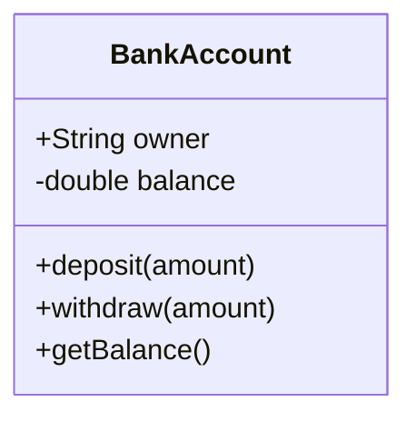

## 2.3.4 Access Modifiers

In the realm of object-oriented programming (OOP), **access modifiers** play a crucial role in defining the boundaries of how and where the data within a class can be accessed or modified. They are fundamental to the principles of encapsulation and data hiding, which are core to creating robust, maintainable, and secure software systems. This section will delve into the different types of access modifiers, their implementation in languages like Python and JavaScript, and their role in ensuring encapsulation.

### Understanding Access Control Levels

Access control levels determine the visibility of class members (attributes and methods) to other parts of a program. These levels are typically defined as:

- **Public:** Members declared as public are accessible from anywhere in the program. They are the most permissive access level.
- **Private:** Private members are accessible only within the class in which they are declared. This level is used to hide implementation details from the outside world.
- **Protected:** Protected members are accessible within the class and its subclasses. This level is less common in Python but can be indicated by naming conventions.

#### Public Access Modifier

Public members are the most accessible. They can be accessed from any part of the program, making them ideal for attributes and methods that need to be exposed to the user or other parts of the application.

**Example in Python:**

```python
class Car:
    def __init__(self, make, model):
        self.make = make   # Public attribute
        self.model = model # Public attribute

car = Car("Toyota", "Corolla")
print(car.make)  # Output: Toyota
print(car.model) # Output: Corolla
```

**Example in JavaScript:**

```javascript
class Car {
    constructor(make, model) {
        this.make = make;   // Public attribute
        this.model = model; // Public attribute
    }
}

const car = new Car("Toyota", "Corolla");
console.log(car.make);  // Output: Toyota
console.log(car.model); // Output: Corolla
```

#### Private Access Modifier

Private members are intended to be hidden from outside access. In Python, private members are indicated by prefixing the member name with double underscores (`__`). In JavaScript, private fields are denoted by the `#` symbol, introduced in ECMAScript 2021.

**Example in Python:**

```python
class Employee:
    def __init__(self, name, salary):
        self.name = name       # Public attribute
        self.__salary = salary # Private attribute

    def get_salary(self):
        return self.__salary

emp = Employee("John", 50000)
print(emp.name)           # Access public attribute
print(emp.get_salary())   # Access private attribute via method
```

**Example in JavaScript:**

```javascript
class Employee {
    #salary; // Private field (ES2021)

    constructor(name, salary) {
        this.name = name;   // Public attribute
        this.#salary = salary;
    }

    getSalary() {
        return this.#salary;
    }
}

const emp = new Employee("John", 50000);
console.log(emp.name);        // Access public attribute
console.log(emp.getSalary()); // Access private attribute via method
// console.log(emp.#salary);   // SyntaxError: Private field '#salary' must be declared in an enclosing class
```

#### Protected Access Modifier

Protected members are typically accessible within the class and its subclasses. In Python, this is indicated by a single underscore (`_`). While this is more of a convention than a strict enforcement, it signals to developers that the member is intended for internal use.

**Example in Python:**

```python
class Animal:
    def __init__(self, name, species):
        self._name = name       # Protected attribute
        self._species = species # Protected attribute

class Dog(Animal):
    def __init__(self, name):
        super().__init__(name, "Dog")

    def get_info(self):
        return f"{self._name} is a {self._species}"

dog = Dog("Buddy")
print(dog.get_info()) # Output: Buddy is a Dog
```

JavaScript does not have a native concept of protected members, but similar behavior can be achieved through conventions or using closures.

### Implementing Access Modifiers

The implementation of access modifiers varies between programming languages. Here, we'll focus on Python and JavaScript.

#### Python Access Modifiers

In Python, access modifiers are not strictly enforced by the language. Instead, naming conventions are used:

- **Public:** No underscores (`name`)
- **Protected:** Single underscore (`_name`)
- **Private:** Double underscores (`__name`)

These conventions help in understanding the intended access level of class members.

#### JavaScript Access Modifiers

JavaScript traditionally treats all properties as public. However, with the introduction of ECMAScript 2021, private fields can be declared using the `#` syntax. Before this, closures and other patterns were used to simulate private members.

### Encapsulation and Data Hiding

**Encapsulation** is the bundling of data and methods that operate on the data within a single unit, typically a class. Access modifiers are a key aspect of encapsulation as they control how data is accessed and modified.

**Data Hiding** is a principle that restricts access to certain details of an object, preventing unintended interactions and maintaining the integrity of the object's state.

By using access modifiers, developers can:

- Protect the internal state of an object from unintended interference.
- Expose only necessary parts of an object to the outside world.
- Ensure that objects are used correctly and safely.

### Examples of Use

Let's explore practical examples of how access modifiers can be used to define and access members with different visibility levels.

#### Python Example

```python
class BankAccount:
    def __init__(self, owner, balance):
        self.owner = owner           # Public attribute
        self.__balance = balance     # Private attribute

    def deposit(self, amount):
        if amount > 0:
            self.__balance += amount
            return True
        return False

    def withdraw(self, amount):
        if 0 < amount <= self.__balance:
            self.__balance -= amount
            return True
        return False

    def get_balance(self):
        return self.__balance

account = BankAccount("Alice", 1000)
print(account.owner)          # Access public attribute
print(account.get_balance())  # Access private attribute via method
```

#### JavaScript Example

```javascript
class BankAccount {
    #balance; // Private field

    constructor(owner, balance) {
        this.owner = owner;   // Public attribute
        this.#balance = balance;
    }

    deposit(amount) {
        if (amount > 0) {
            this.#balance += amount;
            return true;
        }
        return false;
    }

    withdraw(amount) {
        if (0 < amount && amount <= this.#balance) {
            this.#balance -= amount;
            return true;
        }
        return false;
    }

    getBalance() {
        return this.#balance;
    }
}

const account = new BankAccount("Alice", 1000);
console.log(account.owner);         // Access public attribute
console.log(account.getBalance());  // Access private attribute via method
// console.log(account.#balance);   // SyntaxError: Private field '#balance' must be declared in an enclosing class
```

### Visual Representation

To better understand how access modifiers work, let's visualize this with a class diagram using Mermaid.js.



### Key Points to Emphasize

- **Access Modifiers are Essential:** They are crucial for controlling how data and methods are accessed, ensuring that objects are used correctly and safely.
- **Encapsulation:** Access modifiers enforce encapsulation, allowing developers to hide the internal state of an object and expose only what is necessary.
- **Data Integrity and Security:** By restricting access to certain parts of an object, access modifiers help maintain data integrity and prevent unauthorized access.

### Best Practices and Common Pitfalls

#### Best Practices

- **Use Private Members for Sensitive Data:** Always use private or protected access levels for sensitive data to prevent unauthorized access.
- **Expose Only What is Necessary:** Keep the interface of a class as minimal as possible by exposing only the methods and attributes that are necessary for the operation of the program.
- **Follow Naming Conventions:** In languages like Python, adhere to naming conventions to indicate the intended access level of class members.

#### Common Pitfalls

- **Ignoring Encapsulation:** Failing to use access modifiers can lead to code that is difficult to maintain and prone to bugs due to unintended interactions with object state.
- **Overusing Public Access:** Making too many members public can expose the internal workings of a class, leading to tight coupling and reduced flexibility.

### Conclusion

Access modifiers are a fundamental aspect of object-oriented programming that enable encapsulation and data hiding. By understanding and effectively using access modifiers, developers can create software that is secure, maintainable, and robust. As you continue to explore design patterns and software architecture, remember that access modifiers are a powerful tool in your toolkit for designing effective and efficient systems.

## Quiz Time!



### What is the purpose of access modifiers in object-oriented programming?

- [x] To control the visibility and accessibility of class members
- [ ] To enhance the performance of a program
- [ ] To increase the complexity of a class
- [ ] To define the data types of variables

> **Explanation:** Access modifiers are used to control the visibility and accessibility of class members, ensuring encapsulation and data hiding.

### Which of the following is a public attribute in Python?

- [x] `name`
- [ ] `_name`
- [ ] `__name`
- [ ] `#name`

> **Explanation:** In Python, a public attribute is typically declared without any underscores, such as `name`.

### How are private members indicated in Python?

- [ ] With a single underscore
- [x] With double underscores
- [ ] With a hash symbol
- [ ] With a dollar sign

> **Explanation:** In Python, private members are indicated by prefixing the member name with double underscores.

### Which access modifier allows access only within the class in JavaScript (ES2021)?

- [ ] Public
- [ ] Protected
- [x] Private (using `#`)
- [ ] Local

> **Explanation:** In JavaScript (ES2021), private fields are declared using the `#` syntax, restricting access to within the class.

### What is encapsulation in object-oriented programming?

- [x] Bundling data and methods within a single unit
- [ ] Separating data from methods
- [ ] Making all data public
- [ ] Using only public access modifiers

> **Explanation:** Encapsulation is the bundling of data and methods that operate on the data within a single unit, typically a class.

### Which access level is the most permissive?

- [x] Public
- [ ] Private
- [ ] Protected
- [ ] Local

> **Explanation:** Public access level is the most permissive, allowing access from anywhere in the program.

### What is the benefit of using private members in a class?

- [x] To hide implementation details and protect the internal state
- [ ] To make the class more complex
- [ ] To allow external access to all data
- [ ] To reduce the number of methods in a class

> **Explanation:** Private members help hide implementation details and protect the internal state of a class, enhancing encapsulation.

### How can protected members be indicated in Python?

- [x] With a single underscore
- [ ] With double underscores
- [ ] With a hash symbol
- [ ] With a dollar sign

> **Explanation:** In Python, protected members are conventionally indicated by a single underscore.

### What error will occur if you try to access a private field directly in JavaScript?

- [x] SyntaxError
- [ ] TypeError
- [ ] ReferenceError
- [ ] RangeError

> **Explanation:** Attempting to access a private field directly in JavaScript will result in a SyntaxError.

### True or False: In JavaScript, all properties are public by default.

- [x] True
- [ ] False

> **Explanation:** In JavaScript, all properties are public by default unless explicitly declared as private using the `#` syntax.


